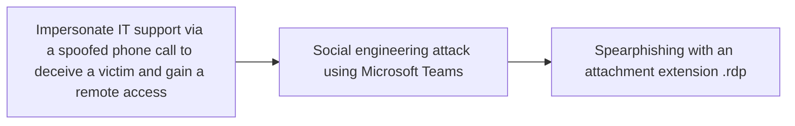

# Impersonate IT support via a spoofed phone call to deceive a victim and gain a remote access

## Metadata

- **UUID**: `c4456134-df7b-4969-b5ff-a24794996890`
- **Schema**: `threat::1.0`
- **TLP**: clear

## Description
IT support impersonation via spoofed phone calls is a common social
engineering technique used by attackers to gain initial access to an
organisation's network. This tactic is often combined with other
techniques, such as email flooding or phishing, to create a sense
of urgency and legitimacy. To deceive victims, attackers may use
one of the following methids:

- Use spoofed phone numbers: The threat actors can use spoofed phone
numbers that appear to be from the organisation's IT department or a
legitimate company.  
- Create a sense of urgency: Attackers may claim that there is a critical
issue with the victim's computer or account that requires immediate
attention.
- Use technical jargon: Some threat actor groups are observed to use
technical terms and acronyms to sound legitimate and knowledgeable.
- Request remote access: Attackers may ask the victim to grant remote
access to their computer or network, often through tools like Zoom,
Anydesk, Any Connect, TeamViewer or Microsoft Quick Assist.    

### Possible scenario

Threat actor groups are targeting an organisation by gathering variety of
user's data, for example, employee email addresses and the IT department's
phone number. They can flood an employee with unsolicited emails and then
impersonate IT support via a spoofed phone call, tricking the employee
into granting remote access through `Microsoft Quick Assist` ref [1].   

Because `Quick Assist` uses the RDP stack (T1021.001), the attacker gains
an RDP session under the user's context. If the targeted users has extended
rights, the attacker can sidesteps perimeter ACLs, and disables input
monitoring. A hidden admin account is added ref [1], [3]:  

```
*net user svc_updater P@ss123! /add*,
*net localgroup administrators svc_updater /add*)
```

and a signed Hyper-V VHDX (`*windows_storage.vhdx*`) containing Cobalt
Strike and the 3AM encryptor is transferred over SMB. Credential dumping
from *lsass.exe* and *net group "domain admins" /DOMAIN* follow, before
the payload encrypts mapped drives and drops *README_3AM.txt*.  

By performing such attack, the threat actor maintains persistence and
can exfiltrates available data towards any server he controls.

## Techniques
- T1624
- T1566
- T1566.004
- T1210
- T1033
- T1016
- T1219
- T1078
- T1105

## Chaining

