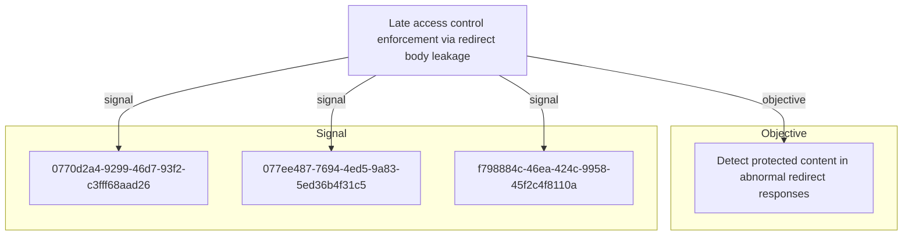

# Late access control enforcement via redirect body leakage

## Metadata

- **UUID**: `0663c192-cdeb-49a2-994c-4cc8e98f764e`
- **Schema**: `threat::1.0`
- **Version**: `2`
- **Created**: `2026-03-30`
- **Modified**: `2026-05-04`
- **TLP**: clear (`TLP:CLEAR`)
- **Contributors**: Hold Security Threat Research
- **Organisation**: EC DIGIT CSOC (`56b0a0f0-b0bc-47d9-bb46-02f80ae2065a`)

## References
### Public
- **1**: [https://owasp.org/Top10/A01_2021-Broken_Access_Control/](https://owasp.org/Top10/A01_2021-Broken_Access_Control/)
- **2**: [https://cwe.mitre.org/data/definitions/284.html](https://cwe.mitre.org/data/definitions/284.html)
- **3**: [https://portswigger.net/web-security/access-control](https://portswigger.net/web-security/access-control)

## Description
An adversary exploits a broken access control pattern in a web application
where the server constructs and includes the full rendered page content in
the HTTP response body before enforcing authentication or authorisation
checks. When the access control check fails, the server issues an HTTP 302
Found redirect response with a Location header pointing to a login or error
page — however, the response body still contains the complete protected page
content.

Standard web browsers automatically follow the redirect and do not display
the body content to the user, masking the data leakage. However, an attacker
using HTTP clients that do not follow redirects (e.g. curl, Burp Suite, or
custom scripts) can intercept and read the full protected content from the
redirect response body.

This vulnerability affects authenticated and role-restricted web pages in a
pattern-based manner, meaning it is not isolated to a single endpoint but
rather stems from a systemic flaw in the application's access control
enforcement architecture. The root cause is a late enforcement model where
the application constructs the complete response — including sensitive data —
before determining whether the requesting user is authorised to view it.

Exploitation is trivial once the pattern is discovered: the adversary simply
sends HTTP requests to protected endpoints and inspects the response bodies
of 302 redirect responses. No authentication tokens, session cookies, or
special headers are required. The attack can be automated to enumerate and
exfiltrate content from all affected endpoints systematically.

This aligns with OWASP Top 10 A01:2021 Broken Access Control and CWE-284
Improper Access Control. The vulnerability represents a fundamental flaw in
the application's security architecture rather than a simple misconfiguration.

## Criticality
**High** - A High priority incident is likely to result in a demonstrable impact to public health or safety, national security, economic security, foreign relations, civil liberties, or public confidence.

## Terrain
> **A web application that performs access control checks late in the request
processing pipeline, after the response body has already been constructed.
The application must use HTTP redirects (typically 302 Found) for access
control enforcement rather than blocking the request outright or returning
a minimal error response. The response body includes the full rendered
protected page content alongside the redirect Location header. This pattern
typically arises in framework-level middleware or filter configurations where
page rendering occurs before authentication and authorisation gates are
evaluated. The vulnerability is systemic rather than endpoint-specific,
affecting multiple authenticated or role-restricted routes that share the
same flawed request processing pipeline.**

## Threat Assessment
| Dimension | Assessment | Description |
| --- | --- | --- |
| Severity | Substantial incident | A cyber attack which has a serious impact on a medium-sized organisation, or which poses a considerable risk to a large organisation or wider / local government. |
| Impact | Data Breach; IP Loss | - |
| Leverage | Information Disclosure | Threat action intending to read a file that one was not granted access to, or to read data in transit. |
| Viability | Likely | Probable (probably) - 55-80% |
| Kill Chain | Collection | Techniques used to identify and gather data from a target network prior to exfiltration. |

## ATT&CK Techniques
| Technique | Name | Description |
| --- | --- | --- |
| `T1190` | [Exploit Public-Facing Application](https://attack.mitre.org/techniques/T1190) | Adversaries may attempt to exploit a weakness in an Internet-facing host or system to initially access a network. The weakness in the system can be a software bug, a temporary glitch, or a misconfiguration.  Exploited applications are often websites/web servers, but can also include databases (like SQL), standard services (like SMB or SSH), network device administration and management protocols (like SNMP and Smart Install), and any other system with Internet-accessible open sockets.(Citation: NVD CVE-2016-6662)(Citation: CIS Multiple SMB Vulnerabilities)(Citation: US-CERT TA18-106A Network Infrastructure Devices 2018)(Citation: Cisco Blog Legacy Device Attacks)(Citation: NVD CVE-2014-7169) On ESXi infrastructure, adversaries may exploit exposed OpenSLP services; they may alternatively exploit exposed VMware vCenter servers.(Citation: Recorded Future ESXiArgs Ransomware 2023)(Citation: Ars Technica VMWare Code Execution Vulnerability 2021) Depending on the flaw being exploited, this may also involve [Exploitation for Defense Evasion](https://attack.mitre.org/techniques/T1211) or [Exploitation for Client Execution](https://attack.mitre.org/techniques/T1203).  If an application is hosted on cloud-based infrastructure and/or is containerized, then exploiting it may lead to compromise of the underlying instance or container. This can allow an adversary a path to access the cloud or container APIs (e.g., via the [Cloud Instance Metadata API](https://attack.mitre.org/techniques/T1552/005)), exploit container host access via [Escape to Host](https://attack.mitre.org/techniques/T1611), or take advantage of weak identity and access management policies.  Adversaries may also exploit edge network infrastructure and related appliances, specifically targeting devices that do not support robust host-based defenses.(Citation: Mandiant Fortinet Zero Day)(Citation: Wired Russia Cyberwar)  For websites and databases, the OWASP top 10 and CWE top 25 highlight the most common web-based vulnerabilities.(Citation: OWASP Top 10)(Citation: CWE top 25) |

## Relations

