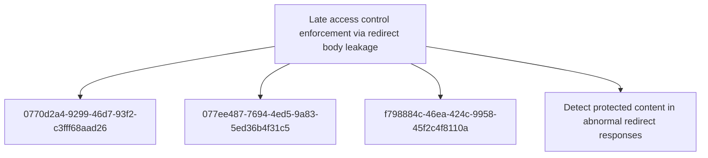

# Late access control enforcement via redirect body leakage

## Metadata

- **UUID**: `0663c192-cdeb-49a2-994c-4cc8e98f764e`
- **Schema**: `threat::1.0`
- **TLP**: clear

## Description
An adversary exploits a broken access control pattern in a web application
where the server constructs and includes the full rendered page content in
the HTTP response body before enforcing authentication or authorisation
checks. When the access control check fails, the server issues an HTTP 302
Found redirect response with a Location header pointing to a login or error
page — however, the response body still contains the complete protected page
content.

Standard web browsers automatically follow the redirect and do not display
the body content to the user, masking the data leakage. However, an attacker
using HTTP clients that do not follow redirects (e.g. curl, Burp Suite, or
custom scripts) can intercept and read the full protected content from the
redirect response body.

This vulnerability affects authenticated and role-restricted web pages in a
pattern-based manner, meaning it is not isolated to a single endpoint but
rather stems from a systemic flaw in the application's access control
enforcement architecture. The root cause is a late enforcement model where
the application constructs the complete response — including sensitive data —
before determining whether the requesting user is authorised to view it.

Exploitation is trivial once the pattern is discovered: the adversary simply
sends HTTP requests to protected endpoints and inspects the response bodies
of 302 redirect responses. No authentication tokens, session cookies, or
special headers are required. The attack can be automated to enumerate and
exfiltrate content from all affected endpoints systematically.

This aligns with OWASP Top 10 A01:2021 Broken Access Control and CWE-284
Improper Access Control. The vulnerability represents a fundamental flaw in
the application's security architecture rather than a simple misconfiguration.

## Techniques
- T1190

## Relations

