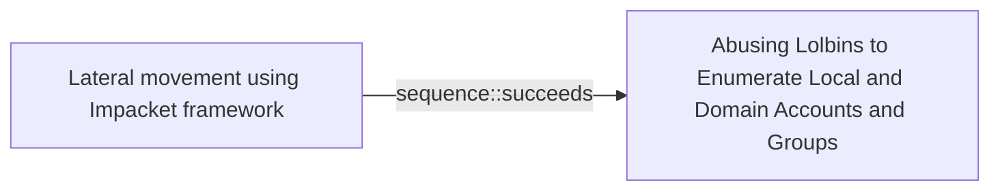

# Lateral movement using Impacket framework

## Metadata

- **UUID**: `75415bc5-6615-487e-a69c-7a4ffc196996`
- **Schema**: `threat::1.0`
- **Version**: `1`
- **Created**: `2024-09-17`
- **Modified**: `2024-09-18`
- **TLP**: clear (`TLP:CLEAR`)
- **Organisation**: EC DIGIT CSOC (`56b0a0f0-b0bc-47d9-bb46-02f80ae2065a`)

## References
### Public
- **1**: [https://www.microsoft.com/en-us/security/blog/2023/06/14/cadet-blizzard-emerges-as-a-novel-and-distinct-russian-threat-actor/](https://www.microsoft.com/en-us/security/blog/2023/06/14/cadet-blizzard-emerges-as-a-novel-and-distinct-russian-threat-actor/)
- **2**: [https://medium.com/threatpunter/detecting-attempts-to-steal-passwords-from-the-registry-7512674487f8](https://medium.com/threatpunter/detecting-attempts-to-steal-passwords-from-the-registry-7512674487f8)
- **3**: [https://learn.microsoft.com/en-us/previous-versions/windows/it-pro/windows-10/security/threat-protection/auditing/basic-audit-object-access](https://learn.microsoft.com/en-us/previous-versions/windows/it-pro/windows-10/security/threat-protection/auditing/basic-audit-object-access)

## Description
Threat actors conduct lateral movement with valid network credentials
obtained from credential harvesting. To conduct lateral movement more
efficiently, they typically use modules from the publicly available
Impacket framework ref [1].    

Some of the activities during the lateral movement might be:

- Enumerate the volume of a device (example: PS get-volume), 
  access volumes via network shares like \\127.0.0.1\ADMINS$\__  
- Copying critical registry hives that contain password hashes
  and computer information.  
- Downloading files directly from actor-owned infrastructure
  (example: cmdlet: DownloadFile)  
- Extract both system and security event logs into operational
  directory (example: Win32_NTEventlogFile cmdlet) 

Variety of reports and analysis show that the threat actor commonly
deletes files used during operational phases seen in lateral movement.

In some cases the threat actors may try to manipulate the Group Policies
to hide their traces. For example, the registries which are related to
the access of the System Registries. They may also try to turn off `Audit
object access` for successful and failed access events. ref [2, 3]

## Criticality
**High** - A High priority incident is likely to result in a demonstrable impact to public health or safety, national security, economic security, foreign relations, civil liberties, or public confidence.

## Terrain
> **A threat actor needs initial access to move laterally through the network.

Domains: Enterprise, Private Cloud, Public Cloud
Targets: Customer, Laptop, Workstations, End-user, Other
Platforms: Windows**

## Threat Assessment
| Dimension | Assessment | Description |
| --- | --- | --- |
| Severity | Localised incident | A cyber attack on an individual, or preliminary indications of cyber activity against a small or medium-sized organisation. |
| Impact | Identity Theft; Business disruption; Impairement; Nuisance | - |
| Leverage | Dwelling; Elevation of privilege | - |
| Viability | Likely | Probable (probably) - 55-80% |
| Kill Chain | Credential Access | Techniques resulting in the access of, or control over, system, service or domain credentials. |

## Actors
| Actor | ID | Source | Description |
| --- | --- | --- | --- |
| [[Enterprise] Ember Bear](https://attack.mitre.org/groups/G1003) | `att&ck::G1003` | ('att&ck',) | [Ember Bear](https://attack.mitre.org/groups/G1003) is a Russian state-sponsored cyber espionage group that has been active since at least 2020, linked to Russia's General Staff Main Intelligence Directorate (GRU) 161st Specialist Training Center (Unit 29155).(Citation: CISA GRU29155 2024) [Ember Bear](https://attack.mitre.org/groups/G1003) has primarily focused operations against Ukrainian government and telecommunication entities, but has also operated against critical infrastructure entities in Europe and the Americas.(Citation: Cadet Blizzard emerges as novel threat actor) [Ember Bear](https://attack.mitre.org/groups/G1003) conducted the [WhisperGate](https://attack.mitre.org/software/S0689) destructive wiper attacks against Ukraine in early 2022.(Citation: CrowdStrike Ember Bear Profile March 2022)(Citation: Mandiant UNC2589 March 2022)(Citation: CISA GRU29155 2024) There is some confusion as to whether [Ember Bear](https://attack.mitre.org/groups/G1003) overlaps with another Russian-linked entity referred to as [Saint Bear](https://attack.mitre.org/groups/G1031). At present available evidence strongly suggests these are distinct activities with different behavioral profiles.(Citation: Cadet Blizzard emerges as novel threat actor)(Citation: Palo Alto Unit 42 OutSteel SaintBot February 2022 ) |
| DEV-0586 | `misp::a5f64c1a-c829-4855-903d-e0ff2098b2d7` | ('misp',) | MSTIC has not found any notable associations between this observed activity, tracked as DEV-0586, and other known activity groups. MSTIC assesses that the malware (WhisperGate), which is designed to look like ransomware but lacking a ransom recovery mechanism, is intended to be destructive and designed to render targeted devices inoperable rather than to obtain a ransom. |

## ATT&CK Techniques
| Technique | Name | Description |
| --- | --- | --- |
| `T1021` | [Remote Services](https://attack.mitre.org/techniques/T1021) | Adversaries may use [Valid Accounts](https://attack.mitre.org/techniques/T1078) to log into a service that accepts remote connections, such as telnet, SSH, and VNC. The adversary may then perform actions as the logged-on user.  In an enterprise environment, servers and workstations can be organized into domains. Domains provide centralized identity management, allowing users to login using one set of credentials across the entire network. If an adversary is able to obtain a set of valid domain credentials, they could login to many different machines using remote access protocols such as secure shell (SSH) or remote desktop protocol (RDP).(Citation: SSH Secure Shell)(Citation: TechNet Remote Desktop Services) They could also login to accessible SaaS or IaaS services, such as those that federate their identities to the domain, or management platforms for internal virtualization environments such as VMware vCenter.   Legitimate applications (such as [Software Deployment Tools](https://attack.mitre.org/techniques/T1072) and other administrative programs) may utilize [Remote Services](https://attack.mitre.org/techniques/T1021) to access remote hosts. For example, Apple Remote Desktop (ARD) on macOS is native software used for remote management. ARD leverages a blend of protocols, including [VNC](https://attack.mitre.org/techniques/T1021/005) to send the screen and control buffers and [SSH](https://attack.mitre.org/techniques/T1021/004) for secure file transfer.(Citation: Remote Management MDM macOS)(Citation: Kickstart Apple Remote Desktop commands)(Citation: Apple Remote Desktop Admin Guide 3.3) Adversaries can abuse applications such as ARD to gain remote code execution and perform lateral movement. In versions of macOS prior to 10.14, an adversary can escalate an SSH session to an ARD session which enables an adversary to accept TCC (Transparency, Consent, and Control) prompts without user interaction and gain access to data.(Citation: FireEye 2019 Apple Remote Desktop)(Citation: Lockboxx ARD 2019)(Citation: Kickstart Apple Remote Desktop commands) |
| `T1059.001` | [Command and Scripting Interpreter: PowerShell](https://attack.mitre.org/techniques/T1059/001) | Adversaries may abuse PowerShell commands and scripts for execution. PowerShell is a powerful interactive command-line interface and scripting environment included in the Windows operating system.(Citation: TechNet PowerShell) Adversaries can use PowerShell to perform a number of actions, including discovery of information and execution of code. Examples include the <code>Start-Process</code> cmdlet which can be used to run an executable and the <code>Invoke-Command</code> cmdlet which runs a command locally or on a remote computer (though administrator permissions are required to use PowerShell to connect to remote systems).  PowerShell may also be used to download and run executables from the Internet, which can be executed from disk or in memory without touching disk.  A number of PowerShell-based offensive testing tools are available, including [Empire](https://attack.mitre.org/software/S0363),  [PowerSploit](https://attack.mitre.org/software/S0194), [PoshC2](https://attack.mitre.org/software/S0378), and PSAttack.(Citation: Github PSAttack)  PowerShell commands/scripts can also be executed without directly invoking the <code>powershell.exe</code> binary through interfaces to PowerShell's underlying <code>System.Management.Automation</code> assembly DLL exposed through the .NET framework and Windows Common Language Interface (CLI).(Citation: Sixdub PowerPick Jan 2016)(Citation: SilentBreak Offensive PS Dec 2015)(Citation: Microsoft PSfromCsharp APR 2014) |
| `T1552.002` | [Unsecured Credentials: Credentials in Registry](https://attack.mitre.org/techniques/T1552/002) | Adversaries may search the Registry on compromised systems for insecurely stored credentials. The Windows Registry stores configuration information that can be used by the system or other programs. Adversaries may query the Registry looking for credentials and passwords that have been stored for use by other programs or services. Sometimes these credentials are used for automatic logons.  Example commands to find Registry keys related to password information: (Citation: Pentestlab Stored Credentials)  * Local Machine Hive: <code>reg query HKLM /f password /t REG_SZ /s</code> * Current User Hive: <code>reg query HKCU /f password /t REG_SZ /s</code> |

## Chaining

### Chaining details
#### succeeds -> Abusing Lolbins to Enumerate Local and Domain Accounts and Groups (`sequence::succeeds`)
A threat actor commonly utilizes living-off-the-land techniques
after gaining initial access to move laterally through the network.

- **Target UUID**: `3b1026c6-7d04-4b91-ba6f-abc68e993616`
