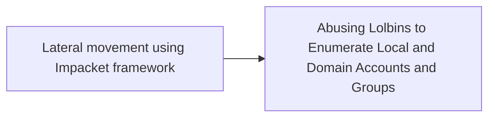

# Lateral movement using Impacket framework

## Metadata

- **UUID**: `75415bc5-6615-487e-a69c-7a4ffc196996`
- **Schema**: `threat::1.0`
- **TLP**: clear

## Description
Threat actors conduct lateral movement with valid network credentials
obtained from credential harvesting. To conduct lateral movement more
efficiently, they typically use modules from the publicly available
Impacket framework ref [1].    

Some of the activities during the lateral movement might be:

- Enumerate the volume of a device (example: PS get-volume), 
  access volumes via network shares like \\127.0.0.1\ADMINS$\__  
- Copying critical registry hives that contain password hashes
  and computer information.  
- Downloading files directly from actor-owned infrastructure
  (example: cmdlet: DownloadFile)  
- Extract both system and security event logs into operational
  directory (example: Win32_NTEventlogFile cmdlet) 

Variety of reports and analysis show that the threat actor commonly
deletes files used during operational phases seen in lateral movement.

In some cases the threat actors may try to manipulate the Group Policies
to hide their traces. For example, the registries which are related to
the access of the System Registries. They may also try to turn off `Audit
object access` for successful and failed access events. ref [2, 3]

## Techniques
- T1021
- T1059.001
- T1552.002

## Chaining

