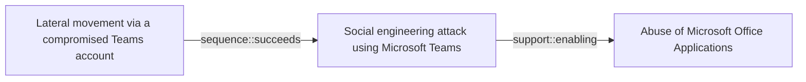

# Lateral movement via a compromised Teams account

## Metadata

- **UUID**: `cc9003f7-a9e3-4407-a1ca-d514af469787`
- **Schema**: `threat::1.0`
- **Version**: `1`
- **Created**: `2025-04-01`
- **Modified**: `2025-04-01`
- **TLP**: clear (`TLP:CLEAR`)
- **Organisation**: EC DIGIT CSOC (`56b0a0f0-b0bc-47d9-bb46-02f80ae2065a`)

## References
### Public
- **1**: [https://www.csoonline.com/article/575349/researchers-show-ways-to-abuse-microsoft-teams-accounts-for-lateral-movement.html](https://www.csoonline.com/article/575349/researchers-show-ways-to-abuse-microsoft-teams-accounts-for-lateral-movement.html)
- **2**: [https://learn.microsoft.com/en-us/defender-for-identity/understand-lateral-movement-paths](https://learn.microsoft.com/en-us/defender-for-identity/understand-lateral-movement-paths)
- **3**: [https://www.linkedin.com/pulse/attackers-leveraging-microsoft-teams-defaults-quick-assist-p1u5c](https://www.linkedin.com/pulse/attackers-leveraging-microsoft-teams-defaults-quick-assist-p1u5c)

## Description
Lateral movement refers to attackers exploiting compromised accounts or systems 
to navigate through a network and gain access to sensitive resources. In the context 
of Microsoft Teams, attackers leverage its collaboration features and integrations 
to move laterally within an organization environment. Here are the main techniques 
and risks associated with this threat:    

### How Attackers Exploit Teams for Lateral Movement
1. **Compromised Accounts**  
  - Attackers gain access to low-privileged Teams accounts through phishing or 
  credential theft. These accounts are then used to impersonate trusted users and 
  escalate privileges.
  - Sensitive credentials stored on shared systems can be exploited for lateral moves.    

2. **File Sharing Abuse**  
  - Malicious files (e.g., malware-laden executables or scripts) are distributed 
  through Teams chats or channels, targeting internal users.  
  - These files can auto-execute or trick users into running them, enabling attackers 
  to infect other systems.    

3. **Federated Trust Exploitation**  
  - Misconfigured external access settings allow attackers from federated tenants 
  to infiltrate and move laterally between organizations.    

4. **Remote Execution Tools**  
  - Attackers use Teams-integrated tools like Quick Assist or remote desktop protocols 
  (RDP) to execute commands on other systems, furthering their movement.    

5. **Credential Theft Techniques**  
  - Methods like Pass-the-Hash (PtH) or Pass-the-Ticket (PtT) are used to steal 
  authentication data from compromised systems, enabling attackers to impersonate 
  users across the network.    

### Risks of Lateral Movement via Teams
- **Domain Compromise**: Attackers can move towards domain controllers by exploiting 
stored credentials or misconfigurations.
- **Sensitive Data Access**: Lateral movement enables access to high-value assets 
such as financial records, intellectual property, or administrative accounts.
- **Stealthy Operations**: Native tools and legitimate credentials make detection 
harder, as malicious actions appear normal in audit logs.

## Criticality
**High** - A High priority incident is likely to result in a demonstrable impact to public health or safety, national security, economic security, foreign relations, civil liberties, or public confidence.

## Terrain
> **Adversaries through different means, they need to compromise an account in order 
to be able to carry out lateral movement.

Domains: Enterprise, Public Cloud, Private Cloud
Targets: Workstations, Personal Information, Critical Documents, Remote access, Virtual Machines, Laptop, End-user
Platforms: Windows, Microsoft Teams**

## Threat Assessment
| Dimension | Assessment | Description |
| --- | --- | --- |
| Severity | Significant incident | A cyber attack which has a serious impact on a large organisation or on wider / local government, or which poses a considerable risk to central government or (inter)national essential services. |
| Impact | Data Breach; Impairement; IP Loss; Nuisance | - |
| Leverage | Dwelling; Elevation of privilege; Spoofing; Information Disclosure | - |
| Viability | Likely | Probable (probably) - 55-80% |
| Kill Chain | Lateral Movement | Techniques that enable an adversary to horizontally access and control other remote systems. |

## ATT&CK Techniques
| Technique | Name | Description |
| --- | --- | --- |
| `T1210` | [Exploitation of Remote Services](https://attack.mitre.org/techniques/T1210) | Adversaries may exploit remote services to gain unauthorized access to internal systems once inside of a network. Exploitation of a software vulnerability occurs when an adversary takes advantage of a programming error in a program, service, or within the operating system software or kernel itself to execute adversary-controlled code.xa0A common goal for post-compromise exploitation of remote services is for lateral movement to enable access to a remote system.  An adversary may need to determine if the remote system is in a vulnerable state, which may be done through [Network Service Discovery](https://attack.mitre.org/techniques/T1046) or other Discovery methods looking for common, vulnerable software that may be deployed in the network, the lack of certain patches that may indicate vulnerabilities,  or security software that may be used to detect or contain remote exploitation. Servers are likely a high value target for lateral movement exploitation, but endpoint systems may also be at risk if they provide an advantage or access to additional resources.  There are several well-known vulnerabilities that exist in common services such as SMB(Citation: CIS Multiple SMB Vulnerabilities) and RDP(Citation: NVD CVE-2017-0176) as well as applications that may be used within internal networks such as MySQL(Citation: NVD CVE-2016-6662) and web server services.(Citation: NVD CVE-2014-7169)(Citation: Ars Technica VMWare Code Execution Vulnerability 2021) Additionally, there have been a number of vulnerabilities in VMware vCenter installations, which may enable threat actors to move laterally from the compromised vCenter server to virtual machines or even to ESXi hypervisors.(Citation: Broadcom VMSA-2024-0019)  Depending on the permissions level of the vulnerable remote service an adversary may achieve [Exploitation for Privilege Escalation](https://attack.mitre.org/techniques/T1068) as a result of lateral movement exploitation as well. |
| `T1534` | [Internal Spearphishing](https://attack.mitre.org/techniques/T1534) | After they already have access to accounts or systems within the environment, adversaries may use internal spearphishing to gain access to additional information or compromise other users within the same organization. Internal spearphishing is multi-staged campaign where a legitimate account is initially compromised either by controlling the user's device or by compromising the account credentials of the user. Adversaries may then attempt to take advantage of the trusted internal account to increase the likelihood of tricking more victims into falling for phish attempts, often incorporating [Impersonation](https://attack.mitre.org/techniques/T1656).(Citation: Trend Micro - Int SP)  For example, adversaries may leverage [Spearphishing Attachment](https://attack.mitre.org/techniques/T1566/001) or [Spearphishing Link](https://attack.mitre.org/techniques/T1566/002) as part of internal spearphishing to deliver a payload or redirect to an external site to capture credentials through [Input Capture](https://attack.mitre.org/techniques/T1056) on sites that mimic login interfaces.  Adversaries may also leverage internal chat apps, such as Microsoft Teams, to spread malicious content or engage users in attempts to capture sensitive information and/or credentials.(Citation: Int SP - chat apps) |
| `T1570` | [Lateral Tool Transfer](https://attack.mitre.org/techniques/T1570) | Adversaries may transfer tools or other files between systems in a compromised environment. Once brought into the victim environment (i.e., [Ingress Tool Transfer](https://attack.mitre.org/techniques/T1105)) files may then be copied from one system to another to stage adversary tools or other files over the course of an operation.  Adversaries may copy files between internal victim systems to support lateral movement using inherent file sharing protocols such as file sharing over [SMB/Windows Admin Shares](https://attack.mitre.org/techniques/T1021/002) to connected network shares or with authenticated connections via [Remote Desktop Protocol](https://attack.mitre.org/techniques/T1021/001).(Citation: Unit42 LockerGoga 2019)  Files can also be transferred using native or otherwise present tools on the victim system, such as scp, rsync, curl, sftp, and [ftp](https://attack.mitre.org/software/S0095). In some cases, adversaries may be able to leverage [Web Service](https://attack.mitre.org/techniques/T1102)s such as Dropbox or OneDrive to copy files from one machine to another via shared, automatically synced folders.(Citation: Dropbox Malware Sync) |
| `T1563` | [Remote Service Session Hijacking](https://attack.mitre.org/techniques/T1563) | Adversaries may take control of preexisting sessions with remote services to move laterally in an environment. Users may use valid credentials to log into a service specifically designed to accept remote connections, such as telnet, SSH, and RDP. When a user logs into a service, a session will be established that will allow them to maintain a continuous interaction with that service.  Adversaries may commandeer these sessions to carry out actions on remote systems. [Remote Service Session Hijacking](https://attack.mitre.org/techniques/T1563) differs from use of [Remote Services](https://attack.mitre.org/techniques/T1021) because it hijacks an existing session rather than creating a new session using [Valid Accounts](https://attack.mitre.org/techniques/T1078).(Citation: RDP Hijacking Medium)(Citation: Breach Post-mortem SSH Hijack) |
| `T1550` | [Use Alternate Authentication Material](https://attack.mitre.org/techniques/T1550) | Adversaries may use alternate authentication material, such as password hashes, Kerberos tickets, and application access tokens, in order to move laterally within an environment and bypass normal system access controls.   Authentication processes generally require a valid identity (e.g., username) along with one or more authentication factors (e.g., password, pin, physical smart card, token generator, etc.). Alternate authentication material is legitimately generated by systems after a user or application successfully authenticates by providing a valid identity and the required authentication factor(s). Alternate authentication material may also be generated during the identity creation process.(Citation: NIST Authentication)(Citation: NIST MFA)  Caching alternate authentication material allows the system to verify an identity has successfully authenticated without asking the user to reenter authentication factor(s). Because the alternate authentication must be maintained by the system—either in memory or on disk—it may be at risk of being stolen through [Credential Access](https://attack.mitre.org/tactics/TA0006) techniques. By stealing alternate authentication material, adversaries are able to bypass system access controls and authenticate to systems without knowing the plaintext password or any additional authentication factors. |

## Chaining

### Chaining details
#### succeeds -> Social engineering attack using Microsoft Teams (`sequence::succeeds`)
Adversaries are using compromised Microsoft 365 tenants to create technical
support-themed domains and send tech support lures via Microsoft Teams,
attempting to trick users of the targeted organizations using social engineering.

- **Target UUID**: `06c60af1-5fa8-493c-bf9b-6b2e215819f1`
#### enabling -> Abuse of Microsoft Office Applications (`support::enabling`)
Can be a factor that allows attackers to use credential theft and lateral mobility 
techniques, as Microsoft Office applications can be used to share malicious files 
and gain access to Teams accounts.

- **Target UUID**: `b663b684-a80f-4570-89b6-2f7faa16fece`
