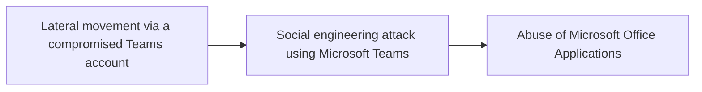

# Lateral movement via a compromised Teams account

## Metadata

- **UUID**: `cc9003f7-a9e3-4407-a1ca-d514af469787`
- **Schema**: `threat::1.0`
- **TLP**: clear

## Description
Lateral movement refers to attackers exploiting compromised accounts or systems 
to navigate through a network and gain access to sensitive resources. In the context 
of Microsoft Teams, attackers leverage its collaboration features and integrations 
to move laterally within an organization environment. Here are the main techniques 
and risks associated with this threat:    

### How Attackers Exploit Teams for Lateral Movement
1. **Compromised Accounts**  
  - Attackers gain access to low-privileged Teams accounts through phishing or 
  credential theft. These accounts are then used to impersonate trusted users and 
  escalate privileges.
  - Sensitive credentials stored on shared systems can be exploited for lateral moves.    

2. **File Sharing Abuse**  
  - Malicious files (e.g., malware-laden executables or scripts) are distributed 
  through Teams chats or channels, targeting internal users.  
  - These files can auto-execute or trick users into running them, enabling attackers 
  to infect other systems.    

3. **Federated Trust Exploitation**  
  - Misconfigured external access settings allow attackers from federated tenants 
  to infiltrate and move laterally between organizations.    

4. **Remote Execution Tools**  
  - Attackers use Teams-integrated tools like Quick Assist or remote desktop protocols 
  (RDP) to execute commands on other systems, furthering their movement.    

5. **Credential Theft Techniques**  
  - Methods like Pass-the-Hash (PtH) or Pass-the-Ticket (PtT) are used to steal 
  authentication data from compromised systems, enabling attackers to impersonate 
  users across the network.    

### Risks of Lateral Movement via Teams
- **Domain Compromise**: Attackers can move towards domain controllers by exploiting 
stored credentials or misconfigurations.
- **Sensitive Data Access**: Lateral movement enables access to high-value assets 
such as financial records, intellectual property, or administrative accounts.
- **Stealthy Operations**: Native tools and legitimate credentials make detection 
harder, as malicious actions appear normal in audit logs.

## Techniques
- T1210
- T1534
- T1570
- T1563
- T1550

## Chaining

