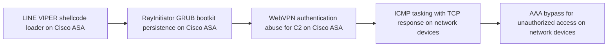

# LINE VIPER shellcode loader on Cisco ASA

## Metadata

- **UUID**: `b6175f16-2b61-4116-bd97-de54b02b197e`
- **Schema**: `threat::1.0`
- **TLP**: clear

## Description
LINE VIPER is a sophisticated user-mode shellcode loader with
associated modules that targets Cisco ASA (Adaptive Security
Appliance) devices. It represents a significant advancement over
previous malware families LINE DANCER and LINE RUNNER [1].

The analysed versions target Cisco ASA devices running firmware
versions 9.12(4)67 and 9.14(4)24, which at the time of
investigation were fully patched. LINE VIPER is loaded into memory
by the RayInitiator bootkit from a WebVPN client authentication
request containing a partial PKCS7 certificate followed by
shellcode [1].

#### Tasking Methods

LINE VIPER can be tasked via two distinct methods [1]:

1. **WebVPN Client Authentication Sessions over HTTPS:** The
   primary tasking method leverages the WebVPN authentication
   mechanism. Tasking payloads are delivered through specially
   crafted HTTPS requests to the WebVPN endpoint.

2. **ICMP with Responses over Raw TCP:** An alternative method
   receives tasking via ICMP packets and responds over raw TCP
   connections using high-ephemeral ports.

#### Security Mechanisms

LINE VIPER employs multiple security mechanisms to protect its
operations [1]:

- **Victim-Specific Tokens:** Utilises victim-specific tokens for
  authentication, a method previously observed in LINE DANCER and
  LINE RUNNER. Tasking payloads are checked for multiple
  victim-specific tokens before execution.

- **Per-Victim RSA Keys:** Uses per-victim RSA public keys to
  perform symmetric key exchange for securing tasking and
  exfiltration via the WebVPN client authentication method.

- **Environmental Keying:** Implements execution guardrails by
  validating environmental conditions before running tasked
  payloads.

#### Capabilities

LINE VIPER provides extensive capabilities for post-compromise
operations [1]:

- **CLI Command Execution:** Ability to execute arbitrary CLI
  commands on the compromised device, enabling full control over
  device configuration and operation.

- **Packet Capture:** Performs network packet captures and has been
  observed collecting protocols with plaintext credentials,
  supporting credential harvesting operations.

- **AAA Bypass:** Bypasses Authentication, Authorization, and
  Accounting (AAA) mechanisms for actor-controlled devices,
  allowing unauthorised access without generating authentication
  logs.

- **Syslog Suppression:** Suppresses specific syslog messages to
  hide malware behaviour and evade detection by security monitoring
  systems.

- **CLI Command Harvesting:** Harvests and monitors user CLI
  commands executed on the device, enabling intelligence gathering
  on administrator activities.

- **Delayed Reboot:** Forces a delayed reboot of the device,
  potentially serving as an anti-forensic capability or to clean up
  traces of malicious activity.

#### Defense Evasion

LINE VIPER implements multiple defence evasion techniques [1]:

- **System Integrity Check Patching:** Patches system integrity
  checks and returns results as if the device was not compromised,
  defeating built-in security validation mechanisms.

- **Heap Integrity Verification Disabling:** Disables heap
  integrity verification functionality to prevent detection of
  memory manipulation.

- **Immediate Reboot Capability:** Implements an anti-forensic
  capability to immediately reboot the device when certain CLI
  commands are executed, potentially destroying volatile evidence.

The combination of advanced persistence, multiple C2 channels,
encryption, and extensive defence evasion makes LINE VIPER a highly
sophisticated threat to network infrastructure.

## Techniques
- T1059.008
- T1014
- T1562.001
- T1562
- T1202
- T1040
- T1480.001

## Chaining

## Relations

```mermaid
flowchart TB
b6175f16_2b61_4116_bd97_de54b02b197e["LINE VIPER shellcode loader on Cisco ASA"]
0114324a_80a5_46cb_a75c_6f4a2301b7e5["0114324a-80a5-46cb-a75c-6f4a2301b7e5"]
10482800_4d71_4246_93f4_6edfc4705b86["10482800-4d71-4246-93f4-6edfc4705b86"]
22e8fb52_d101_4d67_90b7_6e697c2dbb2d["22e8fb52-d101-4d67-90b7-6e697c2dbb2d"]
7c0f2788_690e_4d34_b9eb_5f76e7363ccc["Detect LINE VIPER Defence Evasion on Cisco ASA"]
8546b0d8_c9e1_4a51_bf64_2b93c4159ebf["Detect LINE VIPER WebVPN Command and Control on Cisco ASA"]
9666e19f_f48d_4a0b_bb3e_0efbd69e8eac["9666e19f-f48d-4a0b-bb3e-0efbd69e8eac"]
cef505da_e628_469b_ad75_1a19091d31a6["cef505da-e628-469b-ad75-1a19091d31a6"]
cff09577_eb0b_4ac9_9393_789dbe439b56["cff09577-eb0b-4ac9-9393-789dbe439b56"]
b6175f16_2b61_4116_bd97_de54b02b197e --> 0114324a_80a5_46cb_a75c_6f4a2301b7e5
b6175f16_2b61_4116_bd97_de54b02b197e --> 10482800_4d71_4246_93f4_6edfc4705b86
b6175f16_2b61_4116_bd97_de54b02b197e --> 22e8fb52_d101_4d67_90b7_6e697c2dbb2d
b6175f16_2b61_4116_bd97_de54b02b197e --> 7c0f2788_690e_4d34_b9eb_5f76e7363ccc
b6175f16_2b61_4116_bd97_de54b02b197e --> 8546b0d8_c9e1_4a51_bf64_2b93c4159ebf
b6175f16_2b61_4116_bd97_de54b02b197e --> 9666e19f_f48d_4a0b_bb3e_0efbd69e8eac
b6175f16_2b61_4116_bd97_de54b02b197e --> cef505da_e628_469b_ad75_1a19091d31a6
b6175f16_2b61_4116_bd97_de54b02b197e --> cff09577_eb0b_4ac9_9393_789dbe439b56
```

