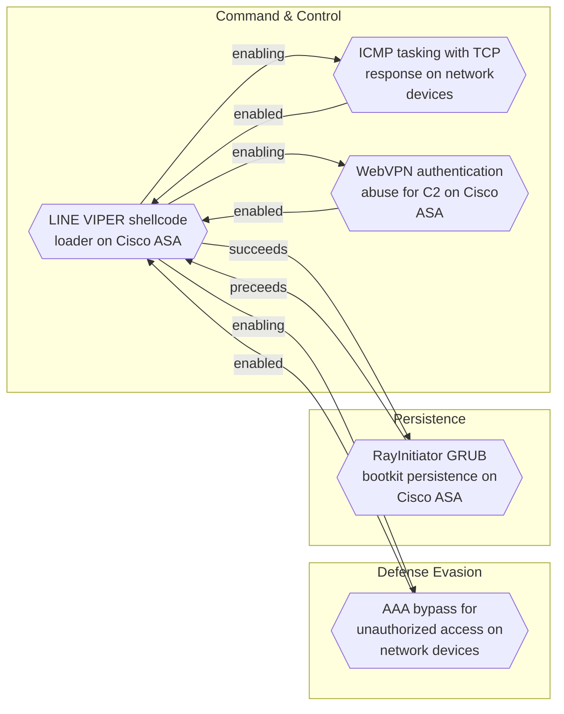
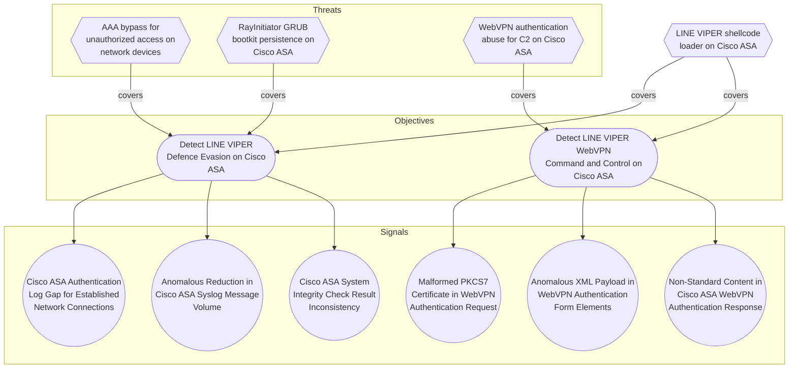

# LINE VIPER shellcode loader on Cisco ASA

## Metadata
| Field | Value |
| --- | --- |
| UUID | `b6175f16-2b61-4116-bd97-de54b02b197e` |
| Schema | `threat::1.0` |
| Version | `1` |
| Created | `2026-06-18` |
| Modified | `2026-06-18` |
| TLP | clear (`TLP:CLEAR`) |
| Organisation | EC DIGIT CSOC (`56b0a0f0-b0bc-47d9-bb46-02f80ae2065a`) |

## References
### Public
- **1**: [https://www.ncsc.gov.uk/static-assets/documents/malware-analysis-reports/RayInitiator-LINE-VIPER/ncsc-mar-rayinitiator-line-viper.pdf](https://www.ncsc.gov.uk/static-assets/documents/malware-analysis-reports/RayInitiator-LINE-VIPER/ncsc-mar-rayinitiator-line-viper.pdf)

## Description
LINE VIPER is a sophisticated user-mode shellcode loader with
associated modules that targets Cisco ASA (Adaptive Security
Appliance) devices. It represents a significant advancement over
previous malware families LINE DANCER and LINE RUNNER [1].

The analysed versions target Cisco ASA devices running firmware
versions 9.12(4)67 and 9.14(4)24, which at the time of
investigation were fully patched. LINE VIPER is loaded into memory
by the RayInitiator bootkit from a WebVPN client authentication
request containing a partial PKCS7 certificate followed by
shellcode [1].

#### Tasking Methods

LINE VIPER can be tasked via two distinct methods [1]:

1. **WebVPN Client Authentication Sessions over HTTPS:** The
   primary tasking method leverages the WebVPN authentication
   mechanism. Tasking payloads are delivered through specially
   crafted HTTPS requests to the WebVPN endpoint.

2. **ICMP with Responses over Raw TCP:** An alternative method
   receives tasking via ICMP packets and responds over raw TCP
   connections using high-ephemeral ports.

#### Security Mechanisms

LINE VIPER employs multiple security mechanisms to protect its
operations [1]:

- **Victim-Specific Tokens:** Utilises victim-specific tokens for
  authentication, a method previously observed in LINE DANCER and
  LINE RUNNER. Tasking payloads are checked for multiple
  victim-specific tokens before execution.

- **Per-Victim RSA Keys:** Uses per-victim RSA public keys to
  perform symmetric key exchange for securing tasking and
  exfiltration via the WebVPN client authentication method.

- **Environmental Keying:** Implements execution guardrails by
  validating environmental conditions before running tasked
  payloads.

#### Capabilities

LINE VIPER provides extensive capabilities for post-compromise
operations [1]:

- **CLI Command Execution:** Ability to execute arbitrary CLI
  commands on the compromised device, enabling full control over
  device configuration and operation.

- **Packet Capture:** Performs network packet captures and has been
  observed collecting protocols with plaintext credentials,
  supporting credential harvesting operations.

- **AAA Bypass:** Bypasses Authentication, Authorization, and
  Accounting (AAA) mechanisms for actor-controlled devices,
  allowing unauthorised access without generating authentication
  logs.

- **Syslog Suppression:** Suppresses specific syslog messages to
  hide malware behaviour and evade detection by security monitoring
  systems.

- **CLI Command Harvesting:** Harvests and monitors user CLI
  commands executed on the device, enabling intelligence gathering
  on administrator activities.

- **Delayed Reboot:** Forces a delayed reboot of the device,
  potentially serving as an anti-forensic capability or to clean up
  traces of malicious activity.

#### Defense Evasion

LINE VIPER implements multiple defence evasion techniques [1]:

- **System Integrity Check Patching:** Patches system integrity
  checks and returns results as if the device was not compromised,
  defeating built-in security validation mechanisms.

- **Heap Integrity Verification Disabling:** Disables heap
  integrity verification functionality to prevent detection of
  memory manipulation.

- **Immediate Reboot Capability:** Implements an anti-forensic
  capability to immediately reboot the device when certain CLI
  commands are executed, potentially destroying volatile evidence.

The combination of advanced persistence, multiple C2 channels,
encryption, and extensive defence evasion makes LINE VIPER a highly
sophisticated threat to network infrastructure.

## Criticality
**Severe** - A Severe priority incident is likely to result in a significant impact to public health or safety, national security, economic security, foreign relations, or civil liberties.

## Terrain
Compromised Cisco ASA devices running firmware versions 9.12(4)67
and 9.14(4)24, which were fully patched at time of discovery [1].
Requires prior deployment of RayInitiator bootkit which installs
hooks into lina binary to intercept WebVPN XML form element
processing. The WebVPN traffic handling codebase in lina processes
XML data that can be weaponised to load shellcode when specific form
elements are encountered.

## Surface
> **Routers**
> Network routers

> **Switches**
> Network switches

> **VPN**
> Virtual Private Network solutions and tunnelling protocols

## Threat Assessment
| Dimension | Assessment | Description |
| --- | --- | --- |
| Severity | Substantial incident | A cyber attack which has a serious impact on a medium-sized organisation, or which poses a considerable risk to a large organisation or wider / local government. |
| Impact | Data Breach Lose Capabilities Reputational Damages National Security | Non-public information has been accessed from the outside, and successfully extracted. Vector execution will remove key functions to the organization, which will not be easily circumvented. Most day-to-day is heavily impaired, but processes can reorganize at a loss. Damages to the organization public view may be achieved by using directly the access gained, or indirectly with data gathered. The vector execution will expose or destroy such sufficient critical information infrastructure that the country will have to intervene due to loss to key national  or international functions. |
| Leverage | Infrastructure Compromise Information Disclosure Dwelling Tampering Repudiation | The compromised target is likely to be used to further expand the sphere of influence of the attacker and allow more potent vectors to be executed. Threat action intending to read a file that one was not granted access to, or to read data in transit. Active or passive extended presence in the target, which performs adversarial operations continuously. Threat action intending to maliciously change or modify persistent data, such as records in a database, and the alteration of data in transit between two computers over an open network, such as the Internet. Threat action aimed at performing prohibited operations in a system that lacks the ability to trace the operations. |
| Viability | Likely | Probable (probably) - 55-80% |
| Kill Chain | Command & Control | Techniques that allow attackers to communicate with controlled systems within a target network. |

## ATT&CK Techniques
| Technique | Name | Description |
| --- | --- | --- |
| `T1059.008` | [Command and Scripting Interpreter: Network Device CLI](https://attack.mitre.org/techniques/T1059/008) | Adversaries may abuse scripting or built-in command line interpreters (CLI) on network devices to execute malicious command and payloads. The CLI is the primary means through which users and administrators interact with the device in order to view system information, modify device operations, or perform diagnostic and administrative functions. CLIs typically contain various permission levels required for different commands.   Scripting interpreters automate tasks and extend functionality beyond the command set included in the network OS. The CLI and scripting interpreter are accessible through a direct console connection, or through remote means, such as telnet or [SSH](https://attack.mitre.org/techniques/T1021/004).  Adversaries can use the network CLI to change how network devices behave and operate. The CLI may be used to manipulate traffic flows to intercept or manipulate data, modify startup configuration parameters to load malicious system software, or to disable security features or logging to avoid detection.(Citation: Cisco Synful Knock Evolution) |
| `T1014` | [Rootkit](https://attack.mitre.org/techniques/T1014) | Adversaries may use rootkits to hide the presence of programs, files, network connections, services, drivers, and other system components. Rootkits are programs that hide the existence of malware by intercepting/hooking and modifying operating system API calls that supply system information. (Citation: Symantec Windows Rootkits)   Rootkits or rootkit enabling functionality may reside at the user or kernel level in the operating system or lower, to include a hypervisor, Master Boot Record, or [System Firmware](https://attack.mitre.org/techniques/T1542/001). (Citation: Wikipedia Rootkit) Rootkits have been seen for Windows, Linux, and Mac OS X systems. (Citation: CrowdStrike Linux Rootkit) (Citation: BlackHat Mac OSX Rootkit) |
| `T1562.001` | [Impair Defenses: Disable or Modify Tools](https://attack.mitre.org/techniques/T1562/001) | Adversaries may modify and/or disable security tools to avoid possible detection of their malware/tools and activities. This may take many forms, such as killing security software processes or services, modifying / deleting Registry keys or configuration files so that tools do not operate properly, or other methods to interfere with security tools scanning or reporting information. Adversaries may also disable updates to prevent the latest security patches from reaching tools on victim systems.(Citation: SCADAfence_ransomware)  Adversaries may also tamper with artifacts deployed and utilized by security tools. Security tools may make dynamic changes to system components in order to maintain visibility into specific events. For example, security products may load their own modules and/or modify those loaded by processes to facilitate data collection. Similar to [Indicator Blocking](https://attack.mitre.org/techniques/T1562/006), adversaries may unhook or otherwise modify these features added by tools (especially those that exist in userland or are otherwise potentially accessible to adversaries) to avoid detection.(Citation: OutFlank System Calls)(Citation: MDSec System Calls) Alternatively, they may add new directories to an endpoint detection and response (EDR) tool’s exclusion list, enabling them to hide malicious files via [File/Path Exclusions](https://attack.mitre.org/techniques/T1564/012).(Citation: BlackBerry WhisperGate 2022)(Citation: Google Cloud Threat Intelligence FIN13 2021)  Adversaries may also focus on specific applications such as Sysmon. For example, the “Start” and “Enable” values in <code>HKEY_LOCAL_MACHINE\SYSTEM\CurrentControlSet\Control\WMI\Autologger\EventLog-Microsoft-Windows-Sysmon-Operational</code> may be modified to tamper with and potentially disable Sysmon logging.(Citation: disable_win_evt_logging)   On network devices, adversaries may attempt to skip digital signature verification checks by altering startup configuration files and effectively disabling firmware verification that typically occurs at boot.(Citation: Fortinet Zero-Day and Custom Malware Used by Suspected Chinese Actor in Espionage Operation)(Citation: Analysis of FG-IR-22-369)  In cloud environments, tools disabled by adversaries may include cloud monitoring agents that report back to services such as AWS CloudWatch or Google Cloud Monitor.  Furthermore, although defensive tools may have anti-tampering mechanisms, adversaries may abuse tools such as legitimate rootkit removal kits to impair and/or disable these tools.(Citation: chasing_avaddon_ransomware)(Citation: dharma_ransomware)(Citation: demystifying_ryuk)(Citation: doppelpaymer_crowdstrike) For example, adversaries have used tools such as GMER to find and shut down hidden processes and antivirus software on infected systems.(Citation: demystifying_ryuk)  Additionally, adversaries may exploit legitimate drivers from anti-virus software to gain access to kernel space (i.e. [Exploitation for Privilege Escalation](https://attack.mitre.org/techniques/T1068)), which may lead to bypassing anti-tampering features.(Citation: avoslocker_ransomware) |
| `T1562` | [Impair Defenses](https://attack.mitre.org/techniques/T1562) | Adversaries may maliciously modify components of a victim environment in order to hinder or disable defensive mechanisms. This not only involves impairing preventative defenses, such as firewalls and anti-virus, but also detection capabilities that defenders can use to audit activity and identify malicious behavior. This may also span both native defenses as well as supplemental capabilities installed by users and administrators.  Adversaries may also impair routine operations that contribute to defensive hygiene, such as blocking users from logging out, preventing a system from shutting down, or disabling or modifying the update process. Adversaries could also target event aggregation and analysis mechanisms, or otherwise disrupt these procedures by altering other system components. These restrictions can further enable malicious operations as well as the continued propagation of incidents.(Citation: Google Cloud Mandiant UNC3886 2024)(Citation: Emotet shutdown) |
| `T1202` | [Indirect Command Execution](https://attack.mitre.org/techniques/T1202) | Adversaries may abuse utilities that allow for command execution to bypass security restrictions that limit the use of command-line interpreters. Various Windows utilities may be used to execute commands, possibly without invoking [cmd](https://attack.mitre.org/software/S0106). For example, [Forfiles](https://attack.mitre.org/software/S0193), the Program Compatibility Assistant (`pcalua.exe`), components of the Windows Subsystem for Linux (WSL), `Scriptrunner.exe`, as well as other utilities may invoke the execution of programs and commands from a [Command and Scripting Interpreter](https://attack.mitre.org/techniques/T1059), Run window, or via scripts.(Citation: VectorSec ForFiles Aug 2017)(Citation: Evi1cg Forfiles Nov 2017)(Citation: Secure Team - Scriptrunner.exe)(Citation: SS64)(Citation: Bleeping Computer - Scriptrunner.exe) Adversaries may also abuse the `ssh.exe` binary to execute malicious commands via the `ProxyCommand` and `LocalCommand` options, which can be invoked via the `-o` flag or by modifying the SSH config file.(Citation: Threat Actor Targets the Manufacturing industry with Lumma Stealer and Amadey Bot)  Adversaries may abuse these features for [Defense Evasion](https://attack.mitre.org/tactics/TA0005), specifically to perform arbitrary execution while subverting detections and/or mitigation controls (such as Group Policy) that limit/prevent the usage of [cmd](https://attack.mitre.org/software/S0106) or file extensions more commonly associated with malicious payloads. |
| `T1040` | [Network Sniffing](https://attack.mitre.org/techniques/T1040) | Adversaries may passively sniff network traffic to capture information about an environment, including authentication material passed over the network. Network sniffing refers to using the network interface on a system to monitor or capture information sent over a wired or wireless connection. An adversary may place a network interface into promiscuous mode to passively access data in transit over the network, or use span ports to capture a larger amount of data.  Data captured via this technique may include user credentials, especially those sent over an insecure, unencrypted protocol. Techniques for name service resolution poisoning, such as [LLMNR/NBT-NS Poisoning and SMB Relay](https://attack.mitre.org/techniques/T1557/001), can also be used to capture credentials to websites, proxies, and internal systems by redirecting traffic to an adversary.  Network sniffing may reveal configuration details, such as running services, version numbers, and other network characteristics (e.g. IP addresses, hostnames, VLAN IDs) necessary for subsequent [Lateral Movement](https://attack.mitre.org/tactics/TA0008) and/or [Defense Evasion](https://attack.mitre.org/tactics/TA0005) activities. Adversaries may likely also utilize network sniffing during [Adversary-in-the-Middle](https://attack.mitre.org/techniques/T1557) (AiTM) to passively gain additional knowledge about the environment.  In cloud-based environments, adversaries may still be able to use traffic mirroring services to sniff network traffic from virtual machines. For example, AWS Traffic Mirroring, GCP Packet Mirroring, and Azure vTap allow users to define specified instances to collect traffic from and specified targets to send collected traffic to.(Citation: AWS Traffic Mirroring)(Citation: GCP Packet Mirroring)(Citation: Azure Virtual Network TAP) Often, much of this traffic will be in cleartext due to the use of TLS termination at the load balancer level to reduce the strain of encrypting and decrypting traffic.(Citation: Rhino Security Labs AWS VPC Traffic Mirroring)(Citation: SpecterOps AWS Traffic Mirroring) The adversary can then use exfiltration techniques such as Transfer Data to Cloud Account in order to access the sniffed traffic.(Citation: Rhino Security Labs AWS VPC Traffic Mirroring)  On network devices, adversaries may perform network captures using [Network Device CLI](https://attack.mitre.org/techniques/T1059/008) commands such as `monitor capture`.(Citation: US-CERT-TA18-106A)(Citation: capture_embedded_packet_on_software) |
| `T1480.001` | [Execution Guardrails: Environmental Keying](https://attack.mitre.org/techniques/T1480/001) | Adversaries may environmentally key payloads or other features of malware to evade defenses and constraint execution to a specific target environment. Environmental keying uses cryptography to constrain execution or actions based on adversary supplied environment specific conditions that are expected to be present on the target. Environmental keying is an implementation of [Execution Guardrails](https://attack.mitre.org/techniques/T1480) that utilizes cryptographic techniques for deriving encryption/decryption keys from specific types of values in a given computing environment.(Citation: EK Clueless Agents)  Values can be derived from target-specific elements and used to generate a decryption key for an encrypted payload. Target-specific values can be derived from specific network shares, physical devices, software/software versions, files, joined AD domains, system time, and local/external IP addresses.(Citation: Kaspersky Gauss Whitepaper)(Citation: Proofpoint Router Malvertising)(Citation: EK Impeding Malware Analysis)(Citation: Environmental Keyed HTA)(Citation: Ebowla: Genetic Malware) By generating the decryption keys from target-specific environmental values, environmental keying can make sandbox detection, anti-virus detection, crowdsourcing of information, and reverse engineering difficult.(Citation: Kaspersky Gauss Whitepaper)(Citation: Ebowla: Genetic Malware) These difficulties can slow down the incident response process and help adversaries hide their tactics, techniques, and procedures (TTPs).  Similar to [Obfuscated Files or Information](https://attack.mitre.org/techniques/T1027), adversaries may use environmental keying to help protect their TTPs and evade detection. Environmental keying may be used to deliver an encrypted payload to the target that will use target-specific values to decrypt the payload before execution.(Citation: Kaspersky Gauss Whitepaper)(Citation: EK Impeding Malware Analysis)(Citation: Environmental Keyed HTA)(Citation: Ebowla: Genetic Malware)(Citation: Demiguise Guardrail Router Logo) By utilizing target-specific values to decrypt the payload the adversary can avoid packaging the decryption key with the payload or sending it over a potentially monitored network connection. Depending on the technique for gathering target-specific values, reverse engineering of the encrypted payload can be exceptionally difficult.(Citation: Kaspersky Gauss Whitepaper) This can be used to prevent exposure of capabilities in environments that are not intended to be compromised or operated within.  Like other [Execution Guardrails](https://attack.mitre.org/techniques/T1480), environmental keying can be used to prevent exposure of capabilities in environments that are not intended to be compromised or operated within. This activity is distinct from typical [Virtualization/Sandbox Evasion](https://attack.mitre.org/techniques/T1497). While use of [Virtualization/Sandbox Evasion](https://attack.mitre.org/techniques/T1497) may involve checking for known sandbox values and continuing with execution only if there is no match, the use of environmental keying will involve checking for an expected target-specific value that must match for decryption and subsequent execution to be successful. |

## Chaining

### Chaining details
#### succeeds -> [RayInitiator GRUB bootkit persistence on Cisco ASA](rayinitiator-grub-bootkit-persistence-on-cisco-asa.md) (`a6f331e0-292d-4d83-87a9-46aa149555dd`) (`sequence::succeeds`)
LINE VIPER is deployed by the RayInitiator bootkit, which
installs a handler in the lina binary (Stage 3) that triggers
shellcode loading from a crafted WebVPN client authentication
request containing a partial PKCS7 certificate [1].

- **Target UUID**: `a6f331e0-292d-4d83-87a9-46aa149555dd`
#### enabling -> [WebVPN authentication abuse for C2 on Cisco ASA](webvpn-authentication-abuse-for-c2-on-cisco-asa.md) (`fcc552fb-b4d1-4b47-b366-104ec4d806ef`) (`support::enabling`)
LINE VIPER hooks WebVPN XML form element processing in lina,
enabling the WebVPN authentication channel to serve as a covert
C2 mechanism. The implant intercepts and processes specially
crafted authentication requests embedding tasking data [1].

- **Target UUID**: `fcc552fb-b4d1-4b47-b366-104ec4d806ef`
#### enabling -> [ICMP tasking with TCP response on network devices](icmp-tasking-with-tcp-response-on-network-devices.md) (`2a5faf22-c526-4d49-81b9-6a7b895de58b`) (`support::enabling`)
LINE VIPER implements a secondary C2 channel that receives
tasking via crafted ICMP packets and responds over raw TCP
connections using high-ephemeral ports, providing operational
resilience independent of WebVPN access [1].

- **Target UUID**: `2a5faf22-c526-4d49-81b9-6a7b895de58b`
#### enabling -> [AAA bypass for unauthorized access on network devices](aaa-bypass-for-unauthorized-access-on-network-devices.md) (`53389577-fd8d-4ce6-9852-8365ed947c17`) (`support::enabling`)
LINE VIPER's memory-resident hooks in lina intercept AAA
processing logic at runtime, enabling actor-controlled devices
to bypass authentication and accounting without generating
audit logs [1].

- **Target UUID**: `53389577-fd8d-4ce6-9852-8365ed947c17`

## Coverage

## Related objects
| Type | Name | Direction | Relation |
| --- | --- | --- | --- |
| Objective | [Detect LINE VIPER Defence Evasion on Cisco ASA](../Objectives/detect-line-viper-defence-evasion-on-cisco-asa.md) (`7c0f2788-690e-4d34-b9eb-5f76e7363ccc`) | Downstream | objective |
| Objective | [Detect LINE VIPER WebVPN Command and Control on Cisco ASA](../Objectives/detect-line-viper-webvpn-command-and-control-on-cisco-asa.md) (`8546b0d8-c9e1-4a51-bf64-2b93c4159ebf`) | Downstream | objective |
| Signal | [Cisco ASA Authentication Log Gap for Established Network Connections](../Objectives/detect-line-viper-defence-evasion-on-cisco-asa.md#cisco-asa-authentication-log-gap-for-established-network-connections) (`0114324a-80a5-46cb-a75c-6f4a2301b7e5`) | Downstream | signal |
| Signal | [Anomalous Reduction in Cisco ASA Syslog Message Volume](../Objectives/detect-line-viper-defence-evasion-on-cisco-asa.md#anomalous-reduction-in-cisco-asa-syslog-message-volume) (`10482800-4d71-4246-93f4-6edfc4705b86`) | Downstream | signal |
| Signal | [Malformed PKCS7 Certificate in WebVPN Authentication Request](../Objectives/detect-line-viper-webvpn-command-and-control-on-cisco-asa.md#malformed-pkcs7-certificate-in-webvpn-authentication-request) (`22e8fb52-d101-4d67-90b7-6e697c2dbb2d`) | Downstream | signal |
| Signal | [Cisco ASA System Integrity Check Result Inconsistency](../Objectives/detect-line-viper-defence-evasion-on-cisco-asa.md#cisco-asa-system-integrity-check-result-inconsistency) (`9666e19f-f48d-4a0b-bb3e-0efbd69e8eac`) | Downstream | signal |
| Signal | [Non-Standard Content in Cisco ASA WebVPN Authentication Response](../Objectives/detect-line-viper-webvpn-command-and-control-on-cisco-asa.md#non-standard-content-in-cisco-asa-webvpn-authentication-response) (`cef505da-e628-469b-ad75-1a19091d31a6`) | Downstream | signal |
| Signal | [Anomalous XML Payload in WebVPN Authentication Form Elements](../Objectives/detect-line-viper-webvpn-command-and-control-on-cisco-asa.md#anomalous-xml-payload-in-webvpn-authentication-form-elements) (`cff09577-eb0b-4ac9-9393-789dbe439b56`) | Downstream | signal |
