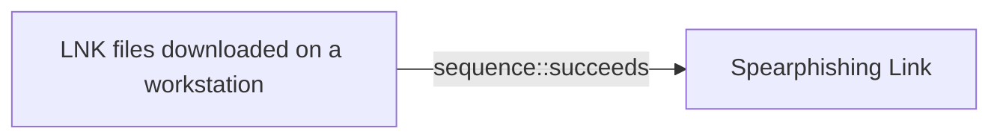

# LNK files downloaded on a workstation

## Metadata

- **UUID**: `3088db32-843b-439f-9374-f8c04a82b2ec`
- **Schema**: `threat::1.0`
- **Version**: `1`
- **Created**: `2025-05-23`
- **Modified**: `2025-05-23`
- **TLP**: clear (`TLP:CLEAR`)
- **Organisation**: EC DIGIT CSOC (`56b0a0f0-b0bc-47d9-bb46-02f80ae2065a`)

## References
### Public
- **1**: [https://socradar.io/windows-shortcut-zero-day-zdi-can-25373-exploited](https://socradar.io/windows-shortcut-zero-day-zdi-can-25373-exploited)
- **2**: [https://www.csoonline.com/article/3850346/new-windows-zero-day-feared-abused-in-widespread-espionage-for-years.html](https://www.csoonline.com/article/3850346/new-windows-zero-day-feared-abused-in-widespread-espionage-for-years.html)
- **3**: [https://windowsforum.com/threads/hidden-windows-vulnerability-the-lnk-shortcut-threat-explained.357280/](https://windowsforum.com/threads/hidden-windows-vulnerability-the-lnk-shortcut-threat-explained.357280/)

## Description
A malicious .lnk file can be crafted to execute arbitrary code, download
malware, or exploit vulnerabilities in the operating system. The threat
actors can use social engineering tactics to trick users into downloading
and opening these files, which can lead to some of the following threats
ref [1], [2]:

- Malware infection: The .lnk file can download and install malware,
such as viruses, Trojans, or ransomware, onto the workstation.
- Code execution: The file can execute malicious code, potentially
allowing attackers to gain control of the workstation or steal sensitive
data.
- Exploitation of vulnerabilities: Malicious .lnk files can exploit known
vulnerabilities in the operating system or applications, leading to further
compromise.

In one of the observed and reported threat actor cyber-espionage campaigns
a North Korean threat actor spreads spear-phishing e-mails containing a link
to a password-protected document which contains LNK file.  

The lure contains a e-mail with a title "Political Advisory Meeting to
be held at the EU Delegation on May 14." This was both the e-mail subject
and the name of a zip file sent through a Dropbox link. The mail contains
a password-protected zip file with included .lnk file in it. Once an end-
usr click this file, it will download a payload usually from a GitHub 
repository. Further the payload executes and infect the host.

## Criticality
**Medium** - A Medium priority incident may affect public health or safety, national security, economic security, foreign relations, civil liberties, or public confidence.

## Terrain
> **Threat actor rely on social engineering techniques for initial access.
For example, well customised and legitimate looking company e-mail with
administrative document protected with passwords or titled with ongoing
meeting or agenda.

Domains: Enterprise
Targets: Customer, End-user, Workstations
Platforms: Office 365, Github**

## Threat Assessment
| Dimension | Assessment | Description |
| --- | --- | --- |
| Severity | Moderate incident | A cyber attack on a small organisation, or which poses a considerable risk to a medium-sized organisation, or preliminary indications of cyber activity against a large organisation or the government. |
| Impact | Business disruption; Lose Capabilities; Data Breach; Identity Theft; Impairement | - |
| Leverage | Infrastructure Compromise; Tampering | - |
| Viability | Likely | Probable (probably) - 55-80% |
| Kill Chain | Defense Evasion | Techniques an attacker may specifically use for evading detection or avoiding other defenses. |

## Actors
| Actor | ID | Source | Description |
| --- | --- | --- | --- |
| [[Enterprise] Kimsuky](https://attack.mitre.org/groups/G0094) | `att&ck::G0094` | ('att&ck',) | [Kimsuky](https://attack.mitre.org/groups/G0094) is a North Korea-based cyber espionage group that has been active since at least 2012. The group initially focused on targeting South Korean government entities, think tanks, and individuals identified as experts in various fields, and expanded its operations to include the UN and the government, education, business services, and manufacturing sectors in the United States, Japan, Russia, and Europe. [Kimsuky](https://attack.mitre.org/groups/G0094) has focused its intelligence collection activities on foreign policy and national security issues related to the Korean peninsula, nuclear policy, and sanctions. [Kimsuky](https://attack.mitre.org/groups/G0094) operations have overlapped with those of other North Korean cyber espionage actors likely as a result of ad hoc collaborations or other limited resource sharing.(Citation: EST Kimsuky April 2019)(Citation: Cybereason Kimsuky November 2020)(Citation: Malwarebytes Kimsuky June 2021)(Citation: CISA AA20-301A Kimsuky)(Citation: Mandiant APT43 March 2024)(Citation: Proofpoint TA427 April 2024)  [Kimsuky](https://attack.mitre.org/groups/G0094) was assessed to be responsible for the 2014 Korea Hydro & Nuclear Power Co. compromise; other notable campaigns include Operation STOLEN PENCIL (2018), Operation Kabar Cobra (2019), and Operation Smoke Screen (2019).(Citation: Netscout Stolen Pencil Dec 2018)(Citation: EST Kimsuky SmokeScreen April 2019)(Citation: AhnLab Kimsuky Kabar Cobra Feb 2019)  North Korean group definitions are known to have significant overlap, and some security researchers report all North Korean state-sponsored cyber activity under the name [Lazarus Group](https://attack.mitre.org/groups/G0032) instead of tracking clusters or subgroups.  In 2023, [Kimsuky](https://attack.mitre.org/groups/G0094) has used commercial large language models to assist with vulnerability research, scripting, social engineering and reconnaissance.(Citation: MSFT-AI) |
| Kimsuky | `misp::bcaaad6f-0597-4b89-b69b-84a6be2b7bc3` | ('misp',) | This threat actor targets South Korean think tanks, industry, nuclear power operators, and the Ministry of Unification for espionage purposes. |

## ATT&CK Techniques
| Technique | Name | Description |
| --- | --- | --- |
| `T1566.002` | [Phishing: Spearphishing Link](https://attack.mitre.org/techniques/T1566/002) | Adversaries may send spearphishing emails with a malicious link in an attempt to gain access to victim systems. Spearphishing with a link is a specific variant of spearphishing. It is different from other forms of spearphishing in that it employs the use of links to download malware contained in email, instead of attaching malicious files to the email itself, to avoid defenses that may inspect email attachments. Spearphishing may also involve social engineering techniques, such as posing as a trusted source.  All forms of spearphishing are electronically delivered social engineering targeted at a specific individual, company, or industry. In this case, the malicious emails contain links. Generally, the links will be accompanied by social engineering text and require the user to actively click or copy and paste a URL into a browser, leveraging [User Execution](https://attack.mitre.org/techniques/T1204). The visited website may compromise the web browser using an exploit, or the user will be prompted to download applications, documents, zip files, or even executables depending on the pretext for the email in the first place.  Adversaries may also include links that are intended to interact directly with an email reader, including embedded images intended to exploit the end system directly. Additionally, adversaries may use seemingly benign links that abuse special characters to mimic legitimate websites (known as an "IDN homograph attack").(Citation: CISA IDN ST05-016) URLs may also be obfuscated by taking advantage of quirks in the URL schema, such as the acceptance of integer- or hexadecimal-based hostname formats and the automatic discarding of text before an “@” symbol: for example, `hxxp://google.com@1157586937`.(Citation: Mandiant URL Obfuscation 2023)  Adversaries may also utilize links to perform consent phishing, typically with OAuth 2.0 request URLs that when accepted by the user provide permissions/access for malicious applications, allowing adversaries to  [Steal Application Access Token](https://attack.mitre.org/techniques/T1528)s.(Citation: Trend Micro Pawn Storm OAuth 2017) These stolen access tokens allow the adversary to perform various actions on behalf of the user via API calls. (Citation: Microsoft OAuth 2.0 Consent Phishing 2021)  Adversaries may also utilize spearphishing links to [Steal Application Access Token](https://attack.mitre.org/techniques/T1528)s that grant immediate access to the victim environment. For example, a user may be lured through “consent phishing” into granting adversaries permissions/access via a malicious OAuth 2.0 request URL .(Citation: Trend Micro Pawn Storm OAuth 2017)(Citation: Microsoft OAuth 2.0 Consent Phishing 2021)  Similarly, malicious links may also target device-based authorization, such as OAuth 2.0 device authorization grant flow which is typically used to authenticate devices without UIs/browsers. Known as “device code phishing,” an adversary may send a link that directs the victim to a malicious authorization page where the user is tricked into entering a code/credentials that produces a device token.(Citation: SecureWorks Device Code Phishing 2021)(Citation: Netskope Device Code Phishing 2021)(Citation: Optiv Device Code Phishing 2021) |
| `T1027` | [Obfuscated Files or Information](https://attack.mitre.org/techniques/T1027) | Adversaries may attempt to make an executable or file difficult to discover or analyze by encrypting, encoding, or otherwise obfuscating its contents on the system or in transit. This is common behavior that can be used across different platforms and the network to evade defenses.   Payloads may be compressed, archived, or encrypted in order to avoid detection. These payloads may be used during Initial Access or later to mitigate detection. Sometimes a user's action may be required to open and [Deobfuscate/Decode Files or Information](https://attack.mitre.org/techniques/T1140) for [User Execution](https://attack.mitre.org/techniques/T1204). The user may also be required to input a password to open a password protected compressed/encrypted file that was provided by the adversary. (Citation: Volexity PowerDuke November 2016) Adversaries may also use compressed or archived scripts, such as JavaScript.   Portions of files can also be encoded to hide the plain-text strings that would otherwise help defenders with discovery. (Citation: Linux/Cdorked.A We Live Security Analysis) Payloads may also be split into separate, seemingly benign files that only reveal malicious functionality when reassembled. (Citation: Carbon Black Obfuscation Sept 2016)  Adversaries may also abuse [Command Obfuscation](https://attack.mitre.org/techniques/T1027/010) to obscure commands executed from payloads or directly via [Command and Scripting Interpreter](https://attack.mitre.org/techniques/T1059). Environment variables, aliases, characters, and other platform/language specific semantics can be used to evade signature based detections and application control mechanisms. (Citation: FireEye Obfuscation June 2017) (Citation: FireEye Revoke-Obfuscation July 2017)(Citation: PaloAlto EncodedCommand March 2017) |
| `T1204` | [User Execution](https://attack.mitre.org/techniques/T1204) | An adversary may rely upon specific actions by a user in order to gain execution. Users may be subjected to social engineering to get them to execute malicious code by, for example, opening a malicious document file or link. These user actions will typically be observed as follow-on behavior from forms of [Phishing](https://attack.mitre.org/techniques/T1566).  While [User Execution](https://attack.mitre.org/techniques/T1204) frequently occurs shortly after Initial Access it may occur at other phases of an intrusion, such as when an adversary places a file in a shared directory or on a user's desktop hoping that a user will click on it. This activity may also be seen shortly after [Internal Spearphishing](https://attack.mitre.org/techniques/T1534).  Adversaries may also deceive users into performing actions such as:  * Enabling [Remote Access Tools](https://attack.mitre.org/techniques/T1219), allowing direct control of the system to the adversary * Running malicious JavaScript in their browser, allowing adversaries to [Steal Web Session Cookie](https://attack.mitre.org/techniques/T1539)s(Citation: Talos Roblox Scam 2023)(Citation: Krebs Discord Bookmarks 2023) * Downloading and executing malware for [User Execution](https://attack.mitre.org/techniques/T1204) * Coerceing users to copy, paste, and execute malicious code manually(Citation: Reliaquest-execution)(Citation: proofpoint-selfpwn)  For example, tech support scams can be facilitated through [Phishing](https://attack.mitre.org/techniques/T1566), vishing, or various forms of user interaction. Adversaries can use a combination of these methods, such as spoofing and promoting toll-free numbers or call centers that are used to direct victims to malicious websites, to deliver and execute payloads containing malware or [Remote Access Tools](https://attack.mitre.org/techniques/T1219).(Citation: Telephone Attack Delivery) |

## Chaining

### Chaining details
#### succeeds -> Spearphishing Link (`sequence::succeeds`)
North Korean cyberespionage campaign distributes a spear-phishing
e-mails which contains a link to download a password-protected
file containing a LNK file. In this campaign the threat actor
try to lure the victims to download a malicious LNK file on
their workstations.

- **Target UUID**: `1a68b5eb-0112-424d-a21f-88dda0b6b8df`
