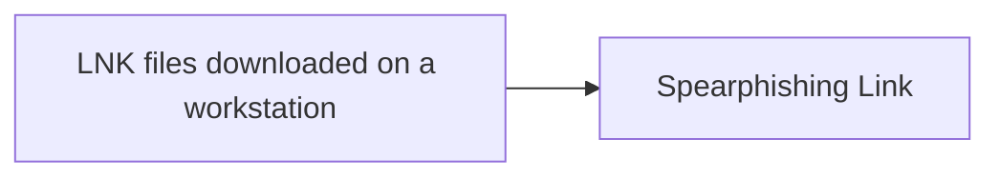

# LNK files downloaded on a workstation

## Metadata

- **UUID**: `3088db32-843b-439f-9374-f8c04a82b2ec`
- **Schema**: `threat::1.0`
- **TLP**: clear

## Description
A malicious .lnk file can be crafted to execute arbitrary code, download
malware, or exploit vulnerabilities in the operating system. The threat
actors can use social engineering tactics to trick users into downloading
and opening these files, which can lead to some of the following threats
ref [1], [2]:

- Malware infection: The .lnk file can download and install malware,
such as viruses, Trojans, or ransomware, onto the workstation.
- Code execution: The file can execute malicious code, potentially
allowing attackers to gain control of the workstation or steal sensitive
data.
- Exploitation of vulnerabilities: Malicious .lnk files can exploit known
vulnerabilities in the operating system or applications, leading to further
compromise.

In one of the observed and reported threat actor cyber-espionage campaigns
a North Korean threat actor spreads spear-phishing e-mails containing a link
to a password-protected document which contains LNK file.  

The lure contains a e-mail with a title "Political Advisory Meeting to
be held at the EU Delegation on May 14." This was both the e-mail subject
and the name of a zip file sent through a Dropbox link. The mail contains
a password-protected zip file with included .lnk file in it. Once an end-
usr click this file, it will download a payload usually from a GitHub 
repository. Further the payload executes and infect the host.

## Techniques
- T1566.002
- T1027
- T1204

## Chaining

