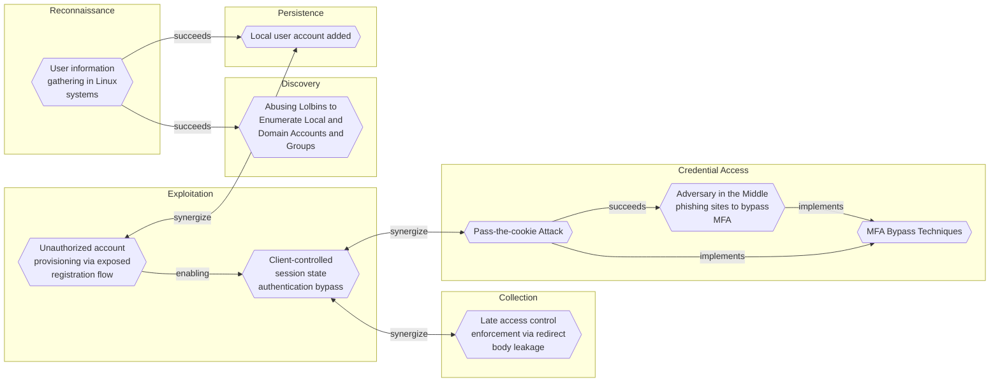

# Local user account added

## Metadata
| Field | Value |
| --- | --- |
| UUID | `e2d8ce6b-f21e-4444-a828-0c6b722a9c93` |
| Schema | `threat::1.0` |
| Version | `1` |
| Created | `2024-12-12` |
| Modified | `2024-12-13` |
| TLP | clear (`TLP:CLEAR`) |
| Organisation | EC DIGIT CSOC (`56b0a0f0-b0bc-47d9-bb46-02f80ae2065a`) |

## References
### Public
- **1**: [https://research.splunk.com/endpoint/aae66dc0-74b4-4807-b480-b35f8027abb4/](https://research.splunk.com/endpoint/aae66dc0-74b4-4807-b480-b35f8027abb4/)
- **2**: [https://research.splunk.com/endpoint/f8c325ea-506e-4105-8ccf-da1492e90115/](https://research.splunk.com/endpoint/f8c325ea-506e-4105-8ccf-da1492e90115/)

## Description
Threat actors may add or modify local user accounts on compromised systems to 
establish persistence, maintain unauthorized access, and potentially 
escalate privileges. By leveraging administrative permissions—often obtained 
through credential theft, exploitation of vulnerabilities, or lateral movement—
adversaries create new user accounts that allow them to re-enter the system 
at will, even if initial malware implants or other backdoor mechanisms 
are detected and removed.  

## Windows

Adversaries might run commands like :
```bash
net user /add [username] [password] 
or 
net localgroup administrators [username] /add
```

To stealthily provision accounts with elevated permissions. 

## Linux or macOS

Threat actors may modify :
```bash
/etc/passwd
or 
/etc/shadow
``` 
or use commands like `useradd` or `dscl` to create new users.
The changes perfomed by using the above commands can be detected by 
monitoring certain paths, such as `/usr/sbin/useradd`.  
In some cases, attackers may script these actions to occur automatically during 
their post-exploitation phase, making detection more challenging.  

In practice, once these local accounts are established, the attackers can 
maintain a foothold within the environment, pivot to other hosts, 
exfiltrate data, or stage further attacks. The long-term impact of such 
account additions may lead to data breaches, reputation damage, financial 
loss and regulatory consequences.

## Criticality
**High** - A High priority incident is likely to result in a demonstrable impact to public health or safety, national security, economic security, foreign relations, civil liberties, or public confidence.

## Terrain
Adversary must have existing administrative privileges on a compromised host 
within the targeted infrastructure to create or modify local user accounts.

## Surface
> **Windows**
> Microsoft Windows operating systems (all versions)

> **Linux**
> Linux-based operating systems (all distributions)

> **macOS**
> Apple macOS operating systems (all versions)

> **Windows::Desktop**
> Microsoft Windows desktop editions

> **Web Servers**
> HTTP servers and reverse proxies

> **Database Management**
> Database management systems

> **Azure::Compute::Virtual Machines**
> Azure Virtual Machines

## Threat Assessment
| Dimension | Assessment | Description |
| --- | --- | --- |
| Severity | Substantial incident | A cyber attack which has a serious impact on a medium-sized organisation, or which poses a considerable risk to a large organisation or wider / local government. |
| Impact | Data Breach<br>Reputational Damages<br>Identity Theft<br>Business disruption | Non-public information has been accessed from the outside, and successfully extracted.<br>Damages to the organization public view may be achieved by using directly the access gained, or indirectly with data gathered.<br>Acquisition of sufficient information and privileges to profess as a given individual, for the purpose of abusing and deceiving human trust relationships.<br>Business disruption |
| Leverage | Elevation of privilege<br>New Accounts<br>Modify configuration | Capacity to augment leverage over the target system by upgrading the compromised access rights<br>Ability to create new arbitrary user accounts.<br>Modify configuration or services |
| Viability | Likely | Probable (probably) - 55-80% |
| Kill Chain | Persistence | Any access, action or change to a system that gives an attacker persistent presence on the system. |

## ATT&CK Techniques
| Technique | Name | Description |
| --- | --- | --- |
| `T1136.001` | [Create Account: Local Account](https://attack.mitre.org/techniques/T1136/001) | Adversaries may create a local account to maintain access to victim systems. Local accounts are those configured by an organization for use by users, remote support, services, or for administration on a single system or service.   For example, with a sufficient level of access, the Windows <code>net user /add</code> command can be used to create a local account.  In Linux, the `useradd` command can be used, while on macOS systems, the <code>dscl -create</code> command can be used. Local accounts may also be added to network devices, often via common [Network Device CLI](https://attack.mitre.org/techniques/T1059/008) commands such as <code>username</code>, to ESXi servers via `esxcli system account add`, or to Kubernetes clusters using the `kubectl` utility.(Citation: cisco_username_cmd)(Citation: Kubernetes Service Accounts Security)  Such accounts may be used to establish secondary credentialed access that do not require persistent remote access tools to be deployed on the system. |

## Chaining

