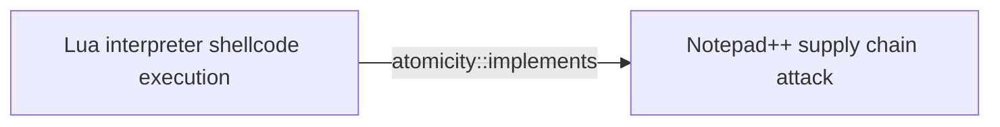
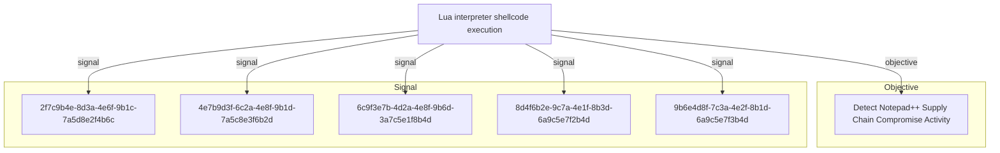

# Lua interpreter shellcode execution

## Metadata

- **UUID**: `bc365789-bdbb-4e78-b2ae-b097a7ccd35f`
- **Schema**: `threat::1.0`
- **Version**: `1`
- **Created**: `2026-02-09`
- **Modified**: `2026-02-09`
- **TLP**: clear (`TLP:CLEAR`)
- **Organisation**: EC DIGIT CSOC (`56b0a0f0-b0bc-47d9-bb46-02f80ae2065a`)

## References
### Public
- **1**: [https://securelist.com/notepad-supply-chain-attack/115382/](https://securelist.com/notepad-supply-chain-attack/115382/)
- **2**: [https://www.rapid7.com/blog/post/2026/02/03/notepad-plus-plus-supply-chain-compromise/](https://www.rapid7.com/blog/post/2026/02/03/notepad-plus-plus-supply-chain-compromise/)

## Description
## Executive Summary

Lua interpreter shellcode execution is an evasion technique that leverages legitimate 
Lua scripting interpreters to execute malicious compiled Lua scripts containing 
shellcode payloads. This technique was observed in Chain #2 of the Notepad++ supply 
chain attack (September-October 2025), where threat actors used a legitimate Lua 
interpreter (script.exe) to load compiled malicious scripts (alien.ini) that 
performed in-memory shellcode injection.

## Technical Details

### Attack Flow

1. **File Deployment**: Malicious and legitimate files dropped to %APPDATA%\Adobe\Scripts\:
   - `alien.dll` (SHA1: 6444dab57d93ce987c22da66b3706d5d7fc226da) - Legitimate library
   - `lua5.1.dll` (SHA1: 2ab0758dda4e71aee6f4c8e4c0265a796518f07d) - Legitimate Lua library
   - `script.exe` (SHA1: bf996a709835c0c16cce1015e6d44fc95e08a38a) - Legitimate Lua interpreter
   - `alien.ini` (SHA1: ca4b6fe0c69472cd3d63b212eb805b7f65710d33) - MALICIOUS compiled Lua script

2. **Execution**: Command line execution:
   ```
   %APPDATA%\Adobe\Scripts\script.exe %APPDATA%\Adobe\Scripts\alien.ini
   ```

3. **Shellcode Injection**: The malicious alien.ini file:
   - Allocates executable memory in the process space
   - Places shellcode into the allocated memory
   - Launches shellcode by abusing the Windows EnumWindowStationsW API function

4. **Payload Delivery**: Shellcode acts as a Metasploit downloader to retrieve Cobalt Strike Beacon

### Malicious File Variants

Multiple variants of the alien.ini compiled Lua script were observed:
- SHA1: ca4b6fe0c69472cd3d63b212eb805b7f65710d33
- SHA1: 0d0f315fd8cf408a483f8e2dd1e69422629ed9fd
- SHA1: 2a476cfb85fbf012fdbe63a37642c11afa5cf020

### Download URLs

Cobalt Strike Beacon downloaded from:
```
https://cdncheck.it[.]com/users/admin
https://safe-dns.it[.]com/help/Get-Start
```

### Command and Control Infrastructure

C2 server URLs:
```
https://cdncheck.it[.]com/api/getInfo/v1
https://cdncheck.it[.]com/api/FileUpload/submit
https://safe-dns.it[.]com/resolve
https://safe-dns.it[.]com/dns-query
```

## Why This Technique is Effective

1. **Living off the Land**: Uses legitimate Lua interpreter (script.exe) that may be trusted
2. **File Masquerading**: Malicious payload disguised as configuration file (alien.ini)
3. **Directory Camouflage**: Files placed in Adobe Scripts directory to appear legitimate
4. **API Abuse**: Leverages legitimate Windows API (EnumWindowStationsW) for shellcode execution
5. **Memory-Only Execution**: Shellcode runs in memory, reducing disk-based artifacts
6. **Defense Evasion**: Compiled Lua scripts are less commonly analyzed than traditional executables

## Detection Opportunities

1. **Process Monitoring**:
   - Monitor for unexpected Lua interpreter (script.exe, lua.exe, lua5.1.exe) execution
   - Look for Lua interpreters spawned from unusual parent processes
   - Alert on Lua processes loading .ini or non-standard file extensions

2. **Command Line Analysis**:
   - Detect command lines executing Lua interpreters with suspicious arguments
   - Monitor for execution from %APPDATA% directories (especially Adobe\Scripts\)

3. **File System Monitoring**:
   - Watch for creation of script.exe, lua5.1.dll, alien.dll in %APPDATA% paths
   - Alert on .ini files in scripting directories
   - Monitor for file writes to %APPDATA%\Adobe\Scripts\ directory

4. **API Call Monitoring**:
   - Detect EnumWindowStationsW API calls from scripting interpreters
   - Monitor for memory allocation patterns (VirtualAlloc, VirtualAllocEx) from Lua processes
   - Alert on WriteProcessMemory calls from script interpreters

5. **Network Monitoring**:
   - Block/alert on connections to known malicious domains (cdncheck.it[.]com, safe-dns.it[.]com)
   - Monitor for unusual HTTPS/HTTP traffic from scripting processes
   - Detect Cobalt Strike Beacon network signatures

6. **Behavioral Detection**:
   - Identify Lua interpreters making network connections
   - Detect shellcode injection patterns (allocate → write → execute)
   - Alert on processes with unusual memory protection changes

## Mitigation Recommendations

1. **Application Whitelisting**:
   - Restrict execution of scripting interpreters to approved locations
   - Block execution from %APPDATA% directories where possible
   - Implement strict execution policies for .exe files in user writable directories

2. **Script Execution Controls**:
   - Monitor and control Lua interpreter usage across the environment
   - Restrict script interpreters from making network connections
   - Implement PowerShell Constrained Language Mode and similar controls for other interpreters

3. **EDR/XDR Deployment**:
   - Deploy endpoint detection solutions capable of monitoring API calls
   - Enable memory scanning to detect shellcode patterns
   - Implement behavioral analytics for script interpreter abuse

4. **Directory Monitoring**:
   - Implement strict monitoring on %APPDATA% directories
   - Alert on creation of executable content in user data directories
   - Monitor for unusual DLL loading from user-writable paths

5. **Network Security**:
   - Block known malicious infrastructure at network perimeter
   - Implement SSL/TLS inspection for HTTPS traffic analysis
   - Deploy DNS filtering to block known C2 domains

6. **Security Awareness**:
   - Train users to recognize unusual software installations
   - Educate on supply chain attack vectors
   - Implement procedures for verifying software update authenticity

## MITRE ATT&CK Mapping

- **T1059.010** - Command and Scripting Interpreter: Lua
  - Attackers used legitimate Lua interpreter (script.exe) to execute malicious compiled Lua scripts

- **T1055.001** - Process Injection: Dynamic-link Library Injection
  - Malicious Lua script allocated memory and injected shellcode into process memory space

- **T1106** - Native API
  - Abused EnumWindowStationsW Windows API function to execute shellcode
  - Likely used VirtualAlloc/VirtualAllocEx for memory allocation

## Indicators of Compromise (IOCs)

### File Hashes (SHA1)

**Legitimate files** (used in attack but not malicious):
```
6444dab57d93ce987c22da66b3706d5d7fc226da - alien.dll
2ab0758dda4e71aee6f4c8e4c0265a796518f07d - lua5.1.dll
bf996a709835c0c16cce1015e6d44fc95e08a38a - script.exe
```

**Malicious files**:
```
ca4b6fe0c69472cd3d63b212eb805b7f65710d33 - alien.ini
0d0f315fd8cf408a483f8e2dd1e69422629ed9fd - alien.ini (variant)
2a476cfb85fbf012fdbe63a37642c11afa5cf020 - alien.ini (variant)
```

### Network Indicators

**Payload Download URLs**:
```
https://cdncheck.it[.]com/users/admin
https://safe-dns.it[.]com/help/Get-Start
```

**C2 Infrastructure**:
```
https://cdncheck.it[.]com/api/getInfo/v1
https://cdncheck.it[.]com/api/FileUpload/submit
https://safe-dns.it[.]com/resolve
https://safe-dns.it[.]com/dns-query
```

**Malicious Domains**:
```
cdncheck.it[.]com
safe-dns.it[.]com
```

### File System Indicators

**File Paths**:
```
%APPDATA%\Adobe\Scripts\alien.dll
%APPDATA%\Adobe\Scripts\lua5.1.dll
%APPDATA%\Adobe\Scripts\script.exe
%APPDATA%\Adobe\Scripts\alien.ini
```

**Execution Command**:
```
%APPDATA%\Adobe\Scripts\script.exe %APPDATA%\Adobe\Scripts\alien.ini
```

## Context within Notepad++ Supply Chain Attack

This technique represents Chain #2 of the Notepad++ supply chain compromise:
- **Timeline**: September-October 2025
- **Position in Kill Chain**: Following initial access through compromised Notepad++ updates
- **Evolution**: Represented a shift from ProShow exploit (Chain #1) to interpreter-based execution
- **Parallel Variants**: Operated alongside DLL side-loading technique (Chain #3)

## Risk Assessment

**Threat Level**: HIGH

**Key Risk Factors**:
- Confirmed real-world usage in sophisticated supply chain attack
- Effective defense evasion through legitimate tool abuse
- Multiple variants indicate active development and testing
- Integration with commercial post-exploitation frameworks (Cobalt Strike)
- Targets developer and workstation environments with elevated privileges

**Target Profile**:
- Organizations using software with embedded scripting interpreters
- Development environments with Lua-based tools
- Enterprises affected by supply chain compromises
- High-value targets in government and financial sectors

## References

- Kaspersky Securelist: "Notepad++ Supply Chain Attack" (February 2026)
- Rapid7 Research: "Notepad++ Supply Chain Compromise Analysis" (February 2026)
- MITRE ATT&CK: T1059.010 (Command and Scripting Interpreter: Lua)
- MITRE ATT&CK: T1055.001 (Process Injection: Dynamic-link Library Injection)
- MITRE ATT&CK: T1106 (Native API)

## Criticality
**High** - A High priority incident is likely to result in a demonstrable impact to public health or safety, national security, economic security, foreign relations, civil liberties, or public confidence.

## Terrain
> **Windows endpoints where adversaries have established initial access and seek to 
execute shellcode through legitimate scripting interpreters. The technique abuses 
a legitimate Lua interpreter (script.exe) to load and execute compiled malicious 
Lua scripts that perform memory allocation and shellcode injection. Commonly seen 
in supply chain attacks where malicious files are dropped to application data 
directories (%APPDATA%) to appear as legitimate software components.

Surface: OS::Windows::Desktop**

## Threat Assessment
| Dimension | Assessment | Description |
| --- | --- | --- |
| Severity | Significant incident | A cyber attack which has a serious impact on a large organisation or on wider / local government, or which poses a considerable risk to central government or (inter)national essential services. |
| Impact | Data Breach; Business disruption; Reputational Damages; Monetary Loss | - |
| Leverage | Elevation of privilege; Information Disclosure; Tampering; Repudiation | - |
| Viability | Almost certain | Nearly certain - 95-99% |
| Kill Chain | Execution | Techniques that result in execution of attacker-controlled code on a local or remote system. |

## ATT&CK Techniques
| Technique | Name | Description |
| --- | --- | --- |
| `T1059.010` | [Command and Scripting Interpreter: AutoHotKey & AutoIT](https://attack.mitre.org/techniques/T1059/010) | Adversaries may execute commands and perform malicious tasks using AutoIT and AutoHotKey automation scripts. AutoIT and AutoHotkey (AHK) are scripting languages that enable users to automate Windows tasks. These automation scripts can be used to perform a wide variety of actions, such as clicking on buttons, entering text, and opening and closing programs.(Citation: AutoIT)(Citation: AutoHotKey)  Adversaries may use AHK (`.ahk`) and AutoIT (`.au3`) scripts to execute malicious code on a victim's system. For example, adversaries have used for AHK to execute payloads and other modular malware such as keyloggers. Adversaries have also used custom AHK files containing embedded malware as [Phishing](https://attack.mitre.org/techniques/T1566) payloads.(Citation: Splunk DarkGate)  These scripts may also be compiled into self-contained executable payloads (`.exe`).(Citation: AutoIT)(Citation: AutoHotKey) |
| `T1055.001` | [Process Injection: Dynamic-link Library Injection](https://attack.mitre.org/techniques/T1055/001) | Adversaries may inject dynamic-link libraries (DLLs) into processes in order to evade process-based defenses as well as possibly elevate privileges. DLL injection is a method of executing arbitrary code in the address space of a separate live process.    DLL injection is commonly performed by writing the path to a DLL in the virtual address space of the target process before loading the DLL by invoking a new thread. The write can be performed with native Windows API calls such as <code>VirtualAllocEx</code> and <code>WriteProcessMemory</code>, then invoked with <code>CreateRemoteThread</code> (which calls the <code>LoadLibrary</code> API responsible for loading the DLL). (Citation: Elastic Process Injection July 2017)   Variations of this method such as reflective DLL injection (writing a self-mapping DLL into a process) and memory module (map DLL when writing into process) overcome the address relocation issue as well as the additional APIs to invoke execution (since these methods load and execute the files in memory by manually preforming the function of <code>LoadLibrary</code>).(Citation: Elastic HuntingNMemory June 2017)(Citation: Elastic Process Injection July 2017)   Another variation of this method, often referred to as Module Stomping/Overloading or DLL Hollowing, may be leveraged to conceal injected code within a process. This method involves loading a legitimate DLL into a remote process then manually overwriting the module's <code>AddressOfEntryPoint</code> before starting a new thread in the target process.(Citation: Module Stomping for Shellcode Injection) This variation allows attackers to hide malicious injected code by potentially backing its execution with a legitimate DLL file on disk.(Citation: Hiding Malicious Code with Module Stomping)   Running code in the context of another process may allow access to the process's memory, system/network resources, and possibly elevated privileges. Execution via DLL injection may also evade detection from security products since the execution is masked under a legitimate process. |
| `T1106` | [Native API](https://attack.mitre.org/techniques/T1106) | Adversaries may interact with the native OS application programming interface (API) to execute behaviors. Native APIs provide a controlled means of calling low-level OS services within the kernel, such as those involving hardware/devices, memory, and processes.(Citation: NT API Windows)(Citation: Linux Kernel API) These native APIs are leveraged by the OS during system boot (when other system components are not yet initialized) as well as carrying out tasks and requests during routine operations.  Adversaries may abuse these OS API functions as a means of executing behaviors. Similar to [Command and Scripting Interpreter](https://attack.mitre.org/techniques/T1059), the native API and its hierarchy of interfaces provide mechanisms to interact with and utilize various components of a victimized system.  Native API functions (such as <code>NtCreateProcess</code>) may be directed invoked via system calls / syscalls, but these features are also often exposed to user-mode applications via interfaces and libraries.(Citation: OutFlank System Calls)(Citation: CyberBit System Calls)(Citation: MDSec System Calls) For example, functions such as the Windows API <code>CreateProcess()</code> or GNU <code>fork()</code> will allow programs and scripts to start other processes.(Citation: Microsoft CreateProcess)(Citation: GNU Fork) This may allow API callers to execute a binary, run a CLI command, load modules, etc. as thousands of similar API functions exist for various system operations.(Citation: Microsoft Win32)(Citation: LIBC)(Citation: GLIBC)  Higher level software frameworks, such as Microsoft .NET and macOS Cocoa, are also available to interact with native APIs. These frameworks typically provide language wrappers/abstractions to API functionalities and are designed for ease-of-use/portability of code.(Citation: Microsoft NET)(Citation: Apple Core Services)(Citation: MACOS Cocoa)(Citation: macOS Foundation)  Adversaries may use assembly to directly or in-directly invoke syscalls in an attempt to subvert defensive sensors and detection signatures such as user mode API-hooks.(Citation: Redops Syscalls) Adversaries may also attempt to tamper with sensors and defensive tools associated with API monitoring, such as unhooking monitored functions via [Disable or Modify Tools](https://attack.mitre.org/techniques/T1562/001). |

## Chaining

### Chaining details
#### implements -> Notepad++ supply chain attack (`atomicity::implements`)
This technique was used as Chain #2 in the Notepad++ supply chain attack 
(September-October 2025). The Lua interpreter execution chain served as 
one of three distinct attack variants deployed by the threat actors.

- **Target UUID**: `8b7cae6f-b6cf-4414-9cdc-fe8c8ee7ee22`

## Relations

