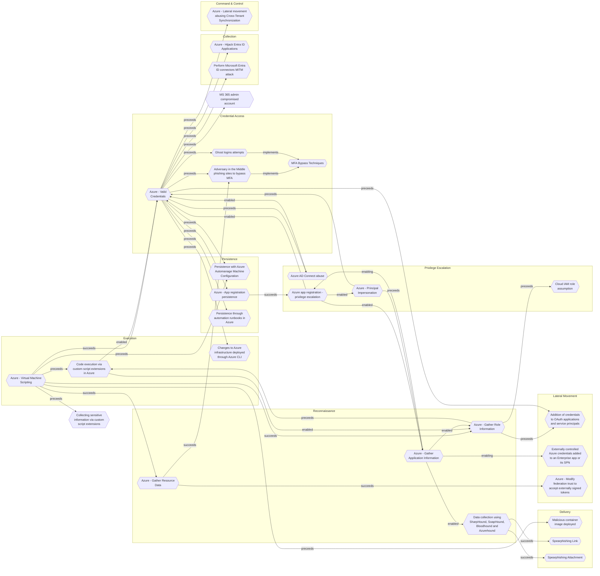

# Malicious container image deployed

## Metadata
| Field | Value |
| --- | --- |
| UUID | `8934c19a-954b-4dce-8081-0a6acca599f6` |
| Schema | `threat::1.0` |
| Version | `1` |
| Created | `2022-07-04` |
| Modified | `2025-10-01` |
| TLP | clear (`TLP:CLEAR`) |
| Organisation | EC DIGIT CSOC (`56b0a0f0-b0bc-47d9-bb46-02f80ae2065a`) |

## References
### Public
- **1**: [https://blog.aquasec.com/supply-chain-threats-using-container-images](https://blog.aquasec.com/supply-chain-threats-using-container-images)
- **2**: [https://github.com/cncf/tag-security/blob/main/supply-chain-security/supply-chain-security-paper/CNCF_SSCP_v1.pdf](https://github.com/cncf/tag-security/blob/main/supply-chain-security/supply-chain-security-paper/CNCF_SSCP_v1.pdf)

## Description
Threat actors plant malicious code into container images which 
execute in target environment. This vector is used to perform 
cryptominning activities and as a persistence technique.

## Criticality
**High** - A High priority incident is likely to result in a demonstrable impact to public health or safety, national security, economic security, foreign relations, civil liberties, or public confidence.

## Terrain
The adversary need to be able to inject malicious code into
container image which will be deployed in target environment. 
This can be achieved by putting malicious image into public 
registry and tricking developer into using it, getting access
into internal CI/CD pipeline, uploading modified image into 
internal registry or running the image directly 
on compromised host.

## Surface
> **AWS**
> Amazon Web Services cloud platform

> **Azure**
> Microsoft Azure cloud platform

> **Container Runtime::Docker**
> Docker Engine container runtime

> **Orchestration::Kubernetes**
> Kubernetes container orchestration platform

> **Linux**
> Linux-based operating systems (all distributions)

> **Development::CI/CD**
> Continuous integration and continuous delivery platforms

> **Code Repositories**
> Source code hosting and version control platforms

## Threat Assessment
| Dimension | Assessment | Description |
| --- | --- | --- |
| Severity | Significant incident | A cyber attack which has a serious impact on a large organisation or on wider / local government, or which poses a considerable risk to central government or (inter)national essential services. |
| Impact | Data Breach Business disruption Operating costs | Non-public information has been accessed from the outside, and successfully extracted. Business disruption Increased operating costs |
| Leverage | Dwelling Elevation of privilege Infrastructure Compromise Software installation | Active or passive extended presence in the target, which performs adversarial operations continuously. Capacity to augment leverage over the target system by upgrading the compromised access rights The compromised target is likely to be used to further expand the sphere of influence of the attacker and allow more potent vectors to be executed. Software installation or code modification |
| Viability | Likely | Probable (probably) - 55-80% |
| Kill Chain | Delivery | Techniques resulting in the transmission of a weaponized object to the targeted environment. |

## ATT&CK Techniques
| Technique | Name | Description |
| --- | --- | --- |
| `T1525` | [Implant Internal Image](https://attack.mitre.org/techniques/T1525) | Adversaries may implant cloud or container images with malicious code to establish persistence after gaining access to an environment. Amazon Web Services (AWS) Amazon Machine Images (AMIs), Google Cloud Platform (GCP) Images, and Azure Images as well as popular container runtimes such as Docker can be implanted or backdoored. Unlike [Upload Malware](https://attack.mitre.org/techniques/T1608/001), this technique focuses on adversaries implanting an image in a registry within a victim’s environment. Depending on how the infrastructure is provisioned, this could provide persistent access if the infrastructure provisioning tool is instructed to always use the latest image.(Citation: Rhino Labs Cloud Image Backdoor Technique Sept 2019)  A tool has been developed to facilitate planting backdoors in cloud container images.(Citation: Rhino Labs Cloud Backdoor September 2019) If an adversary has access to a compromised AWS instance, and permissions to list the available container images, they may implant a backdoor such as a [Web Shell](https://attack.mitre.org/techniques/T1505/003).(Citation: Rhino Labs Cloud Image Backdoor Technique Sept 2019) |
| `T1204.003` | [User Execution: Malicious Image](https://attack.mitre.org/techniques/T1204/003) | Adversaries may rely on a user running a malicious image to facilitate execution. Amazon Web Services (AWS) Amazon Machine Images (AMIs), Google Cloud Platform (GCP) Images, and Azure Images as well as popular container runtimes such as Docker can be backdoored. Backdoored images may be uploaded to a public repository via [Upload Malware](https://attack.mitre.org/techniques/T1608/001), and users may then download and deploy an instance or container from the image without realizing the image is malicious, thus bypassing techniques that specifically achieve Initial Access. This can lead to the execution of malicious code, such as code that executes cryptocurrency mining, in the instance or container.(Citation: Summit Route Malicious AMIs)  Adversaries may also name images a certain way to increase the chance of users mistakenly deploying an instance or container from the image (ex: [Match Legitimate Resource Name or Location](https://attack.mitre.org/techniques/T1036/005)).(Citation: Aqua Security Cloud Native Threat Report June 2021) |

## Chaining

