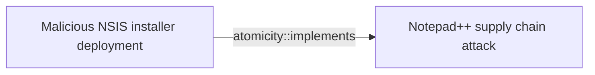
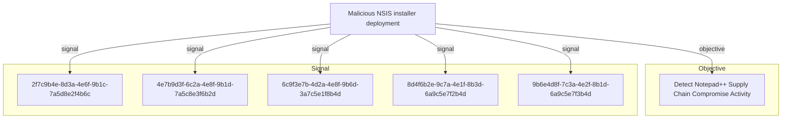

# Malicious NSIS installer deployment

## Metadata

- **UUID**: `52462685-bebb-4e86-94b0-fd46aeacb085`
- **Schema**: `threat::1.0`
- **Version**: `1`
- **Created**: `2026-02-09`
- **Modified**: `2026-02-09`
- **TLP**: clear (`TLP:CLEAR`)
- **Organisation**: EC DIGIT CSOC (`56b0a0f0-b0bc-47d9-bb46-02f80ae2065a`)

## References
### Public
- **1**: [https://securelist.com/notepad-supply-chain-attack/115382/](https://securelist.com/notepad-supply-chain-attack/115382/)
- **2**: [https://www.rapid7.com/blog/post/2026/02/03/notepad-plus-plus-supply-chain-compromise/](https://www.rapid7.com/blog/post/2026/02/03/notepad-plus-plus-supply-chain-compromise/)

## Description
## Overview

Malicious NSIS (Nullsoft Scriptable Install System) installers are being weaponized 
in supply chain attacks to deploy various payloads on victim systems. This technique 
was observed in the Notepad++ supply chain attack where three distinct infection 
chains leveraged NSIS installers with different payloads and behaviors.

## Technical Details

### NSIS Runtime Behavior

When executed, NSIS installers create a temporary directory at runtime:

```
%localappdata%\Temp\ns<random>.tmp
```

This directory creation is a key detection indicator for NSIS installer execution, 
both legitimate and malicious.

### Infection Chain #1 - ProShow Exploit (1MB Size)

**Behavior:**
- Sends heartbeat with system information to command and control
- Drops ProShow exploit payload
- Collects victim telemetry

**Indicators:**
- SHA1: 8e6e505438c21f3d281e1cc257abdbf7223b7f5a
- SHA1: 90e677d7ff5844407b9c073e3b7e896e078e11cd

### Infection Chain #2 - Lua Interpreter (140KB Size)

**Behavior:**
- Collects detailed system information
- Drops Lua interpreter with malicious script
- Establishes persistence mechanism

**Indicators:**
- SHA1: 573549869e84544e3ef253bdba79851dcde4963a
- SHA1: 13179c8f19fbf3d8473c49983a199e6cb4f318f0

### Infection Chain #3 - DLL Sideloading

**Behavior:**
- Drops BluetoothService DLL sideloading components
- Establishes stealth execution capability
- Maintains persistence via legitimate-looking service

**Indicators:**
- SHA1: 4c9aac447bf732acc97992290aa7a187b967ee2c
- SHA1: 821c0cafb2aab0f063ef7e313f64313fc81d46cd

## Detection Guidance

### File System Monitoring

Monitor for NSIS temporary directory creation patterns:

```
File Creation: %localappdata%\Temp\ns*.tmp\*
Parent Process: updater.exe, or unexpected processes
```

### Hash-Based Detection

Monitor for known malicious updater.exe hashes:
- 8e6e505438c21f3d281e1cc257abdbf7223b7f5a
- 90e677d7ff5844407b9c073e3b7e896e078e11cd
- 573549869e84544e3ef253bdba79851dcde4963a
- 13179c8f19fbf3d8473c49983a199e6cb4f318f0
- 4c9aac447bf732acc97992290aa7a187b967ee2c
- 821c0cafb2aab0f063ef7e313f64313fc81d46cd

### Behavioral Detection

1. **Unexpected NSIS Execution**
   - NSIS installers executing from unusual locations
   - User directories, temp folders, browser cache

2. **Network Communication**
   - Outbound connections from installer processes
   - Heartbeat traffic with system telemetry

3. **Payload Dropping**
   - Lua interpreter deployment in non-standard locations
   - DLL files dropped alongside legitimate executables
   - ProShow-related files in unexpected directories

### Process Monitoring

```
Process: *.exe
CommandLine Contains: "updater.exe"
File Size: 140KB or 1MB (typical malicious sizes)
Parent Process: explorer.exe, browser processes
Child Processes: lua.exe, rundll32.exe, regsvr32.exe
```

## Mitigation Recommendations

1. **Software Update Controls**
   - Verify digital signatures on all installers
   - Implement application control policies
   - Whitelist legitimate update mechanisms

2. **Network Segmentation**
   - Restrict outbound connections from installer processes
   - Monitor C2 communication patterns

3. **Endpoint Detection**
   - Deploy EDR solutions with NSIS installer monitoring
   - Alert on ns*.tmp directory creation from suspicious processes

4. **User Awareness**
   - Train users to verify software sources
   - Warn against running installers from unexpected locations
   - Implement prompt for administrator approval on installations

## Criticality
**High** - A High priority incident is likely to result in a demonstrable impact to public health or safety, national security, economic security, foreign relations, civil liberties, or public confidence.

## Terrain
> **Targeted systems are Windows-based workstations and laptops where legitimate software 
update mechanisms exist. The attack leverages NSIS (Nullsoft Scriptable Install System) 
installers to masquerade as legitimate software updates, particularly targeting 
developer environments and end-user workstations. The NSIS framework creates temporary 
directories during runtime that can serve as indicators of compromise.

Surface: OS::Windows::Desktop**

## Threat Assessment
| Dimension | Assessment | Description |
| --- | --- | --- |
| Severity | Significant incident | A cyber attack which has a serious impact on a large organisation or on wider / local government, or which poses a considerable risk to central government or (inter)national essential services. |
| Impact | Data Breach; Lose Capabilities; Business disruption; Reputational Damages | - |
| Leverage | Software installation; Infrastructure Compromise; Tampering | - |
| Viability | Likely | Probable (probably) - 55-80% |
| Kill Chain | Execution | Techniques that result in execution of attacker-controlled code on a local or remote system. |

## ATT&CK Techniques
| Technique | Name | Description |
| --- | --- | --- |
| `T1204.002` | [User Execution: Malicious File](https://attack.mitre.org/techniques/T1204/002) | An adversary may rely upon a user opening a malicious file in order to gain execution. Users may be subjected to social engineering to get them to open a file that will lead to code execution. This user action will typically be observed as follow-on behavior from [Spearphishing Attachment](https://attack.mitre.org/techniques/T1566/001). Adversaries may use several types of files that require a user to execute them, including .doc, .pdf, .xls, .rtf, .scr, .exe, .lnk, .pif, .cpl, and .reg.  Adversaries may employ various forms of [Masquerading](https://attack.mitre.org/techniques/T1036) and [Obfuscated Files or Information](https://attack.mitre.org/techniques/T1027) to increase the likelihood that a user will open and successfully execute a malicious file. These methods may include using a familiar naming convention and/or password protecting the file and supplying instructions to a user on how to open it.(Citation: Password Protected Word Docs)   While [Malicious File](https://attack.mitre.org/techniques/T1204/002) frequently occurs shortly after Initial Access it may occur at other phases of an intrusion, such as when an adversary places a file in a shared directory or on a user's desktop hoping that a user will click on it. This activity may also be seen shortly after [Internal Spearphishing](https://attack.mitre.org/techniques/T1534). |
| `T1059` | [Command and Scripting Interpreter](https://attack.mitre.org/techniques/T1059) | Adversaries may abuse command and script interpreters to execute commands, scripts, or binaries. These interfaces and languages provide ways of interacting with computer systems and are a common feature across many different platforms. Most systems come with some built-in command-line interface and scripting capabilities, for example, macOS and Linux distributions include some flavor of [Unix Shell](https://attack.mitre.org/techniques/T1059/004) while Windows installations include the [Windows Command Shell](https://attack.mitre.org/techniques/T1059/003) and [PowerShell](https://attack.mitre.org/techniques/T1059/001).  There are also cross-platform interpreters such as [Python](https://attack.mitre.org/techniques/T1059/006), as well as those commonly associated with client applications such as [JavaScript](https://attack.mitre.org/techniques/T1059/007) and [Visual Basic](https://attack.mitre.org/techniques/T1059/005).  Adversaries may abuse these technologies in various ways as a means of executing arbitrary commands. Commands and scripts can be embedded in [Initial Access](https://attack.mitre.org/tactics/TA0001) payloads delivered to victims as lure documents or as secondary payloads downloaded from an existing C2. Adversaries may also execute commands through interactive terminals/shells, as well as utilize various [Remote Services](https://attack.mitre.org/techniques/T1021) in order to achieve remote Execution.(Citation: Powershell Remote Commands)(Citation: Cisco IOS Software Integrity Assurance - Command History)(Citation: Remote Shell Execution in Python) |

## Chaining

### Chaining details
#### implements -> Notepad++ supply chain attack (`atomicity::implements`)
This threat vector implements the Notepad++ supply chain attack campaign,
where malicious NSIS installers were distributed through compromised update mechanisms.

- **Target UUID**: `8b7cae6f-b6cf-4414-9cdc-fe8c8ee7ee22`

## Relations

