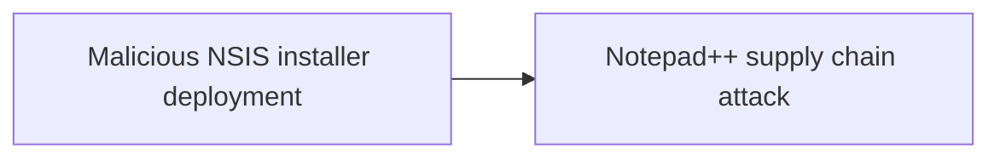
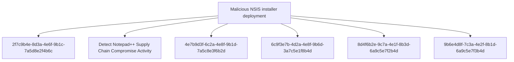

# Malicious NSIS installer deployment

## Metadata

- **UUID**: `52462685-bebb-4e86-94b0-fd46aeacb085`
- **Schema**: `threat::1.0`
- **TLP**: clear

## Description
## Overview

Malicious NSIS (Nullsoft Scriptable Install System) installers are being weaponized 
in supply chain attacks to deploy various payloads on victim systems. This technique 
was observed in the Notepad++ supply chain attack where three distinct infection 
chains leveraged NSIS installers with different payloads and behaviors.

## Technical Details

### NSIS Runtime Behavior

When executed, NSIS installers create a temporary directory at runtime:

```
%localappdata%\Temp\ns<random>.tmp
```

This directory creation is a key detection indicator for NSIS installer execution, 
both legitimate and malicious.

### Infection Chain #1 - ProShow Exploit (1MB Size)

**Behavior:**
- Sends heartbeat with system information to command and control
- Drops ProShow exploit payload
- Collects victim telemetry

**Indicators:**
- SHA1: 8e6e505438c21f3d281e1cc257abdbf7223b7f5a
- SHA1: 90e677d7ff5844407b9c073e3b7e896e078e11cd

### Infection Chain #2 - Lua Interpreter (140KB Size)

**Behavior:**
- Collects detailed system information
- Drops Lua interpreter with malicious script
- Establishes persistence mechanism

**Indicators:**
- SHA1: 573549869e84544e3ef253bdba79851dcde4963a
- SHA1: 13179c8f19fbf3d8473c49983a199e6cb4f318f0

### Infection Chain #3 - DLL Sideloading

**Behavior:**
- Drops BluetoothService DLL sideloading components
- Establishes stealth execution capability
- Maintains persistence via legitimate-looking service

**Indicators:**
- SHA1: 4c9aac447bf732acc97992290aa7a187b967ee2c
- SHA1: 821c0cafb2aab0f063ef7e313f64313fc81d46cd

## Detection Guidance

### File System Monitoring

Monitor for NSIS temporary directory creation patterns:

```
File Creation: %localappdata%\Temp\ns*.tmp\*
Parent Process: updater.exe, or unexpected processes
```

### Hash-Based Detection

Monitor for known malicious updater.exe hashes:
- 8e6e505438c21f3d281e1cc257abdbf7223b7f5a
- 90e677d7ff5844407b9c073e3b7e896e078e11cd
- 573549869e84544e3ef253bdba79851dcde4963a
- 13179c8f19fbf3d8473c49983a199e6cb4f318f0
- 4c9aac447bf732acc97992290aa7a187b967ee2c
- 821c0cafb2aab0f063ef7e313f64313fc81d46cd

### Behavioral Detection

1. **Unexpected NSIS Execution**
   - NSIS installers executing from unusual locations
   - User directories, temp folders, browser cache

2. **Network Communication**
   - Outbound connections from installer processes
   - Heartbeat traffic with system telemetry

3. **Payload Dropping**
   - Lua interpreter deployment in non-standard locations
   - DLL files dropped alongside legitimate executables
   - ProShow-related files in unexpected directories

### Process Monitoring

```
Process: *.exe
CommandLine Contains: "updater.exe"
File Size: 140KB or 1MB (typical malicious sizes)
Parent Process: explorer.exe, browser processes
Child Processes: lua.exe, rundll32.exe, regsvr32.exe
```

## Mitigation Recommendations

1. **Software Update Controls**
   - Verify digital signatures on all installers
   - Implement application control policies
   - Whitelist legitimate update mechanisms

2. **Network Segmentation**
   - Restrict outbound connections from installer processes
   - Monitor C2 communication patterns

3. **Endpoint Detection**
   - Deploy EDR solutions with NSIS installer monitoring
   - Alert on ns*.tmp directory creation from suspicious processes

4. **User Awareness**
   - Train users to verify software sources
   - Warn against running installers from unexpected locations
   - Implement prompt for administrator approval on installations

## Techniques
- T1204.002
- T1059

## Chaining


## Relations

