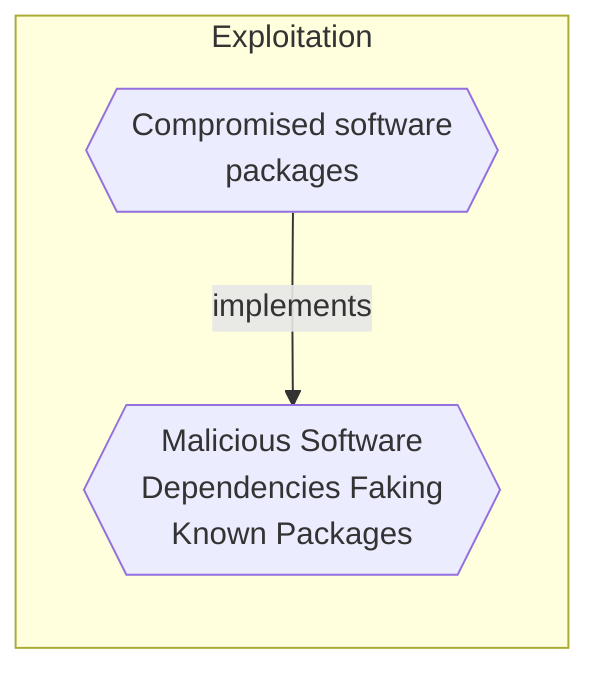

# Malicious Software Dependencies Faking Known Packages

## Metadata
| Field | Value |
| --- | --- |
| UUID | `78683822-44dc-41ac-8fef-b5f0968743c9` |
| Schema | `threat::1.0` |
| Version | `3` |
| Created | `2022-04-05` |
| Modified | `2025-10-01` |
| TLP | clear (`TLP:CLEAR`) |
| Organisation | EC DIGIT CSOC (`56b0a0f0-b0bc-47d9-bb46-02f80ae2065a`) |

## References
### Public
- **1**: [https://jfrog.com/blog/large-scale-npm-attack-targets-azure-developers-with-malicious-packages/](https://jfrog.com/blog/large-scale-npm-attack-targets-azure-developers-with-malicious-packages/)

## Description
Adversaries maymimick known and trusted software packages and
distributors, with the intent to be mistaken for the original developer,
and thus deliver malicious code that will be embedded in the
victim's applications. They may use sophisticated automation
to appear convincing and fool the target. Once delivered, the package may
contain any payload, from crypto mining, to credential theft, command and control etc.

## Criticality
**Medium** - A Medium priority incident may affect public health or safety, national security, economic security, foreign relations, civil liberties, or public confidence.

## Terrain
Software development performed internally need to rely on
external dependencies, and sources are not rigorously checked.

## Surface
> **Azure**
> Microsoft Azure cloud platform

> **AWS**
> Amazon Web Services cloud platform

> **Container Runtime::Docker**
> Docker Engine container runtime

> **Microsoft**
> Microsoft application ecosystem

> **Development::CI/CD**
> Continuous integration and continuous delivery platforms

> **Code Repositories**
> Source code hosting and version control platforms

> **Development**
> Software development tools and platforms

## Threat Assessment
| Dimension | Assessment | Description |
| --- | --- | --- |
| Severity | Substantial incident | A cyber attack which has a serious impact on a medium-sized organisation, or which poses a considerable risk to a large organisation or wider / local government. |
| Impact | Data Breach Impairement | Non-public information has been accessed from the outside, and successfully extracted. Incapacitation of a particular key system that will cause disruptions in day-to-day operations, and eventually service delivery. |
| Leverage | Elevation of privilege Infrastructure Compromise Information Disclosure | Capacity to augment leverage over the target system by upgrading the compromised access rights The compromised target is likely to be used to further expand the sphere of influence of the attacker and allow more potent vectors to be executed. Threat action intending to read a file that one was not granted access to, or to read data in transit. |
| Viability | Likely | Probable (probably) - 55-80% |
| Kill Chain | Exploitation | Techniques to exploit vulnerabilities in systems that may, amongst others, result in code execution. |

## ATT&CK Techniques
| Technique | Name | Description |
| --- | --- | --- |
| `T1195` | [Supply Chain Compromise](https://attack.mitre.org/techniques/T1195) | Adversaries may manipulate products or product delivery mechanisms prior to receipt by a final consumer for the purpose of data or system compromise.  Supply chain compromise can take place at any stage of the supply chain including:  * Manipulation of development tools * Manipulation of a development environment * Manipulation of source code repositories (public or private) * Manipulation of source code in open-source dependencies * Manipulation of software update/distribution mechanisms * Compromised/infected system images (multiple cases of removable media infected at the factory)(Citation: IBM Storwize)(Citation: Schneider Electric USB Malware)  * Replacement of legitimate software with modified versions * Sales of modified/counterfeit products to legitimate distributors * Shipment interdiction  While supply chain compromise can impact any component of hardware or software, adversaries looking to gain execution have often focused on malicious additions to legitimate software in software distribution or update channels.(Citation: Avast CCleaner3 2018)(Citation: Microsoft Dofoil 2018)(Citation: Command Five SK 2011) Targeting may be specific to a desired victim set or malicious software may be distributed to a broad set of consumers but only move on to additional tactics on specific victims.(Citation: Symantec Elderwood Sept 2012)(Citation: Avast CCleaner3 2018)(Citation: Command Five SK 2011) Popular open source projects that are used as dependencies in many applications may also be targeted as a means to add malicious code to users of the dependency.(Citation: Trendmicro NPM Compromise) |

## Chaining

