# MFA fatigue

## Metadata

- **UUID**: `56500aed-5dec-42a8-a275-f1392abac979`
- **Schema**: `threat::1.0`
- **Version**: `1`
- **Created**: `2024-10-21`
- **Modified**: `2024-11-11`
- **TLP**: clear (`TLP:CLEAR`)
- **Organisation**: EC DIGIT CSOC (`56b0a0f0-b0bc-47d9-bb46-02f80ae2065a`)

## References
### Public
- **1**: [https://www.bleepingcomputer.com/news/microsoft/microsoft-confirms-they-were-hacked-by-lapsus-extortion-group/](https://www.bleepingcomputer.com/news/microsoft/microsoft-confirms-they-were-hacked-by-lapsus-extortion-group/)
- **2**: [https://www.bleepingcomputer.com/news/security/uber-hacked-internal-systems-breached-and-vulnerability-reports-stolen/](https://www.bleepingcomputer.com/news/security/uber-hacked-internal-systems-breached-and-vulnerability-reports-stolen/)
- **3**: [https://www.beyondtrust.com/blog/entry/midnight-blizzard-and-modern-identity-based-attacks](https://www.beyondtrust.com/blog/entry/midnight-blizzard-and-modern-identity-based-attacks)

## Description
MFA fatigue (aka MFA abuse, MFA bombing or MFA spamming) is a popular technique
due to its low complexity and high success rate.

It is a social engineering attack strategy where attackers repeatedly push
second-factor authentication requests to the target user email, phone, or registered
devices. The goal is to spam users to the point where they are annoyed by the constant 
notifications and approve one so it will stop. By doing so, the attacker has effectively 
bypassed MFA by tricking the user into approving the login attempt.

The fact that the attacker can trigger MFA push notifications means they obtained
the credentials of the user. This attack is often preceded by other social engineering
attack vectors, such as phishing, to gain credentials. Stolen credentials may also
be acquired from the dark web or via many other attack vectors.

Attacker may trigger push notifications throughout the day with the hopes that
one of the attempts will coincide with the user login activity, so the user will
approve it without suspicion.

MFA fatigue attack chain unfolds as follows:

1. User credentials and information are collected.
The attack begins with user information already available. The attacker will typically
have access to a victim username, password, or recovery credentials. This might be
sourced from preliminary attacks (such as phishing or social engineering) or may have
been exposed credentials from a larger breach.

2. Stolen credentials are used to send MFA push notifications.
The attackers then use the gained credentials to sign-in to a target account or device
secured by push multi-factor authentication. Typically, the attacker will attempt
to activate the authenticating application push notifications in quick succession.
These push notifications can happen over email, text message, or desktop notification,
but are generally pushed to the user authenticated mobile device.

3. User gets push notifications and becomes fatigued.
The user will now rapidly receive push notifications as the attacker attempts to
overwhelm them. The attacker goal is for the victim to push “yes” and confirm their
identity, allowing the attacker to go further into their account or device.
Often, the user may think it is a simple application malfunction or a test,
or just want the notifications to end out of annoyance.

## Criticality
**Medium** - A Medium priority incident may affect public health or safety, national security, economic security, foreign relations, civil liberties, or public confidence.

## Terrain
> **Adversaries must be in possession of the credentials of a valid account.

Domains: Enterprise, Public Cloud
Targets: Auth token, Cloud Portal, End-user, Helpdesk, Identity Services, Mobile phone**

## Threat Assessment
| Dimension | Assessment | Description |
| --- | --- | --- |
| Severity | Significant incident | A cyber attack which has a serious impact on a large organisation or on wider / local government, or which poses a considerable risk to central government or (inter)national essential services. |
| Impact | Identity Theft | Acquisition of sufficient information and privileges to profess as a given individual, for the purpose of abusing and deceiving human trust relationships. |
| Leverage | Elevation of privilege; Spoofing | - |
| Viability | Likely | Probable (probably) - 55-80% |
| Kill Chain | Credential Access | Techniques resulting in the access of, or control over, system, service or domain credentials. |

## Actors
| Actor | ID | Source | Description |
| --- | --- | --- | --- |
| [[Enterprise] Chimera](https://attack.mitre.org/groups/G0114) | `att&ck::G0114` | ('att&ck',) | [Chimera](https://attack.mitre.org/groups/G0114) is a suspected China-based threat group that has been active since at least 2018 targeting the semiconductor industry in Taiwan as well as data from the airline industry.(Citation: Cycraft Chimera April 2020)(Citation: NCC Group Chimera January 2021) |
| [[Enterprise] Kimsuky](https://attack.mitre.org/groups/G0094) | `att&ck::G0094` | ('att&ck',) | [Kimsuky](https://attack.mitre.org/groups/G0094) is a North Korea-based cyber espionage group that has been active since at least 2012. The group initially focused on targeting South Korean government entities, think tanks, and individuals identified as experts in various fields, and expanded its operations to include the UN and the government, education, business services, and manufacturing sectors in the United States, Japan, Russia, and Europe. [Kimsuky](https://attack.mitre.org/groups/G0094) has focused its intelligence collection activities on foreign policy and national security issues related to the Korean peninsula, nuclear policy, and sanctions. [Kimsuky](https://attack.mitre.org/groups/G0094) operations have overlapped with those of other North Korean cyber espionage actors likely as a result of ad hoc collaborations or other limited resource sharing.(Citation: EST Kimsuky April 2019)(Citation: Cybereason Kimsuky November 2020)(Citation: Malwarebytes Kimsuky June 2021)(Citation: CISA AA20-301A Kimsuky)(Citation: Mandiant APT43 March 2024)(Citation: Proofpoint TA427 April 2024)  [Kimsuky](https://attack.mitre.org/groups/G0094) was assessed to be responsible for the 2014 Korea Hydro & Nuclear Power Co. compromise; other notable campaigns include Operation STOLEN PENCIL (2018), Operation Kabar Cobra (2019), and Operation Smoke Screen (2019).(Citation: Netscout Stolen Pencil Dec 2018)(Citation: EST Kimsuky SmokeScreen April 2019)(Citation: AhnLab Kimsuky Kabar Cobra Feb 2019)  North Korean group definitions are known to have significant overlap, and some security researchers report all North Korean state-sponsored cyber activity under the name [Lazarus Group](https://attack.mitre.org/groups/G0032) instead of tracking clusters or subgroups.  In 2023, [Kimsuky](https://attack.mitre.org/groups/G0094) has used commercial large language models to assist with vulnerability research, scripting, social engineering and reconnaissance.(Citation: MSFT-AI) |
| TA406 | `misp::89f005f9-22e9-4c50-9b48-e94c521266e5` | ('misp',) | TA406 is engaging in malware distribution, phishing, intelligence collection, and cryptocurrency theft, resulting in a wide range of criminal activities. |
| [[Enterprise] LAPSUS$](https://attack.mitre.org/groups/G1004) | `att&ck::G1004` | ('att&ck',) | [LAPSUS$](https://attack.mitre.org/groups/G1004) is cyber criminal threat group that has been active since at least mid-2021. [LAPSUS$](https://attack.mitre.org/groups/G1004) specializes in large-scale social engineering and extortion operations, including destructive attacks without the use of ransomware. The group has targeted organizations globally, including in the government, manufacturing, higher education, energy, healthcare, technology, telecommunications, and media sectors.(Citation: BBC LAPSUS Apr 2022)(Citation: MSTIC DEV-0537 Mar 2022)(Citation: UNIT 42 LAPSUS Mar 2022) |
| LAPSUS | `misp::d9e5be22-1a04-4956-af6c-37af02330980` | ('misp',) | An actor group conducting large-scale social engineering and extortion campaign against multiple organizations with some seeing evidence of destructive elements. |
| [[Enterprise] APT29](https://attack.mitre.org/groups/G0016) | `att&ck::G0016` | ('att&ck',) | [APT29](https://attack.mitre.org/groups/G0016) is threat group that has been attributed to Russia's Foreign Intelligence Service (SVR).(Citation: White House Imposing Costs RU Gov April 2021)(Citation: UK Gov Malign RIS Activity April 2021) They have operated since at least 2008, often targeting government networks in Europe and NATO member countries, research institutes, and think tanks. [APT29](https://attack.mitre.org/groups/G0016) reportedly compromised the Democratic National Committee starting in the summer of 2015.(Citation: F-Secure The Dukes)(Citation: GRIZZLY STEPPE JAR)(Citation: Crowdstrike DNC June 2016)(Citation: UK Gov UK Exposes Russia SolarWinds April 2021)  In April 2021, the US and UK governments attributed the [SolarWinds Compromise](https://attack.mitre.org/campaigns/C0024) to the SVR; public statements included citations to [APT29](https://attack.mitre.org/groups/G0016), Cozy Bear, and The Dukes.(Citation: NSA Joint Advisory SVR SolarWinds April 2021)(Citation: UK NSCS Russia SolarWinds April 2021) Industry reporting also referred to the actors involved in this campaign as UNC2452, NOBELIUM, StellarParticle, Dark Halo, and SolarStorm.(Citation: FireEye SUNBURST Backdoor December 2020)(Citation: MSTIC NOBELIUM Mar 2021)(Citation: CrowdStrike SUNSPOT Implant January 2021)(Citation: Volexity SolarWinds)(Citation: Cybersecurity Advisory SVR TTP May 2021)(Citation: Unit 42 SolarStorm December 2020) |
| UNC2452 | `misp::2ee5ed7a-c4d0-40be-a837-20817474a15b` | ('misp',) | Reporting regarding activity related to the SolarWinds supply chain injection has grown quickly since initial disclosure on 13 December 2020. A significant amount of press reporting has focused on the identification of the actor(s) involved, victim organizations, possible campaign timeline, and potential impact. The US Government and cyber community have also provided detailed information on how the campaign was likely conducted and some of the malware used.  MITRE’s ATT&CK team — with the assistance of contributors — has been mapping techniques used by the actor group, referred to as UNC2452/Dark Halo by FireEye and Volexity respectively, as well as SUNBURST and TEARDROP malware. |

## ATT&CK Techniques
| Technique | Name | Description |
| --- | --- | --- |
| `T1111` | [Multi-Factor Authentication Interception](https://attack.mitre.org/techniques/T1111) | Adversaries may target multi-factor authentication (MFA) mechanisms, (i.e., smart cards, token generators, etc.) to gain access to credentials that can be used to access systems, services, and network resources. Use of MFA is recommended and provides a higher level of security than usernames and passwords alone, but organizations should be aware of techniques that could be used to intercept and bypass these security mechanisms.   If a smart card is used for multi-factor authentication, then a keylogger will need to be used to obtain the password associated with a smart card during normal use. With both an inserted card and access to the smart card password, an adversary can connect to a network resource using the infected system to proxy the authentication with the inserted hardware token. (Citation: Mandiant M Trends 2011)  Adversaries may also employ a keylogger to similarly target other hardware tokens, such as RSA SecurID. Capturing token input (including a user's personal identification code) may provide temporary access (i.e. replay the one-time passcode until the next value rollover) as well as possibly enabling adversaries to reliably predict future authentication values (given access to both the algorithm and any seed values used to generate appended temporary codes). (Citation: GCN RSA June 2011)  Other methods of MFA may be intercepted and used by an adversary to authenticate. It is common for one-time codes to be sent via out-of-band communications (email, SMS). If the device and/or service is not secured, then it may be vulnerable to interception. Service providers can also be targeted: for example, an adversary may compromise an SMS messaging service in order to steal MFA codes sent to users’ phones.(Citation: Okta Scatter Swine 2022) |
| `T1621` | [Multi-Factor Authentication Request Generation](https://attack.mitre.org/techniques/T1621) | Adversaries may attempt to bypass multi-factor authentication (MFA) mechanisms and gain access to accounts by generating MFA requests sent to users.  Adversaries in possession of credentials to [Valid Accounts](https://attack.mitre.org/techniques/T1078) may be unable to complete the login process if they lack access to the 2FA or MFA mechanisms required as an additional credential and security control. To circumvent this, adversaries may abuse the automatic generation of push notifications to MFA services such as Duo Push, Microsoft Authenticator, Okta, or similar services to have the user grant access to their account. If adversaries lack credentials to victim accounts, they may also abuse automatic push notification generation when this option is configured for self-service password reset (SSPR).(Citation: Obsidian SSPR Abuse 2023)  In some cases, adversaries may continuously repeat login attempts in order to bombard users with MFA push notifications, SMS messages, and phone calls, potentially resulting in the user finally accepting the authentication request in response to “MFA fatigue.”(Citation: Russian 2FA Push Annoyance - Cimpanu)(Citation: MFA Fatigue Attacks - PortSwigger)(Citation: Suspected Russian Activity Targeting Government and Business Entities Around the Globe) |

## Chaining

```mermaid
flowchart LR
56500aed_5dec_42a8_a275_f1392abac979["MFA fatigue"]
1a68b5eb_0112_424d_a21f_88dda0b6b8df["Spearphishing Link"]
dd5d942c_bac4_4000_b9a6_ca4fef6cfb84["Spearphishing Attachment"]
4a807ac4_f764_41b1_ae6f_94239041d349["MFA Bypass Techniques"]
56500aed_5dec_42a8_a275_f1392abac979 -->|sequence::succeeds| 1a68b5eb_0112_424d_a21f_88dda0b6b8df
1a68b5eb_0112_424d_a21f_88dda0b6b8df -->|sequence::succeeds| dd5d942c_bac4_4000_b9a6_ca4fef6cfb84
dd5d942c_bac4_4000_b9a6_ca4fef6cfb84 -->|atomicity::implements| 4a807ac4_f764_41b1_ae6f_94239041d349
```

### Chaining details
#### succeeds -> Spearphishing Link (`sequence::succeeds`)
Attacker must be able to compromise the username and password of a valid account.

- **Target UUID**: `1a68b5eb-0112-424d-a21f-88dda0b6b8df`
#### succeeds -> Spearphishing Attachment (`sequence::succeeds`)
Attacker must be able to compromise the username and password of a valid account.

- **Target UUID**: `dd5d942c-bac4-4000-b9a6-ca4fef6cfb84`
#### implements -> MFA Bypass Techniques (`atomicity::implements`)
MFA bypass technique

- **Target UUID**: `4a807ac4-f764-41b1-ae6f-94239041d349`
