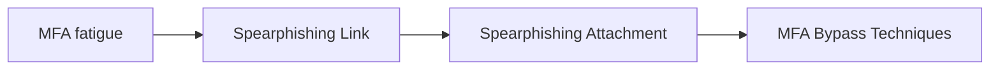

# MFA fatigue

## Metadata

- **UUID**: `56500aed-5dec-42a8-a275-f1392abac979`
- **Schema**: `threat::1.0`
- **TLP**: clear

## Description
MFA fatigue (aka MFA abuse, MFA bombing or MFA spamming) is a popular technique
due to its low complexity and high success rate.

It is a social engineering attack strategy where attackers repeatedly push
second-factor authentication requests to the target user email, phone, or registered
devices. The goal is to spam users to the point where they are annoyed by the constant 
notifications and approve one so it will stop. By doing so, the attacker has effectively 
bypassed MFA by tricking the user into approving the login attempt.

The fact that the attacker can trigger MFA push notifications means they obtained
the credentials of the user. This attack is often preceded by other social engineering
attack vectors, such as phishing, to gain credentials. Stolen credentials may also
be acquired from the dark web or via many other attack vectors.

Attacker may trigger push notifications throughout the day with the hopes that
one of the attempts will coincide with the user login activity, so the user will
approve it without suspicion.

MFA fatigue attack chain unfolds as follows:

1. User credentials and information are collected.
The attack begins with user information already available. The attacker will typically
have access to a victim username, password, or recovery credentials. This might be
sourced from preliminary attacks (such as phishing or social engineering) or may have
been exposed credentials from a larger breach.

2. Stolen credentials are used to send MFA push notifications.
The attackers then use the gained credentials to sign-in to a target account or device
secured by push multi-factor authentication. Typically, the attacker will attempt
to activate the authenticating application push notifications in quick succession.
These push notifications can happen over email, text message, or desktop notification,
but are generally pushed to the user authenticated mobile device.

3. User gets push notifications and becomes fatigued.
The user will now rapidly receive push notifications as the attacker attempts to
overwhelm them. The attacker goal is for the victim to push “yes” and confirm their
identity, allowing the attacker to go further into their account or device.
Often, the user may think it is a simple application malfunction or a test,
or just want the notifications to end out of annoyance.

## Techniques
- T1111
- T1621

## Chaining

