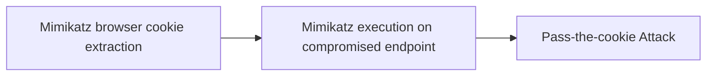

# Mimikatz browser cookie extraction

## Metadata

- **UUID**: `630f420b-b844-42f1-8be1-d367b3734024`
- **Schema**: `threat::1.0`
- **TLP**: clear

## Description
We describe how an attacker could extract cookies using the example of the Chrome browser.

Chrome stores cookies in the following location in a SQLite database:
%localappdata%GoogleChromeUser DataDefaultCookies

The cookies for a given user are encrypted using keys tied to that user via the
Microsoft Data Protection API (DPAPI). To access the cookie database and decrypt 
the cookies, an adversary can use the following mimikatz command:

dpapi::chrome /in:"%localappdata%GoogleChromeUser DataDefaultCookies" /unprotect

Alternatively, adversaries could execute the following from the command line:
mimikatz.exe privilege::debug log "dpapi::chrome /in:%localappdata%googlechromeUSERDA~1defaultcookies /unprotect" exit

Using either of these options will provide the browser cookies.

## PtC attack scenario

1. A sysadmin uses regularly the Azure management portal, MFA is enabled with the authenticator
   app on his mobile device.
    
   He has clicked on a phishing email or his system has been compromised by some other means,
   and now an attacker is able to execute code within the user context.

2. Execute Mimikatz when running as the user
   mimikatz.exe privilege::debug log "dpapi::chrome /in:%localappdata%googlechromeUSERDA~1defaultcookies /unprotect" exit
    
   Attackers look for the Azure authentication cookies, including ESTSAUTH, ESTSAUTHPERSISTENT and ESTSAUTHLIGHT.
    
3. To pass the cookies into another session to take over the user account, opening Chrome on another server
   and use the “Inspect” interface to insert a cookie.
    
    Add the ESTSAUTH or If ESTSAUTHPERSISTENT cookie. If ESTSAUTHPERSISTENT is available, it is preferred because
    it is generated by the “Stay Signed In” option.     

4. Refresh the page and now attackers are logged into Azure as the user — no MFA required.

## Techniques
- T1111

## Chaining

