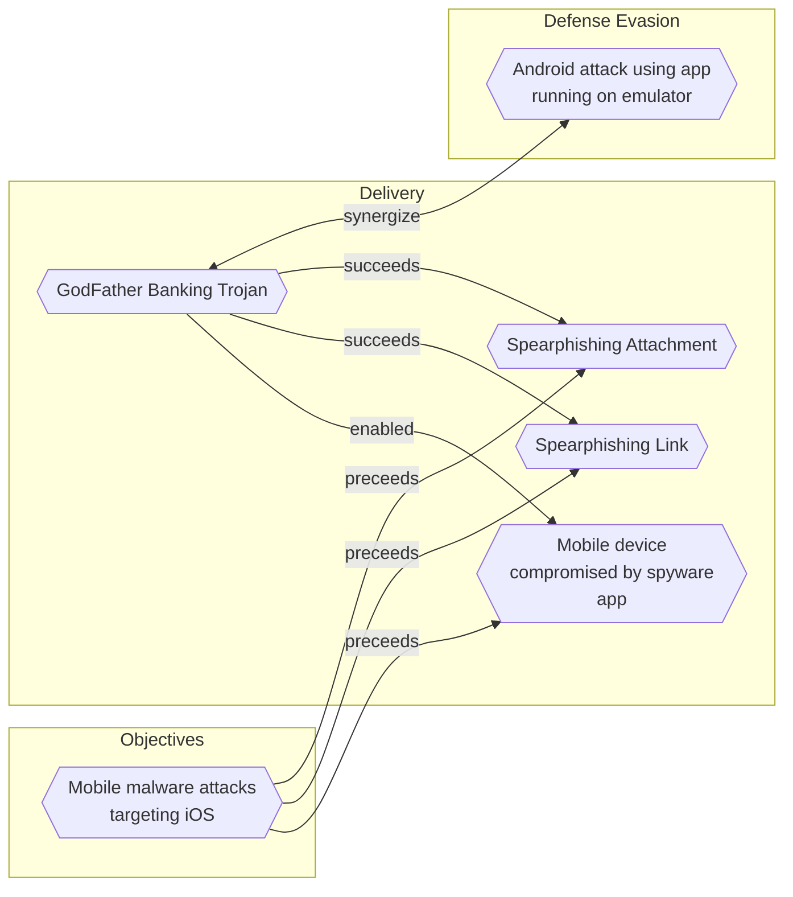

# Mobile device compromised by spyware app

## Metadata
| Field | Value |
| --- | --- |
| UUID | `99c78650-8e19-4756-90fb-2573242577ca` |
| Schema | `threat::1.0` |
| Version | `2` |
| Created | `2022-09-12` |
| Modified | `2025-10-01` |
| TLP | clear (`TLP:CLEAR`) |
| Organisation | EC DIGIT CSOC (`56b0a0f0-b0bc-47d9-bb46-02f80ae2065a`) |

## References
### Public
- **1**: [https://googleprojectzero.blogspot.com/2023/03/multiple-internet-to-baseband-ote-rce.html](https://googleprojectzero.blogspot.com/2023/03/multiple-internet-to-baseband-ote-rce.html)
- **2**: [https://www.kaspersky.com/resource-center/definitions/what-is-zero-click-malware](https://www.kaspersky.com/resource-center/definitions/what-is-zero-click-malware)
- **3**: [https://www.techrepublic.com/article/packaged-zero-day-vulnerabilities-android-attacks/](https://www.techrepublic.com/article/packaged-zero-day-vulnerabilities-android-attacks/)
- **4**: [https://citizenlab.ca/2023/09/blastpass-nso-group-iphone-zero-click-zero-day-exploit-captured-in-the-wild/](https://citizenlab.ca/2023/09/blastpass-nso-group-iphone-zero-click-zero-day-exploit-captured-in-the-wild/)

## Description
Earlier versions of spyware apps were installed on smartphones through vulnerabilities
in commonly used apps, or involving an SMS or iMessage that provides a link to a website. 
If clicked, this link delivers malicious software that compromises the device.
It can also be installed over a wireless transceiver located near a target,
or manually if attacker can steal the phone that has been targeted.  

Since 2019, attackers have been able to install spyware on smartphones with a missed call on WhatsApp,
including delete the record of the missed call, making it impossible for the owner to know anything is amiss.
Another way is by simply sending a message to a phone that produces no notification.  

In the latest versions of spyware does not require the user to do anything. All that is required for a
successful spyware attack and installation is having a particular vulnerable app or OS installed on the device,
such as vulnerabilities in the iMessage service in iPhones which allows for infection by simply receiving a message.
This is known as a zero-click exploit.     

Once installed, spyware malware can theoretically harvest any data from the device and transmit
it back to the attacker. It can steal photos and videos, recordings, location records, communications,
web searches, passwords, call logs and social media posts.
It also has the capability to activate cameras and microphones for real-time surveillance
without the permission or knowledge of the user.

## Criticality
**High** - A High priority incident is likely to result in a demonstrable impact to public health or safety, national security, economic security, foreign relations, civil liberties, or public confidence.

## Terrain
Adversaries can abuse iOS or Android devices which are vulnerable
to a zero-click or zero-day exploitation, without user intervention.

## Surface
> **Mobile**
> Mobile operating systems (Android, iOS)

> **Mobile::Android**
> Google Android mobile operating system (all versions)

> **Mobile::iOS**
> Apple iOS mobile operating system (all versions)

> **Windows::Desktop**
> Microsoft Windows desktop editions

> **Mobile::iPadOS**
> Apple iPadOS (distinct from iOS for tablet devices)

## Threat Assessment
| Dimension | Assessment | Description |
| --- | --- | --- |
| Severity | Significant incident | A cyber attack which has a serious impact on a large organisation or on wider / local government, or which poses a considerable risk to central government or (inter)national essential services. |
| Impact | Data Breach Identity Theft Reputational Damages | Non-public information has been accessed from the outside, and successfully extracted. Acquisition of sufficient information and privileges to profess as a given individual, for the purpose of abusing and deceiving human trust relationships. Damages to the organization public view may be achieved by using directly the access gained, or indirectly with data gathered. |
| Leverage | Alter behavior Information Disclosure Modify configuration Modify data Software installation Tampering | Influence or alter human behavior Threat action intending to read a file that one was not granted access to, or to read data in transit. Modify configuration or services Modify stored data or content Software installation or code modification Threat action intending to maliciously change or modify persistent data, such as records in a database, and the alteration of data in transit between two computers over an open network, such as the Internet. |
| Viability | Likely | Probable (probably) - 55-80% |
| Kill Chain | Delivery | Techniques resulting in the transmission of a weaponized object to the targeted environment. |

## Actors
| Actor | ID | Source | Description |
| --- | --- | --- | --- |
| [[Enterprise] MuddyWater](https://attack.mitre.org/groups/G0069) | `att&ck::G0069` | ('att&ck',) | [MuddyWater](https://attack.mitre.org/groups/G0069) is a cyber espionage group assessed to be a subordinate element within Iran's Ministry of Intelligence and Security (MOIS).(Citation: CYBERCOM Iranian Intel Cyber January 2022) Since at least 2017, [MuddyWater](https://attack.mitre.org/groups/G0069) has targeted a range of government and private organizations across sectors, including telecommunications, local government, defense, and oil and natural gas organizations, in the Middle East, Asia, Africa, Europe, and North America.(Citation: Unit 42 MuddyWater Nov 2017)(Citation: Symantec MuddyWater Dec 2018)(Citation: ClearSky MuddyWater Nov 2018)(Citation: ClearSky MuddyWater June 2019)(Citation: Reaqta MuddyWater November 2017)(Citation: DHS CISA AA22-055A MuddyWater February 2022)(Citation: Talos MuddyWater Jan 2022) |
| MuddyWater | `misp::a29af069-03c3-4534-b78b-7d1a77ea085b` | ('misp',) | The MuddyWater attacks are primarily against Middle Eastern nations. However, we have also observed attacks against surrounding nations and beyond, including targets in India and the USA. MuddyWater attacks are characterized by the use of a slowly evolving PowerShell-based first stage backdoor we call “POWERSTATS”. Despite broad scrutiny and reports on MuddyWater attacks, the activity continues with only incremental changes to the tools and techniques. |

## ATT&CK Techniques
| Technique | Name | Description |
| --- | --- | --- |
| `T1512` | [Mobile : Video Capture](https://attack.mitre.org/techniques/T1512) | An adversary can leverage a device’s cameras to gather information by capturing video recordings. Images may also be captured, potentially in specified intervals, in lieu of video files.       Malware or scripts may interact with the device cameras through an available API provided by the operating system. Video or image files may be written to disk and exfiltrated later. This technique differs from [Screen Capture](https://attack.mitre.org/techniques/T1513) due to use of the device’s cameras for video recording rather than capturing the victim’s screen.      In Android, an application must hold the `android.permission.CAMERA` permission to access the cameras. In iOS, applications must include the `NSCameraUsageDescription` key in the `Info.plist` file. In both cases, the user must grant permission to the requesting application to use the camera. If the device has been rooted or jailbroken, an adversary may be able to access the camera without knowledge of the user. |
| `T1582` | [Mobile : SMS Control](https://attack.mitre.org/techniques/T1582) | Adversaries may delete, alter, or send SMS messages without user authorization. This could be used to hide C2 SMS messages, spread malware, or various external effects.  This can be accomplished by requesting the `RECEIVE_SMS` or `SEND_SMS` permissions depending on what the malware is attempting to do. If the app is set as the default SMS handler on the device, the `SMS_DELIVER` broadcast intent can be registered, which allows the app to write to the SMS content provider. The content provider directly modifies the messaging database on the device, which could allow malicious applications with this ability to insert, modify, or delete arbitrary messages on the device.(Citation: SMS KitKat)(Citation: Android SmsProvider) |
| `T1513` | [Mobile : Screen Capture](https://attack.mitre.org/techniques/T1513) | Adversaries may use screen capture to collect additional information about a target device, such as applications running in the foreground, user data, credentials, or other sensitive information. Applications running in the background can capture screenshots or videos of another application running in the foreground by using the Android `MediaProjectionManager` (generally requires the device user to grant consent).(Citation: Fortinet screencap July 2019)(Citation: Android ScreenCap1 2019) Background applications can also use Android accessibility services to capture screen contents being displayed by a foreground application.(Citation: Lookout-Monokle) An adversary with root access or Android Debug Bridge (adb) access could call the Android `screencap` or `screenrecord` commands.(Citation: Android ScreenCap2 2019)(Citation: Trend Micro ScreenCap July 2015) |
| `T1517` | [Mobile : Access Notifications](https://attack.mitre.org/techniques/T1517) | Adversaries may collect data within notifications sent by the operating system or other applications. Notifications may contain sensitive data such as one-time authentication codes sent over SMS, email, or other mediums. In the case of Credential Access, adversaries may attempt to intercept one-time code sent to the device. Adversaries can also dismiss notifications to prevent the user from noticing that the notification has arrived and can trigger action buttons contained within notifications.(Citation: ESET 2FA Bypass) |
| `T1429` | [Mobile : Audio Capture](https://attack.mitre.org/techniques/T1429) | Adversaries may capture audio to collect information by leveraging standard operating system APIs of a mobile device. Examples of audio information adversaries may target include user conversations, surroundings, phone calls, or other sensitive information.      Android and iOS, by default, require that applications request device microphone access from the user.       On Android devices, applications must hold the `RECORD_AUDIO` permission to access the microphone or the `CAPTURE_AUDIO_OUTPUT` permission to access audio output. Because Android does not allow third-party applications to hold the `CAPTURE_AUDIO_OUTPUT` permission by default, only privileged applications, such as those distributed by Google or the device vendor, can access audio output.(Citation: Android Permissions) However, adversaries may be able to gain this access after successfully elevating their privileges. With the `CAPTURE_AUDIO_OUTPUT` permission, adversaries may pass the `MediaRecorder.AudioSource.VOICE_CALL` constant to `MediaRecorder.setAudioOutput`, allowing capture of both voice call uplink and downlink.(Citation: Manifest.permission)      On iOS devices, applications must include the `NSMicrophoneUsageDescription` key in their `Info.plist` file to access the microphone.(Citation: Requesting Auth-Media Capture) |
| `T1643` | [Mobile : Generate Traffic from Victim](https://attack.mitre.org/techniques/T1643) | Adversaries may generate outbound traffic from devices. This is typically performed to manipulate external outcomes, such as to achieve carrier billing fraud or to manipulate app store rankings or ratings. Outbound traffic is typically generated as SMS messages or general web traffic, but may take other forms as well.  If done via SMS messages, Android apps must hold the `SEND_SMS` permission. Additionally, sending an SMS message requires user consent if the recipient is a premium number. Applications cannot send SMS messages on iOS |

## Chaining

