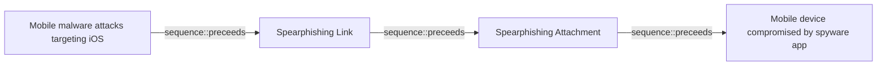

# Mobile malware attacks targeting iOS

## Metadata

- **UUID**: `ef4ba2bf-dfcb-4b70-8f45-7625baeb96d0`
- **Schema**: `threat::1.0`
- **Version**: `1`
- **Created**: `2025-04-28`
- **Modified**: `2025-05-12`
- **TLP**: clear (`TLP:CLEAR`)
- **Organisation**: EC DIGIT CSOC (`56b0a0f0-b0bc-47d9-bb46-02f80ae2065a`)

## References
### Public
- **1**: [https://mas.owasp.org/MASTG/0x06a-Platform-Overview/](https://mas.owasp.org/MASTG/0x06a-Platform-Overview/)
- **2**: [https://thesai.org/Downloads/Volume12No8/Paper_12-Mobile_Malware_Classification_for_iOS.pdf](https://thesai.org/Downloads/Volume12No8/Paper_12-Mobile_Malware_Classification_for_iOS.pdf)
- **3**: [https://digital.ai/catalyst-blog/ios-app-security/](https://digital.ai/catalyst-blog/ios-app-security/)
- **4**: [https://link.springer.com/article/10.1007/s11416-023-00477-y](https://link.springer.com/article/10.1007/s11416-023-00477-y)

## Description
iOS devices are protected by a robust, layered security architecture,
yet attackers continue to develop sophisticated malware that targets 
Apple devices. These threats exploit OS' vulnerabilities, abuse of
legitimate features, and use of social engineering to gain unauthorized 
access, steal sensitive data, or remotely control devices.

### How malware interacts with the architecture

Despite these protections, attackers exploit weaknesses at different
layers of the iOS architecture:

- **Jailbreaking:** By exploiting kernel or system vulnerabilities, attackers
can break out of the sandbox and disable code signing, allowing arbitrary code
execution and installation of malicious apps. This undermines the foundational
security of the Core OS layer.

- **Enterprise Provisioning/MDM Abuse:** Attackers use enterprise certificates
or MDM profiles to bypass App Store restrictions and install malicious apps,
circumventing code signing checks at the app distribution level.

- **App Replacement (Masque Attack):** Exploits flaws in the app installation
process, allowing a malicious app to replace a legitimate one if it shares the
same bundle identifier, gaining access to sensitive app data.

- **Vulnerability Exploitation:** Attackers target flaws in system frameworks or 
the kernel to escalate privileges, bypass sandboxing, or execute unauthorized code.

- **Reverse Engineering and Code Injection:** Attackers decompile apps to discover 
sensitive logic or keys, inject malicious code, or bypass security controls. Lack 
of obfuscation and anti-tamper mechanisms make these attacks easier.

- **Dynamic Instrumentation:** Tools like Frida or Ghidra allow real-time
manipulation of app processes, bypassing authentication or extracting sensitive data.

- **Man-in-the-Middle (MitM) Attacks:** Target insecure network communications, 
intercepting data between the app and backend servers.

### Abuse of iOS architecture

The basic architecture for iOS is divided into four **layers**:
 - Core services, Core OS: manage basic services in iOS  
 - Cocoa Touch, Media: handle the user interface and advanced graphics.

Below the layers there are the iOS **frameworks**, which are similar to static and
dynamic shared libraries, they provide a library of routines that an application can
access to do a specific task:
 - Security  
 - UIKit  
 - Foundation  
 - AVFoundation  
 - System Configuration  
 - MessageUI

After the frameworks there are the functions, which are being abused by different malware.

### Attack Vectors

- **Exploitation of Vulnerabilities:** Attackers leverage flaws in iOS, such as 
remote code execution or privilege escalation, to run malicious code on devices 
without user interaction.

- **Malicious Messaging:** Some attacks use iMessage or other messaging platforms 
to deliver exploit-laden attachments, triggering vulnerabilities and enabling further 
compromise.

- **Abuse of Enterprise Provisioning:** Attackers misuse Apple’s Developer Enterprise 
Program to distribute malicious apps outside the App Store, bypassing Apple’s app 
review process.

- **Masque Attack:** Replaces a legitimate app with a malicious one sharing the 
same bundle identifier, allowing credential theft or background surveillance.

- **Social Engineering and Phishing:** Users are lured into installing malicious 
profiles or apps via deceptive messages, websites, or emails.

### Types of iOS Malware (excluding Spyware) and Functions

| Malware Type                  | Functionality                                                                                 | Example(s)                        |
|-------------------------------|---------------------------------------------------------------------------------------------|------------------------------------|
| **Remote Access Trojan (RAT)**| Grants attackers remote control over the device, can install apps, manipulate settings, etc. | GoldPickaxe                        |
| **Adware**                    | Displays intrusive ads, redirects traffic, generates ad revenue for attackers                | Lock Saver Free, Muda (AdLord), YiSpecter |
| **Ransomware/Scareware**      | Locks device/browser or displays fake warnings, demands payment to restore access            | Safari JavaScript Pop-up Scareware |
| **Credential Stealers**       | Steals Apple ID, passwords, or banking credentials                                          | KeyRaider, XcodeGhost              |
| **App Replacement/Impersonation** | Replaces legitimate apps with malicious ones to steal data or perform fraudulent actions    | Masque Attack, YiSpecter           |

### Impact and Risks

- **Data Theft:** Attackers can steal personal information, financial data, and 
sensitive communications.

- **Device Takeover:** Some malware enables full remote control of the device, allowing 
attackers to impersonate the user or perform fraudulent transactions.

- **Corporate Espionage:** In enterprise environments, a compromised iOS device 
can serve as an entry point into corporate networks, leading to broader breaches 
and operational disruptions.

- **Extortion:** Attackers may use scareware or ransomware to extort victims for 
payment in exchange for restoring access or not disclosing stolen data.

- **Disruption:** Adware and scareware can degrade device performance, flood users 
with ads, or lock browsers, impacting usability.

## Criticality
**High** - A High priority incident is likely to result in a demonstrable impact to public health or safety, national security, economic security, foreign relations, civil liberties, or public confidence.

## Terrain
> **Adversaries need access to methods for distributing malware,
such as phishing campaigns, malicious websites, social engineering 
to install MDM profiles, enterprise provisioning certificates, or
even slipping malicious apps through the App Store review process.

Domains: Mobile
Targets: Mobile phone, Tablet, Critical Documents, Personal Information
Platforms: iOS**

## Threat Assessment
| Dimension | Assessment | Description |
| --- | --- | --- |
| Severity | Significant incident | A cyber attack which has a serious impact on a large organisation or on wider / local government, or which poses a considerable risk to central government or (inter)national essential services. |
| Impact | Competitive disadvantage; Data Breach; Identity Theft; IP Loss | - |
| Leverage | Dwelling; Information Disclosure; Spoofing; Tampering | - |
| Viability | Likely | Probable (probably) - 55-80% |
| Kill Chain | Objectives | Socio-technical objectives of an attack that are intended to achieve a strategic goal. |

## ATT&CK Techniques
| Technique | Name | Description |
| --- | --- | --- |
| `T1404` | [Mobile : Exploitation for Privilege Escalation](https://attack.mitre.org/techniques/T1404) | Adversaries may exploit software vulnerabilities in order to elevate privileges. Exploitation of a software vulnerability occurs when an adversary takes advantage of a programming error in an application, service, within the operating system software, or kernel itself to execute adversary-controlled code. Security constructions, such as permission levels, will often hinder access to information and use of certain techniques. Adversaries will likely need to perform privilege escalation to include use of software exploitation to circumvent those restrictions.   When initially gaining access to a device, an adversary may be operating within a lower privileged process which will prevent them from accessing certain resources on the system. Vulnerabilities may exist, usually in operating system components and applications running at higher permissions, that can be exploited to gain higher levels of access on the system. This could enable someone to move from unprivileged or user- level permission to root permissions depending on the component that is vulnerable. |
| `T1638` | [Mobile : Adversary-in-the-Middle](https://attack.mitre.org/techniques/T1638) | Adversaries may attempt to position themselves between two or more networked devices to support follow-on behaviors such as [Transmitted Data Manipulation](https://attack.mitre.org/techniques/T1565/002) or [Endpoint Denial of Service](https://attack.mitre.org/techniques/T1642).       [Adversary-in-the-Middle](https://attack.mitre.org/techniques/T1638) can be achieved through several mechanisms. For example, a malicious application may register itself as a VPN client, effectively redirecting device traffic to adversary-owned resources. Registering as a VPN client requires user consent on both Android and iOS; additionally, a special entitlement granted by Apple is needed for iOS devices. Alternatively, a malicious application with escalation privileges may utilize those privileges to gain access to network traffic.       Specific to Android devices, adversary-in-the-disk is a type of AiTM attack where adversaries monitor and manipulate data that is exchanged between applications and external storage.(Citation: mitd_kaspersky)(Citation: mitd_checkpoint)(Citation: mitd_checkpoint_research) To accomplish this, a malicious application firsts requests for access to multimedia files on the device (`READ_EXTERNAL STORAGE` and `WRITE_EXTERNAL_STORAGE`), then the application reads data on the device and/or writes malware to the device. Though the request for access is common, when used maliciously, adversaries may access files and other sensitive data due to abusing the permission. Multiple applications were shown to be vulnerable against this attack; however, scrutiny of permissions and input validations may mitigate this attack.      Outside of a mobile device, adversaries may be able to capture traffic by employing a rogue base station or Wi-Fi access point. These devices will allow adversaries to capture network traffic after it has left the device, while it is flowing to its destination. On a local network, enterprise techniques could be used, such as [ARP Cache Poisoning](https://attack.mitre.org/techniques/T1557/002) or [DHCP Spoofing](https://attack.mitre.org/techniques/T1557/003).       If applications properly encrypt their network traffic, sensitive data may not be accessible to adversaries, depending on the point of capture. For example, properly implementing Apple’s Application Transport Security (ATS) and Android’s Network Security Configuration (NSC) may prevent sensitive data leaks.(Citation: NSC_Android) |
| `T1212` | [Exploitation for Credential Access](https://attack.mitre.org/techniques/T1212) | Adversaries may exploit software vulnerabilities in an attempt to collect credentials. Exploitation of a software vulnerability occurs when an adversary takes advantage of a programming error in a program, service, or within the operating system software or kernel itself to execute adversary-controlled code.xa0  Credentialing and authentication mechanisms may be targeted for exploitation by adversaries as a means to gain access to useful credentials or circumvent the process to gain authenticated access to systems. One example of this is `MS14-068`, which targets Kerberos and can be used to forge Kerberos tickets using domain user permissions.(Citation: Technet MS14-068)(Citation: ADSecurity Detecting Forged Tickets) Another example of this is replay attacks, in which the adversary intercepts data packets sent between parties and then later replays these packets. If services don't properly validate authentication requests, these replayed packets may allow an adversary to impersonate one of the parties and gain unauthorized access or privileges.(Citation: Bugcrowd Replay Attack)(Citation: Comparitech Replay Attack)(Citation: Microsoft Midnight Blizzard Replay Attack)  Such exploitation has been demonstrated in cloud environments as well. For example, adversaries have exploited vulnerabilities in public cloud infrastructure that allowed for unintended authentication token creation and renewal.(Citation: Storm-0558 techniques for unauthorized email access)  Exploitation for credential access may also result in Privilege Escalation depending on the process targeted or credentials obtained. |
| `T1663` | [Mobile : Remote Access Software](https://attack.mitre.org/techniques/T1663) | Adversaries may use legitimate remote access software, such as `VNC`, `TeamViewer`, `AirDroid`, `AirMirror`, etc., to establish an interactive command and control channel to target mobile devices.    Remote access applications may be installed and used post-compromise as an alternate communication channel for redundant access or as a way to establish an interactive remote session with the target device. They may also be used as a component of malware to establish a reverse connection to an adversary-controlled system or service. Installation of remote access tools may also include persistence. |
| `T1655` | [Mobile : Masquerading](https://attack.mitre.org/techniques/T1655) | Adversaries may attempt to manipulate features of their artifacts to make them appear legitimate or benign to users and/or security tools. Masquerading occurs when the name, location, or appearance of an object, legitimate or malicious, is manipulated or abused for the sake of evading defenses and observation. This may include manipulating file metadata, tricking users into misidentifying the file type, and giving legitimate task or service names.  Renaming abusable system utilities to evade security monitoring is also a form of [Masquerading](https://attack.mitre.org/techniques/T1655) |
| `T1456` | [Mobile : Drive-By Compromise](https://attack.mitre.org/techniques/T1456) | Adversaries may gain access to a system through a user visiting a website over the normal course of browsing. With this technique, the user's web browser is typically targeted for exploitation, but adversaries may also use compromised websites for non-exploitation behavior such as acquiring an [Application Access Token](https://attack.mitre.org/techniques/T1550/001).  Multiple ways of delivering exploit code to a browser exist, including:  * A legitimate website is compromised where adversaries have injected some form of malicious code such as JavaScript, iFrames, and cross-site scripting. * Malicious ads are paid for and served through legitimate ad providers. * Built-in web application interfaces are leveraged for the insertion of any other kind of object that can be used to display web content or contain a script that executes on the visiting client (e.g. forum posts, comments, and other user controllable web content).  Often the website used by an adversary is one visited by a specific community, such as government, a particular industry, or region, where the goal is to compromise a specific user or set of users based on a shared interest. This kind of targeted attack is referred to a strategic web compromise or watering hole attack. There are several known examples of this occurring.(Citation: Lookout-StealthMango)  Typical drive-by compromise process:  1. A user visits a website that is used to host the adversary controlled content. 2. Scripts automatically execute, typically searching versions of the browser and plugins for a potentially vulnerable version.      * The user may be required to assist in this process by enabling scripting or active website components and ignoring warning dialog boxes. 3. Upon finding a vulnerable version, exploit code is delivered to the browser. 4. If exploitation is successful, then it will give the adversary code execution on the user's system unless other protections are in place.     * In some cases a second visit to the website after the initial scan is required before exploit code is delivered. |
| `T1417` | [Mobile : Input Capture](https://attack.mitre.org/techniques/T1417) | Adversaries may use methods of capturing user input to obtain credentials or collect information. During normal device usage, users often provide credentials to various locations, such as login pages/portals or system dialog boxes. Input capture mechanisms may be transparent to the user (e.g. [Keylogging](https://attack.mitre.org/techniques/T1417/001)) or rely on deceiving the user into providing input into what they believe to be a genuine application prompt (e.g. [GUI Input Capture](https://attack.mitre.org/techniques/T1417/002)). |

## Chaining

### Chaining details
#### preceeds -> Spearphishing Link (`sequence::preceeds`)
Spear phishing requires more preparation and time to achieve success than a phishing 
attack. That is because spear-phishing attackers attempt to obtain vast amounts 
of personal information about their victims,   the entities their work for, or their 
areas of interest. Attackers can get the personal information they need using 
different ways: to compromise an email or messaging system trough other means, to 
use OSINT, scouring Social Media or glean personal information from the user's online presence.

- **Target UUID**: `1a68b5eb-0112-424d-a21f-88dda0b6b8df`
#### preceeds -> Spearphishing Attachment (`sequence::preceeds`)
Spear phishing requires more preparation and time to achieve success  than a phishing 
attack. That is because spear-phishing attackers attempt to obtain vast amounts 
of personal information about their victims

- **Target UUID**: `dd5d942c-bac4-4000-b9a6-ca4fef6cfb84`
#### preceeds -> Mobile device compromised by spyware app (`sequence::preceeds`)
Adversaries can abuse iOS or Android devices which are vulnerable to a zero-click or zero-day 
exploitation, without user intervention.

- **Target UUID**: `99c78650-8e19-4756-90fb-2573242577ca`
