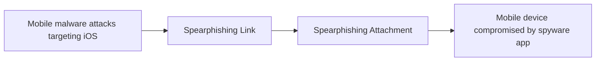

# Mobile malware attacks targeting iOS

## Metadata

- **UUID**: `ef4ba2bf-dfcb-4b70-8f45-7625baeb96d0`
- **Schema**: `threat::1.0`
- **TLP**: clear

## Description
iOS devices are protected by a robust, layered security architecture,
yet attackers continue to develop sophisticated malware that targets 
Apple devices. These threats exploit OS' vulnerabilities, abuse of
legitimate features, and use of social engineering to gain unauthorized 
access, steal sensitive data, or remotely control devices.

### How malware interacts with the architecture

Despite these protections, attackers exploit weaknesses at different
layers of the iOS architecture:

- **Jailbreaking:** By exploiting kernel or system vulnerabilities, attackers
can break out of the sandbox and disable code signing, allowing arbitrary code
execution and installation of malicious apps. This undermines the foundational
security of the Core OS layer.

- **Enterprise Provisioning/MDM Abuse:** Attackers use enterprise certificates
or MDM profiles to bypass App Store restrictions and install malicious apps,
circumventing code signing checks at the app distribution level.

- **App Replacement (Masque Attack):** Exploits flaws in the app installation
process, allowing a malicious app to replace a legitimate one if it shares the
same bundle identifier, gaining access to sensitive app data.

- **Vulnerability Exploitation:** Attackers target flaws in system frameworks or 
the kernel to escalate privileges, bypass sandboxing, or execute unauthorized code.

- **Reverse Engineering and Code Injection:** Attackers decompile apps to discover 
sensitive logic or keys, inject malicious code, or bypass security controls. Lack 
of obfuscation and anti-tamper mechanisms make these attacks easier.

- **Dynamic Instrumentation:** Tools like Frida or Ghidra allow real-time
manipulation of app processes, bypassing authentication or extracting sensitive data.

- **Man-in-the-Middle (MitM) Attacks:** Target insecure network communications, 
intercepting data between the app and backend servers.

### Abuse of iOS architecture

The basic architecture for iOS is divided into four **layers**:
 - Core services, Core OS: manage basic services in iOS  
 - Cocoa Touch, Media: handle the user interface and advanced graphics.

Below the layers there are the iOS **frameworks**, which are similar to static and
dynamic shared libraries, they provide a library of routines that an application can
access to do a specific task:
 - Security  
 - UIKit  
 - Foundation  
 - AVFoundation  
 - System Configuration  
 - MessageUI

After the frameworks there are the functions, which are being abused by different malware.

### Attack Vectors

- **Exploitation of Vulnerabilities:** Attackers leverage flaws in iOS, such as 
remote code execution or privilege escalation, to run malicious code on devices 
without user interaction.

- **Malicious Messaging:** Some attacks use iMessage or other messaging platforms 
to deliver exploit-laden attachments, triggering vulnerabilities and enabling further 
compromise.

- **Abuse of Enterprise Provisioning:** Attackers misuse Apple’s Developer Enterprise 
Program to distribute malicious apps outside the App Store, bypassing Apple’s app 
review process.

- **Masque Attack:** Replaces a legitimate app with a malicious one sharing the 
same bundle identifier, allowing credential theft or background surveillance.

- **Social Engineering and Phishing:** Users are lured into installing malicious 
profiles or apps via deceptive messages, websites, or emails.

### Types of iOS Malware (excluding Spyware) and Functions

| Malware Type                  | Functionality                                                                                 | Example(s)                        |
|-------------------------------|---------------------------------------------------------------------------------------------|------------------------------------|
| **Remote Access Trojan (RAT)**| Grants attackers remote control over the device, can install apps, manipulate settings, etc. | GoldPickaxe                        |
| **Adware**                    | Displays intrusive ads, redirects traffic, generates ad revenue for attackers                | Lock Saver Free, Muda (AdLord), YiSpecter |
| **Ransomware/Scareware**      | Locks device/browser or displays fake warnings, demands payment to restore access            | Safari JavaScript Pop-up Scareware |
| **Credential Stealers**       | Steals Apple ID, passwords, or banking credentials                                          | KeyRaider, XcodeGhost              |
| **App Replacement/Impersonation** | Replaces legitimate apps with malicious ones to steal data or perform fraudulent actions    | Masque Attack, YiSpecter           |

### Impact and Risks

- **Data Theft:** Attackers can steal personal information, financial data, and 
sensitive communications.

- **Device Takeover:** Some malware enables full remote control of the device, allowing 
attackers to impersonate the user or perform fraudulent transactions.

- **Corporate Espionage:** In enterprise environments, a compromised iOS device 
can serve as an entry point into corporate networks, leading to broader breaches 
and operational disruptions.

- **Extortion:** Attackers may use scareware or ransomware to extort victims for 
payment in exchange for restoring access or not disclosing stolen data.

- **Disruption:** Adware and scareware can degrade device performance, flood users 
with ads, or lock browsers, impacting usability.

## Techniques
- T1404
- T1638
- T1212
- T1663
- T1655
- T1456
- T1417

## Chaining

