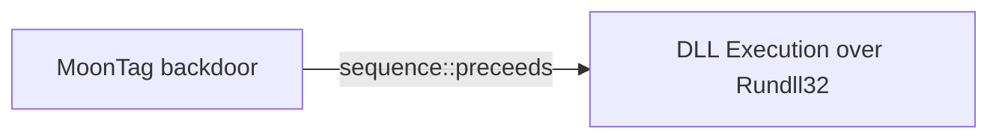

# MoonTag backdoor

## Metadata

- **UUID**: `4110c951-3120-49fb-b54b-3d3aa896296b`
- **Schema**: `threat::1.0`
- **Version**: `1`
- **Created**: `2024-10-16`
- **Modified**: `2024-10-24`
- **TLP**: clear (`TLP:CLEAR`)
- **Organisation**: EC DIGIT CSOC (`56b0a0f0-b0bc-47d9-bb46-02f80ae2065a`)

## References
### Public
- **1**: [https://www.csoonline.com/article/3483919/apt-groups-increasingly-attacking-cloud-services-to-gain-command-and-control.html](https://www.csoonline.com/article/3483919/apt-groups-increasingly-attacking-cloud-services-to-gain-command-and-control.html)
- **2**: [https://groups.google.com/g/ph4nt0m/c/2J3_1XPeKD8/m/AYPoWudRcTAJ?](https://groups.google.com/g/ph4nt0m/c/2J3_1XPeKD8/m/AYPoWudRcTAJ?)
- **3**: [https://www.security.com/threat-intelligence/cloud-espionage-attacks](https://www.security.com/threat-intelligence/cloud-espionage-attacks)

## Description
MoonTag is a new backdoor which appears to be recently uploaded
to VirusTotal. The backdoor seems to be in development phase and
uses the Microsoft Graph API, which is a set of APIs provided by
Microsoft for accessing various services and data ref [1].  

It is believed to have been created by a Chinese threat actor,
and it uses code samples for Graph API communication that were
shared in a Chinese language Google Group.

The malware code can be found at the Virus Total page - ref [2],
although none of the provided codes there appear completed.
It seems that several variants of the backdoor have been uploaded
to VirusTotal. All of the variants found contain functionality
for communicating with the MS Graph API. The malware code shows
further that the code uses a technique DLL side-loading in the
processes, for example SvcHostDLL ref [2].   

Examples: 

- install this dll as a Service host by svchost.exe, used by
rundll32.exe to call callback
- dll module handle used to get dll path in InstallService

The malware, which is named “Moon_Tag” by its developer 
is based on code published in a Google Group. All of the
variants found contain functionality for communicating
with the Graph API ref [3].  

MoonTag samples match a YARA rule named `MAL_APT_9002_SabrePanda`
that detects samples from the 9002 RAT malware family used by
a Chinese affiliated threat actor. There are no strong links
to attribute MoonTag to a specific threat actor, but based on
the reports and analytic pages MoonTag backdoor is written by
Chinese-speaking threat actor based on the Chinese language
used in the Google Group post and the infrastructure used
by the attackers ref [3].  

#### MoonTag backdoor known behavior:

- Persistence: The service installation ensures the backdoor remains
on the system across reboots.
- Camouflage: By using legitimate Windows processes like svchost.exe
and the netsvcs service group, it tries to blend in with the operating
system's normal operations.
- Remote Control: The service starts a command-line process (cmd.exe),
allowing an attacker to execute arbitrary commands on the target machine,
which could lead to further exploitation or system takeover.

## Criticality
**Medium** - A Medium priority incident may affect public health or safety, national security, economic security, foreign relations, civil liberties, or public confidence.

## Terrain
> **Threat actor uses vulnerable Microsoft Graph APIs
to deploy a backdoor.

Domains: Enterprise, Private Cloud, Public Cloud
Targets: Laptop, Other, Remote access
Platforms: Windows**

## Threat Assessment
| Dimension | Assessment | Description |
| --- | --- | --- |
| Severity | Localised incident | A cyber attack on an individual, or preliminary indications of cyber activity against a small or medium-sized organisation. |
| Impact | Data Breach; Impairement; Lose Capabilities; Reputational Damages | - |
| Leverage | Dwelling; Infrastructure Compromise; Information Disclosure; Tampering | - |
| Viability | Likely | Probable (probably) - 55-80% |
| Kill Chain | Exploitation | Techniques to exploit vulnerabilities in systems that may, amongst others, result in code execution. |

## ATT&CK Techniques
| Technique | Name | Description |
| --- | --- | --- |
| `T1219` | [Remote Access Tools](https://attack.mitre.org/techniques/T1219) | An adversary may use legitimate remote access tools to establish an interactive command and control channel within a network. Remote access tools create a session between two trusted hosts through a graphical interface, a command line interaction, a protocol tunnel via development or management software, or hardware-level access such as KVM (Keyboard, Video, Mouse) over IP solutions. Desktop support software (usually graphical interface) and remote management software (typically command line interface) allow a user to control a computer remotely as if they are a local user inheriting the user or software permissions. This software is commonly used for troubleshooting, software installation, and system management.(Citation: Symantec Living off the Land)(Citation: CrowdStrike 2015 Global Threat Report)(Citation: CrySyS Blog TeamSpy) Adversaries may similarly abuse response features included in EDR and other defensive tools that enable remote access.  Remote access tools may be installed and used post-compromise as an alternate communications channel for redundant access or to establish an interactive remote desktop session with the target system. It may also be used as a malware component to establish a reverse connection or back-connect to a service or adversary-controlled system.  Installation of many remote access tools may also include persistence (e.g., the software's installation routine creates a [Windows Service](https://attack.mitre.org/techniques/T1543/003)). Remote access modules/features may also exist as part of otherwise existing software (e.g., Google Chrome’s Remote Desktop).(Citation: Google Chrome Remote Desktop)(Citation: Chrome Remote Desktop) |
| `T1036` | [Masquerading](https://attack.mitre.org/techniques/T1036) | Adversaries may attempt to manipulate features of their artifacts to make them appear legitimate or benign to users and/or security tools. Masquerading occurs when the name or location of an object, legitimate or malicious, is manipulated or abused for the sake of evading defenses and observation. This may include manipulating file metadata, tricking users into misidentifying the file type, and giving legitimate task or service names.  Renaming abusable system utilities to evade security monitoring is also a form of [Masquerading](https://attack.mitre.org/techniques/T1036).(Citation: LOLBAS Main Site) |
| `T1574.001` | [Hijack Execution Flow: DLL](https://attack.mitre.org/techniques/T1574/001) | Adversaries may abuse dynamic-link library files (DLLs) in order to achieve persistence, escalate privileges, and evade defenses. DLLs are libraries that contain code and data that can be simultaneously utilized by multiple programs. While DLLs are not malicious by nature, they can be abused through mechanisms such as side-loading, hijacking search order, and phantom DLL hijacking.(Citation: unit 42)  Specific ways DLLs are abused by adversaries include:  ### DLL Sideloading Adversaries may execute their own malicious payloads by side-loading DLLs. Side-loading involves hijacking which DLL a program loads by planting and then invoking a legitimate application that executes their payload(s).  Side-loading positions both the victim application and malicious payload(s) alongside each other. Adversaries likely use side-loading as a means of masking actions they perform under a legitimate, trusted, and potentially elevated system or software process. Benign executables used to side-load payloads may not be flagged during delivery and/or execution. Adversary payloads may also be encrypted/packed or otherwise obfuscated until loaded into the memory of the trusted process.  Adversaries may also side-load other packages, such as BPLs (Borland Package Library).(Citation: kroll bpl)  ### DLL Search Order Hijacking Adversaries may execute their own malicious payloads by hijacking the search order that Windows uses to load DLLs. This search order is a sequence of special and standard search locations that a program checks when loading a DLL. An adversary can plant a trojan DLL in a directory that will be prioritized by the DLL search order over the location of a legitimate library. This will cause Windows to load the malicious DLL when it is called for by the victim program.(Citation: unit 42)  ### DLL Redirection Adversaries may directly modify the search order via DLL redirection, which after being enabled (in the Registry or via the creation of a redirection file) may cause a program to load a DLL from a different location.(Citation: Microsoft redirection)(Citation: Microsoft - manifests/assembly)  ### Phantom DLL Hijacking Adversaries may leverage phantom DLL hijacking by targeting references to non-existent DLL files. They may be able to load their own malicious DLL by planting it with the correct name in the location of the missing module.(Citation: Hexacorn DLL Hijacking)(Citation: Hijack DLLs CrowdStrike)  ### DLL Substitution Adversaries may target existing, valid DLL files and substitute them with their own malicious DLLs, planting them with the same name and in the same location as the valid DLL file.(Citation: Wietze Beukema DLL Hijacking)  Programs that fall victim to DLL hijacking may appear to behave normally because malicious DLLs may be configured to also load the legitimate DLLs they were meant to replace, evading defenses.  Remote DLL hijacking can occur when a program sets its current directory to a remote location, such as a Web share, before loading a DLL.(Citation: dll pre load owasp)(Citation: microsoft remote preloading)  If a valid DLL is configured to run at a higher privilege level, then the adversary-controlled DLL that is loaded will also be executed at the higher level. In this case, the technique could be used for privilege escalation. |

## Chaining

### Chaining details
#### preceeds -> DLL Execution over Rundll32 (`sequence::preceeds`)
In the code of the MoonTag backdoor is observed
a call function installing dll library used over Rundll32

//Install this dll as a Service host by svchost.exe, used by RUNDLL32.EXE to call
void CALLBACK RundllInstallA(HWND hwnd, HINSTANCE hinst, char *param, int nCmdShow)

- **Target UUID**: `f3a392f7-3268-4c54-8bfa-8117b784f520`
