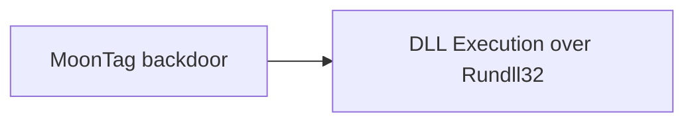

# MoonTag backdoor

## Metadata

- **UUID**: `4110c951-3120-49fb-b54b-3d3aa896296b`
- **Schema**: `threat::1.0`
- **TLP**: clear

## Description
MoonTag is a new backdoor which appears to be recently uploaded
to VirusTotal. The backdoor seems to be in development phase and
uses the Microsoft Graph API, which is a set of APIs provided by
Microsoft for accessing various services and data ref [1].  

It is believed to have been created by a Chinese threat actor,
and it uses code samples for Graph API communication that were
shared in a Chinese language Google Group.

The malware code can be found at the Virus Total page - ref [2],
although none of the provided codes there appear completed.
It seems that several variants of the backdoor have been uploaded
to VirusTotal. All of the variants found contain functionality
for communicating with the MS Graph API. The malware code shows
further that the code uses a technique DLL side-loading in the
processes, for example SvcHostDLL ref [2].   

Examples: 

- install this dll as a Service host by svchost.exe, used by
rundll32.exe to call callback
- dll module handle used to get dll path in InstallService

The malware, which is named “Moon_Tag” by its developer 
is based on code published in a Google Group. All of the
variants found contain functionality for communicating
with the Graph API ref [3].  

MoonTag samples match a YARA rule named `MAL_APT_9002_SabrePanda`
that detects samples from the 9002 RAT malware family used by
a Chinese affiliated threat actor. There are no strong links
to attribute MoonTag to a specific threat actor, but based on
the reports and analytic pages MoonTag backdoor is written by
Chinese-speaking threat actor based on the Chinese language
used in the Google Group post and the infrastructure used
by the attackers ref [3].  

#### MoonTag backdoor known behavior:

- Persistence: The service installation ensures the backdoor remains
on the system across reboots.
- Camouflage: By using legitimate Windows processes like svchost.exe
and the netsvcs service group, it tries to blend in with the operating
system's normal operations.
- Remote Control: The service starts a command-line process (cmd.exe),
allowing an attacker to execute arbitrary commands on the target machine,
which could lead to further exploitation or system takeover.

## Techniques
- T1219
- T1036
- T1574.001

## Chaining

