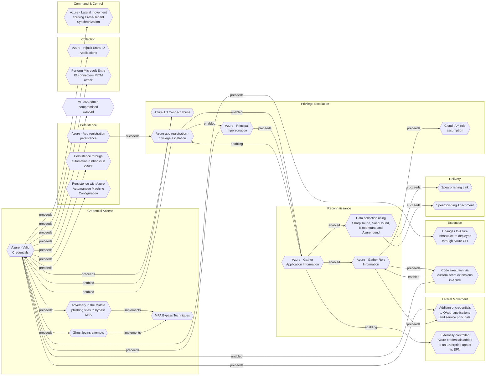

# MS 365 admin compromised account

## Metadata
| Field | Value |
| --- | --- |
| UUID | `20bd3620-b13b-4895-b291-b1a26bd9aef3` |
| Schema | `threat::1.0` |
| Version | `2` |
| Created | `2025-01-28` |
| Modified | `2025-10-01` |
| TLP | clear (`TLP:CLEAR`) |
| Organisation | EC DIGIT CSOC (`56b0a0f0-b0bc-47d9-bb46-02f80ae2065a`) |

## References
### Public
- **1**: [https://blog.talosintelligence.com/how-are-user-credentials-stolen-and-used-by-threat-actors](https://blog.talosintelligence.com/how-are-user-credentials-stolen-and-used-by-threat-actors)

## Description
Compromised credentials may be used to bypass access controls placed on various resources on systems
within the network and may even be used for persistent access to remote systems and externally
available services, such as VPNs, Outlook Web Access, network devices, and remote desktop.

Compromised credentials may also grant an adversary increased privilege to specific systems or access
to restricted areas of the network. Adversaries may choose not to use malware or tools in conjunction
with the legitimate access those credentials provide to make it harder to detect their presence.

There are several methods used by adversaries to compromise valid accounts, such as:  

- Phishing attacks (Spear Phishing, Whaling, BEC).  
- Password guessing and cracking (Credential stuffing, Bruteforce, Password spraying, exploiting weak passwords).
- OAuth and API Abuse.
- Exploiting vulnerabilities in third-party software.

## Criticality
**High** - A High priority incident is likely to result in a demonstrable impact to public health or safety, national security, economic security, foreign relations, civil liberties, or public confidence.

## Terrain
Attackers got valid credentials from MS 365 admin, and they manage to bypass 2FA mechanism.

## Surface
> **Microsoft::Microsoft 365**
> Microsoft 365 cloud-based productivity suite (formerly Office 365)

> **Microsoft::System Center**
> Microsoft System Center enterprise management suite

## Threat Assessment
| Dimension | Assessment | Description |
| --- | --- | --- |
| Severity | Significant incident | A cyber attack which has a serious impact on a large organisation or on wider / local government, or which poses a considerable risk to central government or (inter)national essential services. |
| Impact | Identity Theft Lose Capabilities | Acquisition of sufficient information and privileges to profess as a given individual, for the purpose of abusing and deceiving human trust relationships. Vector execution will remove key functions to the organization, which will not be easily circumvented. Most day-to-day is heavily impaired, but processes can reorganize at a loss. |
| Leverage | Elevation of privilege Modify privileges New Accounts Software installation | Capacity to augment leverage over the target system by upgrading the compromised access rights Modify privileges or permissions Ability to create new arbitrary user accounts. Software installation or code modification |
| Viability | Roughly even chance | Roughly even odds - 45-55% |

## Actors
| Actor | ID | Source | Description |
| --- | --- | --- | --- |
| [[Enterprise] APT18](https://attack.mitre.org/groups/G0026) | `att&ck::G0026` | ('att&ck',) | [APT18](https://attack.mitre.org/groups/G0026) is a threat group that has operated since at least 2009 and has targeted a range of industries, including technology, manufacturing, human rights groups, government, and medical. (Citation: Dell Lateral Movement) |
| APT18 | `misp::9a683d9c-8f7d-43df-bba2-ad0ca71e277c` | ('misp',) | Wekby was described by Palo Alto Networks in a 2015 report as: 'Wekby is a group that has been active for a number of years, targeting various industries such as healthcare, telecommunications, aerospace, defense, and high tech. The group is known to leverage recently released exploits very shortly after those exploits are available, such as in the case of HackingTeams Flash zero - day exploit.' |
| [[Enterprise] Akira](https://attack.mitre.org/groups/G1024) | `att&ck::G1024` | ('att&ck',) | [Akira](https://attack.mitre.org/groups/G1024) is a ransomware variant and ransomware deployment entity active since at least March 2023.(Citation: Arctic Wolf Akira 2023) [Akira](https://attack.mitre.org/groups/G1024) uses compromised credentials to access single-factor external access mechanisms such as VPNs for initial access, then various publicly-available tools and techniques for lateral movement.(Citation: Arctic Wolf Akira 2023)(Citation: Secureworks GOLD SAHARA) [Akira](https://attack.mitre.org/groups/G1024) operations are associated with "double extortion" ransomware activity, where data is exfiltrated from victim environments prior to encryption, with threats to publish files if a ransom is not paid. Technical analysis of [Akira](https://attack.mitre.org/software/S1129) ransomware indicates variants capable of targeting Windows or VMWare ESXi hypervisors and multiple overlaps with [Conti](https://attack.mitre.org/software/S0575) ransomware.(Citation: BushidoToken Akira 2023)(Citation: CISA Akira Ransomware APR 2024)(Citation: Cisco Akira Ransomware OCT 2024) |
| APT29 | `misp::b2056ff0-00b9-482e-b11c-c771daa5f28a` | ('misp',) | A 2015 report by F-Secure describe APT29 as: 'The Dukes are a well-resourced, highly dedicated and organized cyberespionage group that we believe has been working for the Russian Federation since at least 2008 to collect intelligence in support of foreign and security policy decision-making. The Dukes show unusual confidence in their ability to continue successfully compromising their targets, as well as in their ability to operate with impunity. The Dukes primarily target Western governments and related organizations, such as government ministries and agencies, political think tanks, and governmental subcontractors. Their targets have also included the governments of members of the Commonwealth of Independent States;Asian, African, and Middle Eastern governments;organizations associated with Chechen extremism;and Russian speakers engaged in the illicit trade of controlled substances and drugs. The Dukes are known to employ a vast arsenal of malware toolsets, which we identify as MiniDuke, CosmicDuke, OnionDuke, CozyDuke, CloudDuke, SeaDuke, HammerDuke, PinchDuke, and GeminiDuke. In recent years, the Dukes have engaged in apparently biannual large - scale spear - phishing campaigns against hundreds or even thousands of recipients associated with governmental institutions and affiliated organizations. These campaigns utilize a smash - and - grab approach involving a fast but noisy breakin followed by the rapid collection and exfiltration of as much data as possible.If the compromised target is discovered to be of value, the Dukes will quickly switch the toolset used and move to using stealthier tactics focused on persistent compromise and long - term intelligence gathering. This threat actor targets government ministries and agencies in the West, Central Asia, East Africa, and the Middle East; Chechen extremist groups; Russian organized crime; and think tanks. It is suspected to be behind the 2015 compromise of unclassified networks at the White House, Department of State, Pentagon, and the Joint Chiefs of Staff. The threat actor includes all of the Dukes tool sets, including MiniDuke, CosmicDuke, OnionDuke, CozyDuke, SeaDuke, CloudDuke (aka MiniDionis), and HammerDuke (aka Hammertoss). ' |
| [[Enterprise] APT29](https://attack.mitre.org/groups/G0016) | `att&ck::G0016` | ('att&ck',) | [APT29](https://attack.mitre.org/groups/G0016) is threat group that has been attributed to Russia's Foreign Intelligence Service (SVR).(Citation: White House Imposing Costs RU Gov April 2021)(Citation: UK Gov Malign RIS Activity April 2021) They have operated since at least 2008, often targeting government networks in Europe and NATO member countries, research institutes, and think tanks. [APT29](https://attack.mitre.org/groups/G0016) reportedly compromised the Democratic National Committee starting in the summer of 2015.(Citation: F-Secure The Dukes)(Citation: GRIZZLY STEPPE JAR)(Citation: Crowdstrike DNC June 2016)(Citation: UK Gov UK Exposes Russia SolarWinds April 2021)  In April 2021, the US and UK governments attributed the [SolarWinds Compromise](https://attack.mitre.org/campaigns/C0024) to the SVR; public statements included citations to [APT29](https://attack.mitre.org/groups/G0016), Cozy Bear, and The Dukes.(Citation: NSA Joint Advisory SVR SolarWinds April 2021)(Citation: UK NSCS Russia SolarWinds April 2021) Industry reporting also referred to the actors involved in this campaign as UNC2452, NOBELIUM, StellarParticle, Dark Halo, and SolarStorm.(Citation: FireEye SUNBURST Backdoor December 2020)(Citation: MSTIC NOBELIUM Mar 2021)(Citation: CrowdStrike SUNSPOT Implant January 2021)(Citation: Volexity SolarWinds)(Citation: Cybersecurity Advisory SVR TTP May 2021)(Citation: Unit 42 SolarStorm December 2020) |
| APT39 | `misp::c2c64bd3-a325-446f-91a8-b4c0f173a30b` | ('misp',) | APT39 was created to bring together previous activities and methods used by this actor, and its activities largely align with a group publicly referred to as "Chafer." However, there are differences in what has been publicly reported due to the variances in how organizations track activity. APT39 primarily leverages the SEAWEED and CACHEMONEY backdoors along with a specific variant of the POWBAT backdoor. While APT39's targeting scope is global, its activities are concentrated in the Middle East. APT39 has prioritized the telecommunications sector, with additional targeting of the travel industry and IT firms that support it and the high-tech industry. |
| [[Enterprise] APT39](https://attack.mitre.org/groups/G0087) | `att&ck::G0087` | ('att&ck',) | [APT39](https://attack.mitre.org/groups/G0087) is one of several names for cyber espionage activity conducted by the Iranian Ministry of Intelligence and Security (MOIS) through the front company Rana Intelligence Computing since at least 2014. [APT39](https://attack.mitre.org/groups/G0087) has primarily targeted the travel, hospitality, academic, and telecommunications industries in Iran and across Asia, Africa, Europe, and North America to track individuals and entities considered to be a threat by the MOIS.(Citation: FireEye APT39 Jan 2019)(Citation: Symantec Chafer Dec 2015)(Citation: FBI FLASH APT39 September 2020)(Citation: Dept. of Treasury Iran Sanctions September 2020)(Citation: DOJ Iran Indictments September 2020) |
| GALLIUM | `misp::e400b6c5-77cf-453d-ba0f-44575583ac6c` | ('misp',) | GALLIUM, is a threat actor believed to be targeting telecommunication providers over the world, mostly South-East Asia, Europe and Africa. To compromise targeted networks, GALLIUM target unpatched internet-facing services using publicly available exploits and have been known to target vulnerabilities in WildFly/JBoss. |
| [[Enterprise] Axiom](https://attack.mitre.org/groups/G0001) | `att&ck::G0001` | ('att&ck',) | [Axiom](https://attack.mitre.org/groups/G0001) is a suspected Chinese cyber espionage group that has targeted the aerospace, defense, government, manufacturing, and media sectors since at least 2008. Some reporting suggests a degree of overlap between [Axiom](https://attack.mitre.org/groups/G0001) and [Winnti Group](https://attack.mitre.org/groups/G0044) but the two groups appear to be distinct based on differences in reporting on TTPs and targeting.(Citation: Kaspersky Winnti April 2013)(Citation: Kaspersky Winnti June 2015)(Citation: Novetta Winnti April 2015) |
| [[Enterprise] Carbanak](https://attack.mitre.org/groups/G0008) | `att&ck::G0008` | ('att&ck',) | [Carbanak](https://attack.mitre.org/groups/G0008) is a cybercriminal group that has used [Carbanak](https://attack.mitre.org/software/S0030) malware to target financial institutions since at least 2013. [Carbanak](https://attack.mitre.org/groups/G0008) may be linked to groups tracked separately as [Cobalt Group](https://attack.mitre.org/groups/G0080) and [FIN7](https://attack.mitre.org/groups/G0046) that have also used [Carbanak](https://attack.mitre.org/software/S0030) malware.(Citation: Kaspersky Carbanak)(Citation: FireEye FIN7 April 2017)(Citation: Europol Cobalt Mar 2018)(Citation: Secureworks GOLD NIAGARA Threat Profile)(Citation: Secureworks GOLD KINGSWOOD Threat Profile) |
| [[Enterprise] Chimera](https://attack.mitre.org/groups/G0114) | `att&ck::G0114` | ('att&ck',) | [Chimera](https://attack.mitre.org/groups/G0114) is a suspected China-based threat group that has been active since at least 2018 targeting the semiconductor industry in Taiwan as well as data from the airline industry.(Citation: Cycraft Chimera April 2020)(Citation: NCC Group Chimera January 2021) |
| [[Enterprise] Cinnamon Tempest](https://attack.mitre.org/groups/G1021) | `att&ck::G1021` | ('att&ck',) | [Cinnamon Tempest](https://attack.mitre.org/groups/G1021) is a China-based threat group that has been active since at least 2021 deploying multiple strains of ransomware based on the leaked [Babuk](https://attack.mitre.org/software/S0638) source code. [Cinnamon Tempest](https://attack.mitre.org/groups/G1021) does not operate their ransomware on an affiliate model or purchase access but appears to act independently in all stages of the attack lifecycle. Based on victimology, the short lifespan of each ransomware variant, and use of malware attributed to government-sponsored threat groups, [Cinnamon Tempest](https://attack.mitre.org/groups/G1021) may be motivated by intellectual property theft or cyberespionage rather than financial gain.(Citation: Microsoft Ransomware as a Service)(Citation: Microsoft Threat Actor Naming July 2023)(Citation: Trend Micro Cheerscrypt May 2022)(Citation: SecureWorks BRONZE STARLIGHT Ransomware Operations June 2022) |
| [[Enterprise] FIN10](https://attack.mitre.org/groups/G0051) | `att&ck::G0051` | ('att&ck',) | [FIN10](https://attack.mitre.org/groups/G0051) is a financially motivated threat group that has targeted organizations in North America since at least 2013 through 2016. The group uses stolen data exfiltrated from victims to extort organizations. (Citation: FireEye FIN10 June 2017) |
| [[Enterprise] FIN4](https://attack.mitre.org/groups/G0085) | `att&ck::G0085` | ('att&ck',) | [FIN4](https://attack.mitre.org/groups/G0085) is a financially-motivated threat group that has targeted confidential information related to the public financial market, particularly regarding healthcare and pharmaceutical companies, since at least 2013.(Citation: FireEye Hacking FIN4 Dec 2014)(Citation: FireEye FIN4 Stealing Insider NOV 2014) [FIN4](https://attack.mitre.org/groups/G0085) is unique in that they do not infect victims with typical persistent malware, but rather they focus on capturing credentials authorized to access email and other non-public correspondence.(Citation: FireEye Hacking FIN4 Dec 2014)(Citation: FireEye Hacking FIN4 Video Dec 2014) |
| [[Enterprise] FIN8](https://attack.mitre.org/groups/G0061) | `att&ck::G0061` | ('att&ck',) | [FIN8](https://attack.mitre.org/groups/G0061) is a financially motivated threat group that has been active since at least January 2016, and known for targeting organizations in the hospitality, retail, entertainment, insurance, technology, chemical, and financial sectors. In June 2021, security researchers detected [FIN8](https://attack.mitre.org/groups/G0061) switching from targeting point-of-sale (POS) devices to distributing a number of ransomware variants.(Citation: FireEye Obfuscation June 2017)(Citation: FireEye Fin8 May 2016)(Citation: Bitdefender Sardonic Aug 2021)(Citation: Symantec FIN8 Jul 2023) |
| [[Enterprise] Fox Kitten](https://attack.mitre.org/groups/G0117) | `att&ck::G0117` | ('att&ck',) | [Fox Kitten](https://attack.mitre.org/groups/G0117) is threat actor with a suspected nexus to the Iranian government that has been active since at least 2017 against entities in the Middle East, North Africa, Europe, Australia, and North America. [Fox Kitten](https://attack.mitre.org/groups/G0117) has targeted multiple industrial verticals including oil and gas, technology, government, defense, healthcare, manufacturing, and engineering.(Citation: ClearkSky Fox Kitten February 2020)(Citation: CrowdStrike PIONEER KITTEN August 2020)(Citation: Dragos PARISITE )(Citation: ClearSky Pay2Kitten December 2020) |
| [[Enterprise] GALLIUM](https://attack.mitre.org/groups/G0093) | `att&ck::G0093` | ('att&ck',) | [GALLIUM](https://attack.mitre.org/groups/G0093) is a cyberespionage group that has been active since at least 2012, primarily targeting telecommunications companies, financial institutions, and government entities in Afghanistan, Australia, Belgium, Cambodia, Malaysia, Mozambique, the Philippines, Russia, and Vietnam. This group is particularly known for launching Operation Soft Cell, a long-term campaign targeting telecommunications providers.(Citation: Cybereason Soft Cell June 2019) Security researchers have identified [GALLIUM](https://attack.mitre.org/groups/G0093) as a likely Chinese state-sponsored group, based in part on tools used and TTPs commonly associated with Chinese threat actors.(Citation: Cybereason Soft Cell June 2019)(Citation: Microsoft GALLIUM December 2019)(Citation: Unit 42 PingPull Jun 2022) |
| [[Enterprise] Indrik Spider](https://attack.mitre.org/groups/G0119) | `att&ck::G0119` | ('att&ck',) | [Indrik Spider](https://attack.mitre.org/groups/G0119) is a Russia-based cybercriminal group that has been active since at least 2014. [Indrik Spider](https://attack.mitre.org/groups/G0119) initially started with the [Dridex](https://attack.mitre.org/software/S0384) banking Trojan, and then by 2017 they began running ransomware operations using [BitPaymer](https://attack.mitre.org/software/S0570), [WastedLocker](https://attack.mitre.org/software/S0612), and Hades ransomware. Following U.S. sanctions and an indictment in 2019, [Indrik Spider](https://attack.mitre.org/groups/G0119) changed their tactics and diversified their toolset.(Citation: Crowdstrike Indrik November 2018)(Citation: Crowdstrike EvilCorp March 2021)(Citation: Treasury EvilCorp Dec 2019) |
| APT15 | `misp::3501fbf2-098f-47e7-be6a-6b0ff5742ce8` | ('misp',) | This threat actor uses phishing techniques to compromise the networks of foreign ministries of European countries for espionage purposes. |
| [[Enterprise] Ke3chang](https://attack.mitre.org/groups/G0004) | `att&ck::G0004` | ('att&ck',) | [Ke3chang](https://attack.mitre.org/groups/G0004) is a threat group attributed to actors operating out of China. [Ke3chang](https://attack.mitre.org/groups/G0004) has targeted oil, government, diplomatic, military, and NGOs in Central and South America, the Caribbean, Europe, and North America since at least 2010.(Citation: Mandiant Operation Ke3chang November 2014)(Citation: NCC Group APT15 Alive and Strong)(Citation: APT15 Intezer June 2018)(Citation: Microsoft NICKEL December 2021) |
| LAPSUS | `misp::d9e5be22-1a04-4956-af6c-37af02330980` | ('misp',) | An actor group conducting large-scale social engineering and extortion campaign against multiple organizations with some seeing evidence of destructive elements. |
| [[Enterprise] LAPSUS$](https://attack.mitre.org/groups/G1004) | `att&ck::G1004` | ('att&ck',) | [LAPSUS$](https://attack.mitre.org/groups/G1004) is cyber criminal threat group that has been active since at least mid-2021. [LAPSUS$](https://attack.mitre.org/groups/G1004) specializes in large-scale social engineering and extortion operations, including destructive attacks without the use of ransomware. The group has targeted organizations globally, including in the government, manufacturing, higher education, energy, healthcare, technology, telecommunications, and media sectors.(Citation: BBC LAPSUS Apr 2022)(Citation: MSTIC DEV-0537 Mar 2022)(Citation: UNIT 42 LAPSUS Mar 2022) |
| APT40 | `misp::5b4b6980-3bc7-11e8-84d6-879aaac37dd9` | ('misp',) | Leviathan is an espionage actor targeting organizations and high-value targets in defense and government. Active since at least 2014, this actor has long-standing interest in maritime industries, naval defense contractors, and associated research institutions in the United States and Western Europe. |
| [[Enterprise] Leviathan](https://attack.mitre.org/groups/G0065) | `att&ck::G0065` | ('att&ck',) | [Leviathan](https://attack.mitre.org/groups/G0065) is a Chinese state-sponsored cyber espionage group that has been attributed to the Ministry of State Security's (MSS) Hainan State Security Department and an affiliated front company.(Citation: CISA AA21-200A APT40 July 2021) Active since at least 2009, [Leviathan](https://attack.mitre.org/groups/G0065) has targeted the following sectors: academia, aerospace/aviation, biomedical, defense industrial base, government, healthcare, manufacturing, maritime, and transportation across the US, Canada, Australia, Europe, the Middle East, and Southeast Asia.(Citation: CISA AA21-200A APT40 July 2021)(Citation: Proofpoint Leviathan Oct 2017)(Citation: FireEye Periscope March 2018)(Citation: CISA Leviathan 2024) |

## ATT&CK Techniques
| Technique | Name | Description |
| --- | --- | --- |
| `T1078` | [Valid Accounts](https://attack.mitre.org/techniques/T1078) | Adversaries may obtain and abuse credentials of existing accounts as a means of gaining Initial Access, Persistence, Privilege Escalation, or Defense Evasion. Compromised credentials may be used to bypass access controls placed on various resources on systems within the network and may even be used for persistent access to remote systems and externally available services, such as VPNs, Outlook Web Access, network devices, and remote desktop.(Citation: volexity_0day_sophos_FW) Compromised credentials may also grant an adversary increased privilege to specific systems or access to restricted areas of the network. Adversaries may choose not to use malware or tools in conjunction with the legitimate access those credentials provide to make it harder to detect their presence.  In some cases, adversaries may abuse inactive accounts: for example, those belonging to individuals who are no longer part of an organization. Using these accounts may allow the adversary to evade detection, as the original account user will not be present to identify any anomalous activity taking place on their account.(Citation: CISA MFA PrintNightmare)  The overlap of permissions for local, domain, and cloud accounts across a network of systems is of concern because the adversary may be able to pivot across accounts and systems to reach a high level of access (i.e., domain or enterprise administrator) to bypass access controls set within the enterprise.(Citation: TechNet Credential Theft) |
| `T1566` | [Phishing](https://attack.mitre.org/techniques/T1566) | Adversaries may send phishing messages to gain access to victim systems. All forms of phishing are electronically delivered social engineering. Phishing can be targeted, known as spearphishing. In spearphishing, a specific individual, company, or industry will be targeted by the adversary. More generally, adversaries can conduct non-targeted phishing, such as in mass malware spam campaigns.  Adversaries may send victims emails containing malicious attachments or links, typically to execute malicious code on victim systems. Phishing may also be conducted via third-party services, like social media platforms. Phishing may also involve social engineering techniques, such as posing as a trusted source, as well as evasive techniques such as removing or manipulating emails or metadata/headers from compromised accounts being abused to send messages (e.g., [Email Hiding Rules](https://attack.mitre.org/techniques/T1564/008)).(Citation: Microsoft OAuth Spam 2022)(Citation: Palo Alto Unit 42 VBA Infostealer 2014) Another way to accomplish this is by [Email Spoofing](https://attack.mitre.org/techniques/T1672)(Citation: Proofpoint-spoof) the identity of the sender, which can be used to fool both the human recipient as well as automated security tools,(Citation: cyberproof-double-bounce) or by including the intended target as a party to an existing email thread that includes malicious files or links (i.e., "thread hijacking").(Citation: phishing-krebs)  Victims may also receive phishing messages that instruct them to call a phone number where they are directed to visit a malicious URL, download malware,(Citation: sygnia Luna Month)(Citation: CISA Remote Monitoring and Management Software) or install adversary-accessible remote management tools onto their computer (i.e., [User Execution](https://attack.mitre.org/techniques/T1204)).(Citation: Unit42 Luna Moth) |

## Chaining

