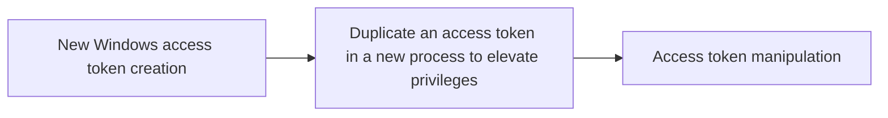

# New Windows access token creation

## Metadata

- **UUID**: `1962f0c7-2f2f-4b4c-bab0-733af8033595`
- **Schema**: `threat::1.0`
- **TLP**: clear

## Description
A Windows access token is a data structure that contains information
about a user's security context, including their security identifier
(SID), group membership, privileges, and other security-related
information. When a user logs in, the system generates an access
token for them. A threat actor may create such access token on
behalf of the Windows user and to use it to access system resources
or to escalate privileges for further access or lateral movement
ref [1].    

### Windows access token creation steps

The access token creation process in Windows involves
the following steps:

- The Local Security Authority (LSA) validates the user's
credentials (e.g., username and password).
- The LSA creates a security database entry (SDBE) for the user.
- The LSA generates an access token for the user based on the SDBE
and the user's security context.
- The LSA attaches the access token to the user's logon session.

### Abuse of Windows API functions to create an access token

A threat actor can use the native Windows API functions to manipulate
the access token, such as `DuplicateToken`, `CreateProcessAsUser`,
`CreateRestrictedToken` and `SetThreadToken`. 

`CreateRestrictedToken` API  creates a version of an existing token
with reduced privileges by stripping out certain rights.

By manipulating these functions, the attacker can create a new token
with elevated privileges or mimic another user's token ref [3].    

### Usage of runas commands

Threat actors can use a set of runas commands to generate a new user's
access tokens and to use it on behalf on a legitimate user ref [a, 3].  

Example:

`runas /user:domain\administrator cmd`

The adversaries commonly use user's token to elevate their security
context from the administrator level to the SYSTEM level. An adversary
can use a token to authenticate to a remote system as the account for
that token if the  account has appropriate permissions on the remote
system. 

### Known toolset used by the threat actors

- Mimikatz
- Windows API (WinAPI)
- PowerShell
- Windows Token Manager (WNTM)
- Cobalt Strike
- Metasploit
- Windows Internal Database (WID)
- Token Universe tool, ref [4]

## Techniques
- T1134.003

## Chaining

