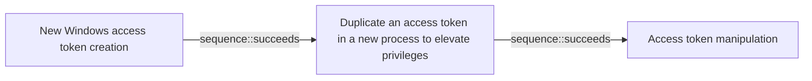

# New Windows access token creation

## Metadata

- **UUID**: `1962f0c7-2f2f-4b4c-bab0-733af8033595`
- **Schema**: `threat::1.0`
- **Version**: `1`
- **Created**: `2025-02-19`
- **Modified**: `2025-02-27`
- **TLP**: clear (`TLP:CLEAR`)
- **Organisation**: EC DIGIT CSOC (`56b0a0f0-b0bc-47d9-bb46-02f80ae2065a`)

## References
### Public
- **1**: [https://ignaciojhd.github.io/articles/AccessTokens/](https://ignaciojhd.github.io/articles/AccessTokens/)
- **2**: [https://learn.microsoft.com/en-us/security/operations/token-theft-playbook](https://learn.microsoft.com/en-us/security/operations/token-theft-playbook)
- **3**: [https://www.socinvestigation.com/account-manipulation-and-access-token-theft-attacks/](https://www.socinvestigation.com/account-manipulation-and-access-token-theft-attacks/)
- **4**: [https://github.com/diversenok/TokenUniverse](https://github.com/diversenok/TokenUniverse)

## Description
A Windows access token is a data structure that contains information
about a user's security context, including their security identifier
(SID), group membership, privileges, and other security-related
information. When a user logs in, the system generates an access
token for them. A threat actor may create such access token on
behalf of the Windows user and to use it to access system resources
or to escalate privileges for further access or lateral movement
ref [1].    

### Windows access token creation steps

The access token creation process in Windows involves
the following steps:

- The Local Security Authority (LSA) validates the user's
credentials (e.g., username and password).
- The LSA creates a security database entry (SDBE) for the user.
- The LSA generates an access token for the user based on the SDBE
and the user's security context.
- The LSA attaches the access token to the user's logon session.

### Abuse of Windows API functions to create an access token

A threat actor can use the native Windows API functions to manipulate
the access token, such as `DuplicateToken`, `CreateProcessAsUser`,
`CreateRestrictedToken` and `SetThreadToken`. 

`CreateRestrictedToken` API  creates a version of an existing token
with reduced privileges by stripping out certain rights.

By manipulating these functions, the attacker can create a new token
with elevated privileges or mimic another user's token ref [3].    

### Usage of runas commands

Threat actors can use a set of runas commands to generate a new user's
access tokens and to use it on behalf on a legitimate user ref [a, 3].  

Example:

`runas /user:domain\administrator cmd`

The adversaries commonly use user's token to elevate their security
context from the administrator level to the SYSTEM level. An adversary
can use a token to authenticate to a remote system as the account for
that token if the  account has appropriate permissions on the remote
system. 

### Known toolset used by the threat actors

- Mimikatz
- Windows API (WinAPI)
- PowerShell
- Windows Token Manager (WNTM)
- Cobalt Strike
- Metasploit
- Windows Internal Database (WID)
- Token Universe tool, ref [4]

## Criticality
**High** - A High priority incident is likely to result in a demonstrable impact to public health or safety, national security, economic security, foreign relations, civil liberties, or public confidence.

## Terrain
> **A threat actor exploits native Windows features as Windows API calls or
Windows native commands to generate in the system a new user access token.

Domains: Enterprise
Targets: Auth token, End-user, Workstations, API Endpoints, Customer
Platforms: Windows**

## Threat Assessment
| Dimension | Assessment | Description |
| --- | --- | --- |
| Severity | Moderate incident | A cyber attack on a small organisation, or which poses a considerable risk to a medium-sized organisation, or preliminary indications of cyber activity against a large organisation or the government. |
| Impact | Identity Theft; Impairement; Nuisance; Lose Capabilities; Operating costs | - |
| Leverage | Elevation of privilege; Infrastructure Compromise; Modify privileges; Dwelling | - |
| Viability | Likely | Probable (probably) - 55-80% |
| Kill Chain | Defense Evasion | Techniques an attacker may specifically use for evading detection or avoiding other defenses. |

## Actors
| Actor | ID | Source | Description |
| --- | --- | --- | --- |
| FIN6 | `misp::647894f6-1723-4cba-aba4-0ef0966d5302` | ('misp',) | FIN is a group targeting financial assets including assets able to do financial transaction including PoS. |
| [[Enterprise] FIN6](https://attack.mitre.org/groups/G0037) | `att&ck::G0037` | ('att&ck',) | [FIN6](https://attack.mitre.org/groups/G0037) is a cyber crime group that has stolen payment card data and sold it for profit on underground marketplaces. This group has aggressively targeted and compromised point of sale (PoS) systems in the hospitality and retail sectors.(Citation: FireEye FIN6 April 2016)(Citation: FireEye FIN6 Apr 2019) |
| Gelsemium | `misp::2dd31182-bae1-48ed-8bb3-805a3df89783` | ('misp',) | The Gelsemium group has been active since at least 2014 and was described in the past by a few security companies. Gelsemium’s name comes from one possible translation ESET found while reading a report from VenusTech who dubbed the group 狼毒草 for the first time. It’s the name of a genus of flowering plants belonging to the family Gelsemiaceae, Gelsemium elegans is the species that contains toxic compounds like Gelsemine, Gelsenicine and Gelsevirine, which ESET choses as names for the three components of this malware family. |
| FIN13 | `misp::60fa684d-c738-4b77-98fb-3f6605e2bb82` | ('misp',) | Since 2017, Mandiant has been tracking FIN13, an industrious and versatile financially motivated threat actor conducting long-term intrusions in Mexico with an activity timeframe stretching back as early as 2016. Although their operations continue through the present day, in many ways FIN13's intrusions are like a time capsule of traditional financial cybercrime from days past. Instead of today's prevalent smash-and-grab ransomware groups, FIN13 takes their time to gather information to perform fraudulent money transfers. Rather than relying heavily on attack frameworks such as Cobalt Strike, the majority of FIN13 intrusions involve heavy use of custom passive backdoors and tools to lurk in environments for the long haul. |
| [[Enterprise] FIN13](https://attack.mitre.org/groups/G1016) | `att&ck::G1016` | ('att&ck',) | [FIN13](https://attack.mitre.org/groups/G1016) is a financially motivated cyber threat group that has targeted the financial, retail, and hospitality industries in Mexico and Latin America, as early as 2016. [FIN13](https://attack.mitre.org/groups/G1016) achieves its objectives by stealing intellectual property, financial data, mergers and acquisition information, or PII.(Citation: Mandiant FIN13 Aug 2022)(Citation: Sygnia Elephant Beetle Jan 2022) |

## ATT&CK Techniques
| Technique | Name | Description |
| --- | --- | --- |
| `T1134.003` | [Access Token Manipulation: Make and Impersonate Token](https://attack.mitre.org/techniques/T1134/003) | Adversaries may make new tokens and impersonate users to escalate privileges and bypass access controls. For example, if an adversary has a username and password but the user is not logged onto the system the adversary can then create a logon session for the user using the `LogonUser` function.(Citation: LogonUserW function) The function will return a copy of the new session's access token and the adversary can use `SetThreadToken` to assign the token to a thread.  This behavior is distinct from [Token Impersonation/Theft](https://attack.mitre.org/techniques/T1134/001) in that this refers to creating a new user token instead of stealing or duplicating an existing one. |

## Chaining

### Chaining details
#### succeeds -> Duplicate an access token in a new process to elevate privileges (`sequence::succeeds`)
A creation of a new access token can be related to a further
duplication of a process in the system.

- **Target UUID**: `349348ca-66f5-41d2-8610-6bb61556d773`
#### succeeds -> Access token manipulation (`sequence::succeeds`)
A threat actor may create a new token and use further token
manipulation technique to create process and activities on
behalf of an existing legitimate user in the environment.

- **Target UUID**: `2404055a-10f8-4c50-9e9b-0f26756e7838`
