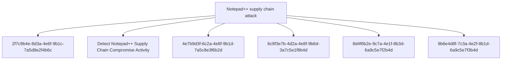

# Notepad++ supply chain attack

## Metadata

- **UUID**: `8b7cae6f-b6cf-4414-9cdc-fe8c8ee7ee22`
- **Schema**: `threat::1.0`
- **TLP**: clear

## Description
## Executive Summary

On February 2, 2026, Notepad++ developers disclosed a critical supply chain compromise 
affecting their update infrastructure. The attack, active from June to September 2025 
with attacker access persisting until December 2025, represents a sophisticated 
multi-stage operation targeting users across multiple countries and sectors.

## Attack Timeline

- **June-September 2025**: Active infection phase with three distinct attack chains
- **December 2025**: Attackers retained infrastructure access
- **February 2, 2026**: Public disclosure by Notepad++ developers

## Infection Chains

### Chain #1 (July-August 2025)

**Flow**: NSIS installer → ProShow vulnerability exploit → Metasploit downloader → Cobalt Strike Beacon

This chain exploited a vulnerability in the ProShow application to establish initial 
foothold, then deployed Metasploit framework components to download and execute 
Cobalt Strike Beacon for persistent command and control.

**Malicious file path**: `%appdata%\ProShow\load`

### Chain #2 (September-October 2025)

**Flow**: NSIS installer → Lua interpreter (alien.ini) → Shellcode → Cobalt Strike Beacon

This variant leveraged an embedded Lua interpreter loaded from a malicious configuration 
file to execute shellcode that deployed Cobalt Strike Beacon.

**Malicious file path**: `%appdata%\Adobe\Scripts\alien.ini`

### Chain #3 (October 2025)

**Flow**: NSIS installer → BluetoothService DLL sideloading → Chrysalis backdoor

The most recent chain utilized DLL side-loading techniques to load a sophisticated 
backdoor named Chrysalis through a malicious BluetoothService DLL.

**Malicious file path**: `%appdata%\Bluetooth\BluetoothService`

## Target Profile

**Geographic Distribution**:
- Vietnam (individuals and IT service provider)
- El Salvador (individuals and financial organization)
- Australia (individuals)
- Philippines (government organization)

**Sectors Affected**:
- Government agencies
- Financial services
- IT service providers
- Individual developers and users

## Indicators of Compromise (IOCs)

### Malicious Update URLs

```
http://45.76.155[.]202/update/update.exe
http://45.32.144[.]255/update/update.exe
http://95.179.213[.]0/update/update.exe
http://95.179.213[.]0/update/install.exe
http://95.179.213[.]0/update/AutoUpdater.exe
```

### System Information Upload URLs

```
http://45.76.155[.]202/list
https://self-dns.it[.]com/list
```

### Metasploit Downloader URLs

```
https://45.77.31[.]210/users/admin
https://cdncheck.it[.]com/users/admin
https://safe-dns.it[.]com/help/Get-Start
```

### Cobalt Strike C2 URLs

```
https://45.77.31[.]210/api/update/v1
https://cdncheck.it[.]com/api/getInfo/v1
https://safe-dns.it[.]com/resolve
https://api.wiresguard[.]com/update/v1
```

### Malicious File Hashes (SHA1)

**Malicious updater.exe**:
```
8e6e505438c21f3d281e1cc257abdbf7223b7f5a
90e677d7ff5844407b9c073e3b7e896e078e11cd
573549869e84544e3ef253bdba79851dcde4963a
13179c8f19fbf3d8473c49983a199e6cb4f318f0
4c9aac447bf732acc97992290aa7a187b967ee2c
821c0cafb2aab0f063ef7e313f64313fc81d46cd
```

**Malicious auxiliary files**:
```
06a6a5a39193075734a32e0235bde0e979c27228 (load - ProShow exploit component)
ca4b6fe0c69472cd3d63b212eb805b7f65710d33 (alien.ini - Lua interpreter config)
f7910d943a013eede24ac89d6388c1b98f8b3717 (log.dll)
7e0790226ea461bcc9ecd4be3c315ace41e1c122 (BluetoothService shellcode)
```

### Network Indicators

**Malicious IP Addresses**:
```
45.76.155.202
45.32.144.255
95.179.213.0
45.77.31.210
```

**Malicious Domains**:
```
self-dns.it[.]com
cdncheck.it[.]com
safe-dns.it[.]com
wiresguard[.]com
```

## Detection Opportunities

1. **Process Monitoring**: Monitor for suspicious NSIS installer activity and child processes
2. **File System Monitoring**: Watch for file creation in %appdata%\ProShow\, %appdata%\Adobe\Scripts\, and %appdata%\Bluetooth\ directories
3. **Network Monitoring**: Block/alert on connections to known malicious IPs and domains
4. **DLL Loading**: Monitor `BluetoothService.exe` sideloading `log.dll` from `%appdata%\Bluetooth\` (Chain #3, Chrysalis backdoor) and any executable loading DLLs from non-system paths
5. **Update Mechanism**: Verify integrity of software update processes and validate update sources
6. **Cobalt Strike Detection**: Look for Cobalt Strike Beacon behaviors and C2 communication patterns
7. **Lua Interpreter**: Detect unexpected Lua interpreter execution

## Mitigation Recommendations

1. **Immediate Actions**:
   - Update Notepad++ to the latest patched version through official channels only
   - Scan systems for IOCs listed above
   - Block network communications to identified malicious infrastructure
   - Review update logs for connections to malicious update URLs

2. **Long-term Measures**:
   - Implement application whitelisting to prevent unauthorized executables
   - Deploy EDR solutions capable of detecting Cobalt Strike and similar post-exploitation frameworks
   - Enforce code signing verification for all software updates
   - Segment networks to limit lateral movement capabilities
   - Monitor and restrict DLL loading behaviors
   - Implement behavioral detection for anomalous scripting interpreter usage

## MITRE ATT&CK Mapping

- **T1195.002** - Supply Chain Compromise: Compromise Software Supply Chain
  - Attackers compromised the legitimate Notepad++ update infrastructure

- **T1071** - Application Layer Protocol
  - Used HTTPS/HTTP for C2 communications and payload delivery

- **T1059** - Command and Scripting Interpreter
  - Leveraged Lua interpreter for malicious code execution

- **T1574** - Hijack Execution Flow (DLL Side-Loading sub-technique T1574.002)
  - Employed `BluetoothService.exe` sideloading `log.dll` to load Chrysalis backdoor

## References

- Kaspersky Securelist: "Notepad++ Supply Chain Attack" (February 2026)
- Rapid7 Research: "Notepad++ Supply Chain Compromise Analysis" (February 2026)

## Critical Risk Factors

This supply chain attack demonstrates:
- **High Sophistication**: Multiple infection chains showing evolution and adaptation
- **Extended Persistence**: Six months of active operations plus additional access retention
- **Targeted Selection**: Deliberate targeting of government and financial sectors
- **Infrastructure Control**: Complete compromise of legitimate update mechanism
- **Advanced Tradecraft**: Use of commercial-grade post-exploitation frameworks (Cobalt Strike)

Organizations using Notepad++ should treat this as a **CRITICAL** incident requiring 
immediate investigation and response actions.

## Techniques
- T1195.002
- T1071
- T1059
- T1574

## Relations

