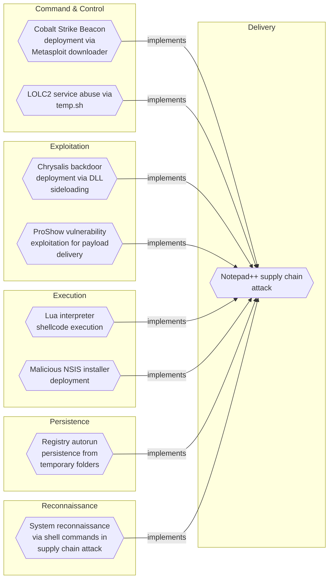
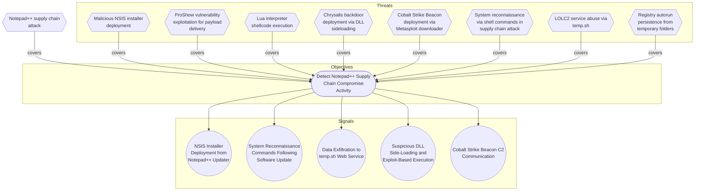

# Notepad++ supply chain attack

## Metadata
| Field | Value |
| --- | --- |
| UUID | `8b7cae6f-b6cf-4414-9cdc-fe8c8ee7ee22` |
| Schema | `threat::1.0` |
| Version | `1` |
| Created | `2026-02-09` |
| Modified | `2026-02-09` |
| TLP | clear (`TLP:CLEAR`) |
| Organisation | EC DIGIT CSOC (`56b0a0f0-b0bc-47d9-bb46-02f80ae2065a`) |

## References
### Public
- **1**: [https://securelist.com/notepad-supply-chain-attack/115382/](https://securelist.com/notepad-supply-chain-attack/115382/)
- **2**: [https://www.rapid7.com/blog/post/2026/02/03/notepad-plus-plus-supply-chain-compromise/](https://www.rapid7.com/blog/post/2026/02/03/notepad-plus-plus-supply-chain-compromise/)

## Description
## Executive Summary

On February 2, 2026, Notepad++ developers disclosed a critical supply chain compromise 
affecting their update infrastructure. The attack, active from June to September 2025 
with attacker access persisting until December 2025, represents a sophisticated 
multi-stage operation targeting users across multiple countries and sectors.

## Attack Timeline

- **June-September 2025**: Active infection phase with three distinct attack chains
- **December 2025**: Attackers retained infrastructure access
- **February 2, 2026**: Public disclosure by Notepad++ developers

## Infection Chains

### Chain #1 (July-August 2025)

**Flow**: NSIS installer → ProShow vulnerability exploit → Metasploit downloader → Cobalt Strike Beacon

This chain exploited a vulnerability in the ProShow application to establish initial 
foothold, then deployed Metasploit framework components to download and execute 
Cobalt Strike Beacon for persistent command and control.

**Malicious file path**: `%appdata%\ProShow\load`

### Chain #2 (September-October 2025)

**Flow**: NSIS installer → Lua interpreter (alien.ini) → Shellcode → Cobalt Strike Beacon

This variant leveraged an embedded Lua interpreter loaded from a malicious configuration 
file to execute shellcode that deployed Cobalt Strike Beacon.

**Malicious file path**: `%appdata%\Adobe\Scripts\alien.ini`

### Chain #3 (October 2025)

**Flow**: NSIS installer → BluetoothService DLL sideloading → Chrysalis backdoor

The most recent chain utilized DLL side-loading techniques to load a sophisticated 
backdoor named Chrysalis through a malicious BluetoothService DLL.

**Malicious file path**: `%appdata%\Bluetooth\BluetoothService`

## Target Profile

**Geographic Distribution**:
- Vietnam (individuals and IT service provider)
- El Salvador (individuals and financial organization)
- Australia (individuals)
- Philippines (government organization)

**Sectors Affected**:
- Government agencies
- Financial services
- IT service providers
- Individual developers and users

## Indicators of Compromise (IOCs)

### Malicious Update URLs

```
http://45.76.155[.]202/update/update.exe
http://45.32.144[.]255/update/update.exe
http://95.179.213[.]0/update/update.exe
http://95.179.213[.]0/update/install.exe
http://95.179.213[.]0/update/AutoUpdater.exe
```

### System Information Upload URLs

```
http://45.76.155[.]202/list
https://self-dns.it[.]com/list
```

### Metasploit Downloader URLs

```
https://45.77.31[.]210/users/admin
https://cdncheck.it[.]com/users/admin
https://safe-dns.it[.]com/help/Get-Start
```

### Cobalt Strike C2 URLs

```
https://45.77.31[.]210/api/update/v1
https://cdncheck.it[.]com/api/getInfo/v1
https://safe-dns.it[.]com/resolve
https://api.wiresguard[.]com/update/v1
```

### Malicious File Hashes (SHA1)

**Malicious updater.exe**:
```
8e6e505438c21f3d281e1cc257abdbf7223b7f5a
90e677d7ff5844407b9c073e3b7e896e078e11cd
573549869e84544e3ef253bdba79851dcde4963a
13179c8f19fbf3d8473c49983a199e6cb4f318f0
4c9aac447bf732acc97992290aa7a187b967ee2c
821c0cafb2aab0f063ef7e313f64313fc81d46cd
```

**Malicious auxiliary files**:
```
06a6a5a39193075734a32e0235bde0e979c27228 (load - ProShow exploit component)
ca4b6fe0c69472cd3d63b212eb805b7f65710d33 (alien.ini - Lua interpreter config)
f7910d943a013eede24ac89d6388c1b98f8b3717 (log.dll)
7e0790226ea461bcc9ecd4be3c315ace41e1c122 (BluetoothService shellcode)
```

### Network Indicators

**Malicious IP Addresses**:
```
45.76.155.202
45.32.144.255
95.179.213.0
45.77.31.210
```

**Malicious Domains**:
```
self-dns.it[.]com
cdncheck.it[.]com
safe-dns.it[.]com
wiresguard[.]com
```

## Detection Opportunities

1. **Process Monitoring**: Monitor for suspicious NSIS installer activity and child processes
2. **File System Monitoring**: Watch for file creation in %appdata%\ProShow\, %appdata%\Adobe\Scripts\, and %appdata%\Bluetooth\ directories
3. **Network Monitoring**: Block/alert on connections to known malicious IPs and domains
4. **DLL Loading**: Monitor `BluetoothService.exe` sideloading `log.dll` from `%appdata%\Bluetooth\` (Chain #3, Chrysalis backdoor) and any executable loading DLLs from non-system paths
5. **Update Mechanism**: Verify integrity of software update processes and validate update sources
6. **Cobalt Strike Detection**: Look for Cobalt Strike Beacon behaviors and C2 communication patterns
7. **Lua Interpreter**: Detect unexpected Lua interpreter execution

## Mitigation Recommendations

1. **Immediate Actions**:
   - Update Notepad++ to the latest patched version through official channels only
   - Scan systems for IOCs listed above
   - Block network communications to identified malicious infrastructure
   - Review update logs for connections to malicious update URLs

2. **Long-term Measures**:
   - Implement application whitelisting to prevent unauthorized executables
   - Deploy EDR solutions capable of detecting Cobalt Strike and similar post-exploitation frameworks
   - Enforce code signing verification for all software updates
   - Segment networks to limit lateral movement capabilities
   - Monitor and restrict DLL loading behaviors
   - Implement behavioral detection for anomalous scripting interpreter usage

## MITRE ATT&CK Mapping

- **T1195.002** - Supply Chain Compromise: Compromise Software Supply Chain
  - Attackers compromised the legitimate Notepad++ update infrastructure

- **T1071** - Application Layer Protocol
  - Used HTTPS/HTTP for C2 communications and payload delivery

- **T1059** - Command and Scripting Interpreter
  - Leveraged Lua interpreter for malicious code execution

- **T1574** - Hijack Execution Flow (DLL Side-Loading sub-technique T1574.002)
  - Employed `BluetoothService.exe` sideloading `log.dll` to load Chrysalis backdoor

## References

- Kaspersky Securelist: "Notepad++ Supply Chain Attack" (February 2026)
- Rapid7 Research: "Notepad++ Supply Chain Compromise Analysis" (February 2026)

## Critical Risk Factors

This supply chain attack demonstrates:
- **High Sophistication**: Multiple infection chains showing evolution and adaptation
- **Extended Persistence**: Six months of active operations plus additional access retention
- **Targeted Selection**: Deliberate targeting of government and financial sectors
- **Infrastructure Control**: Complete compromise of legitimate update mechanism
- **Advanced Tradecraft**: Use of commercial-grade post-exploitation frameworks (Cobalt Strike)

Organizations using Notepad++ should treat this as a **CRITICAL** incident requiring 
immediate investigation and response actions.

## Criticality
**Severe** - A Severe priority incident is likely to result in a significant impact to public health or safety, national security, economic security, foreign relations, or civil liberties.

## Terrain
Organizations and individuals using Notepad++ text editor on Windows systems, 
particularly those with automatic update mechanisms enabled. The attack targeted 
the legitimate update infrastructure, delivering malicious payloads disguised 
as authentic software updates. Victims were distributed globally across multiple 
sectors including government, financial services, and IT service providers.

## Surface
> **Windows::Desktop**
> Microsoft Windows desktop editions

## Threat Assessment
| Dimension | Assessment | Description |
| --- | --- | --- |
| Severity | Highly significant incident | A cyber attack which has a serious impact on central government, (inter)national essential services, a large proportion of the (inter)national population, or the (inter)national economy. |
| Impact | Data Breach<br>Business disruption<br>Reputational Damages<br>Legal and regulatory<br>Monetary Loss | Non-public information has been accessed from the outside, and successfully extracted.<br>Business disruption<br>Damages to the organization public view may be achieved by using directly the access gained, or indirectly with data gathered.<br>Legal and regulatory costs<br>The vector will directly conduct to loss of value directly impacting the bottom line. |
| Leverage | Elevation of privilege<br>Tampering<br>Information Disclosure<br>Repudiation | Capacity to augment leverage over the target system by upgrading the compromised access rights<br>Threat action intending to maliciously change or modify persistent data, such as records in a database, and the alteration of data in transit between two computers over an open network, such as the Internet.<br>Threat action intending to read a file that one was not granted access to, or to read data in transit.<br>Threat action aimed at performing prohibited operations in a system that lacks the ability to trace the operations. |
| Viability | Almost certain | Nearly certain - 95-99% |
| Kill Chain | Delivery | Techniques resulting in the transmission of a weaponized object to the targeted environment. |

## ATT&CK Techniques
| Technique | Name | Description |
| --- | --- | --- |
| `T1195.002` | [Supply Chain Compromise: Compromise Software Supply Chain](https://attack.mitre.org/techniques/T1195/002) | Adversaries may manipulate application software prior to receipt by a final consumer for the purpose of data or system compromise. Supply chain compromise of software can take place in a number of ways, including manipulation of the application source code, manipulation of the update/distribution mechanism for that software, or replacing compiled releases with a modified version.  Targeting may be specific to a desired victim set or may be distributed to a broad set of consumers but only move on to additional tactics on specific victims.(Citation: Avast CCleaner3 2018)(Citation: Command Five SK 2011) |
| `T1071` | [Application Layer Protocol](https://attack.mitre.org/techniques/T1071) | Adversaries may communicate using OSI application layer protocols to avoid detection/network filtering by blending in with existing traffic. Commands to the remote system, and often the results of those commands, will be embedded within the protocol traffic between the client and server.   Adversaries may utilize many different protocols, including those used for web browsing, transferring files, electronic mail, DNS, or publishing/subscribing. For connections that occur internally within an enclave (such as those between a proxy or pivot node and other nodes), commonly used protocols are SMB, SSH, or RDP.(Citation: Mandiant APT29 Eye Spy Email Nov 22) |
| `T1059` | [Command and Scripting Interpreter](https://attack.mitre.org/techniques/T1059) | Adversaries may abuse command and script interpreters to execute commands, scripts, or binaries. These interfaces and languages provide ways of interacting with computer systems and are a common feature across many different platforms. Most systems come with some built-in command-line interface and scripting capabilities, for example, macOS and Linux distributions include some flavor of [Unix Shell](https://attack.mitre.org/techniques/T1059/004) while Windows installations include the [Windows Command Shell](https://attack.mitre.org/techniques/T1059/003) and [PowerShell](https://attack.mitre.org/techniques/T1059/001).  There are also cross-platform interpreters such as [Python](https://attack.mitre.org/techniques/T1059/006), as well as those commonly associated with client applications such as [JavaScript](https://attack.mitre.org/techniques/T1059/007) and [Visual Basic](https://attack.mitre.org/techniques/T1059/005).  Adversaries may abuse these technologies in various ways as a means of executing arbitrary commands. Commands and scripts can be embedded in [Initial Access](https://attack.mitre.org/tactics/TA0001) payloads delivered to victims as lure documents or as secondary payloads downloaded from an existing C2. Adversaries may also execute commands through interactive terminals/shells, as well as utilize various [Remote Services](https://attack.mitre.org/techniques/T1021) in order to achieve remote Execution.(Citation: Powershell Remote Commands)(Citation: Cisco IOS Software Integrity Assurance - Command History)(Citation: Remote Shell Execution in Python) |
| `T1574` | [Hijack Execution Flow](https://attack.mitre.org/techniques/T1574) | Adversaries may execute their own malicious payloads by hijacking the way operating systems run programs. Hijacking execution flow can be for the purposes of persistence, since this hijacked execution may reoccur over time. Adversaries may also use these mechanisms to elevate privileges or evade defenses, such as application control or other restrictions on execution.  There are many ways an adversary may hijack the flow of execution, including by manipulating how the operating system locates programs to be executed. How the operating system locates libraries to be used by a program can also be intercepted. Locations where the operating system looks for programs/resources, such as file directories and in the case of Windows the Registry, could also be poisoned to include malicious payloads. |

## Chaining


## Coverage

## Related objects
| Type | Name | Direction | Relation |
| --- | --- | --- | --- |
| Objective | [Detect Notepad++ Supply Chain Compromise Activity](../Objectives/detect-notepad-supply-chain-compromise-activity.md) (`3e8b5d7f-9c2a-4f6e-8b1d-7a4c9e3f6b2d`) | Downstream | objective |
| Signal | [System Reconnaissance Commands Following Software Update](../Objectives/detect-notepad-supply-chain-compromise-activity.md#system-reconnaissance-commands-following-software-update) (`2f7c9b4e-8d3a-4e6f-9b1c-7a5d8e2f4b6c`) | Downstream | signal |
| Signal | [Suspicious DLL Side-Loading and Exploit-Based Execution](../Objectives/detect-notepad-supply-chain-compromise-activity.md#suspicious-dll-side-loading-and-exploit-based-execution) (`4e7b9d3f-6c2a-4e8f-9b1d-7a5c8e3f6b2d`) | Downstream | signal |
| Signal | [Data Exfiltration to temp.sh Web Service](../Objectives/detect-notepad-supply-chain-compromise-activity.md#data-exfiltration-to-temp-sh-web-service) (`6c9f3e7b-4d2a-4e8f-9b6d-3a7c5e1f8b4d`) | Downstream | signal |
| Signal | [NSIS Installer Deployment from Notepad++ Updater](../Objectives/detect-notepad-supply-chain-compromise-activity.md#nsis-installer-deployment-from-notepad-updater) (`8d4f6b2e-9c7a-4e1f-8b3d-6a9c5e7f2b4d`) | Downstream | signal |
| Signal | [Cobalt Strike Beacon C2 Communication](../Objectives/detect-notepad-supply-chain-compromise-activity.md#cobalt-strike-beacon-c2-communication) (`9b6e4d8f-7c3a-4e2f-8b1d-6a9c5e7f3b4d`) | Downstream | signal |
