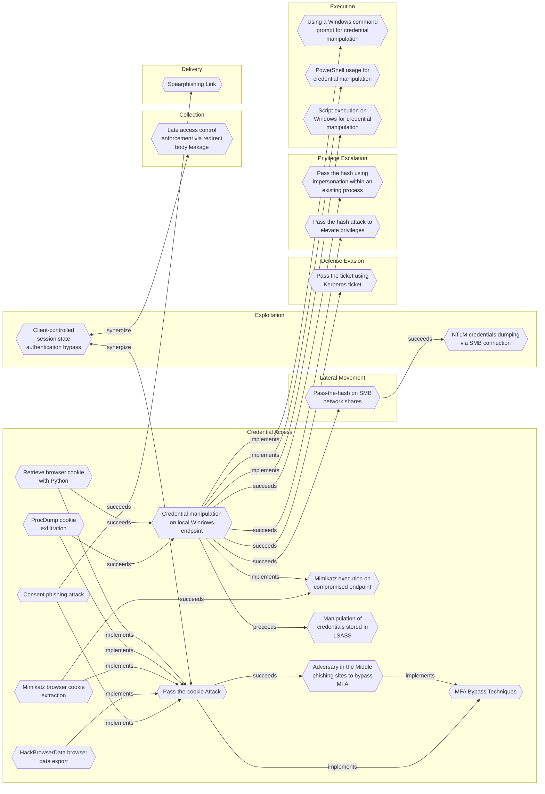

# Pass-the-cookie Attack

## Metadata
| Field | Value |
| --- | --- |
| UUID | `b0d6bf74-b204-4a48-9509-4499ed795771` |
| Schema | `threat::1.0` |
| Version | `1` |
| Created | `2024-10-22` |
| Modified | `2024-11-11` |
| TLP | clear (`TLP:CLEAR`) |
| Organisation | EC DIGIT CSOC (`56b0a0f0-b0bc-47d9-bb46-02f80ae2065a`) |

## References
### Public
- **1**: [https://www.theverge.com/2023/3/24/23654996/linus-tech-tips-channel-hack-session-token-elon-musk-crypto-scam](https://www.theverge.com/2023/3/24/23654996/linus-tech-tips-channel-hack-session-token-elon-musk-crypto-scam)
- **2**: [https://blog.netwrix.com/2022/11/29/bypassing-mfa-with-pass-the-cookie-attack/](https://blog.netwrix.com/2022/11/29/bypassing-mfa-with-pass-the-cookie-attack/)
- **3**: [https://news.sophos.com/en-us/2022/08/18/cookie-stealing-the-new-perimeter-bypass/](https://news.sophos.com/en-us/2022/08/18/cookie-stealing-the-new-perimeter-bypass/)
- **4**: [https://embracethered.com/blog/posts/passthecookie/](https://embracethered.com/blog/posts/passthecookie/)

## Description
Pass-The-Cookie (PTC), also known as token compromise, is a common attack technique
employed by threat actors in SaaS environments. 

A PTC is a type of attack where an attacker can bypass authentication controls by 
compromising browser cookies. At a high level, browser cookies allow web applications
to store user authentication information. 

Specifically, an authentication cookie allows a website to keep the user signed in
and not constantly prompt for credentials every time user clicks a new page.
The server uses the token to recognize the user and confirm they are authenticated 
without requiring the user to re-enter their credentials. Session tokens maintain the
state of the user, allowing them to interact with web services in a stateful manner 
despite the stateless nature of the web.

After authentication to Azure AD via a browser, a cookie is created and stored for
that session. If attackers can compromise a device and extract the browser cookies,
they could pass that cookie into a separate web browser on another system, to be
injected into a new web session to trick the browser into thinking the authenticated
user is present and does not need to prove their identity, bypassing security 
checkpoints along the way.

Because such cookie is also created and stored on a web browser when MFA is in play,
the same technique can handily be used to bypass it.

## Criticality
**High** - A High priority incident is likely to result in a demonstrable impact to public health or safety, national security, economic security, foreign relations, civil liberties, or public confidence.

## Terrain
Attacker must compromise a user endpoint and exfiltrate the browser cookies.
Cookies can be found on disk, in the process memory of the browser, and in network
traffic to remote systems.

Additionally, other applications on the user endpoint machine might store sensitive
authentication cookies in memory (e.g. apps which authenticate to cloud services).

## Surface
> **Microsoft::Microsoft 365**
> Microsoft 365 cloud-based productivity suite (formerly Office 365)

> **OAuth / OIDC**
> OAuth 2.0 and OpenID Connect authorisation/authentication protocols

> **Azure**
> Microsoft Azure cloud platform

> **Windows::Desktop**
> Microsoft Windows desktop editions

> **Entra ID**
> Microsoft Entra ID (formerly Azure Active Directory)

> **Mobile**
> Mobile operating systems (Android, iOS)

## Threat Assessment
| Dimension | Assessment | Description |
| --- | --- | --- |
| Severity | Significant incident | A cyber attack which has a serious impact on a large organisation or on wider / local government, or which poses a considerable risk to central government or (inter)national essential services. |
| Impact | Identity Theft | Acquisition of sufficient information and privileges to profess as a given individual, for the purpose of abusing and deceiving human trust relationships. |
| Leverage | Elevation of privilege Spoofing | Capacity to augment leverage over the target system by upgrading the compromised access rights Threat action aimed at accessing and use of another user’s credentials, such as username and password. |
| Viability | Likely | Probable (probably) - 55-80% |
| Kill Chain | Credential Access | Techniques resulting in the access of, or control over, system, service or domain credentials. |

## Actors
| Actor | ID | Source | Description |
| --- | --- | --- | --- |
| [[Enterprise] APT29](https://attack.mitre.org/groups/G0016) | `att&ck::G0016` | ('att&ck',) | [APT29](https://attack.mitre.org/groups/G0016) is threat group that has been attributed to Russia's Foreign Intelligence Service (SVR).(Citation: White House Imposing Costs RU Gov April 2021)(Citation: UK Gov Malign RIS Activity April 2021) They have operated since at least 2008, often targeting government networks in Europe and NATO member countries, research institutes, and think tanks. [APT29](https://attack.mitre.org/groups/G0016) reportedly compromised the Democratic National Committee starting in the summer of 2015.(Citation: F-Secure The Dukes)(Citation: GRIZZLY STEPPE JAR)(Citation: Crowdstrike DNC June 2016)(Citation: UK Gov UK Exposes Russia SolarWinds April 2021)  In April 2021, the US and UK governments attributed the [SolarWinds Compromise](https://attack.mitre.org/campaigns/C0024) to the SVR; public statements included citations to [APT29](https://attack.mitre.org/groups/G0016), Cozy Bear, and The Dukes.(Citation: NSA Joint Advisory SVR SolarWinds April 2021)(Citation: UK NSCS Russia SolarWinds April 2021) Industry reporting also referred to the actors involved in this campaign as UNC2452, NOBELIUM, StellarParticle, Dark Halo, and SolarStorm.(Citation: FireEye SUNBURST Backdoor December 2020)(Citation: MSTIC NOBELIUM Mar 2021)(Citation: CrowdStrike SUNSPOT Implant January 2021)(Citation: Volexity SolarWinds)(Citation: Cybersecurity Advisory SVR TTP May 2021)(Citation: Unit 42 SolarStorm December 2020) |
| UNC2452 | `misp::2ee5ed7a-c4d0-40be-a837-20817474a15b` | ('misp',) | Reporting regarding activity related to the SolarWinds supply chain injection has grown quickly since initial disclosure on 13 December 2020. A significant amount of press reporting has focused on the identification of the actor(s) involved, victim organizations, possible campaign timeline, and potential impact. The US Government and cyber community have also provided detailed information on how the campaign was likely conducted and some of the malware used.  MITRE’s ATT&CK team — with the assistance of contributors — has been mapping techniques used by the actor group, referred to as UNC2452/Dark Halo by FireEye and Volexity respectively, as well as SUNBURST and TEARDROP malware. |
| [[Enterprise] Sandworm Team](https://attack.mitre.org/groups/G0034) | `att&ck::G0034` | ('att&ck',) | [Sandworm Team](https://attack.mitre.org/groups/G0034) is a destructive threat group that has been attributed to Russia's General Staff Main Intelligence Directorate (GRU) Main Center for Special Technologies (GTsST) military unit 74455.(Citation: US District Court Indictment GRU Unit 74455 October 2020)(Citation: UK NCSC Olympic Attacks October 2020) This group has been active since at least 2009.(Citation: iSIGHT Sandworm 2014)(Citation: CrowdStrike VOODOO BEAR)(Citation: USDOJ Sandworm Feb 2020)(Citation: NCSC Sandworm Feb 2020)  In October 2020, the US indicted six GRU Unit 74455 officers associated with [Sandworm Team](https://attack.mitre.org/groups/G0034) for the following cyber operations: the 2015 and 2016 attacks against Ukrainian electrical companies and government organizations, the 2017 worldwide [NotPetya](https://attack.mitre.org/software/S0368) attack, targeting of the 2017 French presidential campaign, the 2018 [Olympic Destroyer](https://attack.mitre.org/software/S0365) attack against the Winter Olympic Games, the 2018 operation against the Organisation for the Prohibition of Chemical Weapons, and attacks against the country of Georgia in 2018 and 2019.(Citation: US District Court Indictment GRU Unit 74455 October 2020)(Citation: UK NCSC Olympic Attacks October 2020) Some of these were conducted with the assistance of GRU Unit 26165, which is also referred to as [APT28](https://attack.mitre.org/groups/G0007).(Citation: US District Court Indictment GRU Oct 2018) |
| GreyEnergy | `misp::d52ca4c4-d214-11e8-8d29-c3e7cb78acce` | ('misp',) | ESET research reveals a successor to the infamous BlackEnergy APT group targeting critical infrastructure, quite possibly in preparation for damaging attacks |

## ATT&CK Techniques
| Technique | Name | Description |
| --- | --- | --- |
| `T1111` | [Multi-Factor Authentication Interception](https://attack.mitre.org/techniques/T1111) | Adversaries may target multi-factor authentication (MFA) mechanisms, (i.e., smart cards, token generators, etc.) to gain access to credentials that can be used to access systems, services, and network resources. Use of MFA is recommended and provides a higher level of security than usernames and passwords alone, but organizations should be aware of techniques that could be used to intercept and bypass these security mechanisms.   If a smart card is used for multi-factor authentication, then a keylogger will need to be used to obtain the password associated with a smart card during normal use. With both an inserted card and access to the smart card password, an adversary can connect to a network resource using the infected system to proxy the authentication with the inserted hardware token. (Citation: Mandiant M Trends 2011)  Adversaries may also employ a keylogger to similarly target other hardware tokens, such as RSA SecurID. Capturing token input (including a user's personal identification code) may provide temporary access (i.e. replay the one-time passcode until the next value rollover) as well as possibly enabling adversaries to reliably predict future authentication values (given access to both the algorithm and any seed values used to generate appended temporary codes). (Citation: GCN RSA June 2011)  Other methods of MFA may be intercepted and used by an adversary to authenticate. It is common for one-time codes to be sent via out-of-band communications (email, SMS). If the device and/or service is not secured, then it may be vulnerable to interception. Service providers can also be targeted: for example, an adversary may compromise an SMS messaging service in order to steal MFA codes sent to users’ phones.(Citation: Okta Scatter Swine 2022) |

## Chaining

### Chaining details
#### succeeds -> [Adversary in the Middle phishing sites to bypass MFA](adversary-in-the-middle-phishing-sites-to-bypass-mfa.md) (`66aafb61-9a46-4287-8b40-4785b42b77a3`) (`sequence::succeeds`)
The fake MFA login page captures credentials of valid accounts, later the session cookies can be stolen

- **Target UUID**: `66aafb61-9a46-4287-8b40-4785b42b77a3`
#### implements -> [MFA Bypass Techniques](mfa-bypass-techniques.md) (`4a807ac4-f764-41b1-ae6f-94239041d349`) (`atomicity::implements`)
MFA bypass technique

- **Target UUID**: `4a807ac4-f764-41b1-ae6f-94239041d349`
