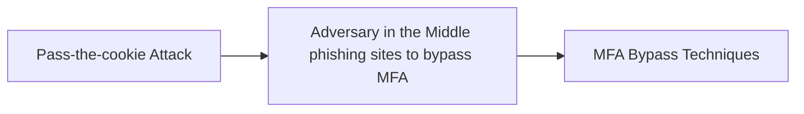

# Pass-the-cookie Attack

## Metadata

- **UUID**: `b0d6bf74-b204-4a48-9509-4499ed795771`
- **Schema**: `threat::1.0`
- **TLP**: clear

## Description
Pass-The-Cookie (PTC), also known as token compromise, is a common attack technique
employed by threat actors in SaaS environments. 

A PTC is a type of attack where an attacker can bypass authentication controls by 
compromising browser cookies. At a high level, browser cookies allow web applications
to store user authentication information. 

Specifically, an authentication cookie allows a website to keep the user signed in
and not constantly prompt for credentials every time user clicks a new page.
The server uses the token to recognize the user and confirm they are authenticated 
without requiring the user to re-enter their credentials. Session tokens maintain the
state of the user, allowing them to interact with web services in a stateful manner 
despite the stateless nature of the web.

After authentication to Azure AD via a browser, a cookie is created and stored for
that session. If attackers can compromise a device and extract the browser cookies,
they could pass that cookie into a separate web browser on another system, to be
injected into a new web session to trick the browser into thinking the authenticated
user is present and does not need to prove their identity, bypassing security 
checkpoints along the way.

Because such cookie is also created and stored on a web browser when MFA is in play,
the same technique can handily be used to bypass it.

## Techniques
- T1111

## Chaining

