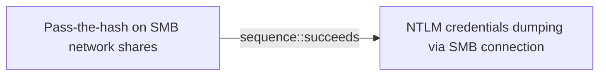

# Pass-the-hash on SMB network shares

## Metadata

- **UUID**: `5ea50181-1124-49aa-9d2c-c74103e86fd5`
- **Schema**: `threat::1.0`
- **Version**: `2`
- **Created**: `2023-08-30`
- **Modified**: `2025-10-01`
- **TLP**: clear (`TLP:CLEAR`)
- **Organisation**: EC DIGIT CSOC (`56b0a0f0-b0bc-47d9-bb46-02f80ae2065a`)

## References
### Public
- **1**: [https://essay.utwente.nl/71415/1/Ullah_MA_EWI.pdf](https://essay.utwente.nl/71415/1/Ullah_MA_EWI.pdf)
- **2**: [https://www.stationx.net/pass-the-hash-attack/](https://www.stationx.net/pass-the-hash-attack/)
- **3**: [https://viperone.gitbook.io/pentest-everything/everything/everything-active-directory/lateral-movement/alternate-authentication-material/wip-pass-the-hash](https://viperone.gitbook.io/pentest-everything/everything/everything-active-directory/lateral-movement/alternate-authentication-material/wip-pass-the-hash)

## Description
In a **Pass-the-Hash attack (PtH)**, Attackers may use offensive tools to load 
the NTLM hash and try to connect to SMB network shares that are reachable 
from the attacker device (SMB port is open to the internet - initial access) 
or from a compromised station under attacker's control - lateral movement. 

Crackmapexec is an excellent tool to try to connect to SMB network 
shares using NTLM hash (PtH).  

It scales really well as you can simply point and shoot at a whole 
subnet or list of IP addresses.  

Attacker may obtain read-only access to SMB network shares and could retrieve 
additional information.  

They may get write access to the share and then be able to drop files 
that victims might be enticed to open or to execute.

## Criticality
**High** - A High priority incident is likely to result in a demonstrable impact to public health or safety, national security, economic security, foreign relations, civil liberties, or public confidence.

## Terrain
> **Attacker needs to have captured a valid NTLM hash,
Kerberos is disabled or NTML authentication is accepted as alternate method,
SMB ports needs to be open  from attacker perspective

Domains: Enterprise
Targets: Control Server, Desktop, End-user, Laptop, Remote access, Virtual Machines, Workstations
Platforms: Windows**

## Threat Assessment
| Dimension | Assessment | Description |
| --- | --- | --- |
| Severity | Highly significant incident | A cyber attack which has a serious impact on central government, (inter)national essential services, a large proportion of the (inter)national population, or the (inter)national economy. |
| Impact | Data Breach; Impairement | - |
| Leverage | Alter behavior; Elevation of privilege; Spoofing | - |
| Viability | Likely | Probable (probably) - 55-80% |
| Kill Chain | Lateral Movement | Techniques that enable an adversary to horizontally access and control other remote systems. |

## Actors
| Actor | ID | Source | Description |
| --- | --- | --- | --- |
| [[Enterprise] APT28](https://attack.mitre.org/groups/G0007) | `att&ck::G0007` | ('att&ck',) | [APT28](https://attack.mitre.org/groups/G0007) is a threat group that has been attributed to Russia's General Staff Main Intelligence Directorate (GRU) 85th Main Special Service Center (GTsSS) military unit 26165.(Citation: NSA/FBI Drovorub August 2020)(Citation: Cybersecurity Advisory GRU Brute Force Campaign July 2021) This group has been active since at least 2004.(Citation: DOJ GRU Indictment Jul 2018)(Citation: Ars Technica GRU indictment Jul 2018)(Citation: Crowdstrike DNC June 2016)(Citation: FireEye APT28)(Citation: SecureWorks TG-4127)(Citation: FireEye APT28 January 2017)(Citation: GRIZZLY STEPPE JAR)(Citation: Sofacy DealersChoice)(Citation: Palo Alto Sofacy 06-2018)(Citation: Symantec APT28 Oct 2018)(Citation: ESET Zebrocy May 2019)  [APT28](https://attack.mitre.org/groups/G0007) reportedly compromised the Hillary Clinton campaign, the Democratic National Committee, and the Democratic Congressional Campaign Committee in 2016 in an attempt to interfere with the U.S. presidential election.(Citation: Crowdstrike DNC June 2016) In 2018, the US indicted five GRU Unit 26165 officers associated with [APT28](https://attack.mitre.org/groups/G0007) for cyber operations (including close-access operations) conducted between 2014 and 2018 against the World Anti-Doping Agency (WADA), the US Anti-Doping Agency, a US nuclear facility, the Organization for the Prohibition of Chemical Weapons (OPCW), the Spiez Swiss Chemicals Laboratory, and other organizations.(Citation: US District Court Indictment GRU Oct 2018) Some of these were conducted with the assistance of GRU Unit 74455, which is also referred to as [Sandworm Team](https://attack.mitre.org/groups/G0034). |
| APT28 | `misp::5b4ee3ea-eee3-4c8e-8323-85ae32658754` | ('misp',) | The Sofacy Group (also known as APT28, Pawn Storm, Fancy Bear and Sednit) is a cyber espionage group believed to have ties to the Russian government. Likely operating since 2007, the group is known to target government, military, and security organizations. It has been characterized as an advanced persistent threat. |
| [[Enterprise] APT1](https://attack.mitre.org/groups/G0006) | `att&ck::G0006` | ('att&ck',) | [APT1](https://attack.mitre.org/groups/G0006) is a Chinese threat group that has been attributed to the 2nd Bureau of the People’s Liberation Army (PLA) General Staff Department’s (GSD) 3rd Department, commonly known by its Military Unit Cover Designator (MUCD) as Unit 61398. (Citation: Mandiant APT1) |
| APT1 | `misp::1cb7e1cc-d695-42b1-92f4-fd0112a3c9be` | ('misp',) | PLA Unit 61398 (Chinese: 61398部队, Pinyin: 61398 bùduì) is the Military Unit Cover Designator (MUCD)[1] of a People's Liberation Army advanced persistent threat unit that has been alleged to be a source of Chinese computer hacking attacks |
| [[Enterprise] APT39](https://attack.mitre.org/groups/G0087) | `att&ck::G0087` | ('att&ck',) | [APT39](https://attack.mitre.org/groups/G0087) is one of several names for cyber espionage activity conducted by the Iranian Ministry of Intelligence and Security (MOIS) through the front company Rana Intelligence Computing since at least 2014. [APT39](https://attack.mitre.org/groups/G0087) has primarily targeted the travel, hospitality, academic, and telecommunications industries in Iran and across Asia, Africa, Europe, and North America to track individuals and entities considered to be a threat by the MOIS.(Citation: FireEye APT39 Jan 2019)(Citation: Symantec Chafer Dec 2015)(Citation: FBI FLASH APT39 September 2020)(Citation: Dept. of Treasury Iran Sanctions September 2020)(Citation: DOJ Iran Indictments September 2020) |
| APT39 | `misp::c2c64bd3-a325-446f-91a8-b4c0f173a30b` | ('misp',) | APT39 was created to bring together previous activities and methods used by this actor, and its activities largely align with a group publicly referred to as "Chafer." However, there are differences in what has been publicly reported due to the variances in how organizations track activity. APT39 primarily leverages the SEAWEED and CACHEMONEY backdoors along with a specific variant of the POWBAT backdoor. While APT39's targeting scope is global, its activities are concentrated in the Middle East. APT39 has prioritized the telecommunications sector, with additional targeting of the travel industry and IT firms that support it and the high-tech industry. |
| [[Enterprise] APT32](https://attack.mitre.org/groups/G0050) | `att&ck::G0050` | ('att&ck',) | [APT32](https://attack.mitre.org/groups/G0050) is a suspected Vietnam-based threat group that has been active since at least 2014. The group has targeted multiple private sector industries as well as foreign governments, dissidents, and journalists with a strong focus on Southeast Asian countries like Vietnam, the Philippines, Laos, and Cambodia. They have extensively used strategic web compromises to compromise victims.(Citation: FireEye APT32 May 2017)(Citation: Volexity OceanLotus Nov 2017)(Citation: ESET OceanLotus) |
| APT32 | `misp::aa29ae56-e54b-47a2-ad16-d3ab0242d5d7` | ('misp',) | Cyber espionage actors, now designated by FireEye as APT32 (OceanLotus Group), are carrying out intrusions into private sector companies across multiple industries and have also targeted foreign governments, dissidents, and journalists. FireEye assesses that APT32 leverages a unique suite of fully-featured malware, in conjunction with commercially-available tools, to conduct targeted operations that are aligned with Vietnamese state interests. |
| [[Enterprise] APT33](https://attack.mitre.org/groups/G0064) | `att&ck::G0064` | ('att&ck',) | [APT33](https://attack.mitre.org/groups/G0064) is a suspected Iranian threat group that has carried out operations since at least 2013. The group has targeted organizations across multiple industries in the United States, Saudi Arabia, and South Korea, with a particular interest in the aviation and energy sectors.(Citation: FireEye APT33 Sept 2017)(Citation: FireEye APT33 Webinar Sept 2017) |
| APT33 | `misp::4f69ec6d-cb6b-42af-b8e2-920a2aa4be10` | ('misp',) | Our analysis reveals that APT33 is a capable group that has carried out cyber espionage operations since at least 2013. We assess APT33 works at the behest of the Iranian government. |
| [[Enterprise] Aquatic Panda](https://attack.mitre.org/groups/G0143) | `att&ck::G0143` | ('att&ck',) | [Aquatic Panda](https://attack.mitre.org/groups/G0143) is a suspected China-based threat group with a dual mission of intelligence collection and industrial espionage. Active since at least May 2020, [Aquatic Panda](https://attack.mitre.org/groups/G0143) has primarily targeted entities in the telecommunications, technology, and government sectors.(Citation: CrowdStrike AQUATIC PANDA December 2021) |
| Tonto Team | `misp::0ab7c8de-fc23-4793-99aa-7ee336199e26` | ('misp',) | Tonto Team is a Chinese-speaking APT group that has been active since at least 2013. They primarily target military, diplomatic, and infrastructure organizations in Asia and Eastern Europe. The group has been observed using various malware, including the Bisonal RAT and ShadowPad. They employ spear-phishing emails with malicious attachments as their preferred method of distribution. |
| [[Enterprise] Blue Mockingbird](https://attack.mitre.org/groups/G0108) | `att&ck::G0108` | ('att&ck',) | [Blue Mockingbird](https://attack.mitre.org/groups/G0108) is a cluster of observed activity involving Monero cryptocurrency-mining payloads in dynamic-link library (DLL) form on Windows systems. The earliest observed Blue Mockingbird tools were created in December 2019.(Citation: RedCanary Mockingbird May 2020) |
| [[Enterprise] BRONZE BUTLER](https://attack.mitre.org/groups/G0060) | `att&ck::G0060` | ('att&ck',) | [BRONZE BUTLER](https://attack.mitre.org/groups/G0060) is a cyber espionage group with likely Chinese origins that has been active since at least 2008. The group primarily targets Japanese organizations, particularly those in government, biotechnology, electronics manufacturing, and industrial chemistry.(Citation: Trend Micro Daserf Nov 2017)(Citation: Secureworks BRONZE BUTLER Oct 2017)(Citation: Trend Micro Tick November 2019) |
| Tick | `misp::add6554a-815a-4ac3-9b22-9337b9661ab8` | ('misp',) | Tick is a cyber espionage group with likely Chinese origins that has been active since at least 2008. The group appears to have close ties to the Chinese National University of Defense and Technology, which is possibly linked to the PLA. This threat actor targets organizations in the critical infrastructure, heavy industry, manufacturing, and international relations sectors for espionage purposes.  The attacks appear to be centered on political, media, and engineering sectors. STALKER PANDA has been observed conducting targeted attacks against Japan, Taiwan, Hong Kong, and the United States. |
| [[Enterprise] Cobalt Group](https://attack.mitre.org/groups/G0080) | `att&ck::G0080` | ('att&ck',) | [Cobalt Group](https://attack.mitre.org/groups/G0080) is a financially motivated threat group that has primarily targeted financial institutions since at least 2016. The group has conducted intrusions to steal money via targeting ATM systems, card processing, payment systems and SWIFT systems. [Cobalt Group](https://attack.mitre.org/groups/G0080) has mainly targeted banks in Eastern Europe, Central Asia, and Southeast Asia. One of the alleged leaders was arrested in Spain in early 2018, but the group still appears to be active. The group has been known to target organizations in order to use their access to then compromise additional victims.(Citation: Talos Cobalt Group July 2018)(Citation: PTSecurity Cobalt Group Aug 2017)(Citation: PTSecurity Cobalt Dec 2016)(Citation: Group IB Cobalt Aug 2017)(Citation: Proofpoint Cobalt June 2017)(Citation: RiskIQ Cobalt Nov 2017)(Citation: RiskIQ Cobalt Jan 2018) Reporting indicates there may be links between [Cobalt Group](https://attack.mitre.org/groups/G0080) and both the malware [Carbanak](https://attack.mitre.org/software/S0030) and the group [Carbanak](https://attack.mitre.org/groups/G0008).(Citation: Europol Cobalt Mar 2018) |
| Cobalt | `misp::01967480-c49b-4d4a-a7fa-aef0eaf535fe` | ('misp',) | A criminal group dubbed Cobalt is behind synchronized ATM heists that saw machines across Europe, CIS countries (including Russia), and Malaysia being raided simultaneously, in the span of a few hours. The group has been active since June 2016, and their latest attacks happened in July and August. |
| [[Enterprise] FIN6](https://attack.mitre.org/groups/G0037) | `att&ck::G0037` | ('att&ck',) | [FIN6](https://attack.mitre.org/groups/G0037) is a cyber crime group that has stolen payment card data and sold it for profit on underground marketplaces. This group has aggressively targeted and compromised point of sale (PoS) systems in the hospitality and retail sectors.(Citation: FireEye FIN6 April 2016)(Citation: FireEye FIN6 Apr 2019) |
| FIN6 | `misp::647894f6-1723-4cba-aba4-0ef0966d5302` | ('misp',) | FIN is a group targeting financial assets including assets able to do financial transaction including PoS. |
| [[Enterprise] Fox Kitten](https://attack.mitre.org/groups/G0117) | `att&ck::G0117` | ('att&ck',) | [Fox Kitten](https://attack.mitre.org/groups/G0117) is threat actor with a suspected nexus to the Iranian government that has been active since at least 2017 against entities in the Middle East, North Africa, Europe, Australia, and North America. [Fox Kitten](https://attack.mitre.org/groups/G0117) has targeted multiple industrial verticals including oil and gas, technology, government, defense, healthcare, manufacturing, and engineering.(Citation: ClearkSky Fox Kitten February 2020)(Citation: CrowdStrike PIONEER KITTEN August 2020)(Citation: Dragos PARISITE )(Citation: ClearSky Pay2Kitten December 2020) |
| Fox Kitten | `misp::bfb0bc20-5bdf-47ff-b07f-dbd9a3cb9772` | ('misp',) | PIONEER KITTEN is an Iran-based adversary that has been active since at least 2017 and has a suspected nexus to the Iranian government. This adversary appears to be primarily focused on gaining and maintaining access to entities possessing sensitive information of likely intelligence interest to the Iranian government. According to DRAGOS, they also targeted ICS-related entities using known VPN vulnerabilities. They are widely known to use open source penetration testing tools for reconnaissance and to establish encrypted communications. |
| [[Enterprise] HAFNIUM](https://attack.mitre.org/groups/G0125) | `att&ck::G0125` | ('att&ck',) | [HAFNIUM](https://attack.mitre.org/groups/G0125) is a likely state-sponsored cyber espionage group operating out of China that has been active since at least January 2021. [HAFNIUM](https://attack.mitre.org/groups/G0125) primarily targets entities in the US across a number of industry sectors, including infectious disease researchers, law firms, higher education institutions, defense contractors, policy think tanks, and NGOs. [HAFNIUM](https://attack.mitre.org/groups/G0125) has targeted remote management tools and cloud software for intial access and has demonstrated an ability to quickly operationalize exploits for identified vulnerabilities in edge devices.(Citation: Microsoft HAFNIUM March 2020)(Citation: Volexity Exchange Marauder March 2021)(Citation: Microsoft Silk Typhoon MAR 2025) |
| HAFNIUM | `misp::4f05d6c1-3fc1-4567-91cd-dd4637cc38b5` | ('misp',) | HAFNIUM primarily targets entities in the United States across a number of industry sectors, including infectious disease researchers, law firms, higher education institutions, defense contractors, policy think tanks, and NGOs. Microsoft Threat Intelligence Center (MSTIC) attributes this campaign with high confidence to HAFNIUM, a group assessed to be state-sponsored and operating out of China, based on observed victimology, tactics and procedures. HAFNIUM has previously compromised victims by exploiting vulnerabilities in internet-facing servers, and has used legitimate open-source frameworks, like Covenant, for command and control. Once they’ve gained access to a victim network, HAFNIUM typically exfiltrates data to file sharing sites like MEGA.In campaigns unrelated to these vulnerabilities, Microsoft has observed HAFNIUM interacting with victim Office 365 tenants. While they are often unsuccessful in compromising customer accounts, this reconnaissance activity helps the adversary identify more details about their targets’ environments. HAFNIUM operates primarily from leased virtual private servers (VPS) in the United States. |

## ATT&CK Techniques
| Technique | Name | Description |
| --- | --- | --- |
| `T1003.001` | [OS Credential Dumping: LSASS Memory](https://attack.mitre.org/techniques/T1003/001) | Adversaries may attempt to access credential material stored in the process memory of the Local Security Authority Subsystem Service (LSASS). After a user logs on, the system generates and stores a variety of credential materials in LSASS process memory. These credential materials can be harvested by an administrative user or SYSTEM and used to conduct [Lateral Movement](https://attack.mitre.org/tactics/TA0008) using [Use Alternate Authentication Material](https://attack.mitre.org/techniques/T1550).  As well as in-memory techniques, the LSASS process memory can be dumped from the target host and analyzed on a local system.  For example, on the target host use procdump:  * <code>procdump -ma lsass.exe lsass_dump</code>  Locally, mimikatz can be run using:  * <code>sekurlsa::Minidump lsassdump.dmp</code> * <code>sekurlsa::logonPasswords</code>  Built-in Windows tools such as `comsvcs.dll` can also be used:  * <code>rundll32.exe C:\Windows\System32\comsvcs.dll MiniDump PID  lsass.dmp full</code>(Citation: Volexity Exchange Marauder March 2021)(Citation: Symantec Attacks Against Government Sector)  Similar to [Image File Execution Options Injection](https://attack.mitre.org/techniques/T1546/012), the silent process exit mechanism can be abused to create a memory dump of `lsass.exe` through Windows Error Reporting (`WerFault.exe`).(Citation: Deep Instinct LSASS)  Windows Security Support Provider (SSP) DLLs are loaded into LSASS process at system start. Once loaded into the LSA, SSP DLLs have access to encrypted and plaintext passwords that are stored in Windows, such as any logged-on user's Domain password or smart card PINs. The SSP configuration is stored in two Registry keys: <code>HKLM\SYSTEM\CurrentControlSet\Control\Lsa\Security Packages</code> and <code>HKLM\SYSTEM\CurrentControlSet\Control\Lsa\OSConfig\Security Packages</code>. An adversary may modify these Registry keys to add new SSPs, which will be loaded the next time the system boots, or when the AddSecurityPackage Windows API function is called.(Citation: Graeber 2014)  The following SSPs can be used to access credentials:  * Msv: Interactive logons, batch logons, and service logons are done through the MSV authentication package. * Wdigest: The Digest Authentication protocol is designed for use with Hypertext Transfer Protocol (HTTP) and Simple Authentication Security Layer (SASL) exchanges.(Citation: TechNet Blogs Credential Protection) * Kerberos: Preferred for mutual client-server domain authentication in Windows 2000 and later. * CredSSP:  Provides SSO and Network Level Authentication for Remote Desktop Services.(Citation: TechNet Blogs Credential Protection) |
| `T1550.002` | [Use Alternate Authentication Material: Pass the Hash](https://attack.mitre.org/techniques/T1550/002) | Adversaries may “pass the hash” using stolen password hashes to move laterally within an environment, bypassing normal system access controls. Pass the hash (PtH) is a method of authenticating as a user without having access to the user's cleartext password. This method bypasses standard authentication steps that require a cleartext password, moving directly into the portion of the authentication that uses the password hash.  When performing PtH, valid password hashes for the account being used are captured using a [Credential Access](https://attack.mitre.org/tactics/TA0006) technique. Captured hashes are used with PtH to authenticate as that user. Once authenticated, PtH may be used to perform actions on local or remote systems.  Adversaries may also use stolen password hashes to "overpass the hash." Similar to PtH, this involves using a password hash to authenticate as a user but also uses the password hash to create a valid Kerberos ticket. This ticket can then be used to perform [Pass the Ticket](https://attack.mitre.org/techniques/T1550/003) attacks.(Citation: Stealthbits Overpass-the-Hash) |
| `T1021.002` | [Remote Services: SMB/Windows Admin Shares](https://attack.mitre.org/techniques/T1021/002) | Adversaries may use [Valid Accounts](https://attack.mitre.org/techniques/T1078) to interact with a remote network share using Server Message Block (SMB). The adversary may then perform actions as the logged-on user.  SMB is a file, printer, and serial port sharing protocol for Windows machines on the same network or domain. Adversaries may use SMB to interact with file shares, allowing them to move laterally throughout a network. Linux and macOS implementations of SMB typically use Samba.  Windows systems have hidden network shares that are accessible only to administrators and provide the ability for remote file copy and other administrative functions. Example network shares include `C$`, `ADMIN$`, and `IPC$`. Adversaries may use this technique in conjunction with administrator-level [Valid Accounts](https://attack.mitre.org/techniques/T1078) to remotely access a networked system over SMB,(Citation: Wikipedia Server Message Block) to interact with systems using remote procedure calls (RPCs),(Citation: TechNet RPC) transfer files, and run transferred binaries through remote Execution. Example execution techniques that rely on authenticated sessions over SMB/RPC are [Scheduled Task/Job](https://attack.mitre.org/techniques/T1053), [Service Execution](https://attack.mitre.org/techniques/T1569/002), and [Windows Management Instrumentation](https://attack.mitre.org/techniques/T1047). Adversaries can also use NTLM hashes to access administrator shares on systems with [Pass the Hash](https://attack.mitre.org/techniques/T1550/002) and certain configuration and patch levels.(Citation: Microsoft Admin Shares) |

## Chaining

### Chaining details
#### succeeds -> NTLM credentials dumping via SMB connection (`sequence::succeeds`)
Attackers needs to have successfully captured a valid NTLM hash

- **Target UUID**: `02311e3e-b7b8-4369-9e1e-74c0a844ae0f`
