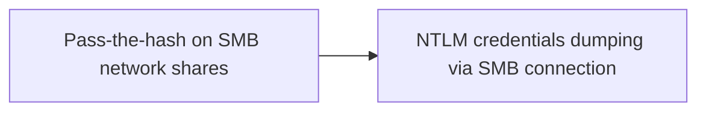

# Pass-the-hash on SMB network shares

## Metadata

- **UUID**: `5ea50181-1124-49aa-9d2c-c74103e86fd5`
- **Schema**: `threat::1.0`
- **TLP**: clear

## Description
In a **Pass-the-Hash attack (PtH)**, Attackers may use offensive tools to load 
the NTLM hash and try to connect to SMB network shares that are reachable 
from the attacker device (SMB port is open to the internet - initial access) 
or from a compromised station under attacker's control - lateral movement. 

Crackmapexec is an excellent tool to try to connect to SMB network 
shares using NTLM hash (PtH).  

It scales really well as you can simply point and shoot at a whole 
subnet or list of IP addresses.  

Attacker may obtain read-only access to SMB network shares and could retrieve 
additional information.  

They may get write access to the share and then be able to drop files 
that victims might be enticed to open or to execute.

## Techniques
- T1003.001
- T1550.002
- T1021.002

## Chaining

