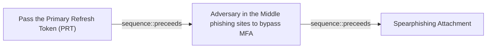

# Pass the Primary Refresh Token (PRT)

## Metadata

- **UUID**: `b1b6d2d7-0832-46fc-a3e5-6e6411179c45`
- **Schema**: `threat::1.0`
- **Version**: `1`
- **Created**: `2025-06-30`
- **Modified**: `2025-06-30`
- **TLP**: clear (`TLP:CLEAR`)
- **Organisation**: EC DIGIT CSOC (`56b0a0f0-b0bc-47d9-bb46-02f80ae2065a`)

## References
### Public
- **1**: [https://blog.netwrix.com/2023/05/13/pass-the-prt-overview/](https://blog.netwrix.com/2023/05/13/pass-the-prt-overview/)
- **2**: [https://informationsecuritybuzz.com/azure-lateral-movement-pass-the-prt/](https://informationsecuritybuzz.com/azure-lateral-movement-pass-the-prt/)
- **3**: [https://www.netwrix.com/pass-the-primary-refresh-token-attack.html](https://www.netwrix.com/pass-the-primary-refresh-token-attack.html)

## Description
Pass-the-PRT (Primary Refresh Token) is an advanced cyberattack technique targeting 
cloud environments, particularly Microsoft Entra ID (formerly Azure AD). It enables 
attackers to bypass MFA and move laterally within cloud infrastructures by stealing
and exploiting valid authentication tokens.

### What is a Primary Refresh Token (PRT)?
A PRT is a persistent authentication token issued when a user logs into an Azure-joined 
or hybrid Azure-joined Windows 10+ device. It enables single sign-on (SSO) to Azure 
AD resources without reauthentication. Key characteristics:
- **Validity**: 14–90 days, depending on usage.
- **Storage**: Securely stored in the device’s LSASS memory and protected by the 
Trusted Platform Module (TPM).
- **Function**: Contains user identity, session keys, and MFA claims, allowing seamless 
access to cloud resources like Microsoft 365.

### How Pass-the-PRT Works
Attackers execute this attack in three stages:

1. **Initial Compromise**:  
  Gain access to a victim’s device via phishing, malware, or exploits. Local admin 
  privileges are typically required.

2. **PRT Extraction**:  
  Extract the PRT and associated session key using tools like:
  - **Mimikatz** (`sekurlsa::cloudap` module).
  - **AADInternals PowerShell** (e.g., `Get-AADIntUserPRTToken`).
  - **BrowserCore.exe** (to steal the `x-ms-RefreshTokenCredential` cookie).

3. **Lateral Movement**:  
  Use the stolen PRT to:
  - Generate valid PRT cookies for browsers (Chrome/Edge).
  - Request access tokens for Azure AD resources without triggering MFA.
  - Move laterally across cloud applications and data as the compromised user.

### Key Risks and Challenges
- **MFA Bypass**: PRTs embed MFA claims, allowing attackers to bypass conditional 
access policies.
- **Stealth**: Attacks mimic legitimate user activity, evading traditional security 
tools.
- **Persistence**: PRTs remain valid for weeks, enabling prolonged access even if 
passwords change.

## Criticality
**High** - A High priority incident is likely to result in a demonstrable impact to public health or safety, national security, economic security, foreign relations, civil liberties, or public confidence.

## Terrain
> **Adversaries need initial access to a device that has a Primary Refresh Token (PRT) 
issued to a legitimate user. Specifically, this means compromising a Windows 10 
or newer device that is Azure AD-joined or hybrid Azure AD-joined and on which the 
user has logged in, thus generating a PRT.

Domains: Public Cloud, Enterprise, SaaS
Targets: Cloud Storage Accounts, Identity Services, API Endpoints, Cloud Portal, Serverless, Virtual Machines, Server Authentication
Platforms: Azure, Windows, Azure AD, Office 365**

## Threat Assessment
| Dimension | Assessment | Description |
| --- | --- | --- |
| Severity | Significant incident | A cyber attack which has a serious impact on a large organisation or on wider / local government, or which poses a considerable risk to central government or (inter)national essential services. |
| Impact | Data Breach; IP Loss; Reputational Damages; Identity Theft; Monetary Loss; Lose Capabilities; Business disruption | - |
| Leverage | Spoofing; Tampering; Elevation of privilege; Information Disclosure; Modify configuration; Modify privileges | - |
| Viability | Likely | Probable (probably) - 55-80% |

## ATT&CK Techniques
| Technique | Name | Description |
| --- | --- | --- |
| `T1134` | [Access Token Manipulation](https://attack.mitre.org/techniques/T1134) | Adversaries may modify access tokens to operate under a different user or system security context to perform actions and bypass access controls. Windows uses access tokens to determine the ownership of a running process. A user can manipulate access tokens to make a running process appear as though it is the child of a different process or belongs to someone other than the user that started the process. When this occurs, the process also takes on the security context associated with the new token.  An adversary can use built-in Windows API functions to copy access tokens from existing processes; this is known as token stealing. These token can then be applied to an existing process (i.e. [Token Impersonation/Theft](https://attack.mitre.org/techniques/T1134/001)) or used to spawn a new process (i.e. [Create Process with Token](https://attack.mitre.org/techniques/T1134/002)). An adversary must already be in a privileged user context (i.e. administrator) to steal a token. However, adversaries commonly use token stealing to elevate their security context from the administrator level to the SYSTEM level. An adversary can then use a token to authenticate to a remote system as the account for that token if the account has appropriate permissions on the remote system.(Citation: Pentestlab Token Manipulation)  Any standard user can use the <code>runas</code> command, and the Windows API functions, to create impersonation tokens; it does not require access to an administrator account. There are also other mechanisms, such as Active Directory fields, that can be used to modify access tokens. |
| `T1539` | [Steal Web Session Cookie](https://attack.mitre.org/techniques/T1539) | An adversary may steal web application or service session cookies and use them to gain access to web applications or Internet services as an authenticated user without needing credentials. Web applications and services often use session cookies as an authentication token after a user has authenticated to a website.  Cookies are often valid for an extended period of time, even if the web application is not actively used. Cookies can be found on disk, in the process memory of the browser, and in network traffic to remote systems. Additionally, other applications on the targets machine might store sensitive authentication cookies in memory (e.g. apps which authenticate to cloud services). Session cookies can be used to bypasses some multi-factor authentication protocols.(Citation: Pass The Cookie)  There are several examples of malware targeting cookies from web browsers on the local system.(Citation: Kaspersky TajMahal April 2019)(Citation: Unit 42 Mac Crypto Cookies January 2019) Adversaries may also steal cookies by injecting malicious JavaScript content into websites or relying on [User Execution](https://attack.mitre.org/techniques/T1204) by tricking victims into running malicious JavaScript in their browser.(Citation: Talos Roblox Scam 2023)(Citation: Krebs Discord Bookmarks 2023)  There are also open source frameworks such as `Evilginx2` and `Muraena` that can gather session cookies through a malicious proxy (e.g., [Adversary-in-the-Middle](https://attack.mitre.org/techniques/T1557)) that can be set up by an adversary and used in phishing campaigns.(Citation: Github evilginx2)(Citation: GitHub Mauraena)  After an adversary acquires a valid cookie, they can then perform a [Web Session Cookie](https://attack.mitre.org/techniques/T1550/004) technique to login to the corresponding web application. |
| `T1550.004` | [Use Alternate Authentication Material: Web Session Cookie](https://attack.mitre.org/techniques/T1550/004) | Adversaries can use stolen session cookies to authenticate to web applications and services. This technique bypasses some multi-factor authentication protocols since the session is already authenticated.(Citation: Pass The Cookie)  Authentication cookies are commonly used in web applications, including cloud-based services, after a user has authenticated to the service so credentials are not passed and re-authentication does not need to occur as frequently. Cookies are often valid for an extended period of time, even if the web application is not actively used. After the cookie is obtained through [Steal Web Session Cookie](https://attack.mitre.org/techniques/T1539) or [Web Cookies](https://attack.mitre.org/techniques/T1606/001), the adversary may then import the cookie into a browser they control and is then able to use the site or application as the user for as long as the session cookie is active. Once logged into the site, an adversary can access sensitive information, read email, or perform actions that the victim account has permissions to perform.  There have been examples of malware targeting session cookies to bypass multi-factor authentication systems.(Citation: Unit 42 Mac Crypto Cookies January 2019) |

## Chaining

### Chaining details
#### preceeds -> Adversary in the Middle phishing sites to bypass MFA (`sequence::preceeds`)
Gain access to user's device via phishing link.

- **Target UUID**: `66aafb61-9a46-4287-8b40-4785b42b77a3`
#### preceeds -> Spearphishing Attachment (`sequence::preceeds`)
Gain access to user's device via malware distributed on email attachment.

- **Target UUID**: `dd5d942c-bac4-4000-b9a6-ca4fef6cfb84`
