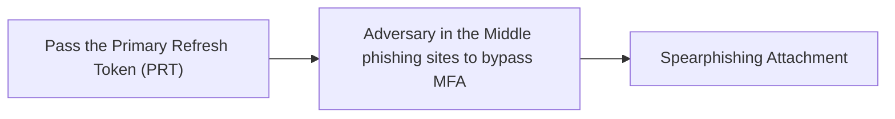

# Pass the Primary Refresh Token (PRT)

## Metadata

- **UUID**: `b1b6d2d7-0832-46fc-a3e5-6e6411179c45`
- **Schema**: `threat::1.0`
- **TLP**: clear

## Description
Pass-the-PRT (Primary Refresh Token) is an advanced cyberattack technique targeting 
cloud environments, particularly Microsoft Entra ID (formerly Azure AD). It enables 
attackers to bypass MFA and move laterally within cloud infrastructures by stealing
and exploiting valid authentication tokens.

### What is a Primary Refresh Token (PRT)?
A PRT is a persistent authentication token issued when a user logs into an Azure-joined 
or hybrid Azure-joined Windows 10+ device. It enables single sign-on (SSO) to Azure 
AD resources without reauthentication. Key characteristics:
- **Validity**: 14–90 days, depending on usage.
- **Storage**: Securely stored in the device’s LSASS memory and protected by the 
Trusted Platform Module (TPM).
- **Function**: Contains user identity, session keys, and MFA claims, allowing seamless 
access to cloud resources like Microsoft 365.

### How Pass-the-PRT Works
Attackers execute this attack in three stages:

1. **Initial Compromise**:  
  Gain access to a victim’s device via phishing, malware, or exploits. Local admin 
  privileges are typically required.

2. **PRT Extraction**:  
  Extract the PRT and associated session key using tools like:
  - **Mimikatz** (`sekurlsa::cloudap` module).
  - **AADInternals PowerShell** (e.g., `Get-AADIntUserPRTToken`).
  - **BrowserCore.exe** (to steal the `x-ms-RefreshTokenCredential` cookie).

3. **Lateral Movement**:  
  Use the stolen PRT to:
  - Generate valid PRT cookies for browsers (Chrome/Edge).
  - Request access tokens for Azure AD resources without triggering MFA.
  - Move laterally across cloud applications and data as the compromised user.

### Key Risks and Challenges
- **MFA Bypass**: PRTs embed MFA claims, allowing attackers to bypass conditional 
access policies.
- **Stealth**: Attacks mimic legitimate user activity, evading traditional security 
tools.
- **Persistence**: PRTs remain valid for weeks, enabling prolonged access even if 
passwords change.

## Techniques
- T1134
- T1539
- T1550.004

## Chaining

