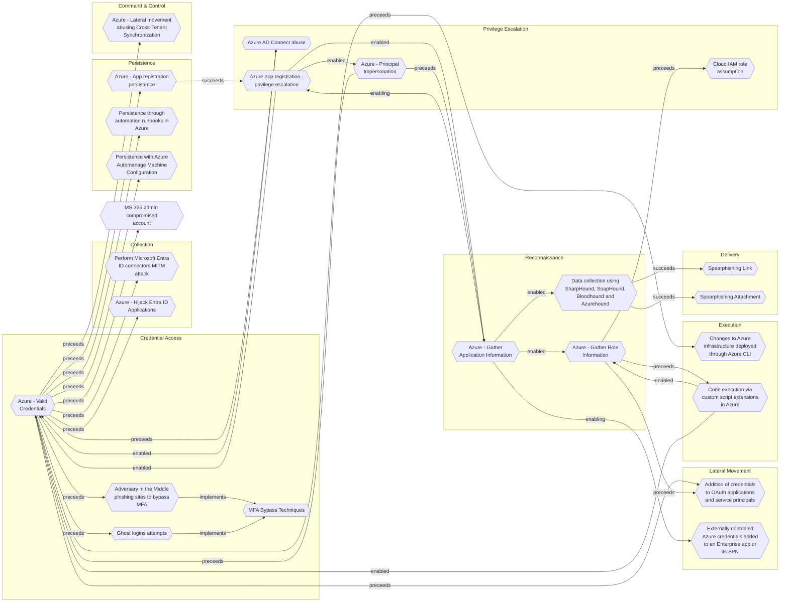

# Perform Microsoft Entra ID connectors MITM attack

## Metadata
| Field | Value |
| --- | --- |
| UUID | `f18be76e-f2b3-410a-80c5-d67e7b8e7b03` |
| Schema | `threat::1.0` |
| Version | `1` |
| Created | `2024-04-30` |
| Modified | `2024-04-30` |
| TLP | clear (`TLP:CLEAR`) |
| Organisation | EC DIGIT CSOC (`56b0a0f0-b0bc-47d9-bb46-02f80ae2065a`) |

## References
### Public
- **1**: [https://learn.microsoft.com/en-us/entra/identity/hybrid/connect/how-to-connect-pta-security-deep-dive](https://learn.microsoft.com/en-us/entra/identity/hybrid/connect/how-to-connect-pta-security-deep-dive)
- **2**: [https://learn.microsoft.com/en-us/entra/global-secure-access/concept-connectors](https://learn.microsoft.com/en-us/entra/global-secure-access/concept-connectors)

## Description
These connectors facilitate outbound connections to the Microsoft Entra Private 
Access and application proxy services. They must be installed on a Windows Server 
with access to backend resources. Connectors can be organized into groups to handle 
traffic to specific resources, enhancing management and optimization.  

The risks of man-in-the-middle attacks on Microsoft Entra ID connectors include the 
interception of sensitive information such as authentication tokens, usernames, passwords, 
and authentication artifacts like session cookies. Adversaries can capture this data, 
mimic legitimate users, and potentially bypass multifactor authentication requirements. 
This poses a significant threat to data confidentiality, integrity, and privacy within 
the Microsoft Entra ecosystem. 

Likewise, common techniques used in man-in-the-middle attacks on Microsoft Entra ID connectors include:

- Phishing Attacks
- Session Hijacking
- DNS Spoofing
- OAuth Application Manipulation
- DNS-over-HTTPS
- Cookie Theft
- Business Email Compromise (BEC) Attacks

## Criticality
**High** - A High priority incident is likely to result in a demonstrable impact to public health or safety, national security, economic security, foreign relations, civil liberties, or public confidence.

## Terrain
The threat actors would need to access the credentials of the users or administrators 
interacting with the connectors. This could be achieved through phishing techniques, 
social engineering, or other forms of credential theft.

## Surface
> **Microsoft::Microsoft 365**
> Microsoft 365 cloud-based productivity suite (formerly Office 365)

> **File Sharing**
> Cloud file sharing and storage services

> **Azure**
> Microsoft Azure cloud platform

> **Windows::Desktop**
> Microsoft Windows desktop editions

> **Microsoft::System Center**
> Microsoft System Center enterprise management suite

> **AWS::Compute::EC2**
> Amazon Elastic Compute Cloud (virtual servers)

> **Web Servers**
> HTTP servers and reverse proxies

## Threat Assessment
| Dimension | Assessment | Description |
| --- | --- | --- |
| Severity | Significant incident | A cyber attack which has a serious impact on a large organisation or on wider / local government, or which poses a considerable risk to central government or (inter)national essential services. |
| Impact | Data Breach Identity Theft IP Loss Reputational Damages | Non-public information has been accessed from the outside, and successfully extracted. Acquisition of sufficient information and privileges to profess as a given individual, for the purpose of abusing and deceiving human trust relationships. Particular, key data, information and blueprint conducive to the organization capability to gain and retain a commercial or geopolitical advantage has been accessed, and their content potentially used by competitors or other adversaries. Damages to the organization public view may be achieved by using directly the access gained, or indirectly with data gathered. |
| Leverage | Information Disclosure Infrastructure Compromise | Threat action intending to read a file that one was not granted access to, or to read data in transit. The compromised target is likely to be used to further expand the sphere of influence of the attacker and allow more potent vectors to be executed. |
| Viability | Likely | Probable (probably) - 55-80% |
| Kill Chain | Collection | Techniques used to identify and gather data from a target network prior to exfiltration. |

## ATT&CK Techniques
| Technique | Name | Description |
| --- | --- | --- |
| `T1557` | [Adversary-in-the-Middle](https://attack.mitre.org/techniques/T1557) | Adversaries may attempt to position themselves between two or more networked devices using an adversary-in-the-middle (AiTM) technique to support follow-on behaviors such as [Network Sniffing](https://attack.mitre.org/techniques/T1040), [Transmitted Data Manipulation](https://attack.mitre.org/techniques/T1565/002), or replay attacks ([Exploitation for Credential Access](https://attack.mitre.org/techniques/T1212)). By abusing features of common networking protocols that can determine the flow of network traffic (e.g. ARP, DNS, LLMNR, etc.), adversaries may force a device to communicate through an adversary controlled system so they can collect information or perform additional actions.(Citation: Rapid7 MiTM Basics)  For example, adversaries may manipulate victim DNS settings to enable other malicious activities such as preventing/redirecting users from accessing legitimate sites and/or pushing additional malware.(Citation: ttint_rat)(Citation: dns_changer_trojans)(Citation: ad_blocker_with_miner) Adversaries may also manipulate DNS and leverage their position in order to intercept user credentials, including access tokens ([Steal Application Access Token](https://attack.mitre.org/techniques/T1528)) and session cookies ([Steal Web Session Cookie](https://attack.mitre.org/techniques/T1539)).(Citation: volexity_0day_sophos_FW)(Citation: Token tactics) [Downgrade Attack](https://attack.mitre.org/techniques/T1562/010)s can also be used to establish an AiTM position, such as by negotiating a less secure, deprecated, or weaker version of communication protocol (SSL/TLS) or encryption algorithm.(Citation: mitm_tls_downgrade_att)(Citation: taxonomy_downgrade_att_tls)(Citation: tlseminar_downgrade_att)  Adversaries may also leverage the AiTM position to attempt to monitor and/or modify traffic, such as in [Transmitted Data Manipulation](https://attack.mitre.org/techniques/T1565/002). Adversaries can setup a position similar to AiTM to prevent traffic from flowing to the appropriate destination, potentially to [Impair Defenses](https://attack.mitre.org/techniques/T1562) and/or in support of a [Network Denial of Service](https://attack.mitre.org/techniques/T1498). |

## Chaining

