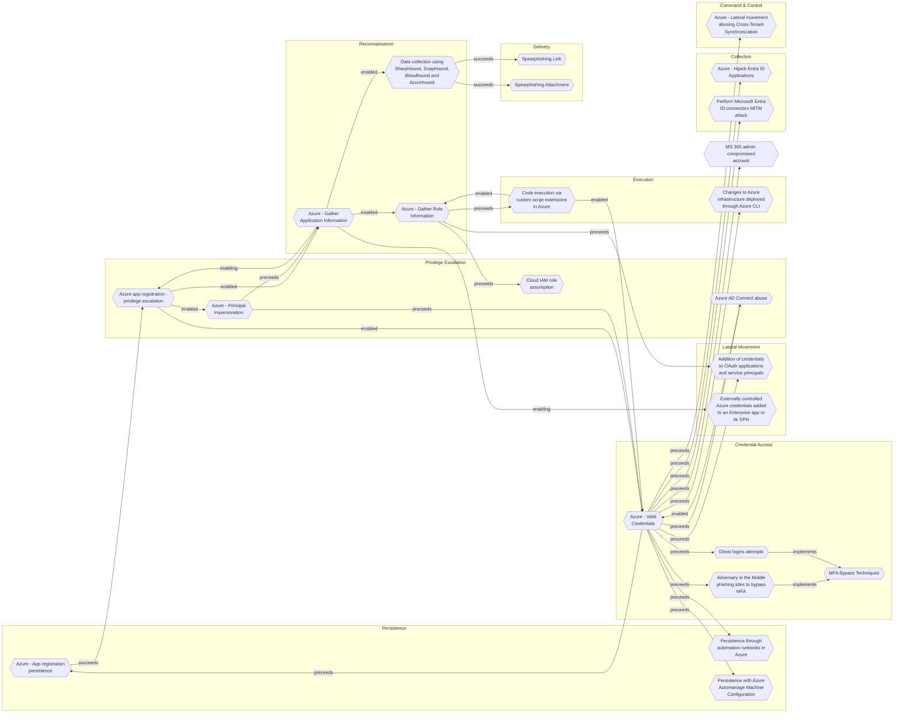

# Persistence through automation runbooks in Azure

## Metadata
| Field | Value |
| --- | --- |
| UUID | `50c7e353-ac1c-48a7-8c98-2515b45f31f4` |
| Schema | `threat::1.0` |
| Version | `1` |
| Created | `2025-05-20` |
| Modified | `2025-05-21` |
| TLP | clear (`TLP:CLEAR`) |
| Organisation | EC DIGIT CSOC (`56b0a0f0-b0bc-47d9-bb46-02f80ae2065a`) |

## References
### Public
- **1**: [https://www.secforce.com/blog/azure-persistence-and-detection/](https://www.secforce.com/blog/azure-persistence-and-detection/)
- **2**: [https://www.netspi.com/blog/technical-blog/cloud-pentesting/maintaining-azure-persistence-via-automation-accounts/](https://www.netspi.com/blog/technical-blog/cloud-pentesting/maintaining-azure-persistence-via-automation-accounts/)
- **3**: [https://learn.microsoft.com/en-us/azure/automation/automation-runbook-execution](https://learn.microsoft.com/en-us/azure/automation/automation-runbook-execution)

## Description
Persistence through automation runbooks in Azure is a robust and often-overlooked 
technique that allows attackers to maintain privileged access in cloud environments 
by leveraging Azure Automation Accounts and their associated runbooks.

### Attack Flow and Techniques

**1. Attack Lifecycle**  
- The attacker compromises an Azure account or system and escalates privileges, 
often to Global Administrator.
- After initial access is revoked or remediated, the attacker uses Automation Accounts 
to regain or maintain access to the Azure tenant.

**2. Runbook Creation and Modification**  
- Attackers create a new Automation Account with excessive privileges (such as "User Administrator" or "Subscription Owner") 
or leverage an existing one.
- A malicious runbook (typically a PowerShell script) is uploaded or an existing runbook is modified. These scripts can:
  - Create new Azure AD users or service principals with high privileges.
  - Deploy payloads (e.g., Cobalt Strike beacons) on Azure VMs.
  - Mimic legitimate processes through naming conventions (e.g., "SplunkDev" for Automation Account, "AzureAutomationMonitor" for runbook).

**3. Webhook Integration**  
- The malicious runbook is linked to a webhook, enabling remote execution via HTTP 
POST requests without direct authentication.
- This allows attackers to regain access on demand, even after their original accounts 
are removed.

**4. Privilege Retention and Escalation**  
- Automation Accounts are configured with password or certificate-based authentication, 
providing multiple avenues for re-entry.
- Attackers may assign or retain excessive permissions to ensure the malicious runbook 
can escalate privileges or create new backdoor accounts.

**5. Hybrid Runbook Workers**  
- Attackers may use Hybrid Runbook Workers, which run outside Azure’s sandbox and 
are not subject to the same execution time limits. This allows for more complex 
or long-running malicious tasks.

**6. Backdooring Packages and Runtime Environments**  
- Beyond runbooks, attackers can backdoor the packages and runtime environments 
(modules and Python packages) that support Automation Accounts. Malicious code can 
be embedded in these components, providing even deeper persistence.

## Criticality
**High** - A High priority incident is likely to result in a demonstrable impact to public health or safety, national security, economic security, foreign relations, civil liberties, or public confidence.

## Terrain
Adversaries must have compromised credentials or accounts with sufficient permissions 
to create or modify Automation Accounts and runbooks. This typically means access 
to roles like Owner, Contributor, or Automation Operator within the Azure subscription 
or resource group.

## Surface
> **Azure**
> Microsoft Azure cloud platform

> **Azure::Security::Entra ID**
> Microsoft Entra ID in Azure (cloud identity)

> **Windows**
> Microsoft Windows operating systems (all versions)

> **Linux**
> Linux-based operating systems (all distributions)

> **AWS::Storage**
> AWS storage services

> **Entra ID**
> Microsoft Entra ID (formerly Azure Active Directory)

> **Orchestration::Kubernetes**
> Kubernetes container orchestration platform

> **Web Servers**
> HTTP servers and reverse proxies

> **Azure::Compute::Virtual Machines**
> Azure Virtual Machines

> **Serverless**
> Cloud-agnostic serverless compute (when not provider-specific)

> **Application Layer::HTTP**
> Hypertext Transfer Protocol

> **AWS::Compute::EC2**
> Amazon Elastic Compute Cloud (virtual servers)

> **Database Management::PostgreSQL**
> PostgreSQL open-source relational database

> **Database Management::MongoDB**
> MongoDB NoSQL document database

> **Kerberos**
> Kerberos network authentication protocol

## Threat Assessment
| Dimension | Assessment | Description |
| --- | --- | --- |
| Severity | Significant incident | A cyber attack which has a serious impact on a large organisation or on wider / local government, or which poses a considerable risk to central government or (inter)national essential services. |
| Impact | Data Breach IP Loss Reputational Damages Identity Theft Competitive disadvantage Lose Capabilities | Non-public information has been accessed from the outside, and successfully extracted. Particular, key data, information and blueprint conducive to the organization capability to gain and retain a commercial or geopolitical advantage has been accessed, and their content potentially used by competitors or other adversaries. Damages to the organization public view may be achieved by using directly the access gained, or indirectly with data gathered. Acquisition of sufficient information and privileges to profess as a given individual, for the purpose of abusing and deceiving human trust relationships. Loss of competitive advantage Vector execution will remove key functions to the organization, which will not be easily circumvented. Most day-to-day is heavily impaired, but processes can reorganize at a loss. |
| Leverage | Spoofing Tampering Repudiation Infrastructure Compromise Information Disclosure Elevation of privilege New Accounts Modify configuration Modify privileges Modify data Software installation | Threat action aimed at accessing and use of another user’s credentials, such as username and password. Threat action intending to maliciously change or modify persistent data, such as records in a database, and the alteration of data in transit between two computers over an open network, such as the Internet. Threat action aimed at performing prohibited operations in a system that lacks the ability to trace the operations. The compromised target is likely to be used to further expand the sphere of influence of the attacker and allow more potent vectors to be executed. Threat action intending to read a file that one was not granted access to, or to read data in transit. Capacity to augment leverage over the target system by upgrading the compromised access rights Ability to create new arbitrary user accounts. Modify configuration or services Modify privileges or permissions Modify stored data or content Software installation or code modification |
| Viability | Likely | Probable (probably) - 55-80% |
| Kill Chain | Persistence | Any access, action or change to a system that gives an attacker persistent presence on the system. |

## ATT&CK Techniques
| Technique | Name | Description |
| --- | --- | --- |
| `T1098` | [Account Manipulation](https://attack.mitre.org/techniques/T1098) | Adversaries may manipulate accounts to maintain and/or elevate access to victim systems. Account manipulation may consist of any action that preserves or modifies adversary access to a compromised account, such as modifying credentials or permission groups.(Citation: FireEye SMOKEDHAM June 2021) These actions could also include account activity designed to subvert security policies, such as performing iterative password updates to bypass password duration policies and preserve the life of compromised credentials.   In order to create or manipulate accounts, the adversary must already have sufficient permissions on systems or the domain. However, account manipulation may also lead to privilege escalation where modifications grant access to additional roles, permissions, or higher-privileged [Valid Accounts](https://attack.mitre.org/techniques/T1078). |
| `T1204` | [User Execution](https://attack.mitre.org/techniques/T1204) | An adversary may rely upon specific actions by a user in order to gain execution. Users may be subjected to social engineering to get them to execute malicious code by, for example, opening a malicious document file or link. These user actions will typically be observed as follow-on behavior from forms of [Phishing](https://attack.mitre.org/techniques/T1566).  While [User Execution](https://attack.mitre.org/techniques/T1204) frequently occurs shortly after Initial Access it may occur at other phases of an intrusion, such as when an adversary places a file in a shared directory or on a user's desktop hoping that a user will click on it. This activity may also be seen shortly after [Internal Spearphishing](https://attack.mitre.org/techniques/T1534).  Adversaries may also deceive users into performing actions such as:  * Enabling [Remote Access Tools](https://attack.mitre.org/techniques/T1219), allowing direct control of the system to the adversary * Running malicious JavaScript in their browser, allowing adversaries to [Steal Web Session Cookie](https://attack.mitre.org/techniques/T1539)s(Citation: Talos Roblox Scam 2023)(Citation: Krebs Discord Bookmarks 2023) * Downloading and executing malware for [User Execution](https://attack.mitre.org/techniques/T1204) * Coerceing users to copy, paste, and execute malicious code manually(Citation: Reliaquest-execution)(Citation: proofpoint-selfpwn)  For example, tech support scams can be facilitated through [Phishing](https://attack.mitre.org/techniques/T1566), vishing, or various forms of user interaction. Adversaries can use a combination of these methods, such as spoofing and promoting toll-free numbers or call centers that are used to direct victims to malicious websites, to deliver and execute payloads containing malware or [Remote Access Tools](https://attack.mitre.org/techniques/T1219).(Citation: Telephone Attack Delivery) |

## Chaining

