# Persistence with Azure Automanage Machine Configuration

## Metadata
| Field | Value |
| --- | --- |
| UUID | `23f6a192-a25d-48b8-a235-7bb55e483682` |
| Schema | `threat::1.0` |
| Version | `2` |
| Created | `2022-04-28` |
| Modified | `2023-01-06` |
| TLP | clear (`TLP:CLEAR`) |
| Organisation | EC DIGIT CSOC (`56b0a0f0-b0bc-47d9-bb46-02f80ae2065a`) |

## References
### Public
- **1**: [https://cloudbrothers.info/azure-persistence-azure-policy-guest-configuration/#:~:text=Azure%20Policy%20enables%20administrators%20to,configuration%20feature%20of%20Azure%20Policy.](https://cloudbrothers.info/azure-persistence-azure-policy-guest-configuration/#:~:text=Azure%20Policy%20enables%20administrators%20to,configuration%20feature%20of%20Azure%20Policy.)

## Description
Azure Policy enables administrators to define, enforce and remediate
configuration standards on Azure resources and even on non Azure assets
using Azure Arc. One key feature, that was released in 2021, is the
guest configuration feature of Azure Policy. Azure Policy Guest 
Configuration is now called Azure Automanage Machine Configuration. 

Adversaries may use this functionality to gain persistence in an Azure 
environment if they have gained the necessary permissions within the 
subscription. And since Azure VMs are in many cases directly integrated 
in the on-Premises Active Directory it is possible to gain additional 
access there.

## Criticality
**Medium** - A Medium priority incident may affect public health or safety, national security, economic security, foreign relations, civil liberties, or public confidence.

## Terrain
The adversary needs the owner access role on the targeted Azure 
Subscription to apply the Azure Policy and grant permissions for
the system-managed identities.

## Surface
> **Azure**
> Microsoft Azure cloud platform

> **Azure::Compute::Virtual Machines**
> Azure Virtual Machines

## Threat Assessment
| Dimension | Assessment | Description |
| --- | --- | --- |
| Severity | Significant incident | A cyber attack which has a serious impact on a large organisation or on wider / local government, or which poses a considerable risk to central government or (inter)national essential services. |
| Impact | Business disruption Data Breach Impairement | Business disruption Non-public information has been accessed from the outside, and successfully extracted. Incapacitation of a particular key system that will cause disruptions in day-to-day operations, and eventually service delivery. |
| Leverage | Infrastructure Compromise Dwelling Modify privileges | The compromised target is likely to be used to further expand the sphere of influence of the attacker and allow more potent vectors to be executed. Active or passive extended presence in the target, which performs adversarial operations continuously. Modify privileges or permissions |
| Viability | Likely | Probable (probably) - 55-80% |
| Kill Chain | Persistence | Any access, action or change to a system that gives an attacker persistent presence on the system. |

## ATT&CK Techniques
| Technique | Name | Description |
| --- | --- | --- |
| `T1484.001` | [Domain or Tenant Policy Modification: Group Policy Modification](https://attack.mitre.org/techniques/T1484/001) | Adversaries may modify Group Policy Objects (GPOs) to subvert the intended discretionary access controls for a domain, usually with the intention of escalating privileges on the domain. Group policy allows for centralized management of user and computer settings in Active Directory (AD). GPOs are containers for group policy settings made up of files stored within a predictable network path `\<DOMAIN>\SYSVOL\<DOMAIN>\Policies\`.(Citation: TechNet Group Policy Basics)(Citation: ADSecurity GPO Persistence 2016)   Like other objects in AD, GPOs have access controls associated with them. By default all user accounts in the domain have permission to read GPOs. It is possible to delegate GPO access control permissions, e.g. write access, to specific users or groups in the domain.  Malicious GPO modifications can be used to implement many other malicious behaviors such as [Scheduled Task/Job](https://attack.mitre.org/techniques/T1053), [Disable or Modify Tools](https://attack.mitre.org/techniques/T1562/001), [Ingress Tool Transfer](https://attack.mitre.org/techniques/T1105), [Create Account](https://attack.mitre.org/techniques/T1136), [Service Execution](https://attack.mitre.org/techniques/T1569/002),  and more.(Citation: ADSecurity GPO Persistence 2016)(Citation: Wald0 Guide to GPOs)(Citation: Harmj0y Abusing GPO Permissions)(Citation: Mandiant M Trends 2016)(Citation: Microsoft Hacking Team Breach) Since GPOs can control so many user and machine settings in the AD environment, there are a great number of potential attacks that can stem from this GPO abuse.(Citation: Wald0 Guide to GPOs)  For example, publicly available scripts such as <code>New-GPOImmediateTask</code> can be leveraged to automate the creation of a malicious [Scheduled Task/Job](https://attack.mitre.org/techniques/T1053) by modifying GPO settings, in this case modifying <code>&lt;GPO_PATH&gt;\Machine\Preferences\ScheduledTasks\ScheduledTasks.xml</code>.(Citation: Wald0 Guide to GPOs)(Citation: Harmj0y Abusing GPO Permissions) In some cases an adversary might modify specific user rights like SeEnableDelegationPrivilege, set in <code>&lt;GPO_PATH&gt;\MACHINE\Microsoft\Windows NT\SecEdit\GptTmpl.inf</code>, to achieve a subtle AD backdoor with complete control of the domain because the user account under the adversary's control would then be able to modify GPOs.(Citation: Harmj0y SeEnableDelegationPrivilege Right) |

## Chaining

```mermaid
flowchart LR
subgraph "Persistence"
23f6a192_a25d_48b8_a235_7bb55e483682{{"Persistence with Azure<br>Automanage Machine<br>Configuration"}}
37f24c48_4a38_4682_aa76_5845ed2d6890{{"Azure - Policy with<br>DeployIfNotExists<br>definition"}}
5d43ef75_4637_4a75_b1ed_6716052cff0e{{"Azure - App registration<br>persistence"}}
50c7e353_ac1c_48a7_8c98_2515b45f31f4{{"Persistence through<br>automation runbooks in<br>Azure"}}
end
subgraph "Execution"
4d9cc646_debc_477b_93cb_4ea74c47c02c{{"Azure - Managed Device<br>Scripting"}}
61ddc240_e5a6_4ca8_ae77_6b471b498913{{"Code execution via<br>custom script extensions<br>in Azure"}}
0815bc77_169d_4320_aa32_770cf062509a{{"Azure - Unmanaged<br>Scripting"}}
60c5b065_7d06_4697_850f_c2f80765f10b{{"Changes to Azure<br>infrastructure deployed<br>through Azure CLI"}}
3435c5fd_1069_40ee_ae79_54c672ce454d{{"Azure - Virtual Machine<br>Scripting"}}
end
subgraph "Reconnaissance"
140907eb_c9fb_4330_9d71_656422388b2b{{"Azure - Gather Role<br>Information"}}
b1593e0b_1b3b_462d_9ab6_21d1c136469d{{"Azure - Gather Resource<br>Data"}}
fe6827f2_efb4_43b3_9ca3_b7d417111b32{{"Azure - Gather<br>Application Information"}}
53063205_4404_4e6d_a2f5_d566c6085d96{{"Data collection using<br>SharpHound, SoapHound,<br>Bloodhound and<br>Azurehound"}}
end
subgraph "Credential Access"
2743bf18_3b86_4721_bf3e_153dcda0b149{{"Azure - Valid<br>Credentials"}}
b6543cff_2e86_4fe6_afb7_6d3595188190{{"Azure - Steal Service<br>Principal Certificate"}}
66aafb61_9a46_4287_8b40_4785b42b77a3{{"Adversary in the Middle<br>phishing sites to bypass<br>MFA"}}
6e988fa7_69c9_4aef_897c_a34fa5066dac{{"Ghost logins attempts"}}
4a807ac4_f764_41b1_ae6f_94239041d349{{"MFA Bypass Techniques"}}
end
subgraph "Privilege Escalation"
bb2501d5_99c7_44a6_ac5a_9510102d6611{{"Azure - Principal<br>Impersonation"}}
c698fc79_3ed6_44a7_a9d7_bc447600e4c3{{"Azure AD Connect abuse"}}
f1dc4341_eb45_4d07_8075_b1a6b227cc76{{"Cloud IAM role<br>assumption"}}
c7e260d8_d391_41eb_be1a_7f276c99b383{{"Azure app registration -<br>privilege escalation"}}
end
subgraph "Lateral Movement"
a8c7b250_a2d4_4a0d_82f8_23dc99c77d7b{{"Addition of credentials<br>to OAuth applications<br>and service principals"}}
ca2751c7_8641_4fb0_a90b_30c5987015dc{{"Externally controlled<br>Azure credentials added<br>to an Enterprise app or<br>its SPN"}}
9bb31c65_8abd_48fc_afe3_8aca76109737{{"Azure - Modify<br>federation trust to<br>accept externally signed<br>tokens"}}
end
subgraph "Collection"
78d5e363_14db_40c0_a1c4_4ba02a3e60d4{{"Azure - Hijack Entra ID<br>Applications"}}
f18be76e_f2b3_410a_80c5_d67e7b8e7b03{{"Perform Microsoft Entra<br>ID connectors MITM<br>attack"}}
end
subgraph "Command & Control"
2fd1cddb_c66d_4a99_9779_31e32b67495e{{"Azure - Lateral movement<br>abusing Cross-Tenant<br>Synchronization"}}
end
subgraph "Delivery"
8934c19a_954b_4dce_8081_0a6acca599f6{{"Malicious container<br>image deployed"}}
1a68b5eb_0112_424d_a21f_88dda0b6b8df{{"Spearphishing Link"}}
dd5d942c_bac4_4000_b9a6_ca4fef6cfb84{{"Spearphishing Attachment"}}
end
b954303c_0ad0_4dc0_b5ca_492c3de9cd53{{"Collecting sensitive<br>information via custom<br>script extensions"}}
20bd3620_b13b_4895_b291_b1a26bd9aef3{{"MS 365 admin compromised<br>account"}}
4d9cc646_debc_477b_93cb_4ea74c47c02c -->|preceeds| 23f6a192_a25d_48b8_a235_7bb55e483682
4d9cc646_debc_477b_93cb_4ea74c47c02c -->|preceeds| 61ddc240_e5a6_4ca8_ae77_6b471b498913
4d9cc646_debc_477b_93cb_4ea74c47c02c -->|succeeds| 140907eb_c9fb_4330_9d71_656422388b2b
4d9cc646_debc_477b_93cb_4ea74c47c02c -->|succeeds| b1593e0b_1b3b_462d_9ab6_21d1c136469d
4d9cc646_debc_477b_93cb_4ea74c47c02c -->|succeeds| 2743bf18_3b86_4721_bf3e_153dcda0b149
37f24c48_4a38_4682_aa76_5845ed2d6890 -->|preceeds| 23f6a192_a25d_48b8_a235_7bb55e483682
37f24c48_4a38_4682_aa76_5845ed2d6890 -->|preceeds| 2743bf18_3b86_4721_bf3e_153dcda0b149
37f24c48_4a38_4682_aa76_5845ed2d6890 -->|preceeds| 61ddc240_e5a6_4ca8_ae77_6b471b498913
37f24c48_4a38_4682_aa76_5845ed2d6890 -->|preceeds| b954303c_0ad0_4dc0_b5ca_492c3de9cd53
37f24c48_4a38_4682_aa76_5845ed2d6890 -->|enabled| fe6827f2_efb4_43b3_9ca3_b7d417111b32
37f24c48_4a38_4682_aa76_5845ed2d6890 -->|enabled| b1593e0b_1b3b_462d_9ab6_21d1c136469d
37f24c48_4a38_4682_aa76_5845ed2d6890 -->|enabled| 53063205_4404_4e6d_a2f5_d566c6085d96
b6543cff_2e86_4fe6_afb7_6d3595188190 -->|preceeds| 23f6a192_a25d_48b8_a235_7bb55e483682
b6543cff_2e86_4fe6_afb7_6d3595188190 -->|preceeds| 61ddc240_e5a6_4ca8_ae77_6b471b498913
b6543cff_2e86_4fe6_afb7_6d3595188190 -->|succeeds| 140907eb_c9fb_4330_9d71_656422388b2b
b6543cff_2e86_4fe6_afb7_6d3595188190 -->|succeeds| b1593e0b_1b3b_462d_9ab6_21d1c136469d
b6543cff_2e86_4fe6_afb7_6d3595188190 -->|succeeds| 2743bf18_3b86_4721_bf3e_153dcda0b149
b6543cff_2e86_4fe6_afb7_6d3595188190 -->|enabled| bb2501d5_99c7_44a6_ac5a_9510102d6611
b6543cff_2e86_4fe6_afb7_6d3595188190 -->|enabled| 53063205_4404_4e6d_a2f5_d566c6085d96
b6543cff_2e86_4fe6_afb7_6d3595188190 -->|enabled| a8c7b250_a2d4_4a0d_82f8_23dc99c77d7b
0815bc77_169d_4320_aa32_770cf062509a -->|preceeds| 23f6a192_a25d_48b8_a235_7bb55e483682
0815bc77_169d_4320_aa32_770cf062509a -->|preceeds| 61ddc240_e5a6_4ca8_ae77_6b471b498913
0815bc77_169d_4320_aa32_770cf062509a -->|preceeds| b954303c_0ad0_4dc0_b5ca_492c3de9cd53
0815bc77_169d_4320_aa32_770cf062509a -->|succeeds| 140907eb_c9fb_4330_9d71_656422388b2b
0815bc77_169d_4320_aa32_770cf062509a -->|succeeds| b1593e0b_1b3b_462d_9ab6_21d1c136469d
0815bc77_169d_4320_aa32_770cf062509a -->|succeeds| 2743bf18_3b86_4721_bf3e_153dcda0b149
2743bf18_3b86_4721_bf3e_153dcda0b149 -->|preceeds| 23f6a192_a25d_48b8_a235_7bb55e483682
2743bf18_3b86_4721_bf3e_153dcda0b149 -->|preceeds| a8c7b250_a2d4_4a0d_82f8_23dc99c77d7b
2743bf18_3b86_4721_bf3e_153dcda0b149 -->|preceeds| 66aafb61_9a46_4287_8b40_4785b42b77a3
2743bf18_3b86_4721_bf3e_153dcda0b149 -->|preceeds| c698fc79_3ed6_44a7_a9d7_bc447600e4c3
2743bf18_3b86_4721_bf3e_153dcda0b149 -->|preceeds| 5d43ef75_4637_4a75_b1ed_6716052cff0e
2743bf18_3b86_4721_bf3e_153dcda0b149 -->|preceeds| 60c5b065_7d06_4697_850f_c2f80765f10b
2743bf18_3b86_4721_bf3e_153dcda0b149 -->|preceeds| 6e988fa7_69c9_4aef_897c_a34fa5066dac
2743bf18_3b86_4721_bf3e_153dcda0b149 -->|preceeds| 78d5e363_14db_40c0_a1c4_4ba02a3e60d4
2743bf18_3b86_4721_bf3e_153dcda0b149 -->|preceeds| 2fd1cddb_c66d_4a99_9779_31e32b67495e
2743bf18_3b86_4721_bf3e_153dcda0b149 -->|preceeds| 20bd3620_b13b_4895_b291_b1a26bd9aef3
2743bf18_3b86_4721_bf3e_153dcda0b149 -->|preceeds| f18be76e_f2b3_410a_80c5_d67e7b8e7b03
2743bf18_3b86_4721_bf3e_153dcda0b149 -->|preceeds| 50c7e353_ac1c_48a7_8c98_2515b45f31f4
3435c5fd_1069_40ee_ae79_54c672ce454d -->|preceeds| 23f6a192_a25d_48b8_a235_7bb55e483682
3435c5fd_1069_40ee_ae79_54c672ce454d -->|preceeds| 61ddc240_e5a6_4ca8_ae77_6b471b498913
3435c5fd_1069_40ee_ae79_54c672ce454d -->|preceeds| b954303c_0ad0_4dc0_b5ca_492c3de9cd53
3435c5fd_1069_40ee_ae79_54c672ce454d -->|preceeds| 8934c19a_954b_4dce_8081_0a6acca599f6
3435c5fd_1069_40ee_ae79_54c672ce454d -->|succeeds| 140907eb_c9fb_4330_9d71_656422388b2b
3435c5fd_1069_40ee_ae79_54c672ce454d -->|succeeds| b1593e0b_1b3b_462d_9ab6_21d1c136469d
3435c5fd_1069_40ee_ae79_54c672ce454d -->|succeeds| 2743bf18_3b86_4721_bf3e_153dcda0b149
140907eb_c9fb_4330_9d71_656422388b2b -->|preceeds| a8c7b250_a2d4_4a0d_82f8_23dc99c77d7b
140907eb_c9fb_4330_9d71_656422388b2b -->|preceeds| 61ddc240_e5a6_4ca8_ae77_6b471b498913
140907eb_c9fb_4330_9d71_656422388b2b -->|preceeds| f1dc4341_eb45_4d07_8075_b1a6b227cc76
61ddc240_e5a6_4ca8_ae77_6b471b498913 -->|enabled| 140907eb_c9fb_4330_9d71_656422388b2b
61ddc240_e5a6_4ca8_ae77_6b471b498913 -->|enabled| 2743bf18_3b86_4721_bf3e_153dcda0b149
66aafb61_9a46_4287_8b40_4785b42b77a3 -->|implements| 4a807ac4_f764_41b1_ae6f_94239041d349
c698fc79_3ed6_44a7_a9d7_bc447600e4c3 -->|enabled| 2743bf18_3b86_4721_bf3e_153dcda0b149
5d43ef75_4637_4a75_b1ed_6716052cff0e -->|succeeds| c7e260d8_d391_41eb_be1a_7f276c99b383
c7e260d8_d391_41eb_be1a_7f276c99b383 -->|enabled| bb2501d5_99c7_44a6_ac5a_9510102d6611
c7e260d8_d391_41eb_be1a_7f276c99b383 -->|enabled| 2743bf18_3b86_4721_bf3e_153dcda0b149
c7e260d8_d391_41eb_be1a_7f276c99b383 -->|enabled| fe6827f2_efb4_43b3_9ca3_b7d417111b32
bb2501d5_99c7_44a6_ac5a_9510102d6611 -->|preceeds| 2743bf18_3b86_4721_bf3e_153dcda0b149
bb2501d5_99c7_44a6_ac5a_9510102d6611 -->|preceeds| fe6827f2_efb4_43b3_9ca3_b7d417111b32
6e988fa7_69c9_4aef_897c_a34fa5066dac -->|implements| 4a807ac4_f764_41b1_ae6f_94239041d349
fe6827f2_efb4_43b3_9ca3_b7d417111b32 -->|enabled| 140907eb_c9fb_4330_9d71_656422388b2b
fe6827f2_efb4_43b3_9ca3_b7d417111b32 -->|enabled| 53063205_4404_4e6d_a2f5_d566c6085d96
fe6827f2_efb4_43b3_9ca3_b7d417111b32 -->|enabling| ca2751c7_8641_4fb0_a90b_30c5987015dc
fe6827f2_efb4_43b3_9ca3_b7d417111b32 -->|enabling| c7e260d8_d391_41eb_be1a_7f276c99b383
53063205_4404_4e6d_a2f5_d566c6085d96 -->|succeeds| 1a68b5eb_0112_424d_a21f_88dda0b6b8df
53063205_4404_4e6d_a2f5_d566c6085d96 -->|succeeds| dd5d942c_bac4_4000_b9a6_ca4fef6cfb84
b1593e0b_1b3b_462d_9ab6_21d1c136469d -->|succeeds| 66aafb61_9a46_4287_8b40_4785b42b77a3
b1593e0b_1b3b_462d_9ab6_21d1c136469d -->|succeeds| 9bb31c65_8abd_48fc_afe3_8aca76109737
```

