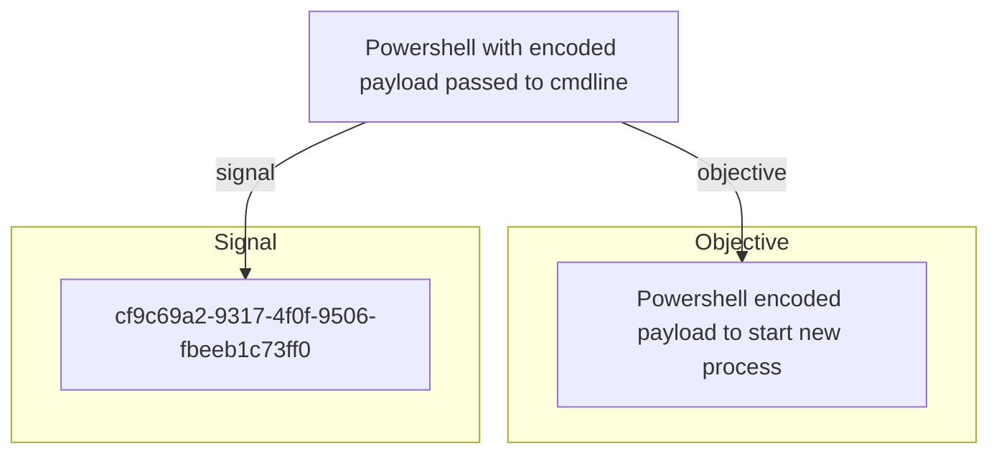

# Powershell with encoded payload passed to cmdline

## Metadata

- **UUID**: `bdc58fee-8da6-4fc9-8fbd-30f8fd156bc7`
- **Schema**: `threat::1.0`
- **Version**: `1`
- **Created**: `2024-04-23`
- **Modified**: `2024-04-24`
- **TLP**: clear (`TLP:CLEAR`)
- **Organisation**: EC DIGIT CSOC (`56b0a0f0-b0bc-47d9-bb46-02f80ae2065a`)

## References
### Public
- **1**: [https://mikefrobbins.com/2017/06/15/simple-obfuscation-with-powershell-using-base64-encoding/](https://mikefrobbins.com/2017/06/15/simple-obfuscation-with-powershell-using-base64-encoding/)
- **2**: [https://stackoverflow.com/questions/6295957/using-powershell-encodedcommand-to-pass-parameters](https://stackoverflow.com/questions/6295957/using-powershell-encodedcommand-to-pass-parameters)
- **3**: [https://www.systanddeploy.com/2021/01/encode-script-or-command-to-base64-and.html](https://www.systanddeploy.com/2021/01/encode-script-or-command-to-base64-and.html)

## Description
When working with PowerShell, a threat actor can encode a command or script
using Base64 or other type of encoding and pass it as a parameter to the
command line. This technique is useful for obfuscating sensitive
information or executing complex commands. (ref [1])   

The malicious document contains a macro which, upon execution,
creates a batch script at C:\Users\public\new[.]bat with the
following content:  

powershell -exec bypass -noP -w hidden -nonI -enc"{string}" del %0;

Other possible examples for encoding with PowerShell commands: 

Encoding a Command with Base64

1. Create a command as a string. 

$command = 'dir "C:\Program Files"'

2. Convert the command to Base64:

$bytes = [System.Text.Encoding]::Unicode.GetBytes($command)
$encodedCommand = [Convert]::ToBase64String($bytes)

Now you can run the encoded command using powershell.exe:

powershell.exe -encodedCommand $encodedCommand

It's also possible to encode domain names, for example: 

Powershell input:

[Convert]::ToBase64String([System.Text.Encoding]::Unicode.GetBytes("'sample_domain.com'"))

Threat actors also use PowerShell scripts for faster encoding process and result.  

An example of Powershell script (ref [2])  

param(
[Parameter()][Alias("un")][string]$Username,
[Parameter()][Alias("pw")][string]$Password
)

Write-Host "Username: $Username"
Write-Host "Password: $Password"

## Criticality
**Medium** - A Medium priority incident may affect public health or safety, national security, economic security, foreign relations, civil liberties, or public confidence.

## Terrain
> **A threat actors need an initial access to the system to use PowerShell
console to execute commands to obfuscate their traffic and activities.

Domains: Enterprise, Private Cloud, Public Cloud
Targets: Remote access, Workstations, Desktop
Platforms: PowerShell, Windows**

## Threat Assessment
| Dimension | Assessment | Description |
| --- | --- | --- |
| Severity | Localised incident | A cyber attack on an individual, or preliminary indications of cyber activity against a small or medium-sized organisation. |
| Impact | Impairement | Incapacitation of a particular key system that will cause disruptions in day-to-day operations, and eventually service delivery. |
| Leverage | Dwelling; Tampering | - |
| Viability | Likely | Probable (probably) - 55-80% |
| Kill Chain | Defense Evasion | Techniques an attacker may specifically use for evading detection or avoiding other defenses. |

## Actors
| Actor | ID | Source | Description |
| --- | --- | --- | --- |
| [[Enterprise] APT28](https://attack.mitre.org/groups/G0007) | `att&ck::G0007` | ('att&ck',) | [APT28](https://attack.mitre.org/groups/G0007) is a threat group that has been attributed to Russia's General Staff Main Intelligence Directorate (GRU) 85th Main Special Service Center (GTsSS) military unit 26165.(Citation: NSA/FBI Drovorub August 2020)(Citation: Cybersecurity Advisory GRU Brute Force Campaign July 2021) This group has been active since at least 2004.(Citation: DOJ GRU Indictment Jul 2018)(Citation: Ars Technica GRU indictment Jul 2018)(Citation: Crowdstrike DNC June 2016)(Citation: FireEye APT28)(Citation: SecureWorks TG-4127)(Citation: FireEye APT28 January 2017)(Citation: GRIZZLY STEPPE JAR)(Citation: Sofacy DealersChoice)(Citation: Palo Alto Sofacy 06-2018)(Citation: Symantec APT28 Oct 2018)(Citation: ESET Zebrocy May 2019)  [APT28](https://attack.mitre.org/groups/G0007) reportedly compromised the Hillary Clinton campaign, the Democratic National Committee, and the Democratic Congressional Campaign Committee in 2016 in an attempt to interfere with the U.S. presidential election.(Citation: Crowdstrike DNC June 2016) In 2018, the US indicted five GRU Unit 26165 officers associated with [APT28](https://attack.mitre.org/groups/G0007) for cyber operations (including close-access operations) conducted between 2014 and 2018 against the World Anti-Doping Agency (WADA), the US Anti-Doping Agency, a US nuclear facility, the Organization for the Prohibition of Chemical Weapons (OPCW), the Spiez Swiss Chemicals Laboratory, and other organizations.(Citation: US District Court Indictment GRU Oct 2018) Some of these were conducted with the assistance of GRU Unit 74455, which is also referred to as [Sandworm Team](https://attack.mitre.org/groups/G0034). |
| APT28 | `misp::5b4ee3ea-eee3-4c8e-8323-85ae32658754` | ('misp',) | The Sofacy Group (also known as APT28, Pawn Storm, Fancy Bear and Sednit) is a cyber espionage group believed to have ties to the Russian government. Likely operating since 2007, the group is known to target government, military, and security organizations. It has been characterized as an advanced persistent threat. |
| [[Enterprise] Threat Group-3390](https://attack.mitre.org/groups/G0027) | `att&ck::G0027` | ('att&ck',) | [Threat Group-3390](https://attack.mitre.org/groups/G0027) is a Chinese threat group that has extensively used strategic Web compromises to target victims.(Citation: Dell TG-3390) The group has been active since at least 2010 and has targeted organizations in the aerospace, government, defense, technology, energy, manufacturing and gambling/betting sectors.(Citation: SecureWorks BRONZE UNION June 2017)(Citation: Securelist LuckyMouse June 2018)(Citation: Trend Micro DRBControl February 2020) |
| APT27 | `misp::834e0acd-d92a-4e38-bb14-dc4159d7cb32` | ('misp',) | A China-based actor that targets foreign embassies to collect data on government, defence, and technology sectors. |

## ATT&CK Techniques
| Technique | Name | Description |
| --- | --- | --- |
| `T1027.010` | [Obfuscated Files or Information: Command Obfuscation](https://attack.mitre.org/techniques/T1027/010) | Adversaries may obfuscate content during command execution to impede detection. Command-line obfuscation is a method of making strings and patterns within commands and scripts more difficult to signature and analyze. This type of obfuscation can be included within commands executed by delivered payloads (e.g., [Phishing](https://attack.mitre.org/techniques/T1566) and [Drive-by Compromise](https://attack.mitre.org/techniques/T1189)) or interactively via [Command and Scripting Interpreter](https://attack.mitre.org/techniques/T1059).(Citation: Akamai JS)(Citation: Malware Monday VBE)  For example, adversaries may abuse syntax that utilizes various symbols and escape characters (such as spacing,  `^`, `+`. `$`, and `%`) to make commands difficult to analyze while maintaining the same intended functionality.(Citation: RC PowerShell) Many languages support built-in obfuscation in the form of base64 or URL encoding.(Citation: Microsoft PowerShellB64) Adversaries may also manually implement command obfuscation via string splitting (`“Wor”+“d.Application”`), order and casing of characters (`rev <<<'dwssap/cte/ tac'`), globing (`mkdir -p '/tmp/:&$NiA'`), as well as various tricks involving passing strings through tokens/environment variables/input streams.(Citation: Bashfuscator Command Obfuscators)(Citation: FireEye Obfuscation June 2017)  Adversaries may also use tricks such as directory traversals to obfuscate references to the binary being invoked by a command (`C:\voi\pcw\..\..\Windows\tei\qs\k\..\..\..\system32\erool\..\wbem\wg\je\..\..\wmic.exe shadowcopy delete`).(Citation: Twitter Richard WMIC)  Tools such as <code>Invoke-Obfuscation</code> and <code>Invoke-DOSfucation</code> have also been used to obfuscate commands.(Citation: Invoke-DOSfuscation)(Citation: Invoke-Obfuscation) |
| `T1059` | [Command and Scripting Interpreter](https://attack.mitre.org/techniques/T1059) | Adversaries may abuse command and script interpreters to execute commands, scripts, or binaries. These interfaces and languages provide ways of interacting with computer systems and are a common feature across many different platforms. Most systems come with some built-in command-line interface and scripting capabilities, for example, macOS and Linux distributions include some flavor of [Unix Shell](https://attack.mitre.org/techniques/T1059/004) while Windows installations include the [Windows Command Shell](https://attack.mitre.org/techniques/T1059/003) and [PowerShell](https://attack.mitre.org/techniques/T1059/001).  There are also cross-platform interpreters such as [Python](https://attack.mitre.org/techniques/T1059/006), as well as those commonly associated with client applications such as [JavaScript](https://attack.mitre.org/techniques/T1059/007) and [Visual Basic](https://attack.mitre.org/techniques/T1059/005).  Adversaries may abuse these technologies in various ways as a means of executing arbitrary commands. Commands and scripts can be embedded in [Initial Access](https://attack.mitre.org/tactics/TA0001) payloads delivered to victims as lure documents or as secondary payloads downloaded from an existing C2. Adversaries may also execute commands through interactive terminals/shells, as well as utilize various [Remote Services](https://attack.mitre.org/techniques/T1021) in order to achieve remote Execution.(Citation: Powershell Remote Commands)(Citation: Cisco IOS Software Integrity Assurance - Command History)(Citation: Remote Shell Execution in Python) |
| `T1059.001` | [Command and Scripting Interpreter: PowerShell](https://attack.mitre.org/techniques/T1059/001) | Adversaries may abuse PowerShell commands and scripts for execution. PowerShell is a powerful interactive command-line interface and scripting environment included in the Windows operating system.(Citation: TechNet PowerShell) Adversaries can use PowerShell to perform a number of actions, including discovery of information and execution of code. Examples include the <code>Start-Process</code> cmdlet which can be used to run an executable and the <code>Invoke-Command</code> cmdlet which runs a command locally or on a remote computer (though administrator permissions are required to use PowerShell to connect to remote systems).  PowerShell may also be used to download and run executables from the Internet, which can be executed from disk or in memory without touching disk.  A number of PowerShell-based offensive testing tools are available, including [Empire](https://attack.mitre.org/software/S0363),  [PowerSploit](https://attack.mitre.org/software/S0194), [PoshC2](https://attack.mitre.org/software/S0378), and PSAttack.(Citation: Github PSAttack)  PowerShell commands/scripts can also be executed without directly invoking the <code>powershell.exe</code> binary through interfaces to PowerShell's underlying <code>System.Management.Automation</code> assembly DLL exposed through the .NET framework and Windows Common Language Interface (CLI).(Citation: Sixdub PowerPick Jan 2016)(Citation: SilentBreak Offensive PS Dec 2015)(Citation: Microsoft PSfromCsharp APR 2014) |
| `T1140` | [Deobfuscate/Decode Files or Information](https://attack.mitre.org/techniques/T1140) | Adversaries may use [Obfuscated Files or Information](https://attack.mitre.org/techniques/T1027) to hide artifacts of an intrusion from analysis. They may require separate mechanisms to decode or deobfuscate that information depending on how they intend to use it. Methods for doing that include built-in functionality of malware or by using utilities present on the system.  One such example is the use of [certutil](https://attack.mitre.org/software/S0160) to decode a remote access tool portable executable file that has been hidden inside a certificate file.(Citation: Malwarebytes Targeted Attack against Saudi Arabia) Another example is using the Windows <code>copy /b</code> or <code>type</code> command to reassemble binary fragments into a malicious payload.(Citation: Carbon Black Obfuscation Sept 2016)(Citation: Sentinel One Tainted Love 2023)  Sometimes a user's action may be required to open it for deobfuscation or decryption as part of [User Execution](https://attack.mitre.org/techniques/T1204). The user may also be required to input a password to open a password protected compressed/encrypted file that was provided by the adversary.(Citation: Volexity PowerDuke November 2016) |
| `T1068` | [Exploitation for Privilege Escalation](https://attack.mitre.org/techniques/T1068) | Adversaries may exploit software vulnerabilities in an attempt to elevate privileges. Exploitation of a software vulnerability occurs when an adversary takes advantage of a programming error in a program, service, or within the operating system software or kernel itself to execute adversary-controlled code. Security constructs such as permission levels will often hinder access to information and use of certain techniques, so adversaries will likely need to perform privilege escalation to include use of software exploitation to circumvent those restrictions.  When initially gaining access to a system, an adversary may be operating within a lower privileged process which will prevent them from accessing certain resources on the system. Vulnerabilities may exist, usually in operating system components and software commonly running at higher permissions, that can be exploited to gain higher levels of access on the system. This could enable someone to move from unprivileged or user level permissions to SYSTEM or root permissions depending on the component that is vulnerable. This could also enable an adversary to move from a virtualized environment, such as within a virtual machine or container, onto the underlying host. This may be a necessary step for an adversary compromising an endpoint system that has been properly configured and limits other privilege escalation methods.  Adversaries may bring a signed vulnerable driver onto a compromised machine so that they can exploit the vulnerability to execute code in kernel mode. This process is sometimes referred to as Bring Your Own Vulnerable Driver (BYOVD).(Citation: ESET InvisiMole June 2020)(Citation: Unit42 AcidBox June 2020) Adversaries may include the vulnerable driver with files delivered during Initial Access or download it to a compromised system via [Ingress Tool Transfer](https://attack.mitre.org/techniques/T1105) or [Lateral Tool Transfer](https://attack.mitre.org/techniques/T1570). |

## Relations

