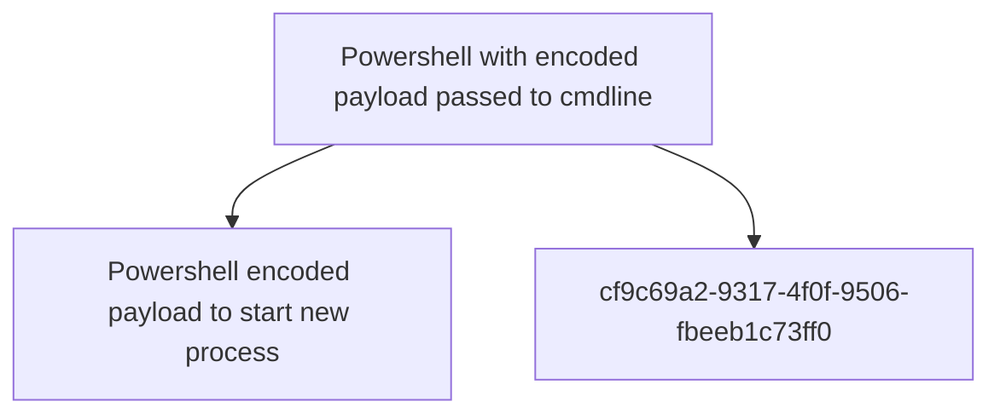

# Powershell with encoded payload passed to cmdline

## Metadata

- **UUID**: `bdc58fee-8da6-4fc9-8fbd-30f8fd156bc7`
- **Schema**: `threat::1.0`
- **TLP**: clear

## Description
When working with PowerShell, a threat actor can encode a command or script
using Base64 or other type of encoding and pass it as a parameter to the
command line. This technique is useful for obfuscating sensitive
information or executing complex commands. (ref [1])   

The malicious document contains a macro which, upon execution,
creates a batch script at C:\Users\public\new[.]bat with the
following content:  

powershell -exec bypass -noP -w hidden -nonI -enc"{string}" del %0;

Other possible examples for encoding with PowerShell commands: 

Encoding a Command with Base64

1. Create a command as a string. 

$command = 'dir "C:\Program Files"'

2. Convert the command to Base64:

$bytes = [System.Text.Encoding]::Unicode.GetBytes($command)
$encodedCommand = [Convert]::ToBase64String($bytes)

Now you can run the encoded command using powershell.exe:

powershell.exe -encodedCommand $encodedCommand

It's also possible to encode domain names, for example: 

Powershell input:

[Convert]::ToBase64String([System.Text.Encoding]::Unicode.GetBytes("'sample_domain.com'"))

Threat actors also use PowerShell scripts for faster encoding process and result.  

An example of Powershell script (ref [2])  

param(
[Parameter()][Alias("un")][string]$Username,
[Parameter()][Alias("pw")][string]$Password
)

Write-Host "Username: $Username"
Write-Host "Password: $Password"

## Techniques
- T1027.010
- T1059
- T1059.001
- T1140
- T1068

## Relations

