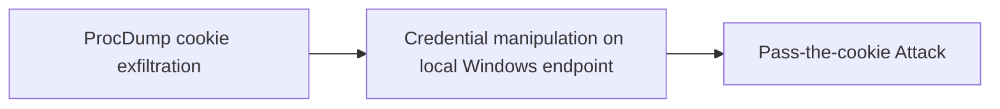

# ProcDump cookie exfiltration

## Metadata

- **UUID**: `e8761933-3137-41f7-bf7a-2687cac68524`
- **Schema**: `threat::1.0`
- **TLP**: clear

## Description
Cookies can be found on disk and also in process memory. Additionally other 
applications on the targets machine might store sensitive authentication
tokens in memory (e.g. apps which authenticate to cloud services). 

ProcDump is a Sysinternal tool to dump strings from any process.

Using the example of the Firefox browser, an attacker can steal the browser 
cookies via ProcDump following the steps below:

  - Acquire the cookie from the user browser via process dump.
  - Exfiltrate the necessary authentication cookies.
  - Open Firefox on the attackers machine.
  - Navigate to the resource to access (the domain the cookie is valid for).
  - Use the Developer Console and set the cookie via document.cookie=“key=value”.

## Techniques
- T1111

## Chaining

