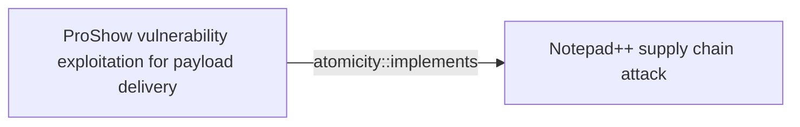
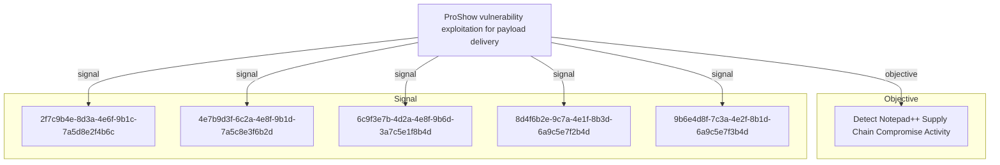

# ProShow vulnerability exploitation for payload delivery

## Metadata

- **UUID**: `23d06aa7-f6d5-44ee-be8f-e6de2f495bd9`
- **Schema**: `threat::1.0`
- **Version**: `1`
- **Created**: `2026-02-09`
- **Modified**: `2026-02-09`
- **TLP**: clear (`TLP:CLEAR`)
- **Organisation**: EC DIGIT CSOC (`56b0a0f0-b0bc-47d9-bb46-02f80ae2065a`)

## References
### Public
- **1**: [https://securelist.com/notepad-supply-chain-attack/115382/](https://securelist.com/notepad-supply-chain-attack/115382/)
- **2**: [https://www.rapid7.com/blog/post/2026/02/03/notepad-plus-plus-supply-chain-compromise/](https://www.rapid7.com/blog/post/2026/02/03/notepad-plus-plus-supply-chain-compromise/)

## Description
## Executive Summary

Threat actors exploited a legacy vulnerability in ProShow software to achieve code 
execution and deliver malicious payloads. This technique was observed in Chain #1 
of the Notepad++ supply chain attack (July-August 2025), demonstrating how attackers 
leverage old, known vulnerabilities to bypass modern security controls while avoiding 
heavily-monitored techniques like DLL side-loading.

## Technical Analysis

### Attack Mechanism

The exploitation leverages ProShow.exe (a legitimate binary) in combination with a 
specially crafted file named "load" placed in the %appdata%\ProShow directory. The 
attack flow proceeds as follows:

1. **File Deployment**: Malicious installer drops ProShow.exe and supporting files to %appdata%\ProShow\
2. **Vulnerability Trigger**: ProShow.exe processes the malicious "load" file
3. **Exploit Execution**: The "load" file contains a two-stage shellcode payload
4. **Payload Delivery**: Decrypted shellcode executes Metasploit downloader
5. **C2 Establishment**: Downloader retrieves Cobalt Strike Beacon from remote infrastructure

### File System Artifacts

Files dropped to %appdata%\ProShow\ directory:

**Legitimate Component**:
- ProShow.exe (SHA1: defb05d5a91e4920c9e22de2d81c5dc9b95a9a7c)

**Supporting Files** (potentially benign):
- defscr (SHA1: 259cd3542dea998c57f67ffdd4543ab836e3d2a3)
- if.dnt (SHA1: 46654a7ad6bc809b623c51938954de48e27a5618)
- proshow.crs (SHA1: da39a3ee5e6b4b0d3255bfef95601890afd80709)
- proshow.phd (SHA1: da39a3ee5e6b4b0d3255bfef95601890afd80709)
- proshow_e.bmp (SHA1: 9df6ecc47b192260826c247bf8d40384aa6e6fd6)

**Malicious Exploit Payload**:
- load (SHA1: 06a6a5a39193075734a32e0235bde0e979c27228) - Contains exploit shellcode

### Exploit Payload Structure

The "load" file demonstrates sophisticated anti-analysis techniques:

1. **Fake Shellcode Header**: Meaningless instructions at the beginning designed to 
   confuse automated analysis tools and security researchers

2. **Real Shellcode Body**: Hidden in the middle of the file, this contains the actual 
   exploit code that decrypts and executes the Metasploit downloader payload

3. **Decryption Routine**: The shellcode includes embedded decryption logic to unpack 
   the final payload at runtime

### Network Communication

After successful exploitation, the Metasploit downloader retrieves Cobalt Strike Beacon from:

**Primary Infrastructure**:
```
https://45.77.31[.]210/users/admin
```

**Backup Infrastructure**:
```
https://cdncheck.it[.]com/users/admin
```

**User-Agent String**:
```
Mozilla/5.0 (Windows NT 10.0; Win64; x64) AppleWebKit/537.36 (KHTML, like Gecko) Chrome/138.0.0.0 Safari/537.36
```

### Command and Control (C2) Infrastructure

Once Cobalt Strike Beacon is deployed, it establishes C2 communications with:

**Primary C2 Endpoints**:
```
https://45.77.31[.]210/api/update/v1
https://45.77.31[.]210/api/FileUpload/submit
```

**Secondary C2 Endpoints**:
```
https://cdncheck.it[.]com/api/update/v1
https://cdncheck.it[.]com/api/Metadata/submit
```

## Indicators of Compromise (IOCs)

### File Hashes (SHA1)

```
defb05d5a91e4920c9e22de2d81c5dc9b95a9a7c - ProShow.exe (legitimate)
259cd3542dea998c57f67ffdd4543ab836e3d2a3 - defscr
46654a7ad6bc809b623c51938954de48e27a5618 - if.dnt
da39a3ee5e6b4b0d3255bfef95601890afd80709 - proshow.crs
da39a3ee5e6b4b0d3255bfef95601890afd80709 - proshow.phd
9df6ecc47b192260826c247bf8d40384aa6e6fd6 - proshow_e.bmp
06a6a5a39193075734a32e0235bde0e979c27228 - load (MALICIOUS)
```

### Network Indicators

**Malicious IP Addresses**:
```
45.77.31.210
```

**Malicious Domains**:
```
cdncheck.it[.]com
```

**URLs**:
```
https://45.77.31[.]210/users/admin
https://cdncheck.it[.]com/users/admin
https://45.77.31[.]210/api/update/v1
https://45.77.31[.]210/api/FileUpload/submit
https://cdncheck.it[.]com/api/update/v1
https://cdncheck.it[.]com/api/Metadata/submit
```

### File System Indicators

**Suspicious Directory Creation**:
```
%appdata%\ProShow\
```

**Suspicious File Presence**:
```
%appdata%\ProShow\ProShow.exe
%appdata%\ProShow\load
%appdata%\ProShow\defscr
%appdata%\ProShow\if.dnt
%appdata%\ProShow\proshow.crs
%appdata%\ProShow\proshow.phd
%appdata%\ProShow\proshow_e.bmp
```

## Detection Opportunities

1. **File System Monitoring**:
   - Monitor for creation of %appdata%\ProShow\ directory
   - Alert on presence of "load" file in ProShow directory
   - Track ProShow.exe execution from non-standard locations

2. **Process Execution Monitoring**:
   - Detect ProShow.exe execution from %appdata% paths
   - Monitor for unusual child processes spawned by ProShow.exe
   - Track process injection behaviors following ProShow.exe execution

3. **Network Monitoring**:
   - Block/alert on connections to 45.77.31[.]210
   - Block/alert on connections to cdncheck.it[.]com
   - Monitor for Cobalt Strike Beacon C2 patterns
   - Detect suspicious User-Agent strings with high Chrome version numbers

4. **Memory Analysis**:
   - Scan for shellcode injection patterns in ProShow.exe process memory
   - Detect decryption routines executing within process space
   - Identify Metasploit framework signatures in memory

5. **Behavioral Detection**:
   - Alert on legacy software (ProShow) executing from AppData locations
   - Detect execution of outdated software versions with known vulnerabilities
   - Monitor for file read operations on files named "load"

## Mitigation Recommendations

### Immediate Actions

1. **Hunt for ProShow Components**:
   - Search all endpoints for %appdata%\ProShow\ directories
   - Identify and analyze any "load" files discovered
   - Check for ProShow.exe execution in non-standard locations

2. **Block Network Infrastructure**:
   - Block outbound connections to 45.77.31[.]210
   - Block outbound connections to cdncheck.it[.]com
   - Implement DNS sinkholing for malicious domains

3. **Isolate Compromised Systems**:
   - Quarantine any systems with ProShow artifacts in %appdata%
   - Perform full incident response procedures on affected hosts
   - Collect forensic images before remediation

### Long-term Measures

1. **Software Inventory and Vulnerability Management**:
   - Maintain comprehensive inventory of installed applications
   - Identify and remove legacy software with known vulnerabilities
   - Implement policy to prevent installation of outdated software versions
   - Regular vulnerability scanning for legacy application components

2. **Application Control**:
   - Implement application whitelisting to prevent execution of unauthorized binaries
   - Restrict execution from %appdata% and other user-writable locations
   - Deploy AppLocker or similar technologies to control executable paths

3. **Endpoint Detection and Response (EDR)**:
   - Deploy EDR solutions capable of detecting memory injection and shellcode execution
   - Enable behavioral monitoring for exploitation attempts
   - Implement Cobalt Strike detection signatures

4. **Network Security Controls**:
   - Deploy SSL/TLS inspection to detect malicious payloads in encrypted traffic
   - Implement threat intelligence feeds for known C2 infrastructure
   - Enable anomaly detection for unusual network behaviors

5. **Security Awareness**:
   - Educate users on risks of installing or retaining legacy software
   - Train security teams on exploitation techniques using legitimate binaries
   - Develop playbooks for responding to exploitation attempts

## MITRE ATT&CK Mapping

### T1203 - Exploitation for Client Execution
The attacker exploits a vulnerability in ProShow software to execute arbitrary code. 
The "load" file contains exploit shellcode that triggers the vulnerability when 
processed by the legitimate ProShow.exe binary, achieving initial code execution 
without requiring user interaction beyond the initial installer execution.

### T1055 - Process Injection
Following successful exploitation, the shellcode in the "load" file injects malicious 
code into the ProShow.exe process space. This process injection allows the attacker 
to execute the Metasploit downloader payload within the context of a legitimate process, 
evading detection mechanisms that focus on standalone malicious executables.

### T1105 - Ingress Tool Transfer
After establishing initial code execution, the Metasploit downloader retrieves the 
Cobalt Strike Beacon payload from remote infrastructure (45.77.31[.]210 and 
cdncheck.it[.]com). This demonstrates the ingress tool transfer technique where 
attackers download additional tools and payloads to the compromised system to 
enable further malicious activities.

## Threat Actor Tradecraft Analysis

### Sophistication Indicators

1. **Exploitation of Legacy Vulnerability**:
   - Demonstrates knowledge of old, less-monitored vulnerabilities
   - Avoids heavily-scrutinized techniques like DLL side-loading
   - Shows attacker adaptation to evolving defensive capabilities

2. **Anti-Analysis Techniques**:
   - Fake shellcode header to confuse automated analysis tools
   - Multi-stage payload decryption to hinder static analysis
   - Use of legitimate binary (ProShow.exe) to blend with normal activity

3. **Infrastructure Design**:
   - Multiple C2 servers for redundancy
   - Use of domains mimicking legitimate services (cdncheck, etc.)
   - Separated infrastructure for payload delivery vs. C2 operations

4. **Commercial-Grade Post-Exploitation**:
   - Use of Metasploit framework for payload staging
   - Deployment of Cobalt Strike Beacon for persistent access
   - Professional-grade tooling suggests well-resourced threat actor

## Risk Assessment

**Likelihood**: Medium
- Requires presence of ProShow software or components
- Exploitation relies on delivery mechanism (supply chain in observed case)
- Technique demonstrated in real-world attack

**Impact**: High
- Enables arbitrary code execution
- Facilitates deployment of sophisticated post-exploitation frameworks
- Provides platform for lateral movement and data exfiltration
- Difficult to detect using traditional signature-based methods

**Overall Risk**: High
- Confirmed exploitation in targeted supply chain attack
- Affects organizations with legacy software installations
- Requires enhanced detection and response capabilities

## References

- Kaspersky Securelist: "Notepad++ Supply Chain Attack" - Chain #1 Analysis (February 2026)
- Rapid7 Research: "ProShow Exploitation in Notepad++ Supply Chain Compromise" (February 2026)

## Conclusion

The ProShow vulnerability exploitation technique demonstrates that threat actors continue 
to leverage legacy vulnerabilities to achieve their objectives, particularly when more 
commonly-monitored techniques face increased detection. Organizations must maintain 
comprehensive software inventories, remove or isolate legacy applications, and implement 
behavioral detection capabilities to identify exploitation attempts even when using 
legitimate software components.

The successful use of this technique in a sophisticated supply chain attack underscores 
the importance of defense-in-depth strategies that don't rely solely on signature-based 
detection or assumption about attacker tool choices.

## Criticality
**High** - A High priority incident is likely to result in a demonstrable impact to public health or safety, national security, economic security, foreign relations, civil liberties, or public confidence.

## Terrain
> **Windows workstations and developer environments where ProShow software is installed 
or where legacy ProShow components remain present. The vulnerability in ProShow, 
dating back to the early 2010s, creates an exploitable attack surface when combined 
with specially crafted malicious files. This technique particularly affects systems 
with outdated or unmaintained software installations where security patches may not 
have been applied.

Surface: OS::Windows::Desktop**

## Threat Assessment
| Dimension | Assessment | Description |
| --- | --- | --- |
| Severity | Significant incident | A cyber attack which has a serious impact on a large organisation or on wider / local government, or which poses a considerable risk to central government or (inter)national essential services. |
| Impact | Lose Capabilities; Impairement; Business disruption; Data Breach | - |
| Leverage | Elevation of privilege; Tampering; Software installation | - |
| Viability | Almost certain | Nearly certain - 95-99% |
| Kill Chain | Exploitation | Techniques to exploit vulnerabilities in systems that may, amongst others, result in code execution. |

## ATT&CK Techniques
| Technique | Name | Description |
| --- | --- | --- |
| `T1203` | [Exploitation for Client Execution](https://attack.mitre.org/techniques/T1203) | Adversaries may exploit software vulnerabilities in client applications to execute code. Vulnerabilities can exist in software due to unsecure coding practices that can lead to unanticipated behavior. Adversaries can take advantage of certain vulnerabilities through targeted exploitation for the purpose of arbitrary code execution. Oftentimes the most valuable exploits to an offensive toolkit are those that can be used to obtain code execution on a remote system because they can be used to gain access to that system. Users will expect to see files related to the applications they commonly used to do work, so they are a useful target for exploit research and development because of their high utility.  Several types exist:  ### Browser-based Exploitation  Web browsers are a common target through [Drive-by Compromise](https://attack.mitre.org/techniques/T1189) and [Spearphishing Link](https://attack.mitre.org/techniques/T1566/002). Endpoint systems may be compromised through normal web browsing or from certain users being targeted by links in spearphishing emails to adversary controlled sites used to exploit the web browser. These often do not require an action by the user for the exploit to be executed.  ### Office Applications  Common office and productivity applications such as Microsoft Office are also targeted through [Phishing](https://attack.mitre.org/techniques/T1566). Malicious files will be transmitted directly as attachments or through links to download them. These require the user to open the document or file for the exploit to run.  ### Common Third-party Applications  Other applications that are commonly seen or are part of the software deployed in a target network may also be used for exploitation. Applications such as Adobe Reader and Flash, which are common in enterprise environments, have been routinely targeted by adversaries attempting to gain access to systems. Depending on the software and nature of the vulnerability, some may be exploited in the browser or require the user to open a file. For instance, some Flash exploits have been delivered as objects within Microsoft Office documents. |
| `T1055` | [Process Injection](https://attack.mitre.org/techniques/T1055) | Adversaries may inject code into processes in order to evade process-based defenses as well as possibly elevate privileges. Process injection is a method of executing arbitrary code in the address space of a separate live process. Running code in the context of another process may allow access to the process's memory, system/network resources, and possibly elevated privileges. Execution via process injection may also evade detection from security products since the execution is masked under a legitimate process.   There are many different ways to inject code into a process, many of which abuse legitimate functionalities. These implementations exist for every major OS but are typically platform specific.   More sophisticated samples may perform multiple process injections to segment modules and further evade detection, utilizing named pipes or other inter-process communication (IPC) mechanisms as a communication channel. |
| `T1105` | [Ingress Tool Transfer](https://attack.mitre.org/techniques/T1105) | Adversaries may transfer tools or other files from an external system into a compromised environment. Tools or files may be copied from an external adversary-controlled system to the victim network through the command and control channel or through alternate protocols such as [ftp](https://attack.mitre.org/software/S0095). Once present, adversaries may also transfer/spread tools between victim devices within a compromised environment (i.e. [Lateral Tool Transfer](https://attack.mitre.org/techniques/T1570)).   On Windows, adversaries may use various utilities to download tools, such as `copy`, `finger`, [certutil](https://attack.mitre.org/software/S0160), and [PowerShell](https://attack.mitre.org/techniques/T1059/001) commands such as <code>IEX(New-Object Net.WebClient).downloadString()</code> and <code>Invoke-WebRequest</code>. On Linux and macOS systems, a variety of utilities also exist, such as `curl`, `scp`, `sftp`, `tftp`, `rsync`, `finger`, and `wget`.(Citation: t1105_lolbas)  A number of these tools, such as `wget`, `curl`, and `scp`, also exist on ESXi. After downloading a file, a threat actor may attempt to verify its integrity by checking its hash value (e.g., via `certutil -hashfile`).(Citation: Google Cloud Threat Intelligence COSCMICENERGY 2023)  Adversaries may also abuse installers and package managers, such as `yum` or `winget`, to download tools to victim hosts. Adversaries have also abused file application features, such as the Windows `search-ms` protocol handler, to deliver malicious files to victims through remote file searches invoked by [User Execution](https://attack.mitre.org/techniques/T1204) (typically after interacting with [Phishing](https://attack.mitre.org/techniques/T1566) lures).(Citation: T1105: Trellix_search-ms)  Files can also be transferred using various [Web Service](https://attack.mitre.org/techniques/T1102)s as well as native or otherwise present tools on the victim system.(Citation: PTSecurity Cobalt Dec 2016) In some cases, adversaries may be able to leverage services that sync between a web-based and an on-premises client, such as Dropbox or OneDrive, to transfer files onto victim systems. For example, by compromising a cloud account and logging into the service's web portal, an adversary may be able to trigger an automatic syncing process that transfers the file onto the victim's machine.(Citation: Dropbox Malware Sync) |

## Chaining

### Chaining details
#### implements -> Notepad++ supply chain attack (`atomicity::implements`)
This technique was used as Chain #1 in the Notepad++ supply chain attack 
(July-August 2025) to establish initial code execution and deliver second-stage 
payloads. The ProShow vulnerability exploitation served as a critical component 
in the attack chain between the malicious NSIS installer and the Metasploit 
downloader deployment.

- **Target UUID**: `8b7cae6f-b6cf-4414-9cdc-fe8c8ee7ee22`

## Relations

