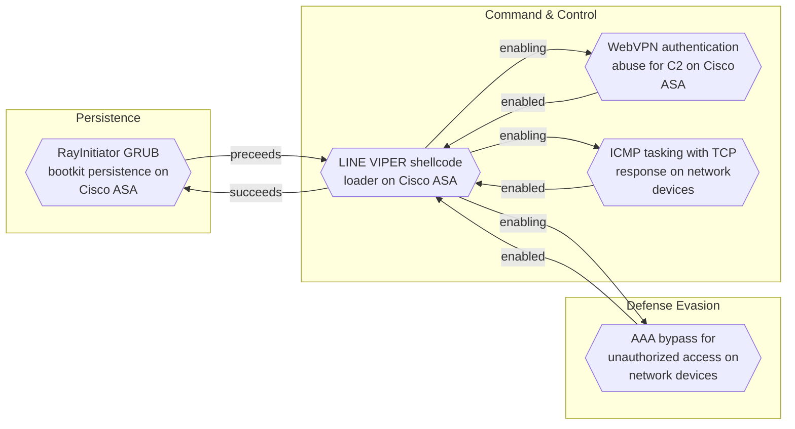
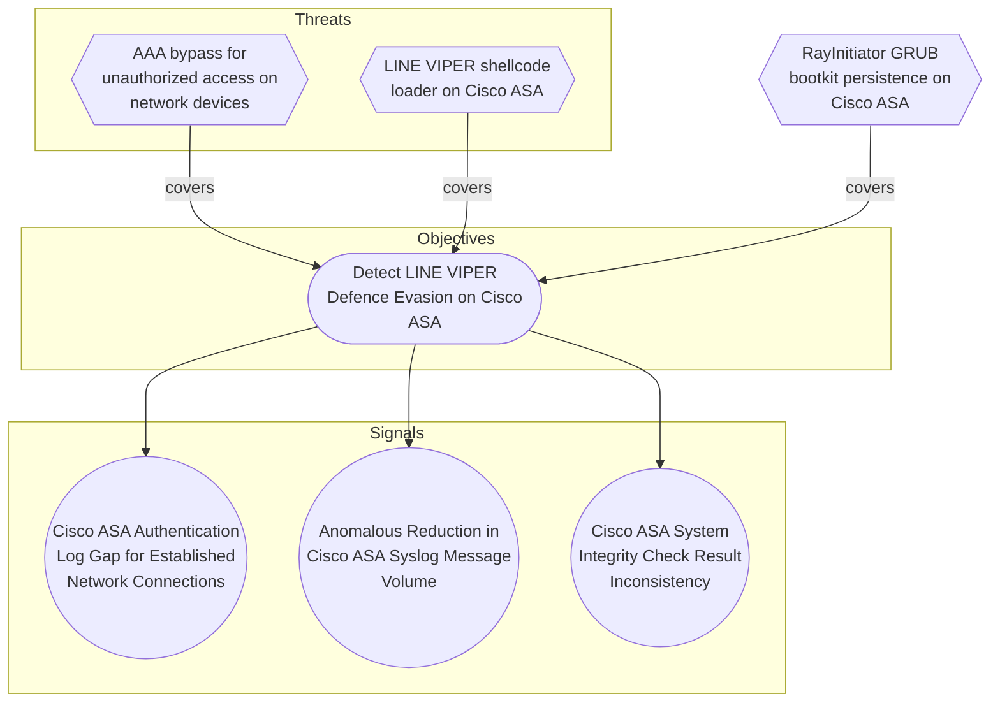

# RayInitiator GRUB bootkit persistence on Cisco ASA

## Metadata
| Field | Value |
| --- | --- |
| UUID | `a6f331e0-292d-4d83-87a9-46aa149555dd` |
| Schema | `threat::1.0` |
| Version | `1` |
| Created | `2026-06-18` |
| Modified | `2026-06-18` |
| TLP | clear (`TLP:CLEAR`) |
| Organisation | EC DIGIT CSOC (`56b0a0f0-b0bc-47d9-bb46-02f80ae2065a`) |

## References
### Public
- **1**: [https://www.ncsc.gov.uk/static-assets/documents/malware-analysis-reports/RayInitiator-LINE-VIPER/ncsc-mar-rayinitiator-line-viper.pdf](https://www.ncsc.gov.uk/static-assets/documents/malware-analysis-reports/RayInitiator-LINE-VIPER/ncsc-mar-rayinitiator-line-viper.pdf)

## Description
RayInitiator is a sophisticated persistent multi-stage bootkit that
facilitates the deployment of LINE VIPER malware to Cisco ASA
(Adaptive Security Appliance) 5500-X series devices without secure
boot technology [1].

The bootkit is flashed directly to the compromised device's GRUB
bootloader and survives both reboots and firmware upgrades. The
targeted models were released in 2012, with an End of Life (EoL)
notice issued by Cisco in 2020. These older models lack
cryptographic verification of early boot software, making them
vulnerable to this type of attack [1].

#### Technical Implementation

RayInitiator operates through multiple stages to establish
persistence and deploy user-mode malware:

**Stage 0 - Initial Execution:** The GRUB bootloader is patched to
hijack boot execution. This initial patch hooks the firmware loading
process, specifically where "Booting...\n" is output to the console,
to call Stage 1 [1].

**Stage 1 - Loader Patching:** Stage 1 searches the Cisco ASA
loader in memory for code responsible for printing "done.\nBooting
the kernel" to the console after the Linux kernel loads. It
identifies this code by iterating through the hardcoded memory
region 0x400000-0x600000, locating the string, and searching for
specific assembly patterns. Once found, it patches the code to
transfer control to Stage 2 [1].

**Stage 2 - Kernel Preparation:** Stage 2 identifies Kernel Address
Space Layout Randomization (KASLR) offsets and copies Stage 3 into
Linux kernel memory. It locates the sched_getparam function within
the system call table and patches it to call Stage 3. Since lina
(the binary implementing most Cisco ASA functionality) calls
sched_getparam during loading, this triggers Stage 3 installation
[1].

**Stage 3 - Malware Deployment:** Stage 3 is responsible for
installing a small handler within the lina binary to execute LINE
VIPER shellcode loader in user-mode [1].

#### Operational Security

The deployment of LINE VIPER via a persistent bootkit, combined with
emphasis on defense evasion techniques, demonstrates a significant
increase in actor sophistication and operational security compared
to previous campaigns such as ArcaneDoor publicly documented in 2024
[1].

RayInitiator represents a significant advancement in firmware-level
persistence techniques targeting network infrastructure. The
multi-stage approach and ability to survive firmware upgrades makes
detection and remediation particularly challenging.

## Criticality
**Severe** - A Severe priority incident is likely to result in a significant impact to public health or safety, national security, economic security, foreign relations, or civil liberties.

## Terrain
Cisco ASA 5500-X series devices without secure boot technology,
lacking cryptographic verification of early boot software [1]. These
models were released in 2012 with an End of Life notice issued by
Cisco in 2020. All observed targeted models have either passed their
last day of support or reach end of support September 30, 2025 [1].
The absence of secure boot allows arbitrary modification of the GRUB
bootloader without cryptographic validation.

## Surface
> **Routers**
> Network routers

> **Switches**
> Network switches

> **Embedded**
> Embedded and real-time operating systems

## Threat Assessment
| Dimension | Assessment | Description |
| --- | --- | --- |
| Severity | Substantial incident | A cyber attack which has a serious impact on a medium-sized organisation, or which poses a considerable risk to a large organisation or wider / local government. |
| Impact | Lose Capabilities Reputational Damages National Security | Vector execution will remove key functions to the organization, which will not be easily circumvented. Most day-to-day is heavily impaired, but processes can reorganize at a loss. Damages to the organization public view may be achieved by using directly the access gained, or indirectly with data gathered. The vector execution will expose or destroy such sufficient critical information infrastructure that the country will have to intervene due to loss to key national  or international functions. |
| Leverage | Infrastructure Compromise Tampering Dwelling | The compromised target is likely to be used to further expand the sphere of influence of the attacker and allow more potent vectors to be executed. Threat action intending to maliciously change or modify persistent data, such as records in a database, and the alteration of data in transit between two computers over an open network, such as the Internet. Active or passive extended presence in the target, which performs adversarial operations continuously. |
| Viability | Likely | Probable (probably) - 55-80% |
| Kill Chain | Persistence | Any access, action or change to a system that gives an attacker persistent presence on the system. |

## ATT&CK Techniques
| Technique | Name | Description |
| --- | --- | --- |
| `T1542.003` | [Pre-OS Boot: Bootkit](https://attack.mitre.org/techniques/T1542/003) | Adversaries may use bootkits to persist on systems. A bootkit is a malware variant that modifies the boot sectors of a hard drive, allowing malicious code to execute before a computer's operating system has loaded. Bootkits reside at a layer below the operating system and may make it difficult to perform full remediation unless an organization suspects one was used and can act accordingly.  In BIOS systems, a bootkit may modify the Master Boot Record (MBR) and/or Volume Boot Record (VBR).(Citation: Mandiant M Trends 2016) The MBR is the section of disk that is first loaded after completing hardware initialization by the BIOS. It is the location of the boot loader. An adversary who has raw access to the boot drive may overwrite this area, diverting execution during startup from the normal boot loader to adversary code.(Citation: Lau 2011)  The MBR passes control of the boot process to the VBR. Similar to the case of MBR, an adversary who has raw access to the boot drive may overwrite the VBR to divert execution during startup to adversary code.  In UEFI (Unified Extensible Firmware Interface) systems, a bootkit may instead create or modify files in the EFI system partition (ESP). The ESP is a partition on data storage used by devices containing UEFI that allows the system to boot the OS and other utilities used by the system. An adversary can use the newly created or patched files in the ESP to run malicious kernel code.(Citation: Microsoft Security)(Citation: welivesecurity) |
| `T1601.001` | [Modify System Image: Patch System Image](https://attack.mitre.org/techniques/T1601/001) | Adversaries may modify the operating system of a network device to introduce new capabilities or weaken existing defenses.(Citation: Killing the myth of Cisco IOS rootkits) (Citation: Killing IOS diversity myth) (Citation: Cisco IOS Shellcode) (Citation: Cisco IOS Forensics Developments) (Citation: Juniper Netscreen of the Dead) Some network devices are built with a monolithic architecture, where the entire operating system and most of the functionality of the device is contained within a single file.  Adversaries may change this file in storage, to be loaded in a future boot, or in memory during runtime.  To change the operating system in storage, the adversary will typically use the standard procedures available to device operators. This may involve downloading a new file via typical protocols used on network devices, such as TFTP, FTP, SCP, or a console connection.  The original file may be overwritten, or a new file may be written alongside of it and the device reconfigured to boot to the compromised image.  To change the operating system in memory, the adversary typically can use one of two methods. In the first, the adversary would make use of native debug commands in the original, unaltered running operating system that allow them to directly modify the relevant memory addresses containing the running operating system.  This method typically requires administrative level access to the device.  In the second method for changing the operating system in memory, the adversary would make use of the boot loader. The boot loader is the first piece of software that loads when the device starts that, in turn, will launch the operating system.  Adversaries may use malicious code previously implanted in the boot loader, such as through the [ROMMONkit](https://attack.mitre.org/techniques/T1542/004) method, to directly manipulate running operating system code in memory.  This malicious code in the bootloader provides the capability of direct memory manipulation to the adversary, allowing them to patch the live operating system during runtime.  By modifying the instructions stored in the system image file, adversaries may either weaken existing defenses or provision new capabilities that the device did not have before. Examples of existing defenses that can be impeded include encryption, via [Weaken Encryption](https://attack.mitre.org/techniques/T1600), authentication, via [Network Device Authentication](https://attack.mitre.org/techniques/T1556/004), and perimeter defenses, via [Network Boundary Bridging](https://attack.mitre.org/techniques/T1599).  Adding new capabilities for the adversary’s purpose include [Keylogging](https://attack.mitre.org/techniques/T1056/001), [Multi-hop Proxy](https://attack.mitre.org/techniques/T1090/003), and [Port Knocking](https://attack.mitre.org/techniques/T1205/001).  Adversaries may also compromise existing commands in the operating system to produce false output to mislead defenders.   When this method is used in conjunction with [Downgrade System Image](https://attack.mitre.org/techniques/T1601/002), one example of a compromised system command may include changing the output of the command that shows the version of the currently running operating system.  By patching the operating system, the adversary can change this command to instead display the original, higher revision number that they replaced through the system downgrade.   When the operating system is patched in storage, this can be achieved in either the resident storage (typically a form of flash memory, which is non-volatile) or via [TFTP Boot](https://attack.mitre.org/techniques/T1542/005).   When the technique is performed on the running operating system in memory and not on the stored copy, this technique will not survive across reboots.  However, live memory modification of the operating system can be combined with [ROMMONkit](https://attack.mitre.org/techniques/T1542/004) to achieve persistence. |
| `T1542.001` | [Pre-OS Boot: System Firmware](https://attack.mitre.org/techniques/T1542/001) | Adversaries may modify system firmware to persist on systems.The BIOS (Basic Input/Output System) and The Unified Extensible Firmware Interface (UEFI) or Extensible Firmware Interface (EFI) are examples of system firmware that operate as the software interface between the operating system and hardware of a computer.(Citation: Wikipedia BIOS)(Citation: Wikipedia UEFI)(Citation: About UEFI)  System firmware like BIOS and (U)EFI underly the functionality of a computer and may be modified by an adversary to perform or assist in malicious activity. Capabilities exist to overwrite the system firmware, which may give sophisticated adversaries a means to install malicious firmware updates as a means of persistence on a system that may be difficult to detect. |

## Chaining

### Chaining details
#### preceeds -> [LINE VIPER shellcode loader on Cisco ASA](line-viper-shellcode-loader-on-cisco-asa.md) (`b6175f16-2b61-4116-bd97-de54b02b197e`) (`sequence::preceeds`)
RayInitiator deploys LINE VIPER shellcode loader into user-mode
memory during the boot process by installing a handler in the
lina binary (Stage 3). LINE VIPER is subsequently loaded from a
specially crafted WebVPN client authentication request containing
a partial PKCS7 certificate followed by shellcode [1].

- **Target UUID**: `b6175f16-2b61-4116-bd97-de54b02b197e`

## Coverage

## Related objects
| Type | Name | Direction | Relation |
| --- | --- | --- | --- |
| Objective | [Detect LINE VIPER Defence Evasion on Cisco ASA](../Objectives/detect-line-viper-defence-evasion-on-cisco-asa.md) (`7c0f2788-690e-4d34-b9eb-5f76e7363ccc`) | Downstream | objective |
| Signal | [Cisco ASA Authentication Log Gap for Established Network Connections](../Objectives/detect-line-viper-defence-evasion-on-cisco-asa.md#cisco-asa-authentication-log-gap-for-established-network-connections) (`0114324a-80a5-46cb-a75c-6f4a2301b7e5`) | Downstream | signal |
| Signal | [Anomalous Reduction in Cisco ASA Syslog Message Volume](../Objectives/detect-line-viper-defence-evasion-on-cisco-asa.md#anomalous-reduction-in-cisco-asa-syslog-message-volume) (`10482800-4d71-4246-93f4-6edfc4705b86`) | Downstream | signal |
| Signal | [Cisco ASA System Integrity Check Result Inconsistency](../Objectives/detect-line-viper-defence-evasion-on-cisco-asa.md#cisco-asa-system-integrity-check-result-inconsistency) (`9666e19f-f48d-4a0b-bb3e-0efbd69e8eac`) | Downstream | signal |
