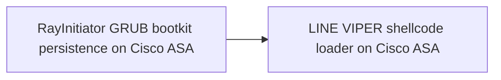
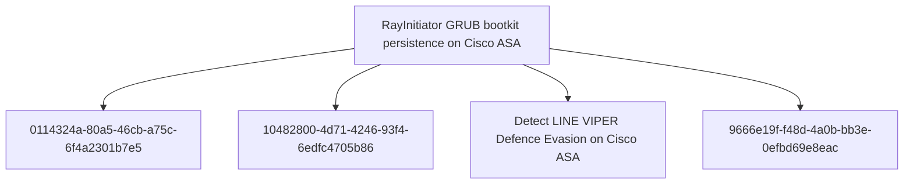

# RayInitiator GRUB bootkit persistence on Cisco ASA

## Metadata

- **UUID**: `a6f331e0-292d-4d83-87a9-46aa149555dd`
- **Schema**: `threat::1.0`
- **TLP**: clear

## Description
RayInitiator is a sophisticated persistent multi-stage bootkit that
facilitates the deployment of LINE VIPER malware to Cisco ASA
(Adaptive Security Appliance) 5500-X series devices without secure
boot technology [1].

The bootkit is flashed directly to the compromised device's GRUB
bootloader and survives both reboots and firmware upgrades. The
targeted models were released in 2012, with an End of Life (EoL)
notice issued by Cisco in 2020. These older models lack
cryptographic verification of early boot software, making them
vulnerable to this type of attack [1].

#### Technical Implementation

RayInitiator operates through multiple stages to establish
persistence and deploy user-mode malware:

**Stage 0 - Initial Execution:** The GRUB bootloader is patched to
hijack boot execution. This initial patch hooks the firmware loading
process, specifically where "Booting...\n" is output to the console,
to call Stage 1 [1].

**Stage 1 - Loader Patching:** Stage 1 searches the Cisco ASA
loader in memory for code responsible for printing "done.\nBooting
the kernel" to the console after the Linux kernel loads. It
identifies this code by iterating through the hardcoded memory
region 0x400000-0x600000, locating the string, and searching for
specific assembly patterns. Once found, it patches the code to
transfer control to Stage 2 [1].

**Stage 2 - Kernel Preparation:** Stage 2 identifies Kernel Address
Space Layout Randomization (KASLR) offsets and copies Stage 3 into
Linux kernel memory. It locates the sched_getparam function within
the system call table and patches it to call Stage 3. Since lina
(the binary implementing most Cisco ASA functionality) calls
sched_getparam during loading, this triggers Stage 3 installation
[1].

**Stage 3 - Malware Deployment:** Stage 3 is responsible for
installing a small handler within the lina binary to execute LINE
VIPER shellcode loader in user-mode [1].

#### Operational Security

The deployment of LINE VIPER via a persistent bootkit, combined with
emphasis on defense evasion techniques, demonstrates a significant
increase in actor sophistication and operational security compared
to previous campaigns such as ArcaneDoor publicly documented in 2024
[1].

RayInitiator represents a significant advancement in firmware-level
persistence techniques targeting network infrastructure. The
multi-stage approach and ability to survive firmware upgrades makes
detection and remediation particularly challenging.

## Techniques
- T1542.003
- T1601.001
- T1542.001

## Chaining

## Relations

